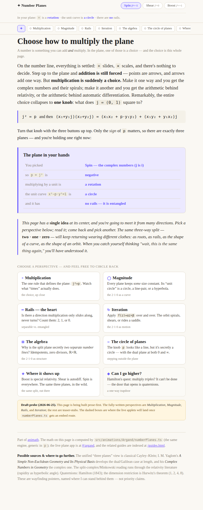
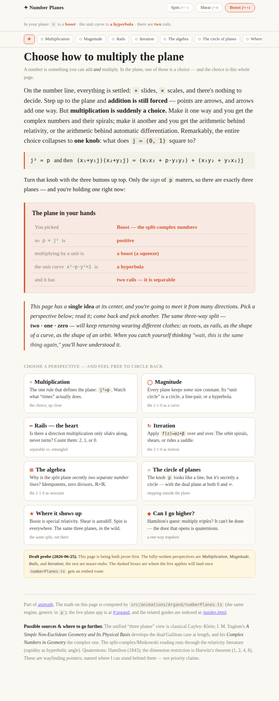
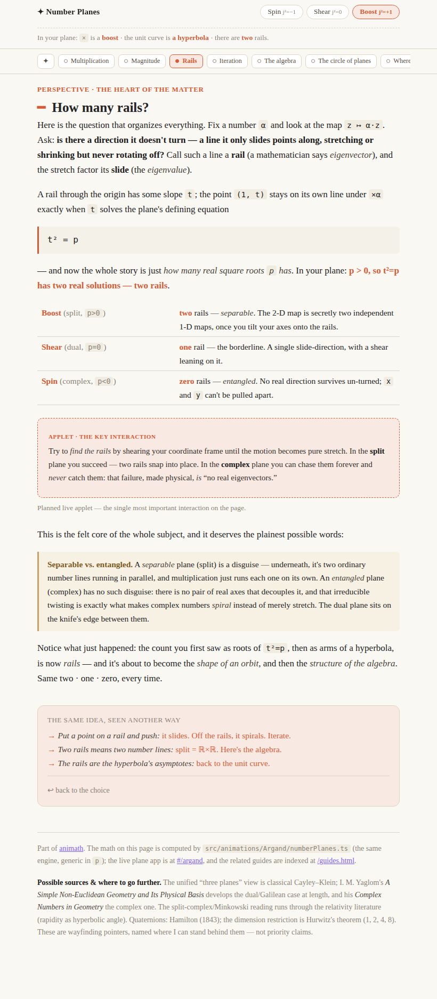

# Number Plane app — continuing the Argand → Number Plane rename + narrative

## Session purpose

Continue the work on the **Number Plane** app, which is to be the rename of the
**Argand Plane** app (`#/argand`). (User framing at session start.)

## Previous session

First tracked session on this branch (`amazing-mccarthy-0lwb1m`). The work
continues directly from the **Argand five-hat review** session on
`argand-plane-review-51egvz` (PR #237, merged) — see its
[handoff](../argand-plane-review-51egvz/2026-06-24-S01-design-ux-review.md) and the
[Number Planes page plan](../argand-plane-review-51egvz/2026-06-24-S01-plan-number-planes-page.md)
(`kind: plan`, `status: proposed`, `signals: needs-dan`).

That session: (1) ran a five-hat design/UX review of Argand; (2) kept a math-first
engine `numberPlanes.ts` (+ 50 tests, dormant) and some plane-app polish; (3) built
then **shelved** an in-app number-line/tour experiment; (4) co-designed a
**curiosity-driven HTML "Number Planes" teaching page** plan with Dan. The page is
**planned, not built**; several design forks need Dan before drafting.

## Working notes

<!-- Newest entry first. -->

### 🟡 milestone · 18:05 — Prose-first probe built & verified: `public/number-planes.html`
**Why:** Dan wanted to *see* the page, and a standalone `public/` HTML file is the
fully-reversible artifact to react to (R2). Build green, pixels checked (R1).

Built `public/number-planes.html` (713 lines, self-contained, in the
`public/*-guide.html` visual family + a small JS layer). What's there:

- **The carried `j²` choice** (sticky header: Spin / Shear / Boost) that **rewrites
  the prose live** — every `.pp` span fills from its `data-spin/shear/boost`
  attribute and the page retints (Spin purple → Shear green → Boost red). Verified:
  switching to Boost rewrote the readout to *"× is a **boost** · unit curve is **a
  hyperbola** · **two** rails"* and the Rails line to *"p > 0 … two real solutions —
  two rails."*
- **The ring of perspectives** (sticky) + a **deck of lens cards** — the hub you
  return to. Visited lenses get a filled dot / ✓.
- **Eight lenses**, each ending in a **circle-back** footer that names the
  recurrence and links sideways to siblings ("you saw the rails; as eigenvalues
  it's the same count"). **Fully written:** Multiplication · Magnitude · Rails (the
  heart) · Iteration. **Teaser-stubs:** The algebra · Circle of planes · Where it
  shows up · ◆ Higher (quaternions leaf).
- **Applet slots** are styled dashed placeholders (numberPlanes.ts has no `#/embed/`
  route yet) — the prose stands alone without them.

Verification: `npm ci` (deps were only partially installed — `vitest` missing, so
the pre-existing `tsc` build failed until a clean install) → `npm run build` green;
page copied to `dist/number-planes.html`; three headless `file://` screenshots
eyeballed.

> [!NOTE]
> **Open for Dan's reaction:** does the hub-and-ring "circling" shape match the felt
> quality he meant ("circle around the same ideas from different perspectives")?
> Next forks: finish the 4 stub lenses; build the `#/embed/number-planes` applet on
> `numberPlanes.ts` (the j² dial · the rails morph) to fill the placeholders; settle
> naming; decide where this lives in `public/guides.html`.

### 🟣 decision · 17:35 — Scope pinned: build the HTML guide page, structured as "circle around one core from many lenses"
**Why:** Dan: focus on the HTML-driven guide page (the choose-your-own-equation
mode, several paths) — and crucially *"I often feel like I have to circle around
these ideas several times from different perspectives and I would like the page to
have that same quality."* Naming deferred ("let's not worry about naming for now").

Read the existing guide family (`public/complex-functions-guide.html` is the
template: serif paper, CSS tokens, `.eq`/`.listing`/`figure`/`.next`, `#/embed/`
applets, quoted source) + `numberPlanes.ts` (full engine: mul/norm/unit-curve/
exp·log/powReal/polar/affine/fixedPoints/criticalPoint + `plane(p)` strategy).

**Structural reading of "circling":** not a branching *tree* (the prior plan's
spine+side-threads, which goes *outward*) but **one core, many lenses** — the
reader keeps returning to the *same* trichotomy and re-meets it through a new lens
each time. The core: choosing `j²=p` gives 3 cases, and that one count (2/1/0)
*is* "# square roots of p" = "# rails (eigenvectors)" = unit curve (circle/line/
hyperbola) = iteration (spiral/shear/saddle) = algebra (field/dual/ℝ×ℝ).

**Page shape to probe:** a **hub** (the choice `j²=p` + the trichotomy promise)
ringed by **lenses** (Multiplication · Magnitude · Rails[the heart] · Iteration ·
The algebra · Circle of planes · Where it shows up · ◆Quaternions leaf). A
**carried `j²` choice** at the top that **visibly rewrites the prose** as you
switch planes (`.per-plane` spans filled from data-attrs — demonstrates "one idea,
three costumes" with zero applets needed). Each lens ends by pointing back to the
hub *and* sideways to sibling lenses, naming the recurrence ("you saw the rails;
as eigenvalues it's the same count"); a persistent map shows which lenses you've
circled. Prose-first; applet `<figure>` slots are styled placeholders for now
(`numberPlanes.ts` has no `#/embed/` route yet — a later step).

Building a **prose-first probe** (R2: artifact pinned = a standalone `public/`
HTML file, fully reversible; Dan wants to *see* it, not more planning) — hub +
2-3 fully-written lenses + stubbed rest + working JS navigation/carried-choice.

### 🟡 milestone · 17:20 — Session start: oriented, awaiting scope decision
**Why:** New branch continuing the Argand → Number Plane work; need Dan to pin the
artifact before any building (RECIPES R2 — separate exploring from guessing).

Read the prior handoff + the Number Planes page plan + the TODO backlog. Current
state on disk:

- `#/argand` is registered in `src/apps.ts` as **"Argand Plane"** (icon `∡`); it
  runs on `complexOps.ts` (untested) and ships `numberPlanes.ts` dormant alongside.
- The prior plan describes a **separate HTML page** (`public/*-guide.html` family,
  JS-driven, curiosity-web), *not* a rename of the app. The user's framing this
  session ("the Number Plane **app** which will be the rename for the Argand plane")
  points at the live app. **These may be the same effort or two — needs Dan.**

Open questions to converge before building (carried from the plan + raised by the
rename framing):

1. **Scope**: rename the live `#/argand` app to "Number Plane(s)"? Build the planned
   HTML page? Both? Is the page the app's `?` explainer, or a standalone guide?
2. **Naming**: "Number Plane" (singular, the user's phrasing) vs "Number Planes"
   (plural, the plan's — the *family* complex/dual/split). The app shows one plane
   at a time but the concept is the family.
3. The plan's own open questions (spine vs side-thread cut, the change-of-basis
   "find the rails" morph, carried-`j²` mechanics, Squeeze vs Boost naming).

Also open on the live app (five-hat Tier-1, from the synthesis): the fabricated
dual/split **quadratic fixed points** (drawn as confident gold dots — a real
correctness bug), the centered hint pill, the clipped "Re" label; and
`complexOps.ts` still has no tests.

Stopping here to let Dan direct scope.
</content>
</invoke>
