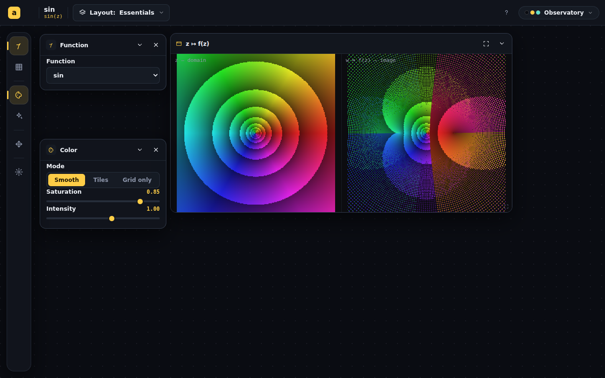
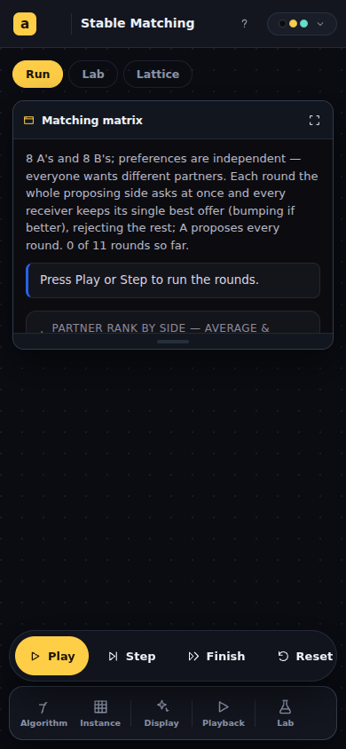
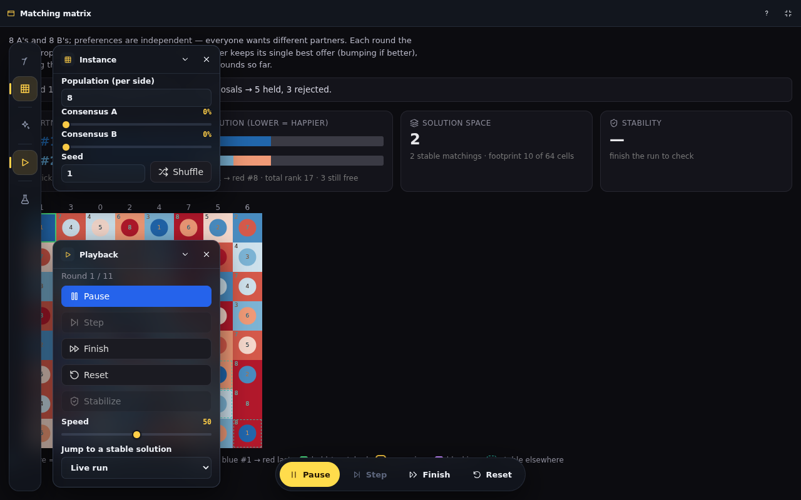
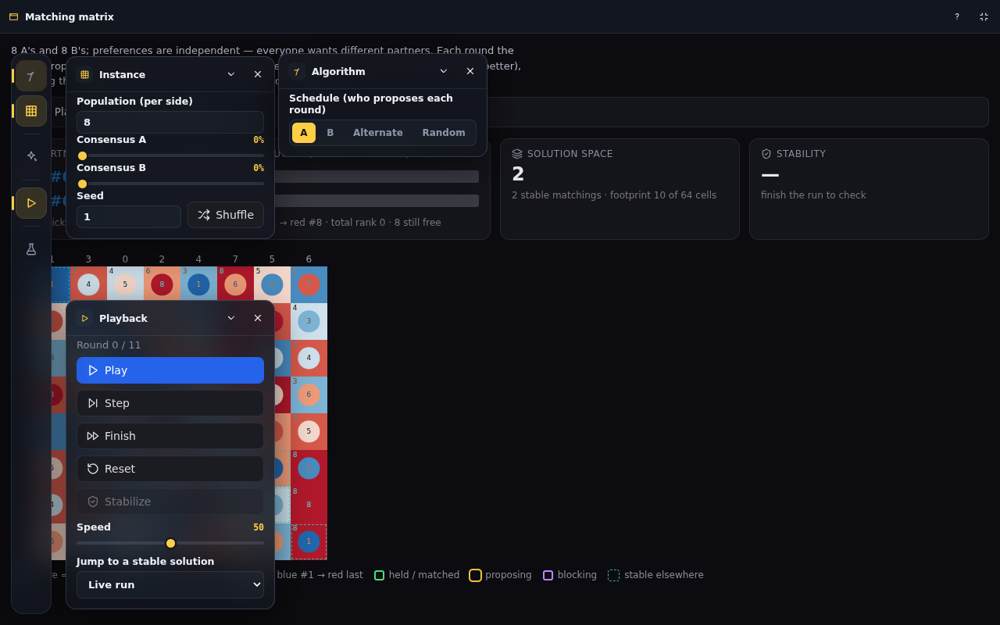

# Whole-scale app chrome overhaul

## Session purpose

Whole-scale focus on the app chrome (`src/chrome/` — gallery, workspace,
skins, top bar, phone re-chrome). Specific direction to be set by the user.

## Previous session

First tracked session on this branch. For continuity, the most recent and
directly relevant handoff is
[new-chrome 2026-06-10-S01](../../handoff/new-chrome/2026-06-10-S01-branch-rename-and-continuation.md):
the workspace-chrome redesign branch (PR #200) merged — fullscreen views,
phone resize grips, per-app gallery previews, complete function set, embed
routes, and the unified projection slider — with carried-forward ledger items
(keyboard window management, zoom-lock, skin-aware canvas palettes, layout
rename/export, gallery search, phone landscape) and embeds phase 2 (the
"Embed this view" share dialog) left open.

## Working notes

<!-- Newest entry first. One ### per state transition. The renderer turns this
     section into the rich timeline rail. Format each heading exactly:
       ### <emoji> <type> · HH:MM — <what>
     type ∈ decision | code | finding | blocker | milestone
     emoji: 🟣 decision · 🟢 code · 🔵 finding · 🔴 blocker · 🟡 milestone
     Follow each with a "**Why:** …" line, then optional body paragraphs. -->

### 🟡 milestone · 01:10 — PR C landed and probe-verified (split views)
**Why:** Continuing the plan of record after PR B.

`ViewDef` became a discriminated `node | panes` union (passing both is a
type error, per the consultant); new `SplitPanes` renders a fixed equal flex
split with mono corner labels — **no draggable divider** by ruling (equal
inscribed squares are what keep the domain/image pair scale-commensurable).
Shared by ViewWindow, phone view cards, and the Plane Transform embed (the
orphaned `.am-embed-pane` CSS deleted). Plane Transform migrated to one
window `z ↦ f(z)` with panes `z — domain` / `w = f(z) — image` under a
fresh id (`plane`) so stale two-window rects sanitize away.
Mandelbrot ↔ Julia deliberately stays two windows. Docs: DESIGN-SPEC split
clause + linked-windows rewording, BUILDING_AN_APP §4b, CLAUDE.md.
Verification: build + 20 tests green; `scripts/probe-split.mjs` 6/6 (one
window, equal panes through resize and fullscreen, embed DOM parity).

### 🟡 milestone · 01:04 — PR B landed and probe-verified (the action strip)
**Why:** User said "continue" — next step on the plan of record.

Built the always-on **action strip**: `ActionDef` + `WorkspaceProps.actions`
with the three-hats constraints structural (buttons-only type, ≤5 rendered,
one primary, static labels, `sectionId` projection validated against the
Drive tier by `validateActions` — unit-tested); `ActionBar` renders a fixed
pill bottom-center on desktop and a labeled row above the dock on phone, at
`--z-actionbar` 130 so it survives fullscreen (modal moved to 150). Three
transport glyphs (pause/step/finish) added as chrome utility icons. Wired
into the four inert-by-default simulation apps — Stable Matching (contextual
GS-run ↔ RVV-replay action sets), Stable Marriage, Agentic Sorting, Trinary
Observatory. Embeds (decision c) scoped: the URL-configured `buttons=` row
is the strip's embed form. Docs ride along: DESIGN-SPEC §2 gains "The action
strip" + a fullscreen clause, the IN-PROGRESS removals ledger records the
not-the-floater ruling, BUILDING_AN_APP gains §4d. Verification: 20 vitest
tests green, build green, `scripts/probe-actionbar.mjs` 11/11 (strip
hit-testable, Play toggles aria-pressed, works in fullscreen, phone labels
visible, dock intact).

### 🟡 milestone · 23:50 — PR A landed and probe-verified (fullscreen access + z bug)
**Why:** With the decisions in, implementation began at the agreed first step.

Implemented and verified the whole PR A scope: **z-compaction** in
`sanitize()` + a bounded `raiseWindow()` (new tests prove z never exceeds
window count under 500 raises); the z-layer scale named once
(`src/chrome/workspace/layers.ts` mirrored by `--z-*` tokens in theme.css);
**panels re-base above fullscreen** via a `zBase` prop (CSS can't beat the
inline zIndex, per the consultant); **staged Esc** through one shared layer
stack (`useEscLayer` replaced five scattered keydown listeners — desktop
fullscreen, phone sheet+full, skin menu, layouts menu, explainer's
capture-phase hack); the **explainer** portals to `<body>` at `--z-modal`
and is openable from a fullscreen view/card header on both desktop and
phone. Verification: 16 vitest tests green, `npm run build` green, and a new
committed probe (`scripts/probe-fullscreen.mjs`) drives the real built app —
all 8 interaction checks pass (panel hit-testable above fullscreen, Esc
peels explainer → fullscreen, panels survive).

### 🟣 decision · 23:20 — User approved all three open decisions
**Why:** The synthesis left three gates; the user answered "1. yes. 2. yes.
3. yes."

(a) Correspondence tap-to-pick will be ungated (PR D); (b) vitest adopted
now; (c) embeds will carry the action strip (PR B scope).

### 🟡 milestone · 20:15 — Three-hats review complete; synthesis + errata applied
**Why:** All three expert agents returned; the user asked for the review and a
PR to track it (draft PR #208).

All three **endorse the plan**. Unanimous: F9 was overstated ("geometrically
wrong" → *incommensurable scales* — each pane is internally consistent);
P4a first; staged Esc must only peel transient layers; P5 with a
discriminated `node | panes` union, fresh window id, fixed 50/50 split;
Correspondence stays two windows. Maintainer + consultant independently found
the same missed bug: the persisted raise counter is unbounded, so panels can
already cross the fullscreen layer today — fix by compacting z in
`sanitize()`; a CSS-only fix can't work against Panel's inline zIndex (thread
`zBase`). Pedagogy found two audit errors: Correspondence pick-`c` is
arm-gated (so the planned hint copy was a false affordance — recommend
ungating tap-to-pick) and Plane Transform ships no morph. Tension resolved by
decomposition: build the shared view-overlay layer and ship P2 hints on it;
defer the full P3 `hud` API. Wrote `…-expert-synthesis.md`, applied the
errata + a "Three-hats review outcome" section to CHROME-REVIEW.md (revised
plan: PRs A–D, P3/P4b deferred). Three decisions left to the user: ungate
tap-to-pick, adopt vitest for chrome pure functions, embeds × action strip.

### 🟣 decision · 19:20 — Draft PR #208 opened to track the review
**Why:** User asked for a pull request so the reports are trackable.

### 🟡 milestone · 19:05 — Design review delivered (CHROME-REVIEW.md)
**Why:** User asked for a chrome design review across all apps, naming three
gaps: always-on-screen buttons (Stable Matching has no visible play button to
begin with), control access in fullscreen, and Plane Transform's planar plots
living as two separate windows.

Wrote `docs/redesign/CHROME-REVIEW.md` (findings F1–F11, proposals P1–P5,
ordered plan) and appended a ledger entry to `docs/redesign/IN-PROGRESS.md`.
Root cause across all three: the spec makes every control a dismissible panel
resident with no concept of permanent controls or inseparable view pairs.

### 🔵 finding · 18:58 — Phone opens every app inert; fullscreen rail is silently broken
**Why:** Three parallel code surveys (per-app primary actions, fullscreen
mechanism, PlaneTransform/Correspondence two-view architecture) to ground the
review in file:line evidence.

Key findings: (1) on phone, panels are bottom sheets all closed by default —
8 of 10 apps open with no action visible (the reported Stable Matching
experience); desktop defaults are right but fragile (✕ + persistence lose the
playback panel). (2) Fullscreen is z-index occlusion (view z 100); the rail
stays clickable at z 200 but the panel it opens renders at z≈30 *behind* the
fullscreen view — a latent bug. (3) The workspace engine has no view-pairing
concept; PlaneTransform fakes the link internally (shared geometry +
force-locked `viewExtent`), and mismatched pane resizes make the SVG curve
overlay geometrically wrong (inscribed-square math); the embed route already
demonstrates the correct one-container/two-pane model. TopologyWalk and
PolygonWorlds hand-roll MovePad HUDs — the missing "always-on control"
concept, invented per app.

### 🟣 decision · 18:50 — Review scope: assessment only, committed under docs/redesign/
**Why:** The deliverable is a design review, not implementation; proposals
need a user decision before code changes.

### 🟡 milestone · 18:43 — Session started
**Why:** User opened the session with the focus "whole-scale focus on app chrome."

Resolved branch `claude/app-chrome-overhaul-lnqgle` (slug
`app-chrome-overhaul-lnqgle`, new — first tracked session). Read the latest
handoff (new-chrome 2026-06-10-S01): PR #200 merged, build passing, chrome
redesign complete with a list of carried-forward items. Awaiting the user's
specific direction for what "whole-scale" targets first.
