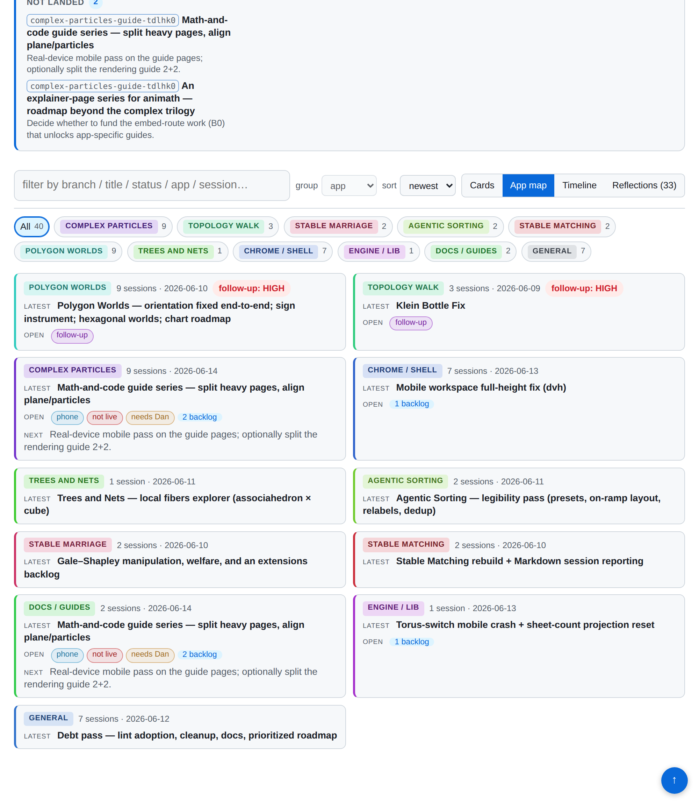
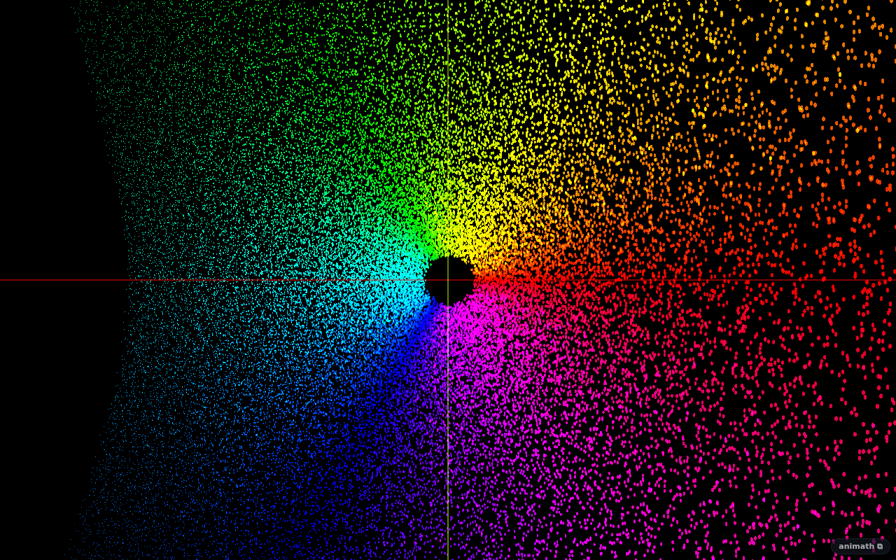
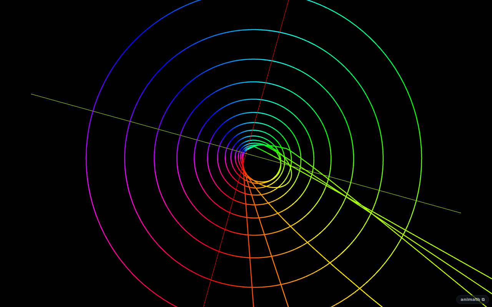
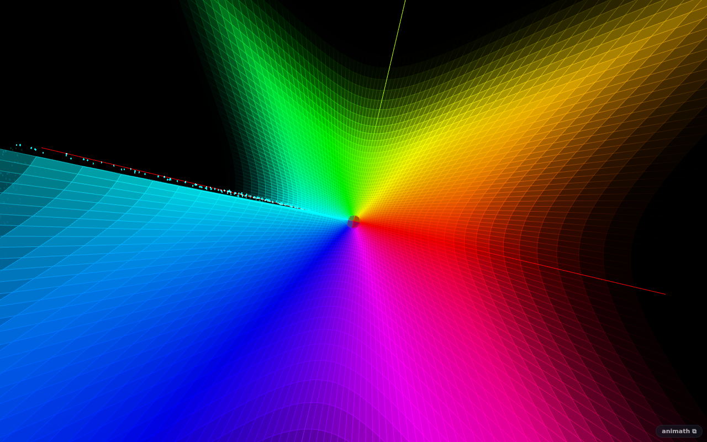
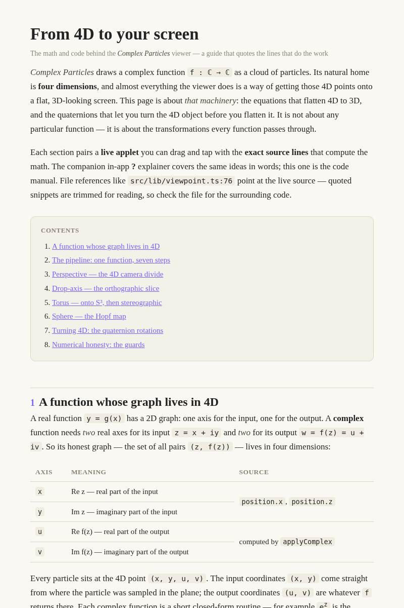

# A math-and-code user guide for Complex Particles

## Session purpose

Create a **user guide** for Complex Particles that explains the *math behind the
visualizations* — not the specific functions/curves, but the **equations and
transformations** that turn a 4-D point `(x, y, u, v)` into the 3-D points on
screen, and what determines the **quaternion rotations**. The guide should read
like a **code manual crossed with math instruction**: styled like the embed demo
(`/embed-demo.html` — article prose with live `<iframe>` applets), but going
further by quoting **specific lines of source** to show how each equation is
actually computed.

## Previous session

First tracked session on this branch. The most recent particle handoff is
[`complex-particles-torus-crash-tile` S02](../../handoff/complex-particles-torus-crash-tile/2026-06-14-S02-domain-region.md)
(PR #216): smoothed the continuous perspective floor and added a polar
**Domain region** radius band — independent of this documentation work, but it
confirms the current state of the projection math (`viewpoint.ts` /
`shaders/index.ts`) that the guide will document.

## Working notes

<!-- Newest entry first. -->

### 🟢 milestone · 20:50 — Session-dashboard productionized: signals · to-do · App-map
**Why:** User wanted the report system to surface a project map + a usable to-do list.

Built a signals/backlog system into `docs/sessions/build-sessions.mjs` + `categories.mjs`:
- **Closed `signals:` vocabulary** (needs-dan · phone-needed · visual-unverified ·
  not-live) + `next:` flat frontmatter, parsed per report. High-precision: explicit
  wins; only `high-followup` (from reflection level), `needs-dan` (proposed plans),
  and `not-live` (report absent on main) are *inferred* — so the full 102-report
  history backfills without editing old files. (Caught + fixed a not-live bug: a
  branch forked from main contains main's history, so is-ancestor flags everything —
  switched to "path exists on main".)
- **"Start here" digest** (auto) + **"To-do" panel** from a new hand-edited
  **`docs/sessions/TODO.md`** backlog (the durable to-do list with notes). Both are
  **filter-aware** — pick a category and they narrow to that app.
- **App-map view** (4th view): per-app rollup — latest · risk (worst follow-up) ·
  open (signals + backlog count) · next — sorted worst-risk first.
- **Taxonomy:** added `docs` + `trees-and-nets` categories.
- **Productionized for agents:** REPORT_STYLE §1.2, both templates, and the handoff +
  start-session skills now author/consult `signals:`/`next:` + the backlog.

### 🟡 milestone · 16:55 — Split heavy guides; cut applet weight; align plane/particles
**Why:** User: applet weight too high (many WebGL iframes/page), and Plane vs
Particles felt confusing. Chosen fixes: split pages + fewer/more-capable applets.

The two heavy guides each had too many live applets for one page (functions 7,
projections 6 — browsers cap concurrent WebGL contexts). Split both into Part 1 / 2:
- **Functions** → `complex-functions-guide.html` (Pt 1: color, z^n, 1/z, exp) +
  `complex-functions-2-guide.html` (Pt 2: branches, trig, special, field guide).
  3 applets each.
- **Projections** → `complex-particles-guide.html` (Pt 1: graph, pipeline,
  perspective, drop) + `complex-particles-2-guide.html` (Pt 2: torus, hopf,
  quaternions, honesty). Folded the two duplicate drop-explorers into one capable
  applet (all four Drop buttons + Rotate) → Pt 1 = 2 applets, Pt 2 = 3.

Kept the original filenames as Part 1, so **every existing inbound link still
resolves**; only the hub + intra-chapter Prev/Next nav are new. Max applets/page is
now 4 (rendering); the 6–7 offenders are gone.

**Plane/particles alignment** (per the user's tip): the functions guide's "bare
colored plane" figure now uses a **linear Complex Particles** plot
(`fn=linear&proj=dropv`) instead of a Plane Transform embed — verified it renders as
the flat colored x,y plane. Plane Transform stays only where the two-pane
*transformation* is the subject (z^n, exp, sin, Joukowski, and the plane-transform
guide itself).

Hub (`guides.html`) updated to list both parts; `EMBEDS.md` notes the split.
`npm run build` passes; split pages compose and the new embed renders. No TS
changed this turn (HTML/docs only).

### 🟡 milestone · 15:30 — Track A complete: color, sampling, plane-transform + hub
**Why:** User asked to complete A1–A3 from the roadmap.

Built three "going deeper" pages, taking the series to **six** cross-linked pages
plus a hub:
- **A1 `complex-color-guide.html`** — domain coloring: phase→hue / magnitude→brightness
  (`calcColor`), domain-vs-range, the quantity/brightness channels, the sequential
  colormap polynomial fits (`colormaps.ts`), contour bands. Live `colorby=`/`colormap=`.
- **A2 `complex-sampling-guide.html`** — the domain patterns (`fillPattern`): grid,
  the radial fiber family, the equal-area `√` radius, the per-point seed. **Needed a
  small additive `pattern=` embed param** (`embedParams.ts` + the ComplexParticles
  embed effect + doc) so the page shows live Rings/Spokes/Web.
- **A3 `complex-plane-transform-guide.html`** — `f` as a flat plane transform: the two
  panes, that it's the Drop-X+Drop-Y shadow of the 4-D graph, **conformality** (angle
  preservation as the signature of differentiability, with `z²`'s origin exception),
  and the **log-polar** unrolling (multiply→translate, `zⁿ`→shear, `ln`→flatten).
- **`guides.html`** — index hub, grouped "The math" (trilogy) + "Going deeper" (these
  three) + the embed demo. All trilogy pages now footer-link the hub.

Verified headless: `pattern=rings/spokes/web` render distinctly (low count to resolve
structure), `colorby=range` and `colormap=2` (Viridis) wire through state, the
`plane-transform?fn=square` two-pane renders. All four new pages compose. `npm run
build` passes. `docs/EMBEDS.md` updated (pattern= param + the six-page list); the S02
plan marks Track A + the hub DONE, leaving Track B (B0 embed routes → B1–B4) open.

One honesty fix: softened A3's Fig-2 claim — the plane-transform embed shows points by
default (grid lines are an in-app toggle), so the prose points to the app for the
explicit right-angle view rather than asserting visible grid cells.

### 🟡 milestone · 14:55 — Third page (rendering) + series roadmap
**Why:** User asked to build the render-modes guide and write a plan for the rest.

`public/complex-rendering-guide.html` — *How the surface is drawn*, completing the
trilogy (functions → projections → rendering). Six sections: Points + the sampling
patterns (`fillPattern` Grid) → Sheet (four-corner cell color, derivative-recovered
normals) → Tiles (deformed-grid quads capped by `uMaxTile`, tearing where stretched)
→ Net (constant-width fiber ribbons) → adaptive density, **both** mechanisms (GPU
`cellStretch` complementarity + CPU `redistributeAdaptive` via the Jacobian
Frobenius norm with the median clamp) → a "which mode when" table. All three guides
now cross-link as a series.

Headless-verified the load-bearing embeds: `render=Tiles` on `exp` (fabric tears
into detached squares where it stretches) and `render=Net` on `1/z` (the polar
fibers — circles→circles, rays→rays). Both live WebGL; page composes.

Wrote the forward plan: `2026-06-14-S02-explainer-series-plan.md` (`kind: plan`,
`status: proposed`). Two tracks — Track A reuses existing embeds (A1 coloring &
colormaps is the recommended next page), Track B needs the **embed-route
investment (B0)** that unlocks app-specific guides (Fractals/Correspondence,
Topology, Trinary, Stable Matching). Plus a Guides-hub meta-move. `docs/EMBEDS.md`
note now lists all three pages + points at the plan.

### 🟡 milestone · 14:40 — Functions guide written + verified
**Why:** Second page complete; build green and both new embed kinds confirmed live.

`public/complex-functions-guide.html` — *What the functions do*, same series
style. Eight sections: color-as-fingerprint (`calcColor` core) → z^n angle-doubling
(`complexSquare`/`complexCube`) → 1/z inside-out + the pole guard (`complexInv`) →
exp (`complexExp`) → ln & the branch index, finite-sheet roots (`complexLnBranch`,
`complexSqrtBranch`, `branchPeriod`) → trig-is-exp (`complexSin`) → Joukowski /
Möbius / Gamma (`complexJoukowski`, `complexGamma` reflection) → a "read any
function at a glance" field-guide table. Plane-Transform embeds show f warping the
colored plane; the √z particle embed shows the two-sheet Riemann surface.

`npm run build` passes; copies to `dist/`. Headless: `plane-transform?fn=exp`
(two-pane domain·image) and `complex-particles?fn=sqrt&render=Sheet` both report
live WebGL and render the expected pictures. Cross-linked both guides' footers.

### 🟢 code · 14:35 — Second page: the functions guide
**Why:** User asked for a companion explaining the functions — how each is
computed and what that means for its transformation — plus where else this
exposition would help.

Building `public/complex-functions-guide.html` in the same series style. Key
illustration vehicle: the **Plane Transform** embed
(`#/embed/plane-transform?fn=…`, params from `embedParams.ts` →
`parsePlaneEmbed`: `fn p q extent caption controls`), which shows `f` warping the
colored plane (domain · image) — exactly "what the computation means." Multivalued
sheets use the particle embed (`render=Sheet`). Sections: color-as-fingerprint →
z^n (angle-doubling) → 1/z & poles → exp → ln + the branch index (finite-sheet
roots: `branchPeriod` 2/3/q) → trig-is-exp → special (Joukowski/Möbius/Gamma) →
a "read any function at a glance" field guide. Quotes `complexMath.ts` (the
readable reference) with the GLSL twin noted. Cross-links with guide 1.

### 🟡 milestone · 12:55 — Guide written + verified headless; discoverability wired
**Why:** Deliverable complete; build green and every applet confirmed live.

Wrote `public/complex-particles-guide.html` — a standalone serif article
(embed-demo styling, extended with a TOC, displayed-equation blocks, and dark
code listings carrying `file:line` captions + accent-highlighted comments). Eight
sections: 4-D graph → the `surfacePos` pipeline → Perspective → Drop-axis →
Torus → Hopf/Sphere → quaternion rotations → numerical honesty. Each pairs a
real embed `<iframe>` with the exact source it documents.

`npm run build` passes; the page copies to `dist/complex-particles-guide.html`.
Verified headless via `scripts/shoot.mjs`: the `torus` (Möbius) and `hopf` (exp)
embeds both report live WebGL (SwiftShader, `ok:true`) and render the
nested-donut / full-sphere pictures the prose describes — the RGBELoader error is
just the headless HDR env map, not a shader fault. Screenshotted the full page
(top + quaternion section) — listings, equations, table, and applets all compose.

Wired discoverability: a closing link from `embed-demo.html` → the guide, and a
"Built so far" note in `docs/EMBEDS.md` naming both host pages. No app code
touched — purely additive docs.

### 🔵 finding · 12:30 — `surfacePos()` is the whole pipeline in one function
**Why:** Found the single source-of-truth transform to anchor the guide on.

Read `complexMath.ts`, `shaders/index.ts`, and `createAnimationLoop.ts`. The
GLSL `surfacePos(vec2 zc)` is the entire 4D→3D path in seven lines: `domainWarp`
→ `applyComplex` (→ `(u,v)`) → `chartCoord` → assemble `vec4(zP.x,zP.y,fP.x,fP.y)`
→ `quatRotate4D(p4, uRotL, uRotR)` → `project(p4, uProjMode)` → `*1.5`. That's the
guide's centerpiece. And `createAnimationLoop` answers "what determines the
quaternions": the default tumble composes `quarterQuat('XY',t·.5)·('YU',t·.7)·
('XV',t)` into `dynL/dynR`, then multiplies the user's accumulated `rotL/rotR`
(eighth-turns + spins). `project()` (GLSL mode 0–7) mirrors `viewpoint.ts` 1:1.

### 🟢 code · 12:20 — Plan confirmed; entering implementation
**Why:** User answered the last two scoping questions; build is green-lit.

- **Audience:** *teach the 4-D math from scratch* — explain quaternions, S³,
  stereographic projection, and the Hopf map, not just the code. Self-contained
  math instruction.
- **Code layers:** user deferred to my call. Decision: **TypeScript is the
  spine** (`viewpoint.ts` `project()` and `quat4.ts` `quarterQuat` read like the
  equations), **add GLSL only where the GPU path is the real one and differs** —
  the floored perspective denominator, the soft-floored torus pole, and the
  `|f|>10³` pole clamp. Avoids doubling every snippet.

Artifact: `public/complex-particles-guide.html` (standalone serif article, live
`<iframe>` applets + quoted code, deploys to `/animath/`). 7 sections: 4-D
graph → Perspective → Drop-axis → Torus → Hopf/Sphere → Quaternion rotations →
Numerical honesty. Each pairs a real embed URL with its source lines. Will
verify embeds render headless before finalizing.

### 🟣 decision · 12:12 — Format chosen: standalone HTML page, hand-quoted code
**Why:** Two scope questions genuinely shaped the build; user answered both.

- **Format:** a **standalone HTML article** under `public/` (like
  `embed-demo.html`) — serif prose, live `<iframe>` applets between sections,
  *and* quoted code blocks. Deploys at `/animath/<name>.html`.
- **Code fidelity:** **hand-quoted snippets** with `file:line` references (not
  pinned-commit permalinks). Keep snippets short and faithful to the live source.

Next: present the section-by-section build plan for confirmation, then write the
page (no app code changes — additive doc only).

### 🟣 decision · 12:08 — Scoped the task before starting
**Why:** The user asked me to explain back what they want and why before any work.

Oriented via the start-session skill: this is a new branch (no prior handoff
here). Read the core math sources the guide must document — `lib/viewpoint.ts`
(the `project()` projection modes: Perspective divide, Stereo, Hopf map, Torus
stereographic, drop-axis), `math/quat4.ts` (`quarterQuat` — the L·p·conj(R)
plane rotations), the existing `EXPLAINER.md` (already strong conceptual prose),
and `public/embed-demo.html` (the stylistic reference: serif article with live
iframe applets). Confirmed the guide is *additive* documentation, not a code
change to the app. Awaiting user confirmation of scope/format/location before
building.
