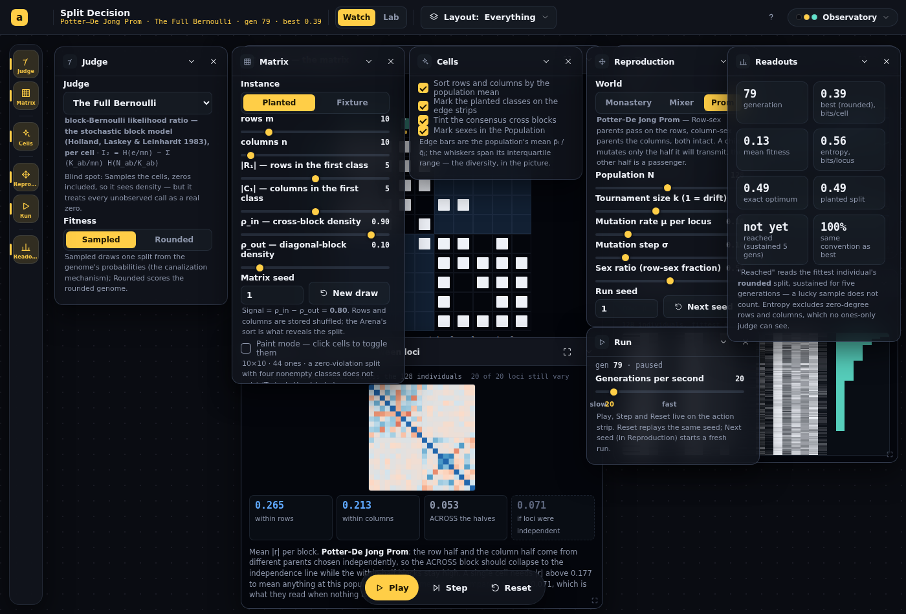

# Split Decision — from spec review to the Phase 1 engine

## Session purpose

Dan brought an agent-drafted spec for a "Split Decision" module and asked for a
review, then for a reading of what he actually wanted, then for the plan, then
"Go". The session covered: the review, the reading, the
[plan](2026-09-16-S01-plan-split-decision.md), a three-hats pass
([synthesis](2026-09-16-S01-expert-synthesis.md)), the plan's revisions, and Phase 1.

## Previous session

First tracked session on this branch.

## Working notes

### 🟢 code · 01:20 (09-18) — A third yield, excess over chance, clears both trivial barriers
**Why:** Dan: "What is a proxy that stands between count and density? I want to try to
avoid these trivial barriers."

*Count* runs away to swallowing the matrix; *density* runs away to hoarding one cell. The
proxy between them is **excess over chance**: a gender's share of the ones minus its share
of the cells, `N/T − K/(m·n)` = `(N − ρK)/T`, the per-block term of Newman's Leftovers.
Size is charged at exactly the rate chance pays it back, so swallowing everything cancels
to exactly 0, hoarding one 1-cell scores `1/T − 1/(m·n)`, and a block only scores by being
denser than chance *and* big. Adding a row pays iff that row is denser over the excluded
columns than the matrix is overall — the modularity greedy rule. Two ratio-type
interpolations were rejected on paper: `N/K^α` and the precision–recall F_β family both
*tie* the true split against the swallow at their midpoint (α = ½, β = 1) on the symmetric
clean case, since the planted block and the whole matrix have the same shape at two scales.

Measured against the real engine (10×10 planted, N = 128, μ = σ = 0.1, generation 600, at
the population consensus; the same protocol as the density table below):

| Rule · k | signal | |R₁| · |C₁| | row excess | col excess | **captured** | planted |
|---|---|---|---|---|---|---|
| clonal · 8 | 1.0 | 5 · 5 | +25 | +25 | **1.00** | 20/20 |
| prom · 3 | 1.0 | 5 · 5 | +25 | +25 | **1.00** | 20/20 |
| clonal · 8 | 0.6 | 7 · 3 | +18 | −1 | **0.76** | 14/20 |
| prom · 8 | 0.6 | 5 · 5 | +10 | +6 | **0.65** | 12/20 |
| prom · 8 | 0.2 | 6 · 3 | +11 | +4 | **0.69** | 11/20 |

(yields in percentage points; *planted* = loci agreeing with the planted cut up to the
global relabeling; the planted cut itself scores +10 / +12, captured 0.71, on the
signal-0.6 matrix.)

Both barriers are gone: no outcome swallows (the clonal count row was 10 · 0) and none
hoards (the Prom density row was 1 · 1). What is left is not trivial and differs by world:

- **Clonal, noisy → bounded conquest.** The population converges on *exactly* the row
  gender's private optimum — enumerating all 2²⁰ cuts, the best row-gender excess on
  that matrix is 0.183, a 7×7 block, and the consensus cut is that cut to the locus. The
  column gender is left with a block sparser than chance. With one parent and both
  genders in one tournament, whichever gender's payoff is larger wins the whole
  population; excess only bounds how far the winner grows (7×7, not 10×10).
- **Prom, noisy → a two-gender compromise.** An interior split where both score, each
  near its planted-cut value, capturing 0.65–0.67 against 0.71 at the planted cut. Same
  shape on 4 seeds; unchanged at 3000 generations and at k = 3. It is *not* the planted
  cut (12/20) — on a 0.6-signal realization the planted cut is neither gender's optimum
  nor the best sum (0.214 against 0.235), so there is no reason it should be.

Shipped as the third option on the *Yield* pill (density stays the default), with the
readout showing signed percentage points under excess. Two new tests: the defining
identity on every 2×2 cut with the swallow at exactly 0 and a sparse block negative, and
the 6×6 checkerboard ordering planted > hoard > swallow where density ties the first two
and count inverts the last. 371 → 373 passing, lint 0 errors at baseline, build green.

### 🟢 code · 07:10 — The selection dial: it worked, but it looked off and it restarted the run
**Why:** Dan: "I suspect there was supposed to be a selection dial added and it is set to
zero or something goes wrong with it."

Tested end to end first. The dial *works* — driven to 1 the run stays at best 0.00 (pure
drift), driven to 16 it reaches the 0.49 optimum. But two things were wrong with it:

1. **It looked like zero.** Widening the range from 1–6 to 1–16 moved the default k = 3
   from 40% of the track to 13%, right above a note saying "k = 1 is pure drift." Same
   value, reads as off. Now has labeled stops (*drift* · 8 · *hard*) so 3 reads as a
   position between anchors. A first cut also had a "3" stop, which collided with "drift"
   into "drift3" — dropped.
2. **Turning it restarted the run.** `useWatchLoop`'s rebuild key hashed the whole
   config, so moving *any* dial threw the population away and began at generation 0. Turn
   up selection on a run that has drifted and the run vanishes. The operator dials — k,
   μ, σ, sex ratio, sex quota — are now **live**: read through a ref each step, left out of
   the rebuild key, so the running population feels the new value next generation and the
   trace bends where you turned it. Measured: k = 1 for 79 generations (best 0.04), dial
   to *hard* mid-run → gen 86, not 0; 80 generations later, best 0.49. The things that
   define a run (matrix, judge, fitness, payoff, rule, N, seed) still rebuild — changing
   the rule mid-run correctly goes to gen 0.

Also closed a robustness hole found while testing: a stored k of 0 produced a label
reading **0** with the thumb pinned left while the input silently clamped to 1 and the
engine drifted. No path in the app can write a 0, but nothing prevented it either; k is now
clamped at the state boundary (`kc`) and `step` treats k < 1 as drift, with a test that
k = 0 and k = −5 produce exactly k = 1's population.

371 tests, lint 0 errors at baseline, build green, smoke `✓ #/split-decision poked=11`.

### 🟢 code · 06:40 — Reopened: the Judge panel was hiding under two others, and the clamp was moving collapsed cards by their open height
**Why:** Dan reopened the session — "something seems very far off." He hadn't said what
yet; a fresh-load screenshot of the default layout showed one thing that was.

The Judge panel had grown a Payoff control (and its notes) since the Essentials layout was
authored for a 300px-tall Judge. Rendered, it runs to the card cap (~497px), so the
collapsed Matrix header at y:330 and the Run panel at y:380 sat on top of its lower half:
the Fitness pills clipped, and the **new Payoff pill completely hidden** — in the default
view of the app, right after saying "there's a Payoff pill in the Judge panel."

Measured every panel under the Everything layout rather than guessing (Judge 497 capped,
Matrix 497 capped, Cells 318, Reproduction 468–497, Run 213, Readouts 457–497), set the
`estHeight`s to match, and re-placed the three layouts from those numbers.

That surfaced a **chrome bug** underneath: `clampToViewport` clamps every panel by its
`estHeight` regardless of `collapsed`, so a 48px collapsed header gets dragged up to where a
500px card would have to sit — onto whatever the layout put above it. It had been doing
this all along (the first screenshot's Matrix header at ~395 was the clamp, not the
authored y:330); honest heights just made it obvious. Fixed in `layouts.ts` with a
`PANEL_COLLAPSED_H = 48` beside the existing `PANEL_W = 268`, and a unit test that
authors a collapsed card under a tall one and checks it stays put while the same card
*open* is still pulled up. Benefits every app with a collapsed panel in an authored
layout.

Verified by measuring card rects and pairwise overlaps at **1400×900 and 1280×720** across
Essentials · Linkage · Population: zero overlaps, Payoff control visible, at both sizes.
The one residual — on a 720px viewport Judge + Run + a collapsed Matrix header genuinely
do not fit — was resolved by dropping Matrix from Essentials; it is one rail click away.
Tests 370 passing (1 new), lint 0 errors at baseline, build green, smoke
`✓ #/split-decision poked=11`.

Whether this is what Dan meant by "far off" is not yet known — asked.

### 🟢 code · 02:45 — Yield density removes the runaway and hands back a second tragedy; and the sex quota can now be lost
**Why:** Dan picked yield *density* over the raw count, and separately asked to relax the
enforced sex balance — "maybe we end up with self-reproducing lizards."

**Density.** A gender's ones over the **cells of its own block**, not over every 1 in the
matrix. Taking more now costs you the empty cells that come with it, so the corner stops
paying: measured, *every* outcome is a proper interior split, the |R₁|=0 conquest and the
|R₁|=|C₁|=10 mutual ruin are both gone. What replaces them depends on the **signal**:

| Rule · k | signal | |R₁| · |C₁| | row density | col density | **captured** |
|---|---|---|---|---|---|
| clonal · 3 | 1.0 | 5 · 5 | 1.00 | 1.00 | **1.00** |
| clonal · 8 | 1.0 | 5 · 5 | 1.00 | 1.00 | **1.00** |
| prom · 3 | 1.0 | 4 · 5 | 1.00 | 0.83 | **0.90** |
| prom · 3 | 0.6 | 1 · 2 | 0.75 | 0.72 | **0.39** |
| prom · 8 | 0.6 | 1 · 1 | 0.78 | 0.78 | **0.29** |
| prom · 8 | 0.2 | 1 · 1 | 0.78 | 0.56 | **0.27** |

(planted 10×10, N = 128, μ = σ = 0.1, generation 600, at the population consensus.)

On a **clean** checkerboard every row in R₁ is as good as every other, so there is nothing
to gain by shrinking, and both genders *and* the pot peak together at the true split —
the cooperative regime Dan predicted, reached exactly (5 · 5, densities 1.00, captured
1.00). On a **noisy** one the genders shrink onto whichever single row and column look
best, keep a respectable density each, and let two thirds of the 1s fall outside both
blocks. So density does not abolish the tragedy, it swaps it: **hoarding a small pure
corner** in place of swallowing the matrix. Higher k gets there faster. Both modes ship
(a *Yield* pill, density the default) because the two are different games and both are
findings.

**The sex quota.** `sexQuota` no longer clamps to [1, N−1], the ratio slider runs the full
0–1, and a new mode draws each birth instead of enforcing a count: **Enforced** keeps
every generation's composition identical, so runs stay comparable; **Drifting** lets the
realized ratio wander, and at a lopsided ratio or a small population the rare sex flickers
out. A two-sex rule with one sex present then has no parent to draw, so `step`
reproduces **parthenogenetically** — one parent, both halves transmitted, both halves
mutated (nothing is a passenger when there is only one parent). That is the whiptail
lizard, *Aspidoscelis neomexicanus*; `rowShare` on `GenStats` reports the realized
composition and the Readouts flag the generation.

Stated honestly in the panel: with a **fixed** ratio, losing a sex is a fluctuation and
not a fate — the lost sex is back in the next draw. Making the ratio *heritable*, so sex
itself is under selection, is what would let it go for good, and is the obvious next step.

The old test asserting "both sexes always exist" encoded the guarantee this removes; it
now states the new contract and points at the parthenogenesis tests. Six new quota tests,
two new density tests — 369 passing, lint 0 errors at baseline, build green, smoke
`✓ #/split-decision poked=11`.

### 🟡 note · 02:35 — "Degenerate cut" was jargon doing work it cannot do
**Why:** Dan read the sexed-yields note and said he wasn't sure what it meant. If the
app's author doesn't parse a term in his own panel, no reader will.

A cut is **degenerate** when one of the four classes is empty — every row on one side and
none on the other. It is a split that splits nothing, and every judge scores it 0 on
purpose. The sexed game's optimum is exactly that position: at |R₁| = 0, |C₁| = 10 the
column gender's block R₂×C₁ *is* the whole matrix, so it takes 100% and the row gender
takes 0; at |R₁| = |C₁| = 10 both cross blocks are empty and nobody takes anything. Both
corners are non-splits.

The panel now says that in those terms — the arrangement, what each gender ends up with,
and why the judges refuse it — instead of leaning on the word. Kept the word out of the
user-facing text entirely; it stays in the code comments, where the reader is someone who
has `isDegenerate` in front of them.

### 🟢 code · 02:20 — Sexed yields: the two genders divide one pot, and the worlds resolve it oppositely
**Why:** Dan asked for a way to turn the selection effect up, and for a variant where each
gender is scored on "the number of 1s it captures" — the row gender from its row
*inclusions* against its column *exclusions*, the column gender the other way round —
expecting that "depending on the regime, they could either be fighting or cooperating or
both."

**The selection knob was just capped low.** Tournament size k *is* the selection intensity
(a parent is the best of k draws, so it wins roughly the top 1/k), and its slider stopped
at 6. Raised to 16, with a note saying what it means.

**The variant is now a Payoff axis** (Judge panel): *Shared judge* or *Sexed yields*. The
two yields are the two **cross blocks** — row gender takes R₁×C₂, column gender takes
R₂×C₁ — so they sum to exactly the bipartite edge count that *Cut and Run* scores. That is
the whole shape of the thing: **the genders want the same cut to be a good cut, and they
want opposite sides of every locus.** `sexedYield` carries **no degenerate guard**, unlike
every judge: "include my whole half" is each gender's individually-best move, and where
that leads has to be reachable or the dynamic cannot be watched.

Measured before building any UI (planted 10×10, N = 128, μ = σ = 0.1, share of all the 1s
at the population consensus):

| Regime | rows in | cols in | row yield | col yield | captured |
|---|---|---|---|---|---|
| shared judge (edge count), Prom | 5/10 | 5/10 | 0.50 | 0.50 | **1.00** |
| sexed, **Monastery** (clonal), k=8, g200 | 0/10 | 10/10 | 0.00 | 1.00 | **1.00** |
| sexed, **Prom** (two sexes), k=8, g200 | 10/10 | 10/10 | 0.00 | 0.00 | **0.00** |

So both, as Dan guessed — but split by the *transmission rule*, not by a parameter:

- **Clonal reproduction resolves the conflict by conquest.** A whole genome is copied, so
  one lineage can move both halves coherently into a corner — and that corner (one side
  empty) captures *every* 1 in the matrix. Efficient and maximally unequal. Higher k gets
  there faster and more completely.
- **The two-sex Prom resolves it by mutual ruin.** Each gender transmits only its own half
  and each half's transmitter wants that half *included*, so both halves run to "include
  everything" and the cross blocks — which need one side excluded — empty out. They fight,
  and the pot goes from 1.00 to 0.00.

The winning cut under sexed yields is a **degenerate** one, the thing every judge in the
roster forbids. That is the headline, not a bug.

Instruments: the Trace plots the two genders' yields in place of best/mean (averaging two
incomparable objectives would be meaningless), the Readouts gain a *two genders* block
(the two yields · captured between them · classes included) and **drop** the judge's
optimum/planted/reached rows — an optimum nobody is scored against and a "reached" that can
never fire mislead more than they inform — and the subtitle reports the yields rather than
a `best 0.00` that is only the degenerate guard talking. The Lab forces the shared judge.

Engine: `payoff` on `EvolveConfig`, `sexedYield` in scores.ts, per-gender means in
`genStats`. Four new unit tests (each gender's own block, the sum identity against the edge
count, the degenerate corner scored where every judge gives 0, monotonicity of the
runaway). 361 tests passing, lint 0 errors at baseline, build green, smoke
`✓ #/split-decision poked=11`.

### 🟢 code · 02:05 — The correlation matrix made block-first, and a Locus order that can freeze
**Why:** Dan: "can we have the elements natively in block format so that when we look at
the correlation, it should show the block structure too… maybe the positions don't change
and something else does?"

He was right, and the picture proved it: the **Arena** read as blocks (rows sort by p̄,
columns by q̄, so the checkerboard snapped into two cross-blocks) while the **correlation
matrix beside it, on the same order, read as speckle** — even though the numbers said the
structure was there (within-rows |r| = 0.201 against an independence line of 0.071).

Two reasons, both about the drawing rather than the math:

- **The color scale was spending itself on nothing.** `r` was mapped over the full
  [−1, +1]. Real structure sits near 0.2 — 10% off the pale center, invisible — while the
  diagonal, which is 1 by definition and says nothing, got the only saturated color.
  Clipping at **±0.5** puts the scale where the data is. It is a *constant*, not an
  auto-fit: normalizing per frame would make the Mixer's noise as loud as the Monastery's
  signal and destroy the comparison the view exists for.
- **Only one boundary was ruled** (row half vs column half), in `--border`, which is a
  0.13-alpha panel hairline and vanished over the cells. The cut splits each half again,
  so there are four groups and a 4×4 grid of blocks.

Now the picture is **block-first**: each block is washed neutrally (`--fg` at an alpha, so
it carries magnitude and no hue) by how far its mean |r| runs above the independence line,
cells sit on top inset by a hairline so the wash reads as a lattice, the diagonal is muted,
and every group boundary is ruled. The three rules become legible at a glance:

| Rule | what the blocks do | within rows | within cols | ACROSS |
|---|---|---|---|---|
| Hardy–Weinberg Mixer | nothing lit — linkage equilibrium | 0.084 | 0.071 | 0.077 |
| Muller's Monastery | every block lit | 0.152 | 0.212 | 0.163 |
| Potter–De Jong Prom | within-half lit, ACROSS dark | 0.243 | 0.350 | 0.073 |

(independence line 0.071 throughout; N = 128, planted 10×10, ~200 generations.)

**And the motion question.** Dan's own suggestion — positions don't change, something else
does — is now a **Locus order** pill in the Cells panel, because both readings are worth
having: **Live** (sort by the population mean, as before: the reorganizing *is* the
discovery, at the cost of positions that move while it converges) · **Planted** (grouped by
the true cut and frozen for the whole run: nothing moves, and what changes is the color
filling into the blocks — it does show the answer from generation 0) · **Stored** (the
shuffled generation order, no grouping). `LocusOrder` now carries `rowSplit`/`colSplit`, so
the Arena and the correlation matrix always rule in the same places. Planted is hidden when
the instance has no planted cut (a painted matrix).

Verified: in Planted mode the Arena's row positions are byte-identical before and after ten
seconds of evolution, while the bars, the tint and the correlation colors all move. Tests
357 passing, lint 0 errors at the 58-warning baseline, build green, smoke `✓ #/split-decision
poked=11`.

### 🟢 code · 01:35 — The phone crash, named: a snapshot that outlived its matrix
**Why:** the new error panel did its job — Dan pasted the frame.

```
TypeError: (intermediate value)(intermediate value)(intermediate value) is not iterable
SplitDecision-JPeO04S2.js:162:16951
Object.Ga [as useMemo] (index-C7YXlu4v.js:39:21312)
```

Resolved through the emitted map (`@jridgewell/trace-mapping`, line 162 col 16880 →
`Arena.tsx:89` the `useMemo`, col 16951 → `Arena.tsx:93` `spreadP`):

```ts
const [lo, hi] = spreadP ? spreadP[i] : [v, v];   // Arena.tsx:93
```

`spreadP` comes from the population snapshot. **Change the matrix size and React
renders the new `m` before the loop republishes** — so for one paint the Arena walks
`i < m` over a `spreadP` still sized to the old matrix, and `spreadP[i]` is
`undefined`. Reproduced in one move: load, open the Matrix panel, drag *rows* up.
Same message, same offset.

My earlier reading of the message was wrong in its specifics — I had concluded from
Node's V8 that the braces of an object literal must be there. Chrome 153 renders a
ternary's three arms as three unnamed pieces with no braces. The generic part held:
something non-iterable, destructured.

**Fixed in two places.** `SplitDecision.tsx` gates a stale snapshot at the source —
if `consensus.p.length !== M.m` (or `q`/`n`), the views get `null` and draw neutral
bars for the one frame until the loop catches up; that covers the Arena, Linkage and
Population, all of which index per locus. `Arena.tsx` also makes its own reads total
(`spreadP?.[i] ?? [v, v]`), because a whole route dying is too steep a price for an
index that runs past the end.

### 🔵 finding · 01:30 — Why CI never saw it: the error boundary hid it from the smoke gate
**Why:** `scripts/smoke.mjs` exists for exactly this defect class and passed the route.

Two holes, both now closed.

1. **`RouteBoundary` catches the error**, so no `pageerror` reaches the page and a
   crashed route reads as a clean load — the smoke gate's main load-bearing detector
   was blind to *every* contained route crash, not just this one. The boundary now
   renders a `data-am-route-error` marker and the gate fails on it.
2. **Loading a route only proves it boots at its defaults.** The gate now runs a
   **poke pass**: open each panel in turn (on phone the sheet is closed at load, so
   poking without opening finds nothing) and move every range input it shows, then
   re-check. 130-odd sliders across 16 routes, and `#/split-decision` and
   `#/counting-the-ways` were missing from the route table entirely — both added.

Verified both directions: with the fix reverted the gate reports
`✗ #/split-decision — route error panel after moving a control: TypeError: … @
SplitDecision-BWGI4H62.js:162:16951`; with it in place all 19 routes pass the poke
pass clean.

One pre-existing failure is left standing and is not this branch's: `#/trees-and-nets`
reports `no <canvas>` (it is listed `webgl: true`). Confirmed identical on the
unmodified script, so it predates this work.

### 🔵 finding · 01:00 — A phone crash I cannot reproduce, and what its message narrows it to
**Why:** Dan hit `TypeError: (intermediate value)(intermediate value)(intermediate value) is not iterable`
on a phone (Brave, Mirage skin, the branch preview at ac96de4) — the route error panel,
no top bar.

**Not reproduced,** across everything I could vary against the same built bundle:
every one of the 17 routes at 390 px; Split Decision at 356×673 with `deviceScaleFactor: 3`,
a mobile user-agent and real touch taps on every button; six seeded persisted states
(fresh, Lab mode, a 24×24 matrix, fixture source, the Prom with sexes); and all 8 skins ×
3 modes. No page errors in any of them.

What the message does narrow: V8 prints `(intermediate value)` for an element it cannot
name in a *reconstructed source expression*. Probing the forms (`scratchpad/v8msg*.mjs`)
gives exactly one that produces this shape —

```
> const [q] = {a, b, c}
TypeError: {(intermediate value)(intermediate value)(intermediate value)} is not iterable
> [...{a, b, c}]
TypeError: {(intermediate value)(intermediate value)(intermediate value)} is not iterable
```

— array-destructuring or spreading **an object literal with exactly three properties**
(the braces are in the message; they are thin glyphs in the panel's dim mono and easy to
lose in a photo). Every other candidate form carries a trailing
`(cannot read property …)` or names its callee. Grepping the built bundles for that
construct (`]={`, `...{`, array-pattern parameters) finds none in our code, so the next
report needs the frame, not more guessing.

**So: make the report carry the location.** Branch previews now build with source maps
(`build.sourcemap` when `CF_PAGES_BRANCH` is set and is not `main`; production stays
map-free), and the route error panel now prints the top four stack frames plus the
component chain, shortened to `name (chunk.js:line:col)` so it fits a phone, with a
**Copy details** button (clipboard, textarea fallback) that also picks up the URL and the
user agent. A frame like `zs (SplitDecision-BI9QWTwp.js:162:31755)` maps straight back
through the emitted `.map`, which carries `sourcesContent`. Verified by forcing a crash
through a malformed persisted record and reading the panel at phone size.

### 🟢 code · 00:40 — Two faults Dan reported: the Lab's gate, and layouts that moved nothing
**Why:** "Many problems. Cannot change from fixed layout to something else. Lab does not work."

**The Lab.** Reproduced, and it was not a crash. The Lab took its planted matrix size
from the Watch mode's **Matrix** panel sliders — which Dan had turned up to 24×24 while
we were chasing the crawl. Past m + n = 20 the Exhaustive Bailiff cannot enumerate, so
`canEnumerate` went false and **Run sweep** rendered disabled behind a gate note that
pointed at a panel the Lab does not show. Fix: the Lab plants its own matrices
(`labM`/`labN`, 4–16, their own sliders and their own persisted keys), so what you are
watching can never disable a sweep.

Two things surfaced while verifying it. The catalog was storing every raw per-run row —
216 of them, a re-render and a ~55 KB `localStorage` write **per finished run**; it now
stores only the per-cell summaries the view draws (a finished sweep: **1.1 KB**, down
from ~55 KB) and publishes on a 250 ms throttle with the raw rows in a ref. And a
record left by an older build crashed the whole route on first paint, because the
migration that dropped it ran in an effect — after the render that read it. Records are
now filtered where they are *read*, not in an effect.

**The layouts.** I could not reproduce a menu that refuses to change — fresh loads, both
modes, drag-to-Custom, 1400/1100/900/700/390 px, a full catalog and a near-full storage
quota all switched fine. What I did find is the substance of the complaint: Split
Decision shipped **one** authored layout, and neither it nor the builtin Compact and
Everything overrode any view rect, so every arrangement left the four windows in
*identical* positions (measured: Arena at 372,70 560×520 under all three). Picking a
different layout genuinely did nothing you could see. Watch mode now has three authored
arrangements that move the windows — **Essentials** (Arena wide, Trace tall beside it),
**Linkage** (Arena and the correlation matrix side by side over a full-width Trace), and
**Population** (the genome strips full height, Arena and Trace stacked to their right) —
plus Compact and Everything's four-window tile. Verified by measuring the rects at each
pick: all four differ.

Headless verification on the built bundle: with a 24×24 Watch matrix persisted, Run
sweep is enabled, a 24-run sweep finishes in ~1.5 s, the record round-trips through a
reload, and no page errors. `npm test` 50 Split Decision tests passing, `npm run lint`
0 errors / 58 warnings (baseline), `npm run build` green. Still unverified on a real
device.

### 🟢 code · 23:10 — Linkage view: the correlation matrix between loci, and the trap preset made honest
**Why:** Dan asked whether the Lab works, and suggested the population's gene-by-gene
correlation matrix would be useful.

**The Lab works.** Driven end to end on the current head: the signal sweep runs its
216 runs in **11 s** (42 s before the optimum caching — a 4× win from the Codex fix),
no page errors, and the hypotheses hold. But the **Escape-the-trap preset reported
0/12 for all three rules**, which looks broken and discriminates nothing. It is not a
crash; it is a real dynamic plus a wrong metric:

| condition | escapes |
|---|---|
| seeded at the trap, μ = 0.1 (shipped default) | 0/12 for every rule, at any seeding softness |
| μ = 0.2, σ = 0.15 | Monastery 3/12 · Mixer 1/12 · Prom 1/12 |
| μ = 0.3, σ = 0.3 | 12/12 for every rule |

Every individual starts at exactly 0 or 1, and a reflecting step of σ = 0.1 cannot
carry a locus back across ½ against selection — a strict local optimum with no
standing variation is absorbing. Two fixes: the preset now reports **escape** (the
first generation the best rounded cut beats the trap), which is what H3 actually
asks and which fires where "reached the global optimum" still reads zero; and the Lab
panel states the measured mutation threshold instead of letting it look broken.

**The Linkage view** (`linkage.ts`, unit-tested against an independent Pearson
implementation) correlates all m+n loci across the population and draws the matrix on
a divergent map, ordered like the Arena. Measured in the running app, 10×10 planted,
N = 128, generation ~79:

| rule | within rows | within columns | ACROSS halves | independence baseline |
|---|---|---|---|---|
| Hardy–Weinberg Mixer | 0.087 | 0.086 | 0.082 | 0.071 |
| Muller's Monastery | 0.220 | 0.190 | 0.221 | 0.071 |
| Potter–De Jong Prom | 0.265 | 0.213 | **0.053** | 0.071 |

The Mixer sits at the independence line in every block — **linkage equilibrium**,
Geiringer's theorem, and the exact condition under which sex reads as
multiplicative-weights updates per locus. The Monastery holds every block ~3× above
it. The Prom holds the within-half blocks and collapses the cross-half block *to
below* the line. That last row is the mechanism behind the trap result in one picture:
the rule that takes its rows and its columns from independently chosen parents is
structurally unable to build a row–column association, which is precisely what
escaping a coordinated trap requires.

> [!NOTE]
> **A statistical detail worth keeping.** The threshold for one cell (≈2/√N) is not
> the baseline for a *mean* |r| (√(2/π)/√N ≈ 0.8 SE). Comparing the means against the
> cell threshold would have made an equilibrated population look structured. Both are
> reported, and the view says which is which.



### 🟢 code · 22:05 — Watch mode was render-bound, not compute-bound; fixed
**Why:** Dan reported "it runs too slow… I turned up some of the parameters but the
screen crawls."

Reproduced headless before changing anything: at 24×24 with N = 256, asking for
20 generations a second delivered **9.2**. A CPU profile of that run put **44% of
the time inside React's reconciler** and 6% in DOM mutation, against ~8% in this
app's own math — so the simulation was never the problem. The Population view alone
was ~12k SVG rects, and both it and the Arena rebuilt on every published frame
(a collapsed view still renders: the workspace hides views, it never unmounts them).

Four changes, in the order the profile justified them:

| Change | Effect |
|---|---|
| Three cadences in `useWatchLoop`: generations advance freely, React snapshots at ≤20 Hz, the population-level picture at ≤4 Hz | React work no longer scales with generation rate |
| `genStats` split into a light per-generation record and `fullStats` (consensus, quartiles, convention fraction) for the render cadence | per-generation cost 2.74 → 1.77 ms at defaults; the Lab sweep gets it free |
| Population view → one canvas (ImageData at one pixel per gene, blitted with smoothing off) | ~12k elements → one draw call |
| Arena: memoized cell grid, engine-supplied quartiles, hover as an overlay band | the grid rebuilds at 4 Hz, not per frame, and hovering no longer touches every cell |

Measured after (same harness, requested 20 gen/s):

| Configuration | before | after |
|---|---|---|
| 10×10, N = 128 (defaults) | 20.2 | 20.1 |
| 24×24, N = 256 | **9.2** | **20.1** |
| 40×40, N = 256 | not held | 20.0 |

The re-profile inverts: React's reconciler drops out of the top ten and the page sits
**62% idle**, with the remainder in the simulation. At 200 gen/s requested, 24×24 /
N = 256 reaches ~112, which is now the honest engine ceiling (three populations
stepping in lockstep for the two entropy control curves).

> [!CAUTION]
> **Two bugs the verification caught, not the eye.** (1) I "optimized" the
> canonicalization by deriving the complemented distance as `len − s`; that identity
> is false (`|ref − (1 − g)| ≠ len − |ref − g|`), and a brute-force equivalence test
> written alongside the change failed immediately. Both distances are now summed in
> the same pass. (2) The canvas painted its separator neon green: `--border` is
> `rgba(150,175,220,0.13)`, and hex-slicing it read "ba" as 186. Colors now resolve
> through a scratch 2-D context, which handles every CSS color form; a pixel probe
> across two skins confirms only theme foreground values remain.


### 🟢 code · 20:20 — Phase 3 lands: the Lab (worker sweep, survival curves, catalog, Escape the trap)
**Why:** the Lab is where the per-rule hypotheses get their curves.

`lab/sweep.ts` gained an instance kind (planted across a signal axis, or a fixture
with a starting cut); `lab/worker.ts` is a typed ten-line message loop;
`lab/pool.ts` deals one run per job to `min(8, cores − 1)` module workers, streams
results, and falls back to yielding main-thread chunks without Workers.
`views/Sweep.tsx` plots reached-by-G_max per rule across signal, the survival curve
at a selected level, a **hypotheses** box (predicted → observed), and the persisted
catalog (config + results, engine-stamped, capped at 12). The Lab mode reuses the
Judge and Reproduction panels, adds a `lab` panel (preset, levels, seeds, G_max,
rules, an evaluation-count estimate) and swaps the action strip to Run sweep · Stop ·
Clear. Leaving Watch pauses the population (it survives in the loop's ref); leaving
the Lab disposes the pool. 40 tests, lint at baseline, build green.

First real sweep, driven headless against the built app (planted 10×10, The Full
Bernoulli, N = 128, k = 3, 12 seeds, G_max 300, six signal levels, 216 runs in 42 s
in the sandbox, no page errors), read at signal 1.0:

| Rule | reached | median generation |
|---|---|---|
| Hardy–Weinberg Mixer | 12/12 | 32 |
| Potter–De Jong Prom | 12/12 | 84 |
| Muller's Monastery | 12/12 | 135 |

H1 (Mixer dominates the Monastery at strong signal) and H2 (the Prom is slower than
the Mixer) both hold at this level with these parameters. One sweep, one instance;
the curves at lower signal and the trap preset are for Dan to run.


### 🟢 code · 19:55 — Phase 2 lands: Watch mode, registered, in the Storeroom
**Why:** the plan's Phase 2 is where the app becomes visible; the main PR lands with it.

`SplitDecision.tsx` (six panels on the corrected archetypes, three views, an
Essentials layout, Play/Step/Reset on the action strip), `useWatchLoop.ts` (population
in a ref, one rAF loop with an accumulator, one snapshot per frame; a **neutral twin**
and a **Rounded twin** run in lockstep from the same seed for the entropy trace),
`views/{Arena,Population,Trace}.tsx`, `splitDecision.css`, `EXPLAINER.md` (with the
sources block, uncertain pointers flagged). Registered in `index.tsx`, `apps.ts`
(above the plane-arithmetic pair), `catalog.ts` (Algorithm, preview kind `matrix`,
`storeroom: true`), README and CLAUDE.md rows. `npm run build` green, lint 0 errors
with no new warnings, `npm test` 346 passing.

Verified headless (puppeteer against the built preview): the page loads with no
errors of its own (the two console errors are Google Fonts blocked by the sandbox
proxy and a favicon 404, present on every route), Play advances ~135 generations in
7 s at 20 gen/s, the Arena reorders, the three entropy curves separate. Real-device
and phone interaction not checked (`visual-unverified`, `phone-needed`).


### 🔵 finding · 19:50 — Premature convergence under the plan's defaults; defaults raised
**Why:** the first driven run (seed 1, N = 64, k = 2) converged to a poor split and
stayed there — a bad first impression, and a real dynamic.

Reproduced in the engine: the UI matched the tests exactly; seed 1 was simply an
unlucky draw. A 12-seed grid on the default 10×10 (signal 0.8, The Full Bernoulli,
G_max = 300) made the choice:

| Setting | Mixer | Monastery | Prom |
|---|---|---|---|
| k = 2, N = 64 (plan default) | 11/12, median 120 | 2/12 | **1/12** |
| k = 3, N = 64 | 12/12, median 87 | 9/12, median 186 | 5/12 |
| k = 3, N = 128 (**new default**) | 12/12, median 56 | 12/12, median 168 | 12/12, median 171 |

Under weak selection a small population drifts into a random basin before the
fitness gradient (nearly flat far from the optimum, and noisy under Sampled fitness)
can act. `DEFAULT_CONFIG` is now N = 128, k = 3. The table is also the first real
reading of the per-rule hypotheses: the Mixer dominates, the Prom is the slowest and
the most sensitive to selection strength. Worth a Lab preset.

### 🟢 code · 19:40 — Phase 1 engine lands: 39 tests, build/lint/test green
**Why:** the plan's Phase 1 is a commit boundary; every acceptance row is a test.

Files: `src/lib/rng.ts` (the first shared `mulberry32` + `runSeed`),
`src/animations/SplitDecision/{matrix,scores,evolve}.ts`, `lab/sweep.ts`, and
`__tests__/{scores,evolve}.test.ts`. Baseline afterwards: `npm test` 346 passing,
`npm run lint` 0 errors / 58 warnings (unchanged), `npm run build` green.

Numbers from the real engine (perfect planted 8×10, N = 64, k = 2, μ = σ = 0.1,
reflecting mutation, "reached" = sustained rounded optimum for 5 generations, 12 seeds,
G_max = 300):

| Score | Monastery (clonal) | Mixer (swap sex) | Prom (two sexes, intact) |
|---|---|---|---|
| The Full Bernoulli | 11/12, median gen 180 | **12/12, median 61** | 12/12, median 155 |
| Cut and Run | 7/12, median 192 | 6/12, median 66 | 4/12, median 192 |

Entropy per locus (10×10 planted, Monastery, Cut and Run, 8 seeds), bits:

| Condition | gen 0 | gen 100 | gen 200 |
|---|---|---|---|
| neutral k = 1 | 0.726 | 0.743 | 0.709 |
| Rounded k = 2 | 0.726 | 0.694 | 0.646 |
| Sampled k = 2 | 0.726 | 0.590 | 0.537 |

Two readings, both provisional at 12 seeds: with transmitted-half-only mutation the
Prom reaches the Bernoulli optimum on every seed, slower than the Mixer and about as
fast as the Monastery (the pedagogy review's smoke test, with whole-genome mutation,
had it last by a wide margin); and the three entropy curves separate as the review
predicted, with reflecting mutation keeping the neutral curve flat.

### 🟣 decision · 18:55 — Plan revised after three-hats
**Why:** the three reviews converged on the shape and corrected the details.

Recorded in the plan's *Revisions after three-hats* section: operators not rules;
scores over a block table counted once; `x, y ∈ {±1}`; Barber's Q; Occam relative to
the no-split code; reflecting mutation; Prom mutates only the transmitted half; seeded
sex quota; "reached" on the rounded genome; archetype corrections; Lab panel set;
Phase 1 as a commit boundary; per-rule hypotheses; survival curves.

### 🔵 finding · 17:05 — The page-50 trap traps only under the balance constraint
**Why:** a GA's mutation flips single loci, so the fixture had to be redefined.

Under unconstrained single flips the monograph's page-50 cut is a strict local
optimum only for modularity (0.173 local vs 0.271 global under Barber's Q). Encoded as
the first trap fixture and its test.

### 🟣 decision · 16:50 — What Dan wants: the evolution, not the statistics
**Why:** Dan had not written or read the spec closely; the history he pasted showed
the GA-with-sex idea was his and the statistics were the drafting agent's center.

The plan puts the reproductive rule as the experiment and the scores as landscapes;
the monograph's calibration machinery is deferred.
