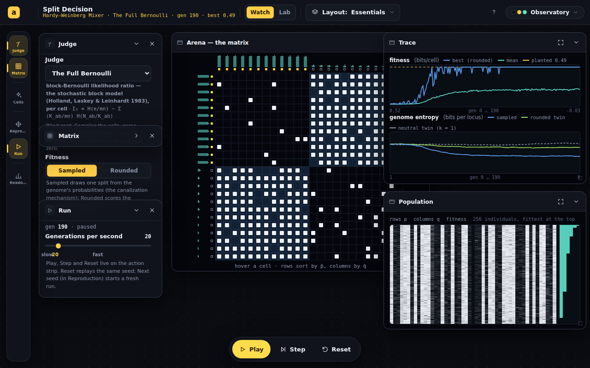
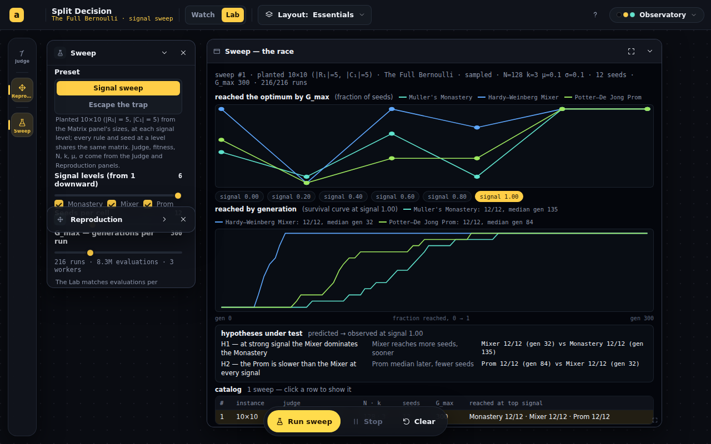
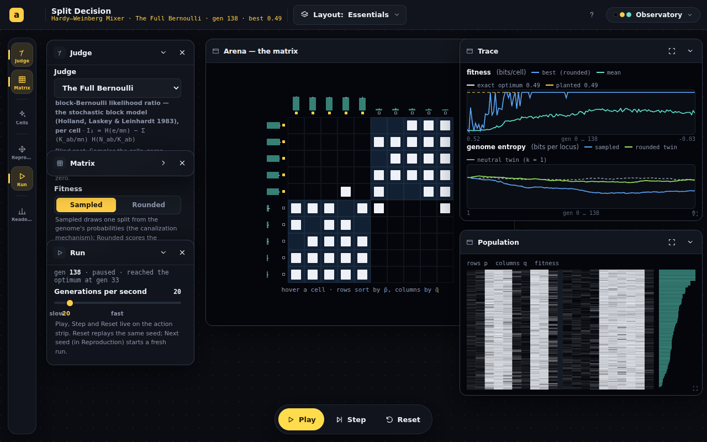

# Split Decision — from spec review to the Phase 1 engine

## Session purpose

Dan brought an agent-drafted spec for a "Split Decision" module and asked for a
review, then for a reading of what he actually wanted, then for the plan, then
"Go". The session covered: the review, the reading, the
[plan](2026-09-16-S01-plan-split-decision.md), a three-hats pass
([synthesis](2026-09-16-S01-expert-synthesis.md)), the plan's revisions, and Phase 1.

## Previous session

First tracked session on this branch.

## Working notes

### 🟢 code · 22:05 — Watch mode was render-bound, not compute-bound; fixed
**Why:** Dan reported "it runs too slow… I turned up some of the parameters but the
screen crawls."

Reproduced headless before changing anything: at 24×24 with N = 256, asking for
20 generations a second delivered **9.2**. A CPU profile of that run put **44% of
the time inside React's reconciler** and 6% in DOM mutation, against ~8% in this
app's own math — so the simulation was never the problem. The Population view alone
was ~12k SVG rects, and both it and the Arena rebuilt on every published frame
(a collapsed view still renders: the workspace hides views, it never unmounts them).

Four changes, in the order the profile justified them:

| Change | Effect |
|---|---|
| Three cadences in `useWatchLoop`: generations advance freely, React snapshots at ≤20 Hz, the population-level picture at ≤4 Hz | React work no longer scales with generation rate |
| `genStats` split into a light per-generation record and `fullStats` (consensus, quartiles, convention fraction) for the render cadence | per-generation cost 2.74 → 1.77 ms at defaults; the Lab sweep gets it free |
| Population view → one canvas (ImageData at one pixel per gene, blitted with smoothing off) | ~12k elements → one draw call |
| Arena: memoized cell grid, engine-supplied quartiles, hover as an overlay band | the grid rebuilds at 4 Hz, not per frame, and hovering no longer touches every cell |

Measured after (same harness, requested 20 gen/s):

| Configuration | before | after |
|---|---|---|
| 10×10, N = 128 (defaults) | 20.2 | 20.1 |
| 24×24, N = 256 | **9.2** | **20.1** |
| 40×40, N = 256 | not held | 20.0 |

The re-profile inverts: React's reconciler drops out of the top ten and the page sits
**62% idle**, with the remainder in the simulation. At 200 gen/s requested, 24×24 /
N = 256 reaches ~112, which is now the honest engine ceiling (three populations
stepping in lockstep for the two entropy control curves).

> [!CAUTION]
> **Two bugs the verification caught, not the eye.** (1) I "optimized" the
> canonicalization by deriving the complemented distance as `len − s`; that identity
> is false (`|ref − (1 − g)| ≠ len − |ref − g|`), and a brute-force equivalence test
> written alongside the change failed immediately. Both distances are now summed in
> the same pass. (2) The canvas painted its separator neon green: `--border` is
> `rgba(150,175,220,0.13)`, and hex-slicing it read "ba" as 186. Colors now resolve
> through a scratch 2-D context, which handles every CSS color form; a pixel probe
> across two skins confirms only theme foreground values remain.

### 🟢 code · 20:20 — Phase 3 lands: the Lab (worker sweep, survival curves, catalog, Escape the trap)
**Why:** the Lab is where the per-rule hypotheses get their curves.

`lab/sweep.ts` gained an instance kind (planted across a signal axis, or a fixture
with a starting cut); `lab/worker.ts` is a typed ten-line message loop;
`lab/pool.ts` deals one run per job to `min(8, cores − 1)` module workers, streams
results, and falls back to yielding main-thread chunks without Workers.
`views/Sweep.tsx` plots reached-by-G_max per rule across signal, the survival curve
at a selected level, a **hypotheses** box (predicted → observed), and the persisted
catalog (config + results, engine-stamped, capped at 12). The Lab mode reuses the
Judge and Reproduction panels, adds a `lab` panel (preset, levels, seeds, G_max,
rules, an evaluation-count estimate) and swaps the action strip to Run sweep · Stop ·
Clear. Leaving Watch pauses the population (it survives in the loop's ref); leaving
the Lab disposes the pool. 40 tests, lint at baseline, build green.

First real sweep, driven headless against the built app (planted 10×10, The Full
Bernoulli, N = 128, k = 3, 12 seeds, G_max 300, six signal levels, 216 runs in 42 s
in the sandbox, no page errors), read at signal 1.0:

| Rule | reached | median generation |
|---|---|---|
| Hardy–Weinberg Mixer | 12/12 | 32 |
| Potter–De Jong Prom | 12/12 | 84 |
| Muller's Monastery | 12/12 | 135 |

H1 (Mixer dominates the Monastery at strong signal) and H2 (the Prom is slower than
the Mixer) both hold at this level with these parameters. One sweep, one instance;
the curves at lower signal and the trap preset are for Dan to run.

### 🟢 code · 19:55 — Phase 2 lands: Watch mode, registered, in the Storeroom
**Why:** the plan's Phase 2 is where the app becomes visible; the main PR lands with it.

`SplitDecision.tsx` (six panels on the corrected archetypes, three views, an
Essentials layout, Play/Step/Reset on the action strip), `useWatchLoop.ts` (population
in a ref, one rAF loop with an accumulator, one snapshot per frame; a **neutral twin**
and a **Rounded twin** run in lockstep from the same seed for the entropy trace),
`views/{Arena,Population,Trace}.tsx`, `splitDecision.css`, `EXPLAINER.md` (with the
sources block, uncertain pointers flagged). Registered in `index.tsx`, `apps.ts`
(above the plane-arithmetic pair), `catalog.ts` (Algorithm, preview kind `matrix`,
`storeroom: true`), README and CLAUDE.md rows. `npm run build` green, lint 0 errors
with no new warnings, `npm test` 346 passing.

Verified headless (puppeteer against the built preview): the page loads with no
errors of its own (the two console errors are Google Fonts blocked by the sandbox
proxy and a favicon 404, present on every route), Play advances ~135 generations in
7 s at 20 gen/s, the Arena reorders, the three entropy curves separate. Real-device
and phone interaction not checked (`visual-unverified`, `phone-needed`).

### 🔵 finding · 19:50 — Premature convergence under the plan's defaults; defaults raised
**Why:** the first driven run (seed 1, N = 64, k = 2) converged to a poor split and
stayed there — a bad first impression, and a real dynamic.

Reproduced in the engine: the UI matched the tests exactly; seed 1 was simply an
unlucky draw. A 12-seed grid on the default 10×10 (signal 0.8, The Full Bernoulli,
G_max = 300) made the choice:

| Setting | Mixer | Monastery | Prom |
|---|---|---|---|
| k = 2, N = 64 (plan default) | 11/12, median 120 | 2/12 | **1/12** |
| k = 3, N = 64 | 12/12, median 87 | 9/12, median 186 | 5/12 |
| k = 3, N = 128 (**new default**) | 12/12, median 56 | 12/12, median 168 | 12/12, median 171 |

Under weak selection a small population drifts into a random basin before the
fitness gradient (nearly flat far from the optimum, and noisy under Sampled fitness)
can act. `DEFAULT_CONFIG` is now N = 128, k = 3. The table is also the first real
reading of the per-rule hypotheses: the Mixer dominates, the Prom is the slowest and
the most sensitive to selection strength. Worth a Lab preset.

### 🟢 code · 19:40 — Phase 1 engine lands: 39 tests, build/lint/test green
**Why:** the plan's Phase 1 is a commit boundary; every acceptance row is a test.

Files: `src/lib/rng.ts` (the first shared `mulberry32` + `runSeed`),
`src/animations/SplitDecision/{matrix,scores,evolve}.ts`, `lab/sweep.ts`, and
`__tests__/{scores,evolve}.test.ts`. Baseline afterwards: `npm test` 346 passing,
`npm run lint` 0 errors / 58 warnings (unchanged), `npm run build` green.

Numbers from the real engine (perfect planted 8×10, N = 64, k = 2, μ = σ = 0.1,
reflecting mutation, "reached" = sustained rounded optimum for 5 generations, 12 seeds,
G_max = 300):

| Score | Monastery (clonal) | Mixer (swap sex) | Prom (two sexes, intact) |
|---|---|---|---|
| The Full Bernoulli | 11/12, median gen 180 | **12/12, median 61** | 12/12, median 155 |
| Cut and Run | 7/12, median 192 | 6/12, median 66 | 4/12, median 192 |

Entropy per locus (10×10 planted, Monastery, Cut and Run, 8 seeds), bits:

| Condition | gen 0 | gen 100 | gen 200 |
|---|---|---|---|
| neutral k = 1 | 0.726 | 0.743 | 0.709 |
| Rounded k = 2 | 0.726 | 0.694 | 0.646 |
| Sampled k = 2 | 0.726 | 0.590 | 0.537 |

Two readings, both provisional at 12 seeds: with transmitted-half-only mutation the
Prom reaches the Bernoulli optimum on every seed, slower than the Mixer and about as
fast as the Monastery (the pedagogy review's smoke test, with whole-genome mutation,
had it last by a wide margin); and the three entropy curves separate as the review
predicted, with reflecting mutation keeping the neutral curve flat.

### 🟣 decision · 18:55 — Plan revised after three-hats
**Why:** the three reviews converged on the shape and corrected the details.

Recorded in the plan's *Revisions after three-hats* section: operators not rules;
scores over a block table counted once; `x, y ∈ {±1}`; Barber's Q; Occam relative to
the no-split code; reflecting mutation; Prom mutates only the transmitted half; seeded
sex quota; "reached" on the rounded genome; archetype corrections; Lab panel set;
Phase 1 as a commit boundary; per-rule hypotheses; survival curves.

### 🔵 finding · 17:05 — The page-50 trap traps only under the balance constraint
**Why:** a GA's mutation flips single loci, so the fixture had to be redefined.

Under unconstrained single flips the monograph's page-50 cut is a strict local
optimum only for modularity (0.173 local vs 0.271 global under Barber's Q). Encoded as
the first trap fixture and its test.

### 🟣 decision · 16:50 — What Dan wants: the evolution, not the statistics
**Why:** Dan had not written or read the spec closely; the history he pasted showed
the GA-with-sex idea was his and the statistics were the drafting agent's center.

The plan puts the reproductive rule as the experiment and the scores as landscapes;
the monograph's calibration machinery is deferred.
