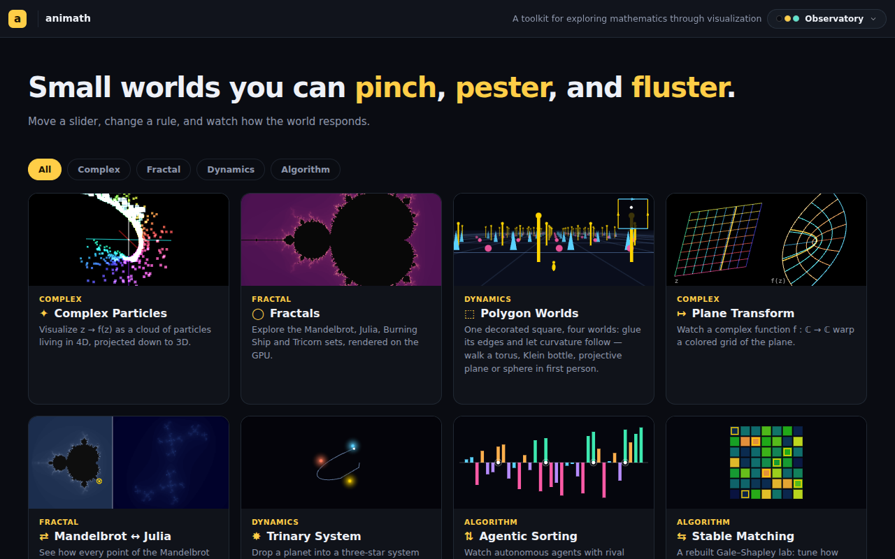

# Gallery ordering cleanup — feature top three, retire Stable Marriage, demote Topology Walk

## Session purpose

Clean up the landing gallery: reorder the apps so the **top three** are
**Complex Particles, Fractals, and Polygon Worlds**; **retire Stable Marriage**
in favor of **Stable Matching**; and **move Topology Walk (Möbius) toward the end**.

## Previous session

New topic — not a continuation. The most recent handoff is
[topology-world-review · 2026-06-14-S01](../../handoff/topology-world-review-m9p5as/2026-06-14-S01-tighten-and-enrich.md)
(Polygon Worlds: per-world embedding inset, richer shading, phone fix; ℝP² seam
parked). Nothing pending there blocks this gallery work. This is the **first
tracked session on `claude/gallery-app-ordering-4y84fi`**.

## Working notes

### 🟡 milestone · 03:32 — Shipped: reorder + retire, build green, gallery verified
**Why:** Both decisions answered (hide / named-changes-only); implemented and verified.

Reordered `src/apps.ts` and dropped the `/stable-marriage` `META` entry in
`src/chrome/catalog.ts` (card retired, `#/stable-marriage` route still live and
still builds). Updated the catalog header comment to document the
"present only if it has a META entry" retirement mechanism. `npm run build`
passes; headless shot of `#/` confirms the new top row (Complex Particles ·
Fractals · Polygon Worlds) and no Stable Marriage card.

**New gallery order:** Complex Particles · Fractals · Polygon Worlds · Plane
Transform · Mandelbrot↔Julia · Trinary · Agentic Sorting · Stable Matching ·
Trees and Nets · Topology Walk. (Stable Marriage hidden; everyone else keeps
their prior relative order.)

### 🟣 decision · 03:30 — Hide Stable Marriage; named changes only
**Why:** User answered the two open questions via AskUserQuestion.

Retire = **hide from gallery** (drop catalog META, keep the route, like
`#/fractals-cpu`). Ordering = **just the named changes**: promote the three to
the top, demote Topology Walk to last, keep all others in their current relative
order — no full re-sort.

### 🔵 finding · 03:28 — Gallery order is driven entirely by `apps.ts`
**Why:** Orient before touching anything — find the single source of order.

The gallery card order is a pure function of the `apps` array order in
[`src/apps.ts`](../../../../src/apps.ts): `src/chrome/catalog.ts` builds `CARDS`
by `apps.filter(...).map(...)`, attaching only category/preview-kind metadata
from its `META` map. So **reordering = reorder `apps.ts`**; `catalog.ts` follows
automatically. To *retire* an app from the gallery, drop its `META` entry (the
`.filter(a => META[a.hash])` then excludes it) and/or remove it from `apps.ts`.

Current order: Complex Particles · Plane Transform · Fractals · Mandelbrot↔Julia ·
Topology Walk · Trinary · **Stable Marriage** · Agentic Sorting · Stable Matching ·
Polygon Worlds · Trees and Nets.

> [!IMPORTANT]
> `apps.ts` is normally **append-only** (parallel-branch convention). This task
> deliberately reorders it, so a `merge origin/main` at PR time may conflict with
> in-flight app branches — resolve by keeping every app's entries and applying the
> intended order. Flagged for finalization.

### 🟣 decision · 03:28 — New session, gallery cleanup; one open question before coding
**Why:** Scope is clear except whether "retire" means hide vs. delete.

"Retire Stable Marriage for Stable Matching" could mean (a) remove its gallery
card but keep the `#/stable-marriage` route live (like the unlisted
`#/fractals-cpu`), or (b) fully delete the app, route, and folder. Will confirm
with the user before editing.

## Decisions to confirm

- **Retire Stable Marriage — hide or delete?** Hide-from-gallery (keep route as
  unlisted) is the low-risk default and mirrors how `#/fractals-cpu` is handled.
- **Exact full ordering** of the remaining apps beyond the named top three and
  the demoted Topology Walk.
