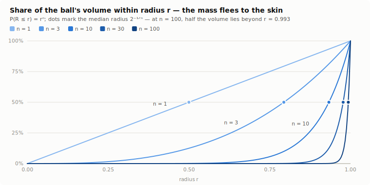
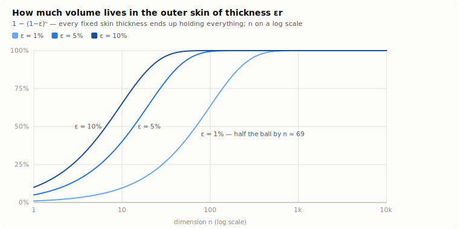
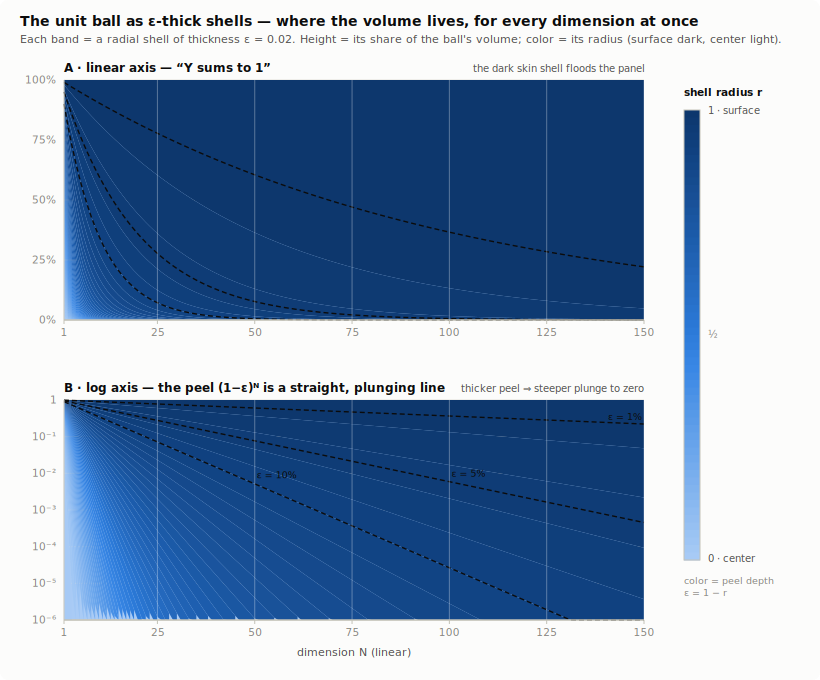
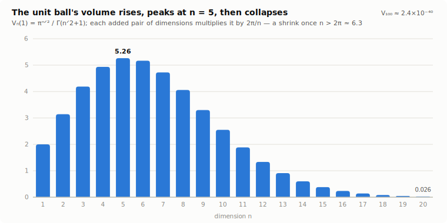
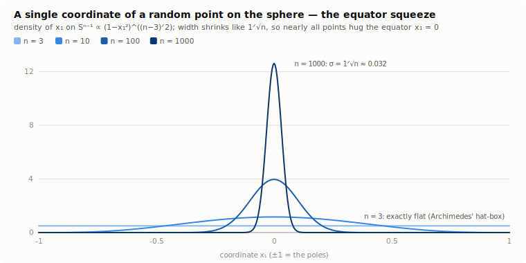

# Notebook — why a high-dimensional ball is all skin

**Phase 1 of the exploration** started from Dan's reading of Richard Hamming
(*The Art of Doing Science and Engineering*, ch. 9, "n-Dimensional Space"):
*at high dimension, almost every point of a sphere is at its surface.* This
notebook does the math, checks every number, and distills the intuition. It is
a math document, not an app plan — §9 collects seeds for a possible app, and
the decision comes after a phase-2 visual probe.

Every number below is reproducible: `node assets/probe.mjs` prints the tables
(deterministic — the Monte Carlo section is seeded), and `node assets/charts.mjs`
regenerates the figures.

## §1 · The one-line fact: the ball is all skin

Volume in n dimensions scales as the n-th power of linear size, so the ball of
radius `(1−ε)` occupies exactly `(1−ε)ⁿ` of the unit ball. What's left over —
the skin of relative thickness ε — holds

> **fraction of volume in the outer ε-shell = 1 − (1−ε)ⁿ → 1.**

That's the whole proof. It is compound interest in reverse: shaving 1% off the
radius discounts the volume by 1% *per dimension*, a hundred times over at
n = 100. The numbers move faster than intuition expects:

| n | outer 1% shell | outer 5% shell | outer 10% shell | median R | E[R] |
|---|---|---|---|---|---|
| 2 | 1.99% | 9.75% | 19.00% | 0.70711 | 0.66667 |
| 3 | 2.97% | 14.26% | 27.10% | 0.79370 | 0.75000 |
| 10 | 9.56% | 40.13% | 65.13% | 0.93303 | 0.90909 |
| 30 | 26.03% | 78.54% | 95.76% | 0.97716 | 0.96774 |
| 100 | 63.40% | 99.41% | 100.00% | 0.99309 | 0.99010 |
| 500 | 99.34% | 100.00% | 100.00% | 0.99861 | 0.99800 |
| 1000 | 100.00% | 100.00% | 100.00% | 0.99931 | 0.99900 |
| 10000 | 100.00% | 100.00% | 100.00% | 0.99993 | 0.99990 |

Equivalently, for a *uniform random point* in the ball, `P(R ≤ r) = rⁿ`: the
median radius is `2^(−1/n)` (0.9931 at n = 100) and the mean is `n/(n+1)`. The
skin thickness that captures **half** the ball is `1 − 2^(−1/n) ≈ ln 2/n` —
0.69% at n = 100, 0.069% at n = 1000. "Uniform in the ball" and "on the
sphere" become the same thing, measure-wise.





A second way to see the same fact holds **every ε and every N in one picture**.
Partition the ball into thin radial shells (thickness ε = 0.02) and track each
shell's share of the volume as the dimension climbs; the shading is the shell's
radius, so peel-depth ε = 1 − r *is* the color axis. Reading the two panels:

- **A · linear axis** is the honest "sums to 1": Y is the cumulative fraction of
  volume within radius r, so the shells partition [0, 1] exactly. As N grows the
  dark outer shell — the skin — floods the panel.
- **B · log axis** is the same axis, log-scaled — where each shell boundary
  `(1−kε)ⁿ` becomes a **straight, plunging line** (a semi-log plot turns an
  exponential into a line). This is "the peel shrinks quickly to zero" made
  literal: a fan of downward rays, steeper for a thicker peel. The three classic
  peels ε = 1%/5%/10% are the heavy dashed lines — the same three curves as the
  chart above, now read as boundaries in the shell fan.



## §2 · Where the volume goes: the 2π/n recursion

The unit ball's volume is `V_n(1) = π^(n/2) / Γ(n/2 + 1)`, but the formula
hides the intuition. Hamming's route shows it. Integrate over the last two
coordinates in polar form: a point of the n-ball with `x² + y² = ρ²` leaves an
(n−2)-ball of radius `√(1−ρ²)` for the remaining coordinates, so

```
V_n(1) = ∫₀^{2π} ∫₀^1 V_{n−2}(√(1−ρ²)) ρ dρ dθ
       = 2π · V_{n−2}(1) · ∫₀^1 ρ (1−ρ²)^{(n−2)/2} dρ
       = (2π/n) · V_{n−2}(1).
```

> **Each added pair of dimensions multiplies the volume by 2π/n.**
> The moment n exceeds 2π ≈ 6.28, that factor shrinks. Hence the famous rise
> and collapse: the peak is at **n = 5** (V = 5.2638), and by n = 100 the unit
> ball holds 2.4×10⁻⁴⁰.



| n | V_n(1) | surface A(1) | V_n / cube 2^n |
|---|---|---|---|
| 1 | 2.0000 | 2.0000 | 1.0000 |
| 2 | 3.1416 | 6.2832 | 0.7854 |
| 3 | 4.1888 | 12.5664 | 0.5236 |
| 5 | 5.2638 | 26.3189 | 0.1645 |
| 10 | 2.5502 | 25.5016 | 0.0025 |
| 20 | 0.0258 | 0.5161 | 2.46e-8 |
| 100 | 2.37e-40 | 2.37e-38 | 1.87e-70 |

The last column answers "smaller *than what*?" — the ball inscribed in its
bounding cube `[−1,1]ⁿ`. At n = 10 the ball fills 0.25% of the cube; at
n = 100, 10⁻⁷⁰. The missing volume went into the **corners**: the cube's
corners sit at distance `√n` from the center while its faces stay at
distance 1, so the high-dimensional cube behaves like a spiky sea-urchin —
2ⁿ long spikes and thin walls between them. A *random* point of the cube has
typical norm `√(n/3) ≈ 0.577·√n` (each coordinate contributes E[x²] = 1/3):
already at n = 4 the typical cube point lies **outside** the inscribed ball.

## §3 · The equator squeeze: every coordinate is tiny

Put a uniform random point on the sphere `S^(n−1)` and look at a single
coordinate `x₁` (equivalently: pick any axis and measure the "latitude").
Slicing at `x₁ = t` leaves a sphere of radius `√(1−t²)`, whose (n−2)-dim
surface content scales as `(1−t²)^{(n−2)/2}`; the slant of the slicing
contributes `(1−t²)^{−1/2}`. So the density is

> `f(t) ∝ (1−t²)^{(n−3)/2}`,  with variance exactly `1/n`
> (by symmetry: the coordinates split the budget `Σxᵢ² = 1` evenly).

At n = 3 the exponent is 0 — the density is **exactly flat**, which is
Archimedes' hat-box theorem (a sphere and its circumscribing cylinder trade
area evenly between latitudes). For large n it collapses into a near-Gaussian
needle of width `1/√n` around the equator:

| n | P(\|x₁\| ≤ 0.1) | P(\|x₁\| ≤ 1.96/√n) | σ(x₁) = 1/√n | σ as an angle |
|---|---|---|---|---|
| 3 | 10.00% | 100.00% | 0.5774 | 33.08° |
| 10 | 23.01% | 95.81% | 0.3162 | 18.12° |
| 100 | 68.03% | 95.05% | 0.1000 | 5.73° |
| 1000 | 99.85% | 95.01% | 0.0316 | 1.81° |



So **nearly all of the sphere lies within a few degrees of the equator** — of
*any* equator, all of them at once, since the axis was arbitrary. That sounds
paradoxical, but the statements are compatible: each equatorial band misses a
sliver of measure `≤ 2e^{−nε²/2}` (the spherical-cap bound), and a union of a
few such slivers still misses almost nothing. The mass sits in the mutual
intersection of all the bands — points whose *every* coordinate is O(1/√n).
There is simply no room to be big in any one direction when the budget
`Σxᵢ² = 1` is split n ways.

> [!NOTE]
> This inverts the 3D picture. We imagine "a sphere" as mostly *away* from any
> given equator (poles included); in high dimension the poles of every axis
> are measure-starved deserts and the equator band is everything.

## §4 · Near-orthogonality: high dimensions are roomy for directions

Fix a unit vector u and draw another, v, at random. Rotating u to the first
axis shows `cos θ = u·v` has *the same distribution as a single coordinate* —
the needle of §3. So `σ(cos θ) = 1/√n`, and random directions are nearly
perpendicular by default:

- at n = 100, **91.9%** of random pairs meet at 90° ± 10° (Monte Carlo: 91.8%);
- at n = 1000, the spherical-cap bound `P(|cos θ| > ε) ≤ 2e^{−nε²/2}` lets
  roughly `e^{nε²/4}` directions be *pairwise* almost-orthogonal — with
  ε = 0.3, about **10⁹ directions all within 73°–107° of each other**.

This was Hamming's actual destination in ch. 9: n-dimensional geometry is the
native habitat of signal and code spaces. Exponentially many almost-orthogonal
directions is *why* you can pack exponentially many distinguishable codewords —
the sphere-hardening behind Shannon's channel-capacity argument.

## §5 · The corner-sphere shocker

The classic stress test (Hamming runs it too). Take the cube of side 4
centered at the origin, and pack 2ⁿ unit spheres at `(±1, ±1, …, ±1)` — each
touching its neighbors. Nestle one more sphere at the center, touching all of
them. Its radius is `√n − 1` (center-to-corner-sphere distance √n, minus their
unit radius):

| n | inner radius √n − 1 | and so… |
|---|---|---|
| 2 | 0.414 | a small pebble in the middle |
| 4 | 1.000 | equal to the corner spheres |
| 9 | 2.000 | touches the cube walls |
| 10 | 2.162 | pokes **outside** the cube |
| 25 | 4.000 | its diameter is twice the cube's side |

The "inner" sphere — touching spheres that are each snugly inside the box —
escapes the box at n = 10. Two follow-ups sharpen it: at n = 10 the inner
sphere's volume already exceeds all 2ⁿ corner spheres combined (`√n − 1 > 2`
is the same inequality), and by **n = 1206** it exceeds the volume of the box
itself. Nothing is wrong: the corner gaps of a spiky cube are simply that
deep. Intuition from 3D ("inner sphere = tiny pebble") fails quantitatively
*and* qualitatively.

## §6 · The unifying view: geometry becomes statistics

Every surprise above is the **law of large numbers wearing geometric
clothes**. The recurring device: a squared length is a *sum of n independent
squares*, and sums of many independent terms don't fluctuate.

- **Sphere coordinate**: `Σxᵢ² = 1` forces each `xᵢ² ≈ 1/n` → the equator
  needle (§3) and near-orthogonality (§4).
- **Gaussian soap bubble**: for X ~ N(0, Iₙ), `|X|² = Σxᵢ²` has mean n and
  standard deviation `√(2n)`, so `|X| = √n ± O(1)` — the standard Gaussian in
  high dimension *is* a thin spherical shell of radius √n, regardless of n.
  (This is also how the probe samples the sphere: normalize a Gaussian.)
- **Cube point**: `|X|² = Σxᵢ²`, mean n/3 → typical norm 0.577√n (§2).
- **Ball radius**: not a sum, but the density `n·rⁿ⁻¹` is the derivative of
  `rⁿ` — the same power-law mechanism as §1.

One honest correction to the slogan "the ball is all skin": the skin is thin
*relative to the radius* (width ~1/n of it), but in high dimension even that
thin shell is where **everything** — random points, cross-sections, function
values — concentrates. "Concentration of measure" is the umbrella term; Lévy
and Milman turned this from a curiosity into a working tool (isoperimetry:
*any* well-behaved function on a high-dim sphere is nearly constant).

## §7 · The intuition digest — pictures that survive

1. **Compound discount.** Volume scales as rⁿ; stepping 1% inward taxes the
   volume 1% per dimension. n small taxes compound into certainty.
2. **The ball ≈ its own boundary.** A uniform point in the 100-ball has median
   radius 0.9931. Sampling the ball and sampling the sphere are almost the
   same experiment.
3. **No room to be big anywhere.** On the sphere the budget `Σxᵢ² = 1` splits
   n ways: every coordinate is ~1/√n. All equators hold nearly everything,
   all poles are deserts.
4. **Cubes are sea-urchins.** Corners at √n, faces at 1. The inscribed ball
   loses everything to the spikes; the "inner" corner-gap sphere outgrows the
   box.
5. **Random directions are perpendicular.** cos θ ~ needle of width 1/√n →
   exponentially many almost-orthogonal directions → room for codes (Hamming's
   punchline).
6. **Geometry becomes statistics.** Radii are averages; averages don't
   fluctuate. High-dimensional geometry is the LLN drawn as shapes.

## §8 · Monte Carlo cross-check

Theory against 200 000 seeded samples at n = 100 (`assets/probe.mjs`,
seed 20260706 — rerun reproduces these digits):

| quantity | theory | sampled |
|---|---|---|
| volume in the outer 1% shell | 63.40% | 63.40% |
| mean radius E[R] = n/(n+1) | 0.99010 | 0.99010 |
| median radius 2^(−1/n) | 0.99309 | 0.99307 |
| σ(cos θ) between random pairs = 1/√n | 0.1000 | 0.0999 |
| pairs within 90° ± 10° | ≈ 91.9% | 91.8% |

## §9 · Seeds for a possible app (phase-2 fodder — not a design)

The honest obstacle: **n = 100 cannot be drawn**. Any app must either show
faithful *statistics* of high-n objects, or show low-n views whose *trend*
carries the story. Candidate probes, roughly ordered by promise:

- **One n-slider, several linked truths.** A single dimension slider driving
  live views of this notebook's four figures (radial mass, shell fraction,
  coordinate needle, V_n bars). Cheap, honest, and the "drag n and watch the
  mass flee" moment may be the entire payoff.
- **The shadow that shrinks.** Scatter the first two coordinates `(x₁, x₂)` of
  points sampled uniformly on S^(n−1): at n = 3 a filled disk (hat-box!), then
  a Gaussian blob of width 1/√n — the sphere's shadow *contracts to a point*
  as n grows. Genuinely surprising, trivially cheap (it's just sampling), and
  it visualizes the equator squeeze without pretending to draw n dimensions.
- **Slice explorer.** Slide a hyperplane `x₁ = t` through the ball and show
  the cross-section's *relative* size `(1−t²)^{(n−1)/2}` — the "why does the
  slice die off so fast" view; pairs with the shadow.
- **The corner-sphere box.** Interactive in 2D/3D (where it's drawable), with
  the `√n − 1` readout extrapolating upward as n climbs past 4, 9, 10, 1206 —
  a story told by a number leaving its cage.
- **Sampling rain / estimator feel.** Watch sampled radii accumulate into the
  n·rⁿ⁻¹ histogram (kinship: Counting the Ways' Lab, which wants the same
  "feel the estimator converge" energy).

Framework notes for later: all of these are CSS/SVG/canvas-scale (no WebGL
needed); the n-slider is a natural **domain**-archetype panel; the linked
views map onto multiple `ViewDef` windows or one split view. A phase-2 probe
should build the *shadow* + *radial mass* pair first — they carry the two
core facts (§3, §1) and are the least fakeable.

## Possible sources & where to go further

- **Richard W. Hamming, *The Art of Doing Science and Engineering* (1997),
  ch. 9 "n-Dimensional Space"** — the seed for this whole exploration: the
  volume recursion, the shell fact, near-orthogonality, and the corner-sphere
  box, aimed at why sphere-hardening matters for coding and Shannon capacity.
- **Blum, Hopcroft & Kannan, *Foundations of Data Science*, ch. 2** — the
  modern standard treatment: volume near the equator, the Gaussian annulus,
  random projection. Free PDF from the authors; the natural "next read."
- **Keith Ball, "An Elementary Introduction to Modern Convex Geometry"**
  (*Flavors of Geometry*, MSRI, 1997) — beautiful on ball volumes, cube vs
  ball, and isoperimetry; the spherical-cap estimate used in §3 is his Lemma
  2.2 (up to constants).
- **Michel Ledoux, *The Concentration of Measure Phenomenon* (AMS, 2001)** —
  the deep theory behind §6 (Lévy, Milman); reference, not entry point.
- **Richard Bellman** coined the neighboring phrase **"curse of
  dimensionality"** (*Dynamic Programming*, 1957) — the same geometry seen as
  an obstacle rather than a curiosity.
- Video prior art (relevant for phase 2, and to differentiate from):
  **3Blue1Brown, "Thinking outside the 10-dimensional box"** (sliding-circles
  view of high-dim spheres) and a **Numberphile** episode on the corner-sphere
  box (I believe with Matt Parker — flagging the attribution as unverified
  rather than fabricating a date).
