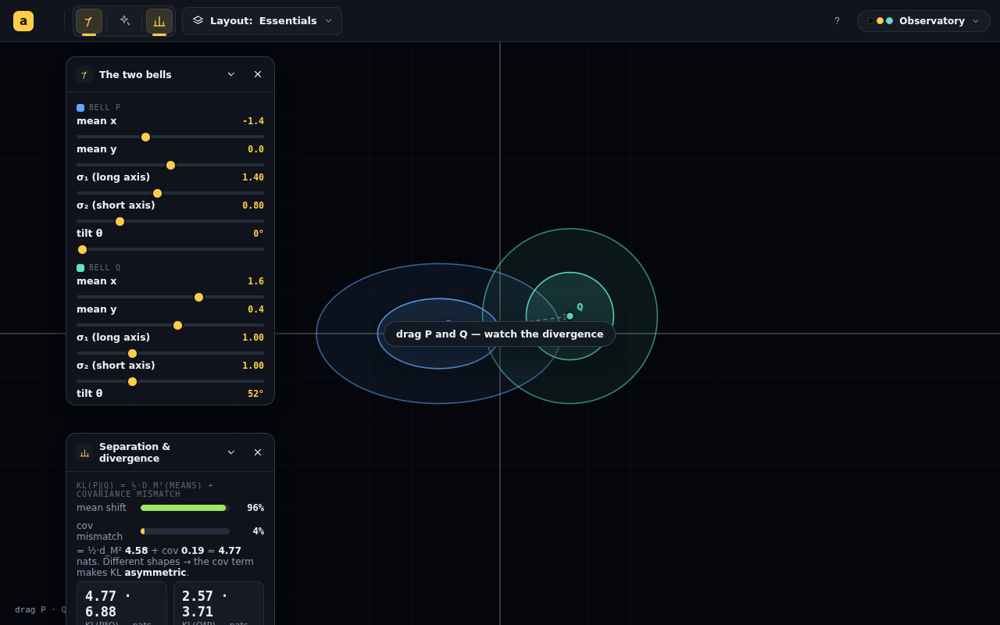
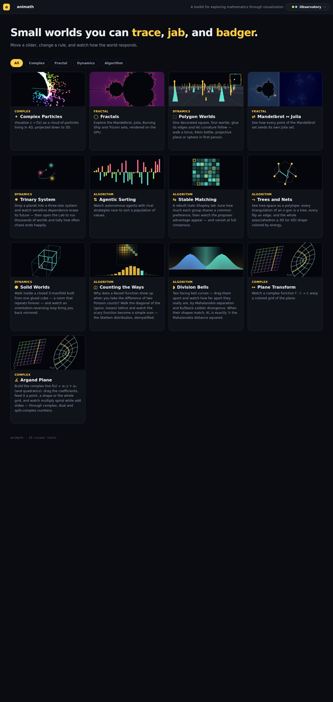

# New app — Mahalanobis separation & Kullback–Leibler divergence

## Session purpose

Build a new animath app that explains **Mahalanobis separation** and
**Kullback–Leibler divergence** — two ways of measuring how far apart / how
different two probability distributions are.

## Previous session

New topic, first tracked session on this branch. For continuity: the latest
handoff across the repo is
[clean-up-loose-ends-8b0wqp/2026-07-02-S01](../clean-up-loose-ends-8b0wqp/2026-07-02-S01-clean-up-loose-ends.md)
(accidental-complexity audit + cleanup, **PR #247 — now merged**, build green).
That work is closed and unrelated to this session's focus.

## Working notes

<!-- Newest entry first. -->

### 🟡 milestone · 12:45 — Wave-1 app shipped & verified (build + lint + tests + eyes)
**Why:** The MVP payload is live and rendering correctly; time to lock it in.

`DivisionBells.tsx` (immersive SVG plane, inlined `BellsPlane`), `EXPLAINER.md`
(with the required *Possible sources* block), `divisionBells.css`; registered in
`index.tsx` / `apps.ts` / `catalog.ts` (`Algorithm`/`divergence`) / README /
CLAUDE, plus the album-cover **gallery tile** (`previews.tsx` `divergence` kind:
two facing bell profiles + lit gap). `npm run build` green, `npm run lint` 0 errors
(fixed 2 unused-import errors; 58 warnings = baseline), 18 engine tests green.

Headless verification (R1) — DOM/SVG so no canvas, screenshotted as-is:



The decomposition renders honestly: mean-shift 96% / cov-mismatch 4%, caption
`= ½·d_M² 4.58 + cov 0.19 = 4.77 nats`, KL(P‖Q)=4.77 vs KL(Q‖P)=2.57 (the
asymmetry is visible). Gallery tile (row 3) reads as two facing bells with the
divergence lit between them:



Mobile (390×844 direct shot) renders cleanly — two bells, axes, the phone dock
with all three panels, no crash/blank; the phone re-chrome works out of the box.
Added `#/division-bells` to `scripts/smoke.mjs` ROUTES (kept in sync with
`index.tsx`).

### 🟢 code · 11:55 — Studied precedents; building Wave-1 UI
**Why:** Match conventions exactly before writing the view (R5 near-parallel-copy
risk). Read the closest models: CountingTheWays (Workspace/sections/views/CSS +
tested engine), workspace/types (`immersive`, ViewDef, SectionDef), readouts
(`Breakdown` takes `pct∈[0,100]`, `StatGrid`, `Kicker`), ControlPanel primitives,
`useThemeTokens`/`readThemeTokens`, previews.tsx (`PreviewKind` closed union +
`themeInk` per-draw token read), catalog (`Category` closed — `Algorithm` is the
fit), index route map, and Argand's pointer-drag + `toMath`/`toV` coordinate
pattern for the immersive plane.

Wave-1 scope: immersive SVG plane (two σ-ellipses + draggable means + difference
vector), Define panels (θ/σ sliders + drag + presets Match-shapes/Concentric),
Analyze panel (KL two-bar Breakdown + StatGrid both directions + Mahalanobis σ),
theme tokens via SVG `var(--data-*)` (no canvas yet → heat deferred as planned).

### 🟢 code · 11:20 — Engine `gaussian2d.ts` + 18-test suite green
**Why:** The pure engine is the real correctness guard (CI runs `tsc` only), so it
lands first with tests (RECIPE R4), the whole measure family up front.

`src/animations/DivisionBells/gaussian2d.ts`: (θ, σ₁, σ₂) Gaussian with closed-form
Σ / Σ⁻¹ / Σ^{±1/2} / det; `pdf`+`logPdf` (log-space); Mahalanobis (directed-in-Q
**and** pooled); `klDivergence` + `klDecompose` (meanShift + covMismatch via the
eigenvalue form ½·Σ(λ−1−lnλ), non-negative per axis); `bhattacharyya` (closed) →
`hellinger`; `bayesErrorBound` (½·BC); `overlapIntegral` (numeric TV / overlap /
Bayes error over an adaptive grid — the honest treatment of the two measures with
**no** Gaussian closed form).

18/18 tests pass (`npx vitest run …/gaussian2d.test.ts`). The load-bearing checks:
closed-form KL == ∫p·(lnp−lnq) **both ways**; BC == ∫√(pq); the **exact collapse**
(equal Σ ⇒ covMismatch=0, λ=1, KL = ½·d_M², directed=pooled); equal-spherical Bayes
error == Φ(−δ/2) & TV == 2Φ(δ/2)−1; the **Bhattacharyya bound** Pₑ ≤ ½·BC and
**Pinsker** TV ≤ √(KL/2) as inequalities; degenerate σ→0 floored, no NaN. Two
initial failures were bad *test cases* (an accidentally-symmetric KL pair; a too-
tight tol on √(1−BC) cancellation), not engine bugs — fixed.

Next: Wave-1 UI — route + catalog registration, the immersive SVG plane view
(draggable means + σ-ellipses), the KL Breakdown + Mahalanobis StatGrid, presets.

### 🟡 milestone · 10:40 — Divergence-family question resolved; staged plan locked
**Why:** All three hats' follow-ups returned and converge.

**Reframe adopted:** Bayes error is the **operational anchor** — the app grows from
"Mahalanobis + KL" into "how far apart are two distributions, by every honest
yardstick," an honest **bounded stack** (TV, Hellinger, BC, Bayes error ∈ [0,1])
with **KL the unbounded outlier**, linked by Pinsker + the Bhattacharyya bound.
Staging: **Wave 1** KL + Mahalanobis (the exact ½·d_M² unification, engine-first +
tests) · **Wave 2** Bhattacharyya + Hellinger (one BC computation, closed-form) ·
**Wave 3** Bayes error + TV (gated on the decision-boundary/overlap conic + a prior
control; **numeric**, labeled "≈"). Correctness catch (all three): TV & Bayes error
have **no closed form for unequal Σ** — need a numeric overlap integrator, must be
labeled. Structure: a scoped stateless `measures.ts` presentation registry for the
scalar family; math stays in tested `gaussian2d.ts`; KL + Mahalanobis stay bespoke.
Full convergence table appended to the
[synthesis](2026-07-06-S01-expert-synthesis.md). Next: build `gaussian2d.ts` +
tests (whole family up front; UI discloses progressively).

### 🟣 decision · 10:15 — Resuming the three hats to weigh *more* divergence measures
**Why:** Dan asked whether Division Bells should include other measures —
**Bayes error, total-variation (TV), Hellinger** (and Bhattacharyya) — and asked
me to put the question back to the three experts while their review context is
still warm. Resuming each agent (context intact) beats asking cold.

All three closed-form for Gaussians, so engine-cheap; the real questions are
scope (Maintainer), a divergence-family abstraction (Consultant), and which are
honest/illuminating + how they relate — Pinsker (TV≤√(KL/2)), Bhattacharyya
bounding Bayes error, the f-divergence family, bounded [0,1] vs unbounded KL
(Pedagogy). Tailored follow-up sent to each; will fold answers into the plan.

### 🟡 milestone · 10:05 — Three-hats review complete + synthesis written
**Why:** All three reviews returned; convergence synthesis captures the plan.

**Unanimous: build it.** Pedagogy re-derived the Gaussian-KL closed form and
Monte-Carlo-checked it (1.5952 vs 1.5939); the `Σ₁=Σ₂ ⇒ KL = ½·d_M²` collapse is
exact. Synthesis:
[2026-07-06-S01-expert-synthesis.md](2026-07-06-S01-expert-synthesis.md) (per-hat
reports linked within). Locked calls: hero Mahalanobis = directed-in-Q; KL
Breakdown = two non-negative bars using the eigenvalue form ½·Σ(λ−1−lnλ); MVP =
single immersive plane, engine-first with tests, heat/whitening/slice deferred;
`logPdf` + running ∫=KL when the integrand heat lands. Blind spot the reviewers
couldn't see: the album-cover gallery tile (added post-dispatch) → new
`previews.tsx` kind.

### 🟣 decision · 09:45 — Gallery tile: inspired by *The Division Bell* album cover
**Why:** Dan asked to base the gallery preview tile on the Pink Floyd *The
Division Bell* (1994, Storm Thorgerson) cover — two giant facing metal-head
profiles in a field at dusk, whose **negative space reads as a third face**.

That maps honestly onto the math: **two facing distributions, and the gap
between them is the divergence/separation** — exactly what the app measures.
Plan for `src/chrome/previews.tsx`: a new preview kind rendering two facing
bell-curve "profiles" (mirrored) with the space between them lit as the
divergence, twilight-sky palette echoing the cover, theme-token aware so it
tracks skins (no hardcoded scene colors — sample the active data/colormap
tokens). Registered via `src/chrome/catalog.ts` META `kind`. Build after the
core app view works.

### 🟣 decision · 09:35 — Name = "Division Bells"; running /three-hats on the design
**Why:** Dan picked the name **Division Bells** (KL *divergence* + *bell* curves,
the Floyd nod) and asked to run `/three-hats` on the design before building — this
is a substantial new app, so a three-lens review de-risks scope/pedagogy first.

Design summary going into the review: two draggable 2-D Gaussians P/Q (mean +
rotatable/scalable σ-ellipses + canvas density), a **whitening** toggle that turns
the reference Gaussian into a unit circle (Mahalanobis = Euclidean in that frame),
a **KL integrand** `p·log(p/q)` signed heat layer, and an Analyze **Breakdown**
that splits `KL = ½[Mahalanobis² + covariance-mismatch]` so matching the ellipses
collapses KL to ½·d_M². Engine `gaussian2d.ts` (pure, unit-tested); optional 1-D
slice view along the μ₁→μ₂ axis. CSS/DOM + SVG + canvas, theme-token driven.

### 🟣 decision · 09:20 — Scope pinned: one scene, two lenses · SVG/Canvas 2-D
**Why:** Asked Dan the two framing decisions up front (R2). Answers: **one shared
scene** where both measures read out live on the SAME pair of Gaussians, rendered
in **SVG + Canvas 2-D** (draggable ellipses + density heat), not WebGL.

The unification is exact and makes a great teaching hook. For P=N(μ₁,Σ₁),
Q=N(μ₂,Σ₂) in k dims:

```
KL(P‖Q) = ½ [ (μ₂−μ₁)ᵀ Σ₂⁻¹ (μ₂−μ₁)   ← squared Mahalanobis of the means, in Q's metric
             + tr(Σ₂⁻¹Σ₁) − k − ln(detΣ₁/detΣ₂) ]  ← covariance-mismatch term
```

So when **Σ₁ = Σ₂ = Σ**, the mismatch term vanishes and **KL = ½·d_M²** exactly —
Mahalanobis *is* the mean-shift part of KL. When the ellipses differ in shape, KL
adds the covariance term and becomes **asymmetric** (KL(P‖Q) ≠ KL(Q‖P)) while the
pooled-Σ Mahalanobis stays symmetric. The app decomposes KL live into these two
pieces — that contrast is the payload.

Next: present a concrete design (engine, panels/views, teaching arc, name
candidates) for sign-off before building; optionally run `/three-hats` on it.

### 🟣 decision · 09:00 — Session opened; orienting on a brand-new app
**Why:** The request is to build a new app teaching Mahalanobis separation and
KL divergence. No prior branch state exists, so this is a clean start.

Ran `/start-session`: resolved branch slug `modest-cannon-umd49e` (new — no
prior handoff/progress folder), read the backlog, RECIPES, and the latest
handoff for continuity. The backlog has no item for this app; it is genuinely
new work.

Before writing any code I want to pin scope with Dan (RECIPE R2 — separate
exploring from guessing). Open questions to converge on:

- **The concept pairing.** Mahalanobis distance measures separation between a
  point (or a distribution's mean) and a distribution, in units of its own
  covariance; KL divergence measures how one full distribution differs from
  another. They're related but not the same object — is the app about *comparing*
  the two lenses on the same pair of Gaussians, or teaching each in turn?
- **The picture.** Most natural home is a 2-D scatter / density plot of two
  Gaussians whose means, covariances (spread + correlation) are draggable, with
  live readouts of Mahalanobis separation and KL divergence as you move them —
  showing e.g. how correlation (whitening) changes "distance" even when the
  Euclidean gap is fixed.
- **Framework fit.** CSS/DOM + SVG (like Counting the Ways / Stable Matching) vs.
  a WebGL density field. Leaning SVG/Canvas 2-D for the draggable-Gaussians story.

Awaiting Dan's direction on framing before building a probe.
