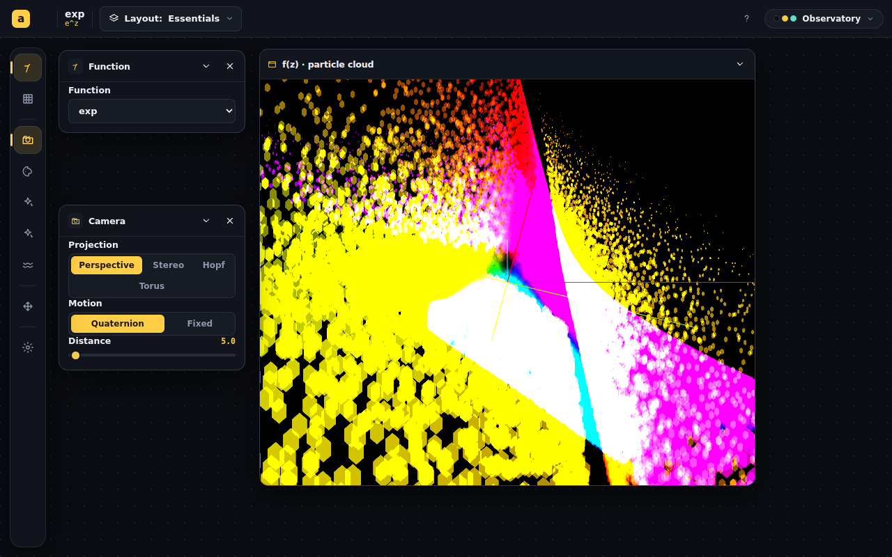

# Design language overhaul — tokens, gallery, workspace

## Session purpose

Begin the chrome/UX overhaul specified by the uploaded design-handoff bundle
(`design_handoff_animath_ui`): replace the current AppShell chrome (top bar,
drawer, floater, landing page) with the redesigned system — gallery landing,
"everything is a window" workspace, left icon rail with an 11-archetype panel
vocabulary, 5 skins via `data-theme` tokens, phone re-chrome ≤740px — without
touching the math/render engines. Work follows the bundle's IMPLEMENTATION.md
phases; this session targets the repo inventory (PARAM-MAP), Phase 0 (tokens &
skins), Phase 1 (gallery + routing + Home), and as much of Phase 2 (workspace
engine) as fits.

## Previous session

First tracked session on this branch. For continuity, the most recent handoff
across branches is
[complex-sheet-ar9zA / 2026-06-08-S01-surface-render-modes](../../handoff/complex-sheet-ar9zA/2026-06-08-S01-surface-render-modes.md)
— unrelated topic (translucent-sheet render mode for Complex Particles, since
merged as PR #194); this session starts a new topic from the uploaded design
bundle.

## Working notes

### 🟡 milestone · 23:55 — All 11 apps migrated; legacy chrome deleted; sweep verified
**Why:** the per-app agents landed one by one; each migration was reviewed,
type-checked, committed and pushed as its own unit, then the shared shell had
no consumers left.

Migration commits: Correspondence `19d79ef` (two linked windows, floater →
playback panel), FractalsGPU `9f765f4`, TopologyWalk `a6a8454` (WASD guarded
against focused inputs), PlaneTransform `26260c8` (two windows, curve floater →
drive panel), PolygonWorlds `4cb9532` (inventoried + PARAM-MAP §11), Agentic
Sorting `88278d7` (zero `as-*` collisions, audited), StableMarriage `c09ce7d`,
StableMatching `6425d4d` (rework's new lattice tab → third view + layout;
`window.innerHeight` → container measurement), Trinary `f8506ba` (mode pills,
two workspaces, Lab's two-view split achieved, URL-query config preserved).
Then `cf84d28` deleted AppShell/ActionFloater/useFloaterDrag/QuarterTurnBar and
made the router bare; `282d6c5` captured the verification sweep — every route
desktop-dark, phone chrome at 390×844, neon + phosphor skins — and fixed the
one layout flaw found (Agentic Sorting Setup overlap). All shots eyeballed:
rail/panels/windows/layouts render per spec on every app.

### 🟢 code · 23:55 — P0–P3 shipped; all nine app migrations dispatched in parallel
**Why:** foundations and the engine are committed and visually verified; the
per-app migrations touch disjoint folders, so they parallelize across agents.

Committed (each `npm run build`-green, pushed): **P0/P1** tokens + 5 skins +
chrome foundations + PARAM-MAP (`f6164a1`); **P2** gallery/TopBar/explainer +
router cutover, Menu deleted (`dc97544`); **merge of origin/main** at the
user's request — brings Polygon Worlds (added to catalog, `7224ad7`+) and a
reworked StableMatching; **P3a** workspace engine (`63ae008`); **P3b** Complex
Particles pilot via rewritten ParticleViewerShell (`42a4e23`). Screenshots
verified: gallery dark + Paper skin, pilot workspace (rail, Essentials layout,
plot in a view window over the dotted void). Nine sub-agents are now migrating
FractalsGPU, Correspondence, PlaneTransform, TopologyWalk, StableMatching,
AgenticSorting, StableMarriage, Trinary (mode pills), PolygonWorlds — each
constrained to its own folder; I integrate, build, screenshot and commit each.

> [!IMPORTANT]
> Trinary keeps its hash tabs but presents them as TopBar mode pills, two
> Workspaces (`trinary-obs`, `trinary-lab`); StableMatching's tabs become
> layouts toggling matrix/heatmap view windows; floaters (Playback, PlaneCurve)
> become playback/drive panels per the design's deliberate removals.

### 🟡 milestone · 23:05 — Plan mode lifted; bundle vendored; execution begins
**Why:** the user switched from Plan mode to Auto mode and asked to finish the
plan and execute it.

Committed the design bundle into the repo so the spec + IN-PROGRESS ledger are
durable: the four docs at `docs/redesign/` and the reference prototype under
`docs/redesign/prototype/`. The final implementation plan is being synthesized
from the architect sub-agent's report; execution follows immediately.

### 🟣 decision · 22:40 — Scope decisions locked with the user
**Why:** three genuinely user-owned choices gated the plan.

1. **Full overhaul on this branch** — all phases (tokens/skins → gallery →
   workspace engine → migrate all apps → phone mode → a11y), old chrome deleted.
2. **Gallery previews = cheap 2D-canvas mocks** ported from the prototype, not
   real renderers (~9 WebGL contexts on one page is fragile).
3. **Catalog = 9 cards** — the 8 designed apps + Stable Matching;
   `#/fractals-cpu` stays an unlisted route.

### 🔵 finding · 22:55 — Inventories + risk probe complete (3 sub-agents)
**Why:** "no dropped capability" is a hard rule; risks needed concrete file:line
facts before the plan could be final.

- Full control inventory of all 9 catalog apps + ParticleViewerShell +
  QuarterTurnControls (every Slider/Pills/Select/Checkbox with state + ranges).
- StableMatching (not covered by the design bundle) inventoried separately:
  Visualizer/Lab tabs, 18 persisted settings, playback + batch-heatmap lab;
  maps cleanly onto the archetype vocabulary. One windowing fix: it measures
  `window.innerHeight` (StableMatching.tsx:278).
- Risk probe: app roots all render `position:absolute; inset:0` → safe inside
  view windows; exceptions are Fractals2D's hardcoded `100vw/100vh` (line 320)
  and App.tsx's fallback. Floaters (ActionFloater/PlaybackFloater/
  PlaneCurveFloater) decompose into drive/playback panels. Trinary Lab is
  hash-routed with URL-query config sync to preserve. Gesture hooks use
  pointer-capture on canvas (window-safe); TopologyWalk's WASD listens on
  `window`. 12 files import AppShell hooks. AgenticSorting's `.as-*` CSS prefix
  collides with AppShell's.

### 🔵 finding · 22:25 — Design bundle + repo shell fully read
**Why:** the bundle's README directs: read DESIGN-SPEC end to end, then map the
repo before implementing.

Read all bundle docs + prototype sources (theme.css tokens/5 skins; workspace.jsx
snap/dock/layout engine — `softAxis`/`snapPos`/`makeSnap`/`makeResize`/`freeSlot`/
collapse-chain BFS, explicitly portable verbatim; chrome.jsx 11-archetype
vocabulary + per-app catalogs; ui.jsx icons/primitives/SkinPicker/usePhone;
journey.jsx gallery+router; viz.jsx cheap canvas mocks). Repo side: hash router
(index.tsx), AppShell context/portals, ControlPanel primitives (API ≈ prototype's
1:1 — restyle, don't rewrite), Canvas3D resizes via ResizeObserver (window-safe),
usePersistentState (`animath:v1:*`). Found `#/stable-matching` app unknown to the
design bundle.

### 🟡 milestone · 22:18 — Session start: design bundle unpacked and read
**Why:** the user uploaded `2e1a5a98-animath.zip` with instructions to start
from its README; orienting before any implementation.

Extracted the bundle to `/tmp/design-overhaul/redesign/design_handoff_animath_ui/`.
Read `README.md`, `DESIGN-SPEC.md`, `IMPLEMENTATION.md`, `IN-PROGRESS.md`.
Key constraints captured: prototype is reference-only (Babel-in-browser, not to
be copied); `theme.css` is the single source of design tokens; the 11-archetype
icon vocabulary is closed; every legacy control must land in some panel
(PARAM-MAP gate before Phase 3); phases must each leave main shippable; the old
Settings/Actions/Function/About taxonomy, the draggable floater, and the in-app
cross-app switcher are deliberate removals.
