# Branch rename to new-chrome + continuation

## Session purpose

Rename the auto-generated branch `claude/dazzling-goodall-1afsbr` to
`claude/new-chrome`, migrate the session reports to the new slug, then continue
the workspace-chrome redesign work from the previous handoff.

## Previous session

[2026-06-09-S01](../../handoff/new-chrome/2026-06-09-S01-design-language-overhaul.md)
— completed the full chrome/UX redesign: all 11 apps migrated onto the new
workspace engine, legacy AppShell deleted, build green, routes
screenshot-verified. Open items: open a PR (sync main first), carried-forward
design gaps in `docs/redesign/IN-PROGRESS.md`, touch-hardware pass.

## Working notes

### 🟢 code · 13:38 — Projection slider: Perspective ⇠ Torus ⇢ Hopf (Stereo retired)
**Why:** the user spotted that "Torus" and "Stereo" are the same projection
— confirmed in the shader: both are stereographic from the +v pole after
normalizing to S³; Torus just soft-floors the pole. They asked to drop
Stereo and replace the mode pills with a three-position slider with smooth
transitions that also fades the axes.

`projMix ∈ [0,2]` (persisted; seeded from the old viewType, Stereo→Torus):
integer positions are the three modes, fractional positions drive the
existing GPU cross-fade live (segment A Perspective→Torus; segment B reuses
the Torus→Hopf fiber collapse, whose separate sliders are now subsumed). The
4D axis cross fades out over the first segment as the scaffold takes over;
viewType/fiberCollapse stay derived, so the ambient Yaw/Pitch/Roll switch
and scaffold/fiber toggles follow the slider. The `stereo` embed param stays
as an alias for torus. Verified by sweeping 0.5/1.0/1.5/2.0 headlessly.

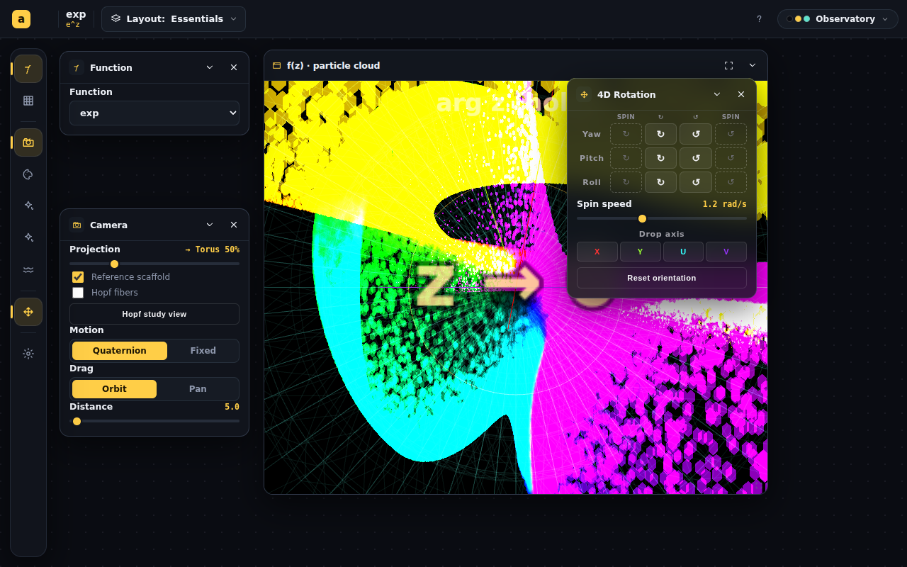

### 🟢 code · 13:28 — Demo page simplified to the user's spec: e^z, two windows, applet buttons
**Why:** the user specified the exact demo: e^z throughout; first plot = the
plane applet (xy → uv, same coloring); second = the 4D particle plot starting
on Drop Y with three in-applet buttons (Drop X · Drop Y · Rotate).

Built `#/embed/plane-transform` (both panes side by side, chrome-less,
ephemeral, `z` / `f(z) = e^z` pane labels) and a `buttons=` embed param:
drop buttons switch the projection and freeze motion, Rotate restores the
full 4D view with the quaternion tumble; active button highlighted. Verified
by driving the buttons inside the iframe: active state Drop Y → Rotate, and
the projection animated back to the tumbling 4D cloud.

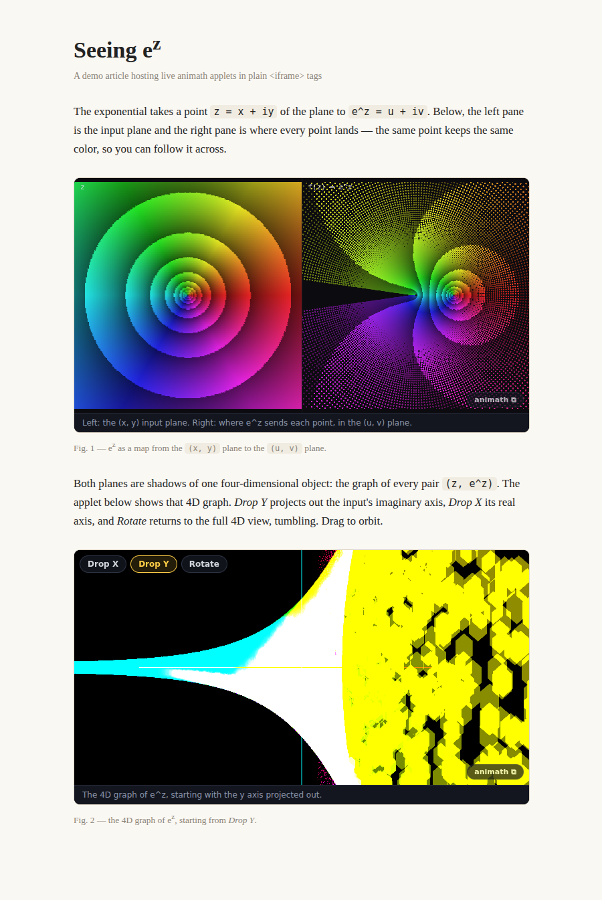

### 🟢 code · 13:11 — Embed pilot built and tested on a real page
**Why:** the user okayed the iframe-first approach and asked to test it on a
real page (and dropped the README-GIF idea — GitHub strips iframes/scripts
from READMEs, so only a canned animation would work there).

Built the phase-1 pilot: `src/lib/embedParams.ts` (readable URL params: fn,
p/q, render, proj, motion, spin, count, colorby, colormap, extent, caption,
controls — garbled values fall back, never crash), an `embed` mode threaded
through ComplexParticles + ParticleViewerShell (ephemeral state — embeds
never touch a visitor's saved settings; chrome-less view + corner badge
linking to the full workspace + optional caption; spin param drives
composing 4D plane rotations), and the `#/embed/complex-particles` route.
**Tested on a real host page** — `public/embed-demo.html`, a prose article
with two plain `<iframe>`s (the e^z cloud, and sin(z) as a sheet under an
isoclinic double rotation). DOM-probed both frames: badge ✓ caption ✓ zero
chrome elements ✓ `localStorage.length === 0` ✓. Remaining from the design:
the `s=` catch-all and the "Embed this view" share dialog.

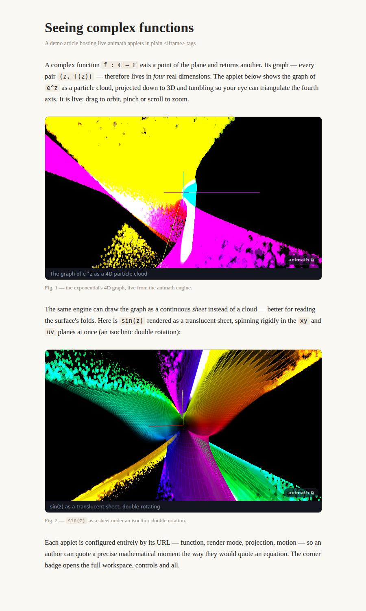

### 🟣 decision · 12:26 — Embeddable applets: design captured, iframe-first recommended
**Why:** the user named the next key work item — packaging app views as
applets embeddable in web pages (e.g. an explainer that embeds live Complex
Particles / sheet views).

Wrote `docs/EMBEDS.md`: recommend an **iframe embed route** first
(`#/embed/:appId` + a versioned settings codec + a chrome-less EmbedShell +
an "Embed this view" share dialog that serializes the current settings),
because the deployed Pages site already is the applet host — isolation,
updates and hosting come free, and the codec/shell are exactly what a later
web-component packaging would reuse. "Complex sheet" is a render mode of
ComplexParticles, so the one pilot covers both looks. Awaiting the user's
go-ahead on the recommendation before building.

### 🟢 code · 12:06 — Free-orbit camera, discoverable pan, authentic particle badge
**Why:** the user asked for the particle card art to be updated, a way to pan
the camera, and for the drag rotation to stop behaving like a bounded knob.

- **Free orbit**: replaced the turntable camera (azimuth/elevation with a
  ±90° elevation clamp and a fixed +Y up) with an orientation quaternion.
  Drags now apply incremental rotations about the camera's own right/up axes
  — a trackball tumble with no pole stops; you can roll over the top
  indefinitely. The ambient Yaw/Pitch/Roll controls (Hopf/Torus) and Reset
  compose on the same quaternion. Verified by driving 3 long sweeps (~8 rad)
  past the old stop in headless Chromium.
- **Pan** already existed (Shift+drag, two-finger drag) but was
  undiscoverable — the Camera panel gains a **Drag: Orbit | Pan** pill so
  one-finger pan is a visible choice on mobile.
- **Particle badge**: the gallery card now sketches the real viewer — the
  (z, f(z)) graph as a phase-colored e^z cloud tumbling under a 4D double
  rotation, with the signature x/y/u/v four-color axis cross
  (hues match `AXIS_COLORS`).

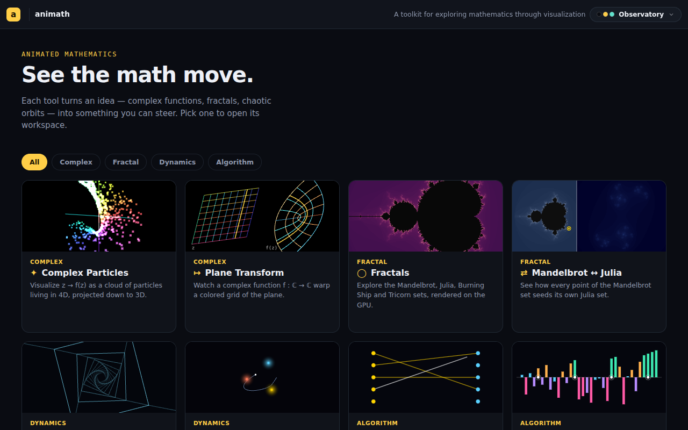

### 🟢 code · 03:36 — Mobile performance pass (user: "less smooth since the reskin")
**Why:** the user reported reduced smoothness on mobile and asked whether the
new chrome components are a computational burden.

The chrome DOM itself is idle — the real costs were per-frame work
interacting badly with the bigger tree:

1. **The big one**: the particle loop pushed the orientation-matrix readout
   into React state *every frame* while Motion = Quaternion (the default
   tumble) — under the old chrome that re-rendered a small drawer; under the
   workspace it re-rendered the whole chrome (bar, rail/dock, every panel) at
   60fps. Now throttled to 4 Hz (it's a Detail-panel diagnostic).
2. **Uncapped devicePixelRatio** (3× on phones = 2.25× the pixels of the 2×
   cap) in PlaneTransform, FractalsGPU and Correspondence — all capped at 2,
   matching Canvas3D.
3. **PlaneTransform read layout (`getBoundingClientRect`) twice per frame** —
   sizes now come from a ResizeObserver cache.
4. **Backdrop blurs** (bar/dock/rail) re-blur every composited frame over a
   live canvas — disabled below 740px (solid `--panel-solid` instead).
5. **Gallery previews kept rAF-ing when scrolled away** — now paused via
   IntersectionObserver until the card returns.

### 🟢 code · 02:16 — Scroll hints on the rail and the phone dock
**Why:** the user missed that the bar scrolls — the phone dock hides its
scrollbar and clips the remaining panel buttons with zero affordance (the
desktop rail has the same failure on short windows).

New `useScrollHints` hook (chrome-level) tracks whether a scroller has more
content past each edge; the rail (vertical) and dock (horizontal) now show a
fade + accent chevron at whichever edge has more, disappearing at rest ends.
Verified by DOM probe: right-only at scroll 0, left-only at the end, both
mid-scroll.

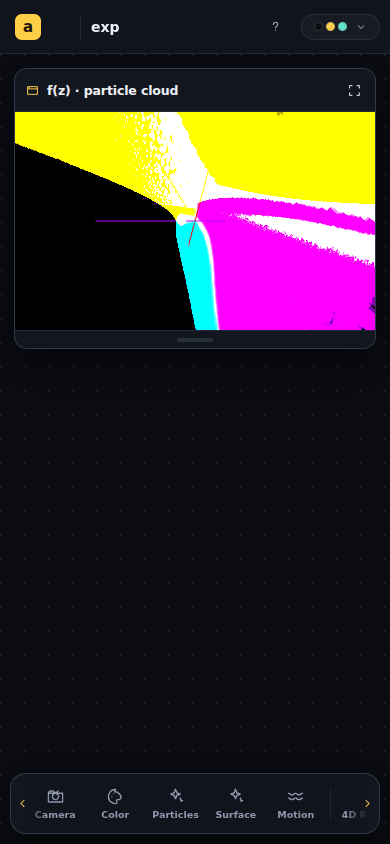

### 🟢 code · 01:40 — 4D Rotation panel opens by default (user couldn't find it)
**Why:** the user reported the drop-axis and rotation controls (the old
Actions floater) missing from the particle viewer.

They survived the redesign intact — turns, spins, spin speed, drop axis,
reset all live in the drive-tier **4D Rotation** panel — but the default
Essentials layout didn't open it, so unlike the old always-visible floater
it was hidden behind a rail icon. Essentials now opens it floating over the
plot's right edge (the floater's old spot). Note: saved workspace
arrangements don't auto-change; re-picking Layout → Essentials (or the rail
icon) restores it for existing users.

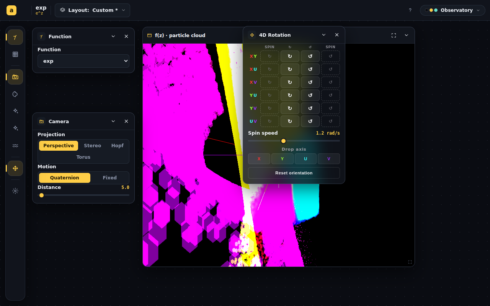

### 🟢 code · 01:33 — Complex-function work package: complete set, parity, quadratic UX, title shortcut
**Why:** the user asked for four things: the Plane Transform preview as
domain/range sheets, the particle viewer's functions wired to the complex
plane, a complete function set (all trig + inverses, 1/z², etc.), better
quadratic entry, and the function name opening a selector.

- **Function set completed** (append-only indices 23–35 in
  `lib/complexMath.ts` + both GLSL dispatches): sec, csc, arctan, arccot,
  arcsec, arccsc, 1/z², sinh, cosh, tanh, arcsinh, arccosh, arctanh. The
  inverses are branch-aware through their ln (arctan's sheets are π apart);
  a shared `MULTIVALUED_INDICES` set now drives every viewer's branch UI.
  Categories regrouped: Trig / Inverse trig / Hyperbolic.
- **Plane Transform wired to the full set**: its GLSL dispatch stopped at 18,
  so cot/arcsin/arccos/quadratic silently rendered as identity — now at full
  parity including the quadratic uniforms, grouped category picker, quadratic
  coefficient UI, and curve mapping. Verified arctan end-to-end (branch
  points at ±i visible in the f(z) pane).
- **Quadratic entry** redone: a new `ComplexInput` ControlPanel primitive —
  one row per coefficient reading `a = [re] + [im]·i` — replaces the six
  "(Re)/(Im)" rows, in both viewers, under an `f(z) = a·z² + b·z + c` hint.
- **Clicking the title/formula opens the Function panel**: `Workspace` gains
  `titlePanel`; the TopBar title becomes a button (opens/raises the panel on
  desktop, opens the sheet on phone). Both function viewers opt in.
- **Gallery preview**: Plane Transform card now shows two tilted sheets —
  the z grid and its image under z² — with a sweeping probe line whose image
  parabola animates the correspondence, labeled `z` and `f(z)`.

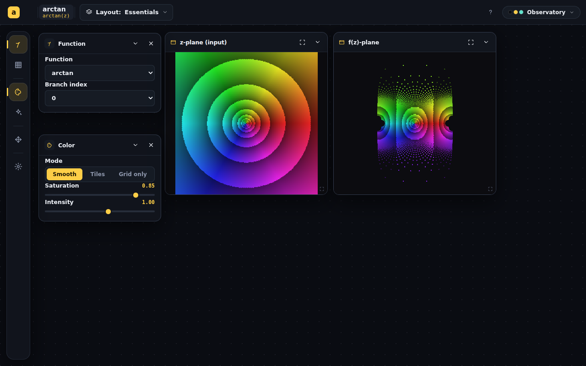

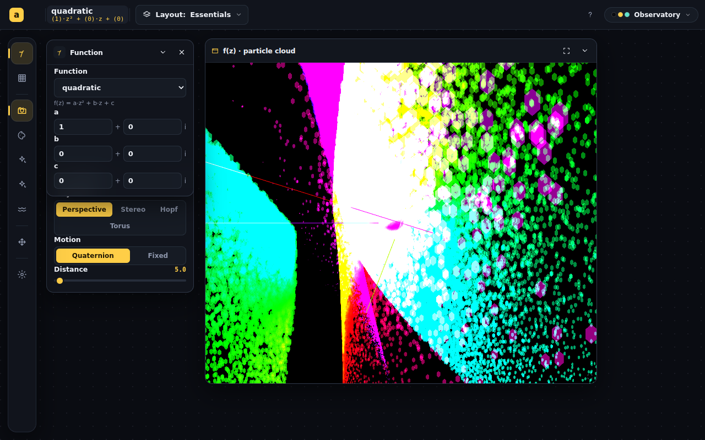

### 🟢 code · 01:21 — Preview feedback round: sorting + polygon redone from the real apps
**Why:** the user flagged the sorting image as weak and asked for the 3D
viewpoint on Polygon Worlds.

Screenshotted both real apps for reference. Agentic Sorting's Array view is a
**bipolar** bar chart (positive up / negative down from a center axis, candy
colors) — the preview now mirrors that, with agent dots crawling the axis
instead of the clumsy full-height cursor rectangles. Polygon Worlds is a 3D
third-person walk with a glued-square minimap inset — the preview now flips
to match: a perspective walk over the tiled universal cover (gold obelisks,
teal cones, pink stones repeating every tile — the repetition *is* the
gluing), gold avatar, and the fundamental square with edge arrows as an
inset minimap.

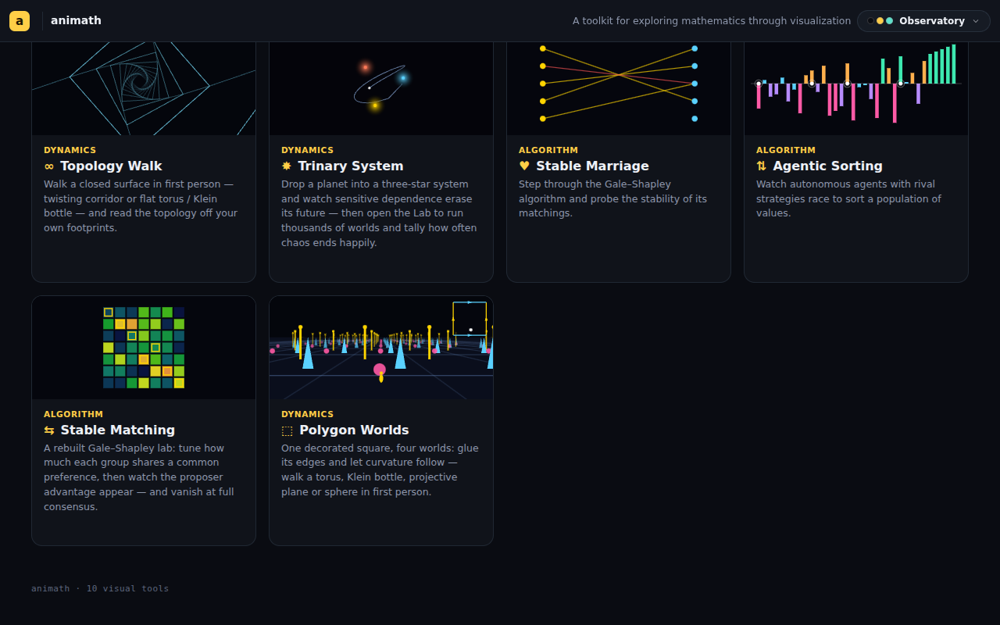

### 🟢 code · 01:09 — App-specific gallery preview animations (one flavor per app)
**Why:** the user asked for thumbnail animations that are app-specific and
relevant — the gallery had 3 shared flavors across 10 cards (Topology Walk,
Polygon Worlds, and both matching apps all showed the three-star preview).

Kept the recorded "cheap 2D canvas, not real renderers" decision and authored
7 new flavors in `chrome/previews.tsx`: a warping plane grid morphing under
f(z)=z² (Plane Transform), a Mandelbrot↔Julia split pane where c orbits the
cardioid and its Julia set morphs live (Correspondence), a twisting
first-person wireframe corridor (Topology Walk), an animated Gale–Shapley
proposal round driven by a real module-scope simulation (Stable Marriage),
three concurrent bubble-sort agents racing over a bar array (Agentic
Sorting), a preference heatmap whose matching walks the lattice (Stable
Matching), and a geodesic walker wrapping a glued-square torus with
edge-identification arrows (Polygon Worlds). The Mandelbrot card now
palette-cycles (iteration field computed once, recolored per frame via LUT).
Verified all 10 cards + Paper skin via headless shots.

> [!CAUTION]
> Found while debugging two black cards: **rAF timestamps can precede a
> `performance.now()` captured earlier in the same effect**, so the first
> frame's `t` was slightly negative and JS `%` keeps sign — `events[-1]`
> crashed the draw loop. `useCanvas` now clamps `t ≥ 0` for every flavor.

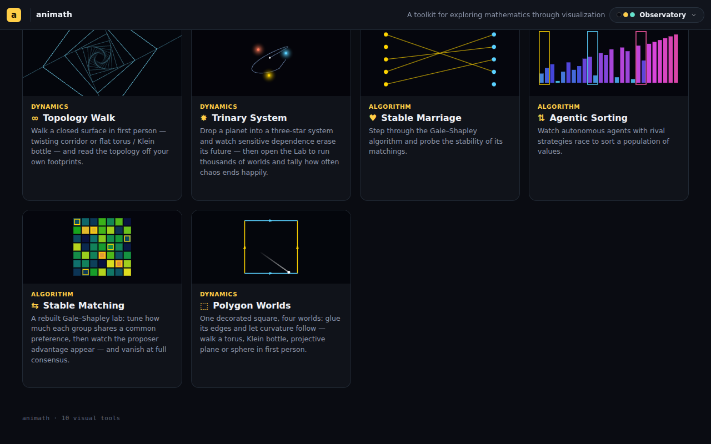

### 🟢 code · 00:54 — View windows: fullscreen mode + phone resize grip
**Why:** the user asked for resizable viewports and a full-screen mode,
particularly on mobile — phone view cards were locked at `56vw`/340px with no
way to grow them.

Fullscreen is a **CSS-only restyle of the same DOM node** (`position: fixed;
inset: 0`) so WebGL contexts survive and `Canvas3D`'s ResizeObserver adapts;
it's transient state (not persisted), exits via the header button or Esc. On
desktop the stage gets `.am-has-full` (z-index 100) so the overlay covers the
top bar (`.am-stage` is `isolation: isolate`, so the fixed child's z-index is
capped by the stage's own level). Phone cards gain a bottom **resize grip**
(pointer-drag, clamped 140px–80vh) with per-view heights persisted under
`animath:v1:wsphone:<appId>`. One new chrome icon `shrink` (inward corners)
mirrors `expand`. Verified by driving headless Chromium: clicked the toggle
and dragged the grip on `#/complex-particles` at 1280×800 and 390×844.

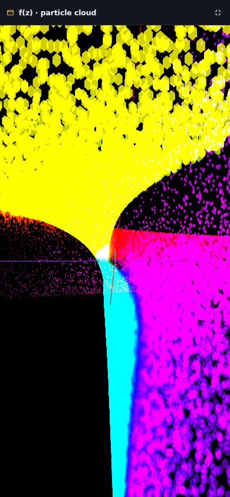

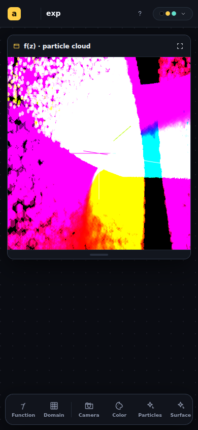

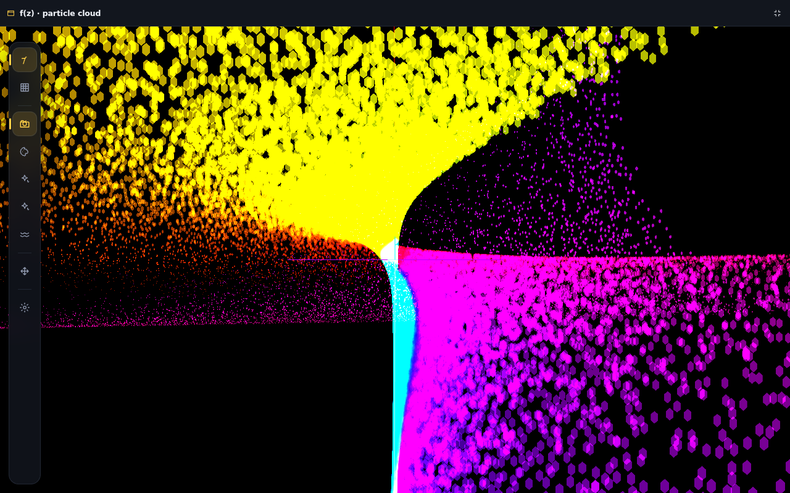

### 🟢 code · 00:52 — Fixed dead screenshot on the deployed session pages
**Why:** the user reported a dead image link on the deployed preview of the
S01 report.

Root cause was not the rename: the S01 progress report embedded
`../../../redesign/shots/p4-complex-particles.png`, a ref that climbs out of
the report's folder. `build-sessions.mjs` mirrored the carried blob to
`docs/sessions/redesign/…` — *outside* `converted/` — and
`copy-sessions-to-dist.mjs` only ships `converted/**`, so the deployed page
404'd (the old slug's page had the same dead link before the rename). Two
fixes: the report now uses an in-folder `assets/p4-complex-particles.png`
copy (per REPORT_STYLE convention), and the build re-homes any escaping ref
under `assets/carried/` inside the converted tree, rewriting the body ref, so
future cross-folder refs can't 404 on Pages.

> [!NOTE]
> The deployed site rebuilds only on a push to `main` (or manual dispatch),
> using `main`'s copy of `build-sessions.mjs` — the report-side fix takes
> effect on the next deploy; the script hardening lands when this branch
> merges.

### 🟡 milestone · 00:37 — Session start on renamed branch
**Why:** orient before continuing the redesign work.

Read the S01 handoff, created this progress report under the new slug. Awaiting
the user's direction on which open item to pick up (PR finalization vs.
carried-forward gaps).

### 🟢 code · 00:36 — Branch renamed; old PR closed
**Why:** the user asked for the auto-generated branch name to be replaced with
a topical one before continuing.

Created `claude/new-chrome` at the tip of `claude/dazzling-goodall-1afsbr` and
pushed it. Moved `docs/sessions/{progress,handoff}/dazzling-goodall-1afsbr/` to
`…/new-chrome/` and updated the branch/slug references in both reports and in
`docs/redesign/IN-PROGRESS.md` (commit `d01ded3`). Closed PR
[#199](https://github.com/piyarsquare/animath/pull/199) (it pointed at the old
head).

> [!WARNING]
> Deleting the old remote branch over git was rejected (HTTP 403 — the proxy
> in this environment doesn't permit branch deletion), so
> `claude/dazzling-goodall-1afsbr` still exists on origin and needs a manual
> delete in the GitHub UI.
