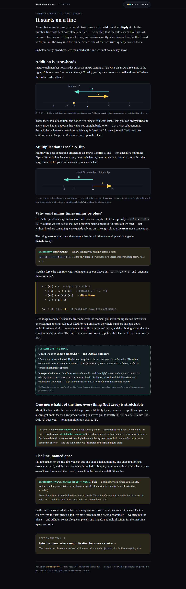
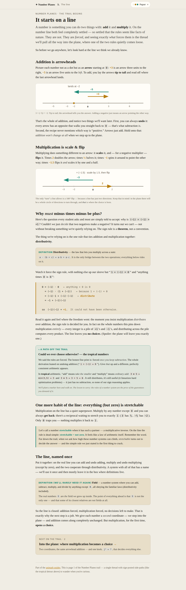

# Number Planes guide — "first looks" + what a first page should be

## Session purpose

Continue work on the **Number Planes** guide (stacked branch off
`number-plane-guide`). Hands-on session: discuss some **"first looks"** and what
a **first page** might look like — i.e. converge on what the reader should
encounter first before touching the artifact.

## Previous session

Stacked on `number-plane-guide`. The most recent tracked work
([2026-06-25-S01](../number-plane-guide/2026-06-25-S01-number-plane-rename.md),
PR #244) built `public/number-planes.html` (715 lines): a prose-first
"circle-the-core-from-many-lenses" hub page with a carried `j²` choice
(Spin/Shear/Boost) that live-rewrites the prose, a ring of perspectives + lens
deck (4 lenses fully written: Multiplication · Magnitude · Rails · Iteration;
4 stubbed), and a themed `guides.html` gallery + shared skin layer
(`guide-theme.css` / `guide-skin.js`) so the static guides mirror the app's 8
skins. Applet slots are styled placeholders (no `#/embed/number-planes` route
yet). Full design story + node map + open questions:
[the Number Planes page plan](../argand-plane-review-51egvz/2026-06-24-S01-plan-number-planes-page.md)
(`kind: plan`, `status: proposed`).

**Open from that work:** finish the 4 stub lenses; build the
`#/embed/number-planes` applet on the dormant, 50-test `numberPlanes.ts` engine;
settle the where-do-guides-live fork (in-chrome native skins vs. static mirror);
and Theming v2 (#239) landing sharpened the drift risk of the static mirror.

## Working notes

<!-- Newest entry first. -->

### 🟣 decision · 21:40 — Naming + math discussion → Rays feed + fan dynamics (built)
**Why:** Dan paused to discuss. Settled and logged:

- **Names:** *Number Planes* (family) and **the p-plane** (generic) adopted; literature
  names kept as "also known as": generalized complex numbers ℂ_p (Harkin & Harkin
  2004, Yaglom tradition), ℝ[j]/(j²−p). Parameter space = "the dial"; compactified
  = "the circle of planes"; moduli = 3 points (non-Hausdorff — dual touches both).
- **Core constraint** (sharpens L3): only **bilinearity + a unit** — in 2D
  commutativity/associativity are FREE (one generator ⇒ ℝ[j]/(quadratic)); complete
  the square ⇒ j²=p. The demands only become payable at dim 4 (quaternions).
- **The fan:** f(t)=t(a+bj) is a copy of ℝ laid along w; z·f(t)=t·(zw) — lines
  through 0 → lines through 0, t untouched. ×z shuffles the fan; fixed blades =
  common eigenvectors of ALL ×z = **the rails = ideals (absorbing lines)**. A plane
  is a field ⇔ its fan has no absorbing blade (unifies WH+FD).
- **Iterated, f(t)·zⁿ:** direction dynamics on the circle — **stir** (dense
  precession, p<0) · **creep** (~1/n to one rail, p=0) · **snap** (exponential to
  the attracting rail, p>0). Magnitude does |z|ⁿ identically in all three — p lives
  entirely in the direction. (Downstream: why ℂ has n n-th roots; split starves.)

**Built (Dan: "add it so we can see it" / "yes, add the slider"):**
- **Rays feed**: 12 colormapped lines through 0 (same color source→image tracks
  each blade); pure shuffle at α₀=0.
- **Iterate extended to Rays**: slider scrubs the fan under f ⁿ — verified at n=6:
  stirred / crept / snapped, exactly as derived. Card-worthy: rails-as-ideals.

### 🟢 code · 20:40 — Number Plane round 3: zoom/pan, honest flow paths, movable shape, quadratic, colormaps, labels
**Why:** Dan's next batch: zoom/pan; the "smooth" path z→f(z); move the shape like
z; switch z² to the quadratic form (Argand's); better subplot separation; a
colormap on iterations *and* shapes; |z|=1 level labels in Marks.

- **Zoom/pan**: wheel + drag-pan + 2-pointer pinch, one shared window across all
  three plots (comparability preserved); double-click / ⟲ Reset view; dynamic axis
  ticks; level/null sets extend to the window. Camera not persisted (a setting vs
  view distinction).
- **Smooth path**: the multiplicative flow `z·αᵗ` via engine `powReal` (spiral /
  shear / boost arcs; straight blend only where the angle honestly doesn't exist —
  powReal's documented fallback). Affine = two legs (spiral ×α, slide +β); the
  **quadratic = three legs** (spiral ×α₁ · slide +α₀ · ramp α₂z² in). Point feed
  draws the dotted arc; orbit arcs use the flow between iterates.
- **Movable shape**: shapes centered on a draggable `sc` handle (persisted).
- **Quadratic**: z² pill replaced by `α₂z² + α₁z + α₀` (expr storage key bumped to
  expr2 to shed stale values); pink α₂ handle (--data-7) + sliders.
- **Subplot separation**: real gutters (window bg behind, viz-bg per plot).
- **Colormap**: theme sequential map (`themeMapsFor`/`sampleContinuous`, tracks
  skin) colors the orbit by iteration and the shape image per-segment — the same
  param color on source/image shows which point went where.
- **Level labels**: Marks checkbox; bold `|z| = 1` above the axis, 0.5/1.5/2 below.

Verified (R1): build green; screenshots — colormapped circle image under the
quadratic on all three planes (gutters visible), staggered level labels, arc paths.
Gestures remain headless-logic-verified (no scripted pinch).

### 🟢 code · 19:50 — Number Plane round 2: z point + feeds + Play morph + Iterate + rails slider
**Why:** Dan's feature list after driving the app: move z and see its image; the
grid AND shapes; watch things move; the iterate step; "I don't know what is
getting squared"; and a change-of-axis control realigning the boost onto its
asymptotes.

- **Point feed**: draggable white `z` shared across plots; image `f(z)`/`z²`
  labeled (answers what-gets-squared); dashed-into via t.
- **Feeds**: Point · Shape (○ □ △ presets) · Grid.
- **Play**: `t` source→image morph slider + ▶ Play (rAF loop, brief rest at ends).
- **Iterate** (1–14): orbit of the same z under each plane's f — **spiral · shear ·
  saddle** side by side (verified screenshot; the app's money shot).
- **Align frame to rails** slider: change-of-basis morph sending the split plot's
  asymptote directions onto the axes (det>0 interpolation, exact 45° rotation at
  p=1; pointer drags inverse-mapped). Complex plot deliberately doesn't move — no
  real rails, the panel copy says that failure is the story. (This is the plan's
  "change-of-basis morph — probably the single most important interaction".)
- **Essentials layout** default (Expression·Dial·Play open) so the three plots are
  visible on first open (Everything buried them under six panels).
- EXPLAINER updated (feeds, dial, rails).

Verified (R1): build green; screenshots — orbit trio (spiral/shear/saddle), rails
at 100% (hyperbolas square, circle unmoved), z² point labeling. Drag remains
headless-logic-verified only.

### 🟢 code · 19:00 — New app: Number Plane (`#/number-plane`) — the Beat-4 comparator
**Why:** Dan pinned the main story's Beat 4 as the next build: a new gallery app
"Number Plane" (may replace Argand later) — one panel, three plots (p = −1, 0, +1),
the **same expression on each**. Mid-build he added: the notebook could *open* on
this ("the three number planes"), and the comparator invites a **single p knob**
that alters complex/split and leaves dual unchanged — both folded in.

Built `src/animations/NumberPlane/` (self-contained, SVG, no WebGL):
- **Three plots** side by side; expressions: `|z| = r` level sets (circle · line
  pair · hyperbola; r=1 bold), `αz + β` (y=mx+b promoted; grid turn/shear/squeeze,
  **α/β draggable on any plot, shared by all three**), `z²` (grid bends three ways).
- **The dial**: one `p` slider — plots show `j² = −p, 0, +p`; turn toward 0 and both
  outer worlds flatten into the dual (level sets generalized to arbitrary p:
  ellipses / line pair / hyperbolas with 1/√|p| scaling).
- **Null set** dashed (`|z| = 0`, the no-way-back numbers) — none · x=0 · y=±x/√p.
- **First consumer of the dormant `numberPlanes.ts` engine** (mul/affine/kindLabel).
- Theming: plane identities on `--data-1/2/3`, handles `--data-4/5` (no --accent).
- Registered (append-only): `index.tsx`, `apps.ts` (icon ⊞), `catalog.ts`
  (Complex/plane/hue 262), CLAUDE.md routing+tree rows, README item 14 + tree.
- EXPLAINER with sources block (Yaglom; Clifford/Cockle; Needham; Harkin & Harkin).

Verified (R1): build green; screenshots of all three expressions + dial at p=0.4
(ellipses stretch, asymptotes steepen — both flattening toward dual). Drag is
logic-verified only (headless, no pointer script) — signals: visual-unverified for
touch feel. "Smaller vessels vs gallery apps" question noted, deferred per Dan.

### 🟢 code · 18:10 — Regrouped into core units (C1/C2/C3)
**Why:** Dan: "yes please regroup into core units."

Added a thin **core** layer above the 27 fine cards (kept intact as the "things"):
- **C1** see + and × on the line — gathers L1·L3·L4·L5·AX·fields·algebra·tropical·modular·p-adic
- **C2** + and × on the plane → choices — gathers L2·PL·DV·CR·QD; figures for the
  3-way comparator (`tri-compare`, p=−1,0,1) + the single `p-dial`
- **C3** the three planes → what the choice gives — gathers CX·DU·SP·WH·FD + the topics
- New `gathers` link type (core→thing) + `core` kind (leads the sidebar, larger graph
  hubs). Checker + inspector updated. Simple, idea-first text.

Verified (R1): checker green (30 cards, all refs resolve incl. gathers), build green,
C2 card shows its cluster + both widget figures, graph shows 3 coral core hubs over
the finer web.

### 🟣 decision · 17:45 — Reframe: the unit is the "core concept" (dial back the machinery)
**Why:** Dan: "we went too far… we were just trying to measure out the ideas into
units. keep the text simple. the focus is on the idea. let's not be precious." The
27 typed cards + type/subject + three-hats was over-precise for what he wanted.

**Grain = the core concept** — a handful of units, each gathering a few neighbors
and a widget or two. The 27 fine cards become the *things hanging under a core*, not
the top level. Text stays simple, idea-first. Confirmed rhythm (Dan's own framing):

- **Core 1 — see `+` and `×` on the line.** Make both operations visible. Cluster:
  distributive rule · rings & fields · tropical.
- **Core 2 — take `+` and `×` to the plane; now there are choices.** Harder than the
  line. Two questions: (1) why are there choices, and what are they? (2) what do the
  choices imply? Widgets: a **3-way comparator** at `p = −1, 0, 1` (same `w·z` on all
  three — circle vs hyperbola — or the plane-transform under one fixed multiply); a
  **single dial** turning the plane through `p`.

Not a simple web page — the target is a *living notebook* (design being explored
separately with Claude design).

> [!NOTE]
> Next: regroup the pile into these core units (a handful, not 27); the fine cards
> become sub-"things." Drop the type/subject fuss as a driver (harmless, can stay).
> The integrity checker + inspector stay useful regardless. Awaiting Dan's go to
> regroup.

### 🟢 code · 17:20 — Executed the three-hats-reconciled plan (checker + additive type/subject pilot)
**Why:** Dan ran the object-type classification plan through /three-hats; all three
converged on **adopt the diagnosis, refuse the churn**
([synthesis](2026-06-29-S01-expert-synthesis.md)). Dan: "proceed with the plan" →
proceeding with the *reconciled* plan, not the raw re-atomization the panel rejected.

Done (all reversible; 27 files intact):
1. **Integrity checker** `scripts/check-cards.mjs` (the panel's #1 near-term risk):
   verifies `manifest.json` ↔ the `.md` set and that every `[[id]]`/`![[id]]`/`links:`
   target resolves; exits non-zero on drift/dangling. Currently green (27 cards).
2. **`type` + `subject` as additive facets** (NOT primary, NOT replacing `kind`) on the
   pilot cluster `CX·DU·SP·WH·FD`: spaces → `type: space`, claims (`WH`,`FD`) →
   `type: claim`; `subject:` = complex/dual/split/planes. Label fixes adopted
   (space not "domain"; claim instead of splitting observation/theorem).
3. **Inspector** shows `type`/`subject` badges loudly + guards phantom cards
   (`r.ok` check, warn+skip) so a 404-as-text can't become a ghost card.

Deferred per the synthesis: observation↔theorem stays a **depth** distinction
(glance/note/full + optional `▸ noticed/▸ why` labels), NOT split cards; the global
`orb→topic` rename and rollout to all 27 wait until Dan sees the pilot; **no
re-atomization** — count changes only when a real consumer (the deck) needs a piece.

Verified (R1): `check-cards.mjs` green, `npm run build` green, CX badges render
(`space · type: space · subject: complex`).

### 🟢 code · 16:30 — Graph view added to the inspector
**Why:** Dan: "add a graph view? showing the different types of edges."

Self-contained force-directed graph (no libs): nodes colored by **kind**, edges
colored + arrowed by **edge type** (leans-on · opens · same-as · contrasts ·
used-for) with a two-row legend. `overview | graph` switch in the sidebar; click a
node → open its card; drag to rearrange (reciprocal same-as/contrasts deduped).
Verified (R1, http preview): 27 nodes, 66 edges, legend renders, no errors.

### 🟢 code · 16:05 — Card inspector: `cards/index.html` (view the graph)
**Why:** Dan: "design a document html so we can look at the cards… see the
connections, the type… examine the yaml." Nothing fancy.

Self-contained viewer (no CDN), themed via the shared skin layer:
- Reads the `.md` files **live** (tiny in-page frontmatter parser + minimal markdown
  renderer) from a generated `manifest.json` — edits show without re-baking; only
  add/remove needs a manifest regen.
- Sidebar grouped by **kind** (colored dots) + filter; detail shows badge · `glance`
  · `## note` · `## full` · figures · **links →** and **← linked from** (typed,
  clickable, both directions) · collapsible **raw YAML**.
- `![[id]]` transclusion renders inline (FD pulls in the `L5` facet).

Verified (R1, http preview): rendered `CX` (15 edges, 1 figure, 0 missing links),
`FD` (transclusion), overview; fixed a transclusion bug (`\s*` ate the blank line →
`[ \t]*`). `npm run build` green. URL: `…pages.dev/number-planes/cards/`.

### 🟢 code · 15:30 — Content architecture: the note-card system + 27 cards
**Why:** Dan steered from design (handled w/ Claude design — the "living notebook":
glowing orbs that expand to a note → window → portal; reader-orderable) to
**content**: build the beats as an ordered, rearrangeable data structure.

Decisions:
- **Order is a *view*, not a property.** Atomic, self-contained, copyable cards;
  the graph lives in each card's `links` (Zettelkasten / digital-garden shape). No
  hard endpoints — quaternions etc. are just cards that connect.
- **Format:** Markdown + YAML frontmatter, one file per card
  (`public/number-planes/cards/`). Edge types: `same-as · contrasts · opens ·
  leans-on · used-for`.
- **Layered text** (Dan): `glance` (orb) · `## note` (terse house voice) · `## full`
  (textbook). Presentation picks depth.
- **Cards hold figures**, incl. one op across `p=−1,0,1` (CX `tri-multiply`).
- **Variable granularity:** small fragments (e.g. *stretchable* = `L5`) are
  `kind: facet`, transcluded `![[id]]`, not their own orb.
- **L2 trimmed** to one idea (Dan: "doing too much"): treat the coordinates as
  strangers → it's `j²=1` (split).

Wrote **27 cards**: spine `L1 L2 L3 L4 L5 PL DV CX DU SP WH FD CR QD` · tangents
`tropical relativity` · orbs `autodiff analysis higher FTA matrices modular
cayley-dickson p-adic fields algebra` + `README` (schema + voice). All `[[links]]`
resolve. (Matrix notation switched off `[[a,−b]]` to avoid wikilink collision.)

> [!NOTE]
> Cards are content, not yet rendered — no notebook UI consumes them. Verification
> = link-resolution check only (R3: a proxy, not a rendered view). The "why fix
> addition" answer (AX) settled a question Dan re-opened: addition is fixed *by
> choice* (vector add + subtraction), tropical is the road that declines it.

### 🟣 decision · 14:35 — Voice + opening reframe: plain & example-first, NOT memoir; lead with "which multiplication?"
**Why:** Dan rejected my first "in-voice" attempt as feeling like a **diary**. His
model: *"Complex numbers are defined by their addition and multiplication. But I
can already think of other ways… like (a,b)·(c,d)=(a·c,b·d). But what are the
constraints — and we start listing them out, then think of them on the number
line."*

**Voice (locked-ish, to become a committed voice guide):**
- **Plain, declarative, example-first.** State the thing → produce a real rival →
  ask *what constrains the choice?* → list the demands → drop to the line to read
  them. Curiosity rides the **math moves**, not personal narrative.
- **Reasoning-"we"/"you" OK; autobiographical-"I" is the diary smell** (the exact
  failure: "no one would explain to me", "I did that for years"). Cut it.
- **Touchstones (Dan):** John McPhee (structure, immersion, restraint), Alfred
  Korzybski (map ≠ territory — "could it be different?" is the native question;
  this is the guide's actual thesis, not a flourish), Bill Bryson (warm + history
  geek-out) **but braver — don't flinch when the math gets hard.**
- **Aesthetic goal:** feel like a *hand-drawn* artifact, not a webpage. Future
  "look": sketch-rendered schematics (rough.js wobbly ink + hatching) under a
  field-notebook theme (toothy paper, ink palette, marginalia type). Parked as the
  advanced request — after voice + content land.

**Opening reframe:** the trail's motivating question becomes **"Why are complex
numbers special — what are the knobs, could it be different?"** (the under-taught
gap a complex-analysis course leaves). Page 1 reopens: define complex by +/×, show
the coordinate-wise rival `(ac,bd)` (which is secretly `ℝ×ℝ` = the split plane), ask
what singles out the complex product, **enumerate the demands as the spine**, and
use the line as the place to isolate each demand. Dan is "taking notes" on the
why/knobs — requested as the best seed (his voice + the content).

> [!NOTE]
> Next build, once Dan confirms the register: restructure `number-planes-line.html`
> §1 to the "which multiplication?" opening + re-tone all 7 slides; draft the voice
> guide doc; then page 2.

### 🟢 code · 14:10 — Built the "trail deck" viewer + first manipulable widget (probe)
**Why:** Dan: break the trail into pages/slides ("maybe JS… a new kind of document
viewer"), and the figures "have to be manipulable" (drag/type/choose `a`,`b` → live
`a+b`). Built a small reversible probe to react to (RECIPES R2).

New reusable viewer toolkit in `public/` (progressive enhancement, no framework):
- **`guide-deck.js`** — turns `<section class="slide">` blocks into a stepper:
  Back/Next + keyboard (←/→/space/Home/End) + clickable progress dots + swipe, a
  deep-link hash per slide, and a lazy `window.GuideWidgets[key]` mount hook. With
  JS off, `body.deck` is never added → slides render as the old scroll page (free
  fallback).
- **`guide-deck.css`** — deck layout + control bar + the interactive-widget styles
  (skin-aware via the shared tokens).
- **`guide-widgets.js`** — `add-line`: addition as tip-to-tail arrows with
  **draggable arrowheads**, number inputs, and preset chips; live colored
  `a + b = sum`. Trivial arithmetic kept inline on purpose; the plane-and-beyond
  widgets will embed the tested `numberPlanes.ts` engine via `#/embed/` applets.
- **`number-planes-line.html`** rewrapped: 7 slides (`open · add · multiply ·
  forced · tropical · stretchable · field`), the static addition figure swapped
  for the live widget.

**Forward call recorded:** widgets by complexity — vanilla for the line, embedded
React `#/embed/number-planes` (on `numberPlanes.ts`) for the plane onward (DRY +
keeps hard math under test).

> [!CAUTION]
> **R1 caught a real bug.** On a deep-linked slide the heading hid behind the
> sticky bar: the browser's `#fragment` scroll fires as late as the `load` event
> (after our JS re-adds the id), aligning the slide top *under* the bar.
> `scrollRestoration='manual'` + a `load` re-pin weren't enough (timing). Fixed
> timing-independently with `scroll-margin-top: 72px` on `.slide` (+ ids carried
> as `data-sid`). Verified: `h2top` 62–74 now clears `barBottom` 54 on every
> deep-link.

Verified headless (R1): `open / add / forced` + phone (390px) across **Observatory
/ Paper / Phosphor** — deck nav, the widget (`3 + −5 = −2`, drag handles), theming,
and wrapping all hold; `npm run build` green.

> [!NOTE]
> **Verification caveat (R3):** drag *interaction* is verified by the widget's
> logic + static end-state, not by a scripted pointer-drag in headless. The deck
> nav state is trivial (index clamp); not unit-tested as it lives in `public/`
> vanilla JS outside the vitest harness — flagged for extraction+test if the spur
> (post-mark side-step) state machine lands next.

### 🔵 finding · 13:25 — PR #245 up + live preview; Codex P2 (discoverability) deferred to Dan
**Why:** Dan: create/follow a PR and send the live link. Codex then flagged that
page 1 has no inbound link.

- **PR [#245](https://github.com/piyarsquare/animath/pull/245)** opened (base =
  `number-plane-guide`, the stacked base — *not* main). Subscribed for CI/review
  events; one-shot ~1h fallback check-in armed (webhooks miss CI-success/merge).
- **Cloudflare deploy ✅.** Live page (branch preview, auto-updates):
  `https://claude-number-plane-guide-fi.animath.pages.dev/number-planes-line.html`
  (this commit: `https://c73b0bd1.animath.pages.dev/number-planes-line.html`).
- **Codex review P2** (not a bug): page 1 only links *forward* to
  `number-planes.html`; nothing in `guides.html` / the hub links *to* it, so the
  Guides gallery still lands on the old hub. **Deferred to Dan, not acted on** —
  wiring the gallery entry point to the new trail is the exact "where does the
  trail start live / how do pages join" decision Dan reserved for later. Did not
  reply on the PR thread (keeping GitHub chatter minimal).

### 🟢 code · 13:45 — Built page 1 of the trail: `public/number-planes-line.html` (the line)
**Why:** Dan: "build the first page around the Real number line, addition and
multiplication with the open aside to tropical numbers (where lives a postmark)
and finishes with our familiar field over the real numbers (only in passing, or
in boxes that keep definitions)."

New standalone page in the `public/*-guide.html` family, reusing the shared skin
layer (`guide-theme.css` + `guide-skin.js`) — a **reversible probe** that leaves
the existing `number-planes.html` hub intact for later folding-in. Content, in
order:

- **It starts on a line** — a number is something you add *and* multiply; the
  rules look like facts of nature but are *forced*, and the line is where we find
  out by what.
- **Addition is arrowheads** — tip-to-tail arrows (static SVG figure: `3+(−5)=−2`),
  with the two seeds: addition is *undoable*, and it *won't change* in the plane.
- **Multiplication is scale & flip** — SVG of `×(−1.5)` flipping `2`→`−3`; the
  line's only "turn" is a 180° flip *because a line has two directions* (the bridge
  to the plane's circle of directions).
- **Why must (−)(−)=+** — the forcing derivation in a mono block; a **Definition**
  box for *distributivity*; the punch that the line leaves *no* choices (plane
  leaves one).
- **Post-mark → tropical** — first instance of the signpost mechanic (dashed
  `.postmark`): the rules are forced *only if you keep subtraction*; tropical
  (min, +) is the give-up-subtraction world.
- **Stretchable plant** — `.note`: invertible = "stretchable", on the line
  `stretchable = nonzero`, flagged to crack far down the trail.
- **The line, named once** — **Field** kept to a definition box; close sets up the
  jolt: addition comes to the plane unchanged, multiplication opens a choice.
  Forward `.next` card → "Into the plane" (temporarily linked to the existing hub).

Prose-first; static SVG (no applets yet); plane-agnostic accent (no `j²` color —
the choice hasn't happened). **Verified (R1):** `npm run build` green; headless
full-page shots across **Observatory / Paper / Phosphor** + a **390px phone** —
theming, figures, and wrapping all hold.

### 🟣 decision · 13:10 — Single thread + "post-marks", not a branching web; two-axes is *a* throughline, not *the* one
**Why:** Dan: a story with multiple unfolding pathways is conceptually possible,
but "we are going to try for a single thread and put the post-marks for other
paths along the way. we will maybe figure out how to join them." The two-axes
framing (distributivity count vs. stretchability ladder) is **one** throughline,
not **the** one.

Reverses the original plan's explorable-*web* navigation model in favor of a
**linear spine with signposts**. Post-marks are the future seams where a branch
can attach; joining is deferred. Demotes the two-axes structure from
candidate-spine to one of the signposted side-paths.

**Inventory of post-marks surfaced this session** (each a side-path, not the
trunk): why `(−)(−)=+` is *forced* by distributivity (a theorem, not a
convention); **tropical** math = give up subtraction (the additive group is
itself a choice); **stretchability** = having an inverse, and the **1·2·4·8**
normed-division ladder; **3-D is empty of division** but holds a rich
classifiable **zoo of five** commutative-unital algebras (incl. `ℝ[x]/x³` =
second-order autodiff, `ℝ³` = three rails); **Hamilton/quaternions** (jump to 4-D,
lose commutativity) as the far trapdoor; the magnitude/unit-curve; eigenvalues &
the change-of-basis "find the rails" morph; relativity (split) / autodiff (dual)
applications; the circle of planes (`p ↦ 1/p`, dual at ∞).

Open: name **the** single spine (candidate = Dan's opening arc continued: line →
plane+choice → the three → feel them → the dial is a circle, with "how many
rails / separable vs entangled" as the heart) and decide where it ends.

### 🔵 finding · 12:55 — Math thread that reshapes Beat 1: what's actually *forced*
**Why:** Dan challenged "there's only one way to multiply the line," then pushed
through 3-D and the magnitude condition. The math we settled becomes page content.

- **Sign rules are theorems, not conventions.** Distributivity over a genuine
  additive group + a unit *forces* `0·a=0`, `(−1)a=−a`, `(−1)(−1)=1`. On ℤ/ℚ it
  pins multiplication completely (0 free parameters). The plane is the first
  place the same demand leaves one knob loose (`j²=p`). → sharper Beat 1→2 hinge.
- **Tropical** keeps distributivity but drops additive inverses (a semiring) — the
  honest "you could choose otherwise" escape is *give up subtraction*, not
  *redefine negatives*.
- **Magnitude was never required for the trichotomy** — distributivity + unit alone
  gives the three planes. The conjugate-product norm `N_p = x²−p·y²` appears on its
  own and is multiplicative in all three, but positive-definite (a true norm,
  stretchable = nonzero) **only for complex**. Demanding it collapses the plane to
  ℂ alone. → "stretchable" is a *second axis*, orthogonal to `j²`.
- **3-D under distributivity-only is rich**: exactly **five** commutative
  associative unital ℝ-algebras (`ℝ³`, `ℝ×ℂ`, `ℝ×ℝ[ε]`, `ℝ[x]/x³`, `ℝ[x,y]/(x,y)²`),
  none a division algebra (no 3-D field over ℝ exists). `ℝ[x]/x³` = second-order
  autodiff — the dual-number thread, one floor up.

### 🟡 milestone · 12:30 — Session start: oriented, awaiting "first looks" discussion
**Why:** New branch (`number-plane-guide-first-page-zkpnzi`) continuing the
Number Planes guide; this is a hands-on discussion session, so pin the topic
with Dan before any artifact change (RECIPES R2 — separate exploring from
guessing).

Oriented:
- **Branch** is stacked on `number-plane-guide` (merge-base = its tip
  `b3b07d9`), **not** `main` — so any future sync targets that base, never `main`.
- **On disk now:** `public/number-planes.html` (715 lines, the hub+lenses page),
  `public/guides.html` (themed gallery), `guide-theme.css` / `guide-skin.js`
  (shared skin layer). The dormant engine is `src/animations/Argand/numberPlanes.ts`.
- Read the prior progress (#244 work) + the full page plan + the TODO backlog.

The session focus is **"first looks" and what a first page might look like** —
i.e. the reader's entry experience, which the current page opens with a sticky
`j²` chooser + perspective ring + lens deck. Stopping here to discuss with Dan
what the *first* thing a reader meets should be before changing anything.
</content>
</invoke>
