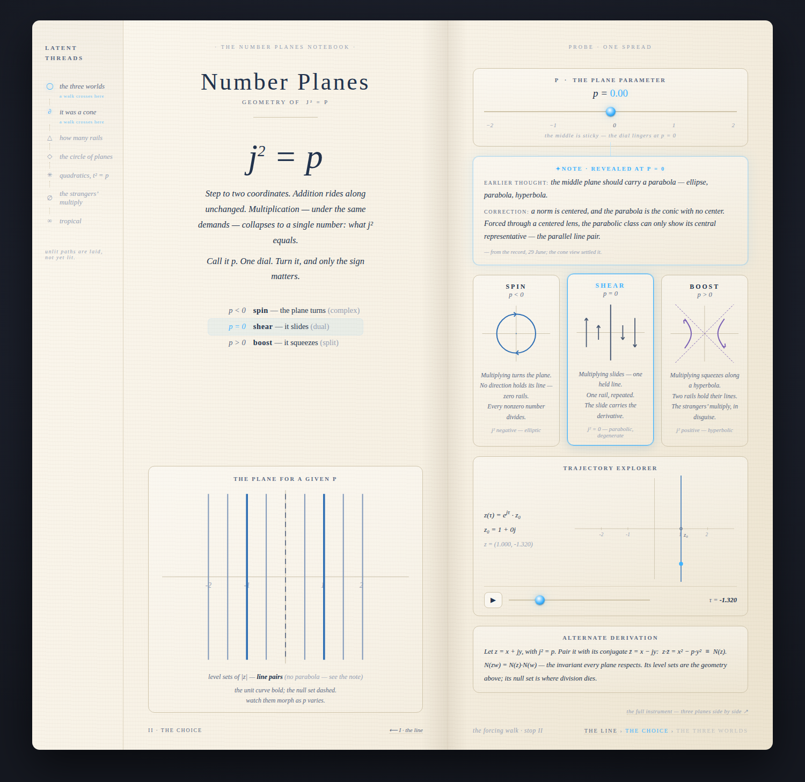
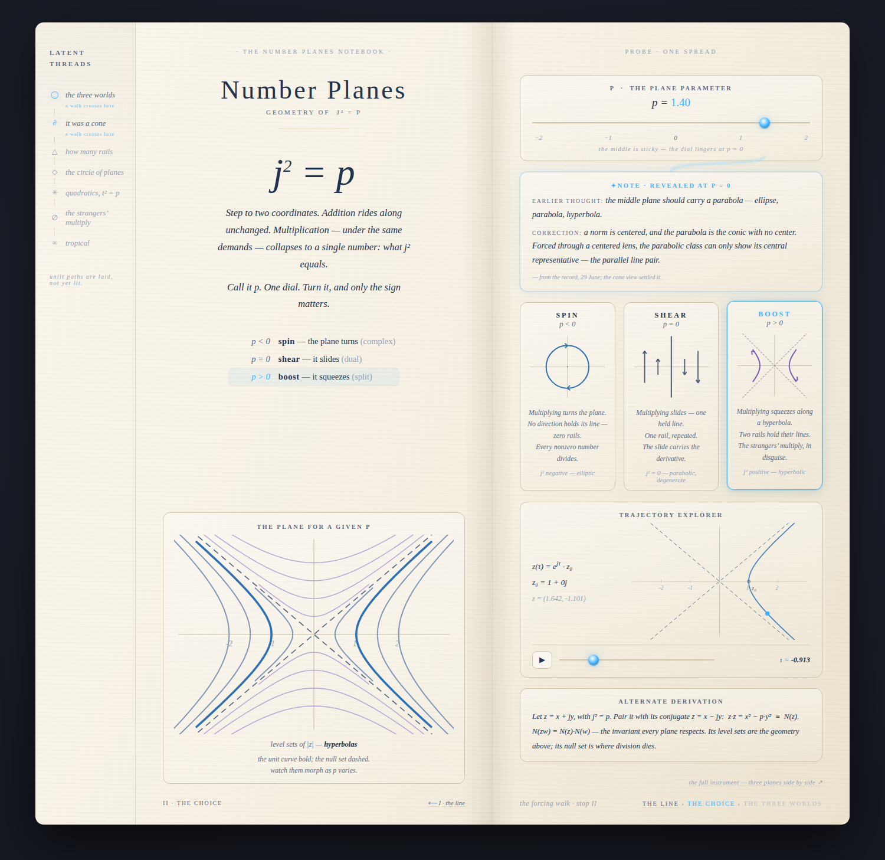
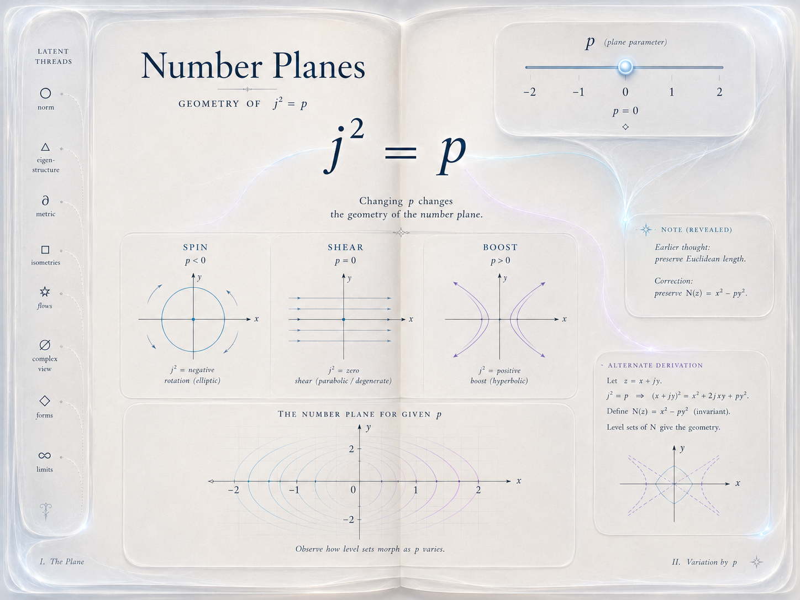
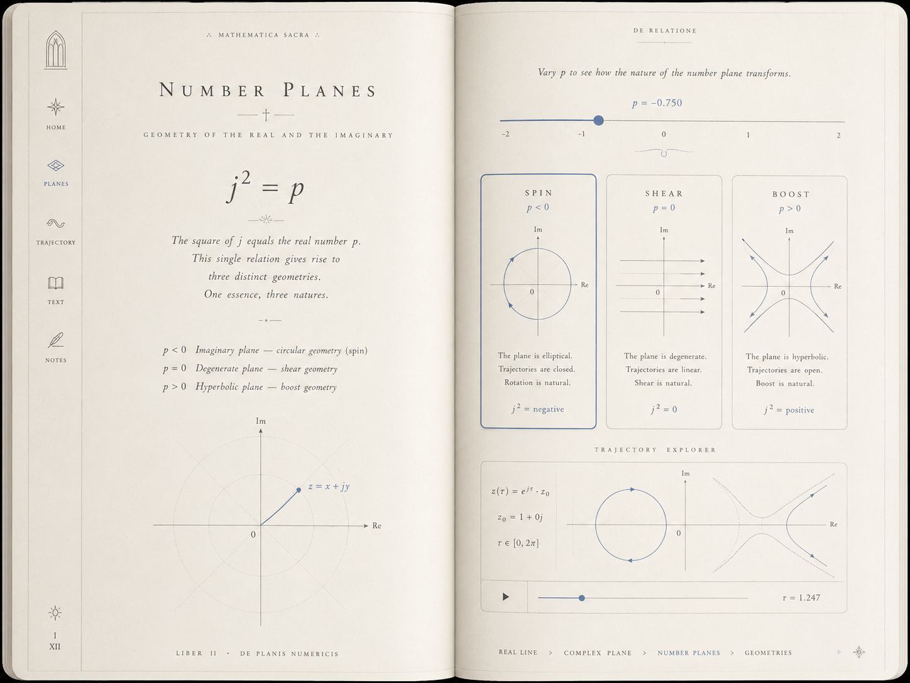

# Number Planes — the living-notebook presentation (the unfolding)

## Session purpose

Present the Number Planes explorations as an **interactive notebook/artifact**:
futuristic feeling, tactile interactions, yet the sense of a **personal
notebook** — a personal exploration, curated and threaded but **not forced** —
rather than an encyclopedia or a textbook. This is the "unfolding" the backlog
carries as the top `number-plane` item: turn the 35-card pile + the Number
Plane app into the living-notebook presentation.

## Previous session

[2026-06-29-S01 — first looks / first page](../number-plane-guide-first-page-zkpnzi/2026-06-29-S01-first-looks-first-page.md)
(PR #245, merged into `number-plane-guide`): built trail page 1, the 35-card
note-card system (`public/number-planes/cards/` + inspector + checker), and the
Number Plane app (`#/number-plane`). Its handoff's `next:` is exactly this
session: *"Dan drives the 'unfolding' — turn the 35-card pile + Number Plane
app into the living-notebook presentation."*

## Working notes

<!-- Newest entry first. One ### per state transition. -->

### 🟢 code · 07:00 — v3 built: the staged passage lives (`18c5a73`)
**Why:** Dan approved the script with adjustments (multiple twinkles OK for
unordered/forking tasks; text judged when assembled — ideally the notebook
gets built *as we explore*; A0 reply my call; tap-per-line; include Stop D;
ruler design my call, noting a possible change-of-basis analog for the
hyperbolas later). Mid-build he added the C0 insight: the unit-square
deformation (1 → w, the square follows) shows spin/shear/boost precisely
because it shows the decomposition (1,1) = (1,0) + (0,1) added both ways —
distributivity gives the full effect from the two basis moves.

Built the moment engine (18 moments · 4 stops), replacing the static desk:
- **Stop A**: the bare question → tap-per-line unfolding (add asks nothing;
  distribute-and-collect; only j² unknown; j² = p born large, then a ghost
  flies it to the header dock). Whisper: completing the square one floor up.
- **Stop B**: the settle-the-dots renormalization widget — each p tapped
  glides to sign(p) with its own ruler s = √|p| shown; the zero dot refuses,
  with the no-neighborhood caption; **multiple twinkles** (one per unsettled
  dot) as the unordered task set. Then the p-line *becomes the dial* (ghost
  morph) and the three portraits light by sign; visiting all three advances.
- **Stop C**: the triad rows (same + / same reals / same ×1) tap-per-line;
  the close adds Dan's far-corner line; C1 desk with the operator stage now
  drawing the full decomposition: 0→w gold, 0→w·j teal, dashed parallelogram
  completion, the far corner labeled w + w·j. Threads → the **asks rail**
  (questions that summon faces; future passages sit dim).
- **Stop D**: the mirror trick unfolds with the same gesture as A; levels
  exist only from here (face + ask both born at D1); the p=0 margin note
  arms only here; dismissed notes leave a ✦ ask in the rail.
- Engine: zones per layout, moments gate births/retirements, ghost flights
  for the two signature morphs, stop-dot scrubber, resume via localStorage,
  `?m=N` deep links, start-over.

**Verified** by driving the entire passage headless (every advance clicked,
all dots settled, all three signs visited, both columns tapped through):
every moment viewport-fits at 1440×900 and 390×844; resume returns to the
last moment; restart returns to the question. Two real bugs caught by the
walk: the zero-dot tap didn't redraw (its twinkle never cleared — a human
would have stalled there too), and the desk slots collapsed to header height
(absolute faces gave the body no height). Both fixed and re-verified.

### 🟣 decision · 05:20 — Staging is the missing layer; the passage script is written
**Why:** Dan's design review of the live desk: it overloads the screen — the
concept isn't cohering because the page has *space* mechanics (compartments,
faces) but no *time* mechanics. His direction: open on the question ("Does the
number plane have to be complex?"), then No → three choices → because j² must
equal something → the equation → the slider; then the behavior questions. Plus
four specifics: (1) twinkle/orb affordances announcing advance points;
(2) named layouts with natural morphs between them (PowerPoint-like states,
element travel between them); (3) beat 1 must SHOW the math — the derivation
unfolds, "announcing is not our way" — and two missing mathematical beats
identified: **renormalization** (only the sign of p survives rescaling; 0
alone with no neighborhood — which finally *explains* the sticky dial) and
the **× → level sets bridge** (the mirror trick z·z̄ = x² − p·y²; level sets
are currently an unearned jump); (4) the stop ends on the shared-ground triad
(same +, same reals, same ×1) as the setup for the three ×w motions. Multiple
stops per page expected.

**The method, named:** script particular passages first, plan the unfolding
from the script, build, test how they perform — then, freed of the thread,
see if the apparatus invites alternative views. The garden arranges itself
around walks that are already true.

Wrote [the passage script](2026-07-03-S01-plan-passage-script.md)
(`kind: plan`): four stops (A the question→the equation unfolds · B
renormalization, where the p-line *becomes* the dial · C the triad → the
three ×w motions · D the mirror trick → levels, earned), six named layouts
(CENTER/COLUMN/SPLIT/DESK-LITE/TRIAD/DESK) with FLIP morphs and two signature
morphs (the equation travels; the p-line becomes the dial), the twinkle
grammar (one live twinkle; advancing = doing the thing it sits on), memory
(return visits open assembled), and the declutter accounting (claim dissolves
into beats; operator/compare/levels are born, not resident; threads become
the question rail). Key reorder the script commits to: **level sets come
AFTER ×w** — they answer "what does ×w preserve?". Awaiting Dan's markup on
the text, A0's reply mode, step-advance style, whether Stop D opens the next
page, and the ruler-slider design.

### 🟢 code · 03:40 — v2: one-screen desk, compartment faces, the operator, all 8 skins
**Why:** Dan's structured feedback on v1: the page must fit the viewport
entirely (scrolling doesn't exist — anything beyond is an interaction: a new
page or a pan); drop the book/two-page mock (sections shape the page; halves
only matter if they become phone "screens"); **nothing appears that cannot be
hidden again**; compartments like a control panel — same-shaped slots whose
contents swap, simple controls growing complex on demand; more interactive,
less illustrative — specifically **the relationship with linear operators**;
density a bit too sparse in parts; and enable the animath themes (light +
dark). He also asked what review elements would help structure his feedback.

Rebuilt as the **desk layout** (`d851b5b`, same URL):
- **Viewport-fit everywhere**: topbar · dial strip · compartment grid ·
  footbar in a `100dvh` flex column, `overflow:hidden`; asserted headless at
  1440×900, 1280×800, 1680×1000, 390×844 (doc AND main never scroll). On
  phone the six compartments become swipe screens (scroll-snap pager + dots).
- **Compartments (slots) with faces**: uniform slot shape (header + face
  tabs). Stage faces: Levels · Orbit · **Operator**; Margin faces:
  Derivation · ✦Note. Touching the w sliders auto-swaps the stage to the
  operator face — the requested "simple control becomes the complex type."
- **The operator slot** (new content): ×w as the matrix [[a, p·b],[b, a]]
  with the p·b entry lit (p enters exactly once), live eigenvalues
  λ = a ± b√p tracking sign(p) (complex pair / repeated / two real), the
  whisper "the characteristic equation is t² = p in disguise," and the stage
  face showing the grid + unit square carried by ×w with rails dashed as
  real eigen-directions. Connects WH + matrices cards.
- **Hide-again rule**: the marginal note now lives in the Margin compartment
  — reveals at p = 0 on the filament (which now arcs across the whole desk
  from the dial thumb), dismisses with ×, leaves a persistent ✦ note tab to
  reopen. Nothing un-hideable remains.
- **Themed**: linked the shared `guide-theme.css`/`guide-skin.js` layer — all
  8 skins (3 light, 5 dark), picker synced with the app's saved skin. The
  "light responds" role rides `--accent`; paper is `--bg`/`--card`. Phosphor
  verified in mono; Daylight verified light.
- Denser: comparator as three compact rows (name · rails count · one-liner),
  the demands line added to the claim, matrix+eigen readouts always live.

Known thin spot: the phone claim screen is still airy (flagged to Dan).
Verification artifact worth remembering: a screenshot taken mid-CSS-
transition showed the *previous* comparator row still lit — looked like a
selection bug, was actually the 0.35s fade; re-shot settled.

### 🟢 code · 01:10 — The probe built: `public/number-planes/notebook.html` (spread II · the choice)
**Why:** Dan approved the probe ("yes I think that is a good idea") and left
the path question open ("I am open to seeing what you come up with").

**The path call:** the plaza doesn't belong to a path — paths belong to the
plaza. The probe claims arrival by the **forcing walk** (Path A), because
that's the only stretch already laid (trail page 1 = the line), so the
breadcrumb `the line › the choice › the three worlds` is real, not fictional;
the other two walks appear as **lit junction exits** in the latent-threads
rail ("the three worlds", "it was a cone" — each marked *a walk crosses
here*). The probe therefore exercises the junction mechanism instead of
dodging the path question.

**What's on the spread** (every mockup unit, on real card content):
- Left page: claim (PL/DV note voice), j² = p, the trichotomy list (rows
  highlight with the dial), and the **live level-set figure** (ellipses ↔
  line pairs ↔ hyperbolas + dashed null set, unit curve bold) — state crosses
  the fold.
- Right page: the **p instrument** (luminous thumb, sticky snap at |p|<0.08 —
  the sticky middle made tactile), the **comparator** (SPIN/SHEAR/BOOST,
  selection glows by sign(p), text from CX/DU/SP/WH/L2), the **trajectory
  explorer** (z(τ)=e^{jτ}z₀, play/scrub, live z readout — the "scrubber pays
  its way" TODO honored), the **alternate derivation** card (kneel depth),
  breadcrumb + folio + "the full instrument ↗" link to the app.
- **The revealed marginal note**: hidden until the reader first drags p to 0;
  then it unfolds on a luminous filament from the slider thumb. Content is a
  *genuine* recorded correction (the no-parabola discussion, 29 June — CN
  card), cited "— from the record". The kind-line adds "(no parabola — see
  the note)" at p = 0.
- Register: paper holds (cream, serif, hairlines, folio) / light responds
  (filament, selection glow, luminous readouts). English section names (no
  Latin) pending Dan's register call. Deliberately outside the skin system —
  the notebook is an artifact with its own identity (probe-scope decision).
- Engine: ~15 lines of vanilla JS ported from `numberPlanes.ts` (mul, expj,
  kindOf) — inline for the probe; the June-29 forward call (embed the tested
  engine for plane widgets) stands for the real build.

**Verified** (headless puppeteer, driving the actual controls): note reveals
at p=0 (class + computed opacity checked), BOOST selects at p=1.4, note
persists after leaving 0, z readout changes under τ scrub, slider at 0.05
snaps to 0; screenshots at spin/reveal/boost + phone 390px read correctly
(one real bug caught and fixed from the pixels: the breadcrumb footer
self-collided; plus a stray arrowhead artifact). `npm run build` green.

### 🔵 finding · 00:45 — Dan's two mockups read: the anatomy of a spread + "paper should feel alive"
**Why:** Dan attached two mockup images of the notebook style and layout — "so
you have an idea of the informational units and connectivity. paper should
feel alive." Both are preserved in `assets/` (they otherwise live outside the
recorded history). Notably, **both mockups draw the same stop — the plaza
(j² = p)** — independent confirmation that it is the notebook's center of
gravity.

**Informational units both mockups agree on** (the anatomy of a spread):
1. **The spread** — the unit of place: one idea at full width, numbered
   within a walk ("I. The Plane · II. Variation by p"; "Liber II", page I/XII).
2. **The claim** — headline formula + a few lines in the locked voice ("One
   essence, three natures").
3. **The instrument** — the p slider lives ON the page and its state
   propagates: at p = −0.75 the SPIN panel is selected, the level sets morph.
4. **The comparator** — three parallel panels (the parterres seen from the
   plaza), each figure + three terse observations.
5. **The explorer** — a second, deeper instrument (trajectory z(τ) = e^{jτ}z₀
   with play/scrub): lean-in depth of *interaction*, matching note/full depth
   of *text*.
6. **Marginalia — the revealed note** (vellum mockup): "Earlier thought:
   preserve Euclidean length. Correction: preserve N(z) = x² − py²." A NEW
   unit type not in the card schema — the record of corrected thinking. This
   is how the notebook is *personal* without autobiographical "I": the
   personality lives in revision marks, not narration. Solves the diary
   problem. And these can be quarried from real session history.
7. **The alternate derivation** — `## full` rendered as a subordinate side
   card: kneeling depth, present in place.
8. **The latent-threads rail** (vellum) — norm · eigen-structure · metric ·
   isometries · flows · complex view · forms · limits, dim, waiting: the
   junction exits / gates visible from this stop. (The codex rail is global
   nav instead: Home · Planes · Trajectory · Text · Notes.)
9. **The breadcrumb walk** (codex) — REAL LINE > COMPLEX PLANE > NUMBER
   PLANES > GEOMETRIES: the path underfoot.
10. **Connective filaments** (vellum) — connectivity drawn as luminous thread
    ON the paper (slider → the note it revealed), not as hyperlink.

**Two registers, one synthesis:** Mockup A is luminous vellum (futuristic,
aurora light-seams, alive); Mockup B is the codex (Mathematica Sacra — warm,
tactile, liturgical, with the clearer interaction semantics: selection state,
breadcrumb, explorer). The brief wants both. Proposed split: **paper is what
holds** (the codex's cream, serif, figure discipline, spread structure);
**light is what responds** (the vellum's filaments, reveals, selection glow —
every reader action answered in light). "Paper should feel alive" = state
flows visibly across the page.

**Mapping onto the garden plan:** spread = stop · breadcrumb = path underfoot
· latent threads = junctions/gates seen from the stop · on-page instrument =
instruments planted in beds · comparator = parterre view from the plaza ·
alternate derivation = depth-as-proximity · filaments = seams made visible ·
revealed marginalia = the meta-seam (the garden records its own walking).

**Gap to fill:** the card schema has no marginalia unit. Proposal: marginalia
belong to the **thread layer** (the walk's presentation), not the cards —
sourced from real recorded corrections in the session logs, revealed by
reader action. Register question flagged for Dan: how far to lean into the
codex conceit (Latin section names, "Mathematica Sacra") vs keep it a quiet
costume.

### 🟣 decision · 20:15 — The garden plan drafted: four beds, three paths, nine seams
**Why:** Dan set the frame: the notebook should carry the last session's rhythm
(question → new way of seeing → the tools to see it) and the right analogy is a
**garden** — we design beds and layouts, many paths natural to the layout, the
visitor never walks into the plantings. He asked for a curatorial review of all
35 cards + the surfaced ideas (with backward projection to the pre-recorded
germ line) to decide the main paths and reveal the seams.

Reviewed the full corpus (all 35 cards, the 2026-06-24 plan, the 2026-06-25 hub
session, the 2026-06-29 marathon) and wrote
[the garden plan](2026-07-03-S01-plan-garden-paths.md) (`kind: plan`,
`status: proposed`). Its skeleton:

- **Four beds**: the Line (forcing) · the Plaza (the choice) · the Three
  Parterres (the worlds) · **the Overlook** (the terrace of unifications).
- **Three paths**: A "Could it be different?" (forcing walk) · B "What does
  each world feel like?" (residents' walk — the app IS this path) · C "It was
  one thing all along" (the overlook climb — the last session's evening).
- **Nine seams** where paths cross (L2=SP, WH's four costumes, CN's
  knife=dial, QD, PT's family-speaks-dual, NH's sticky middles, IN the master
  seam, CR's loop, CK's rhyme) — to be rendered as junctions, real places.
- **Garden principles** for the presentation: depth = proximity (glance/note/
  full as leaning in, not page jumps); junctions are where choice lives; gates
  (orbs) are honest; the walk step is the rhythm; instruments planted in beds;
  the graph is the gardener's plan, not the visitor's map.

### 🔵 finding · 20:00 — The card graph already knows a fourth bed exists
**Why:** Verifying the bed hypothesis against the actual `gathers:` lists
before proposing structure on top of it.

`C2` gathers plaza cards AND terrace cards mixed (`CR, CN, PT, NH` alongside
`L2, PL, DV, QD`); `IN` is tucked into `C3`'s thirteen; **`CK` is gathered by
no core at all** (reachable only via `CN`/`NH`/`IN` opens-links). The
late-evening discussion cards were filed under whichever core was nearest
because they arrived after the core layer was designed. Proposal in the plan:
a fourth core **C4 — "one object in costume"** gathering `[CN, CR, PT, NH,
IN, CK]`, slimming C2 back to the plaza. Awaiting Dan's yes (card edit only).

### 🟡 milestone · 19:53 — Session start: oriented on the unfolding
**Why:** New branch (`claude/number-plane-notebook-kxvxzj`) picking up the
open design problem the 2026-06-29 handoff left as its `next:`. /start-session
run; no implementation yet — the presentation design needs to converge with
Dan first (RECIPES R2: pin scope before building).

Oriented:
- **Branch base:** starts exactly at the `number-plane-guide` tip (`0e6df33`,
  which contains merged PR #245) — so this branch is **stacked on
  `number-plane-guide`**, never to be synced against `main`.
- **On disk:** all the quarried content — 35 cards + inspector + checker
  (`public/number-planes/cards/`, `scripts/check-cards.mjs`), the Number Plane
  app (`src/animations/NumberPlane/`), trail page 1
  (`public/number-planes-line.html` + `guide-deck.{js,css}` +
  `guide-widgets.js`), and the older hub (`number-planes.html`) + themed
  `guides.html` underneath.
- **Design anchors from the prior session:** Dan's living-notebook sketch
  (glowing orbs → note → portal, reader-orderable); order is a *view*, not a
  property; layered card text (`glance` / `## note` / `## full`) exists so the
  presentation can pick depth; the voice is locked (plain, terse,
  example-first, reasoning-"we", never autobiographical "I"); the hand-drawn
  "field notebook" aesthetic was parked as an advanced request. The prior
  handoff's recommendation: make trail pages *views over cards*.
- **This session's brief adds tension to balance:** *futuristic* + *tactile*
  vs *personal notebook*; *curated and threaded* vs *not forced*. The design
  was explored separately with a design agent (outside this repo — no report
  in `docs/sessions/`), so Dan carries that context into this session.
