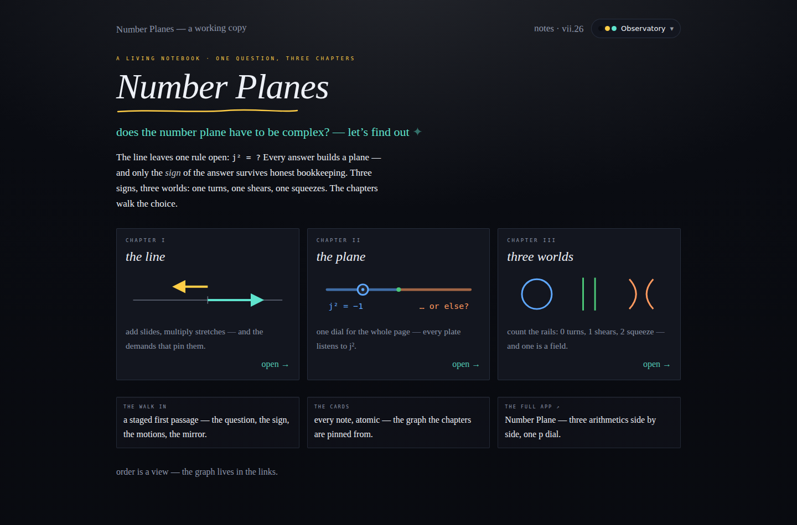
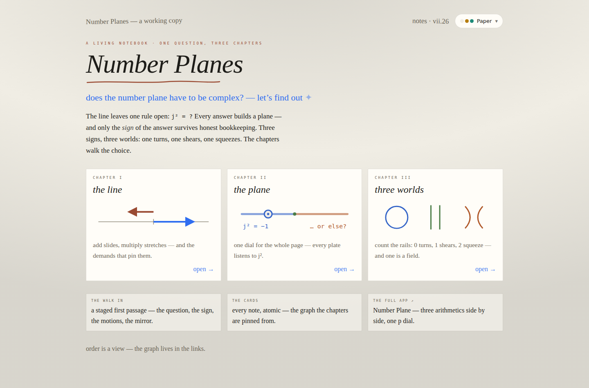
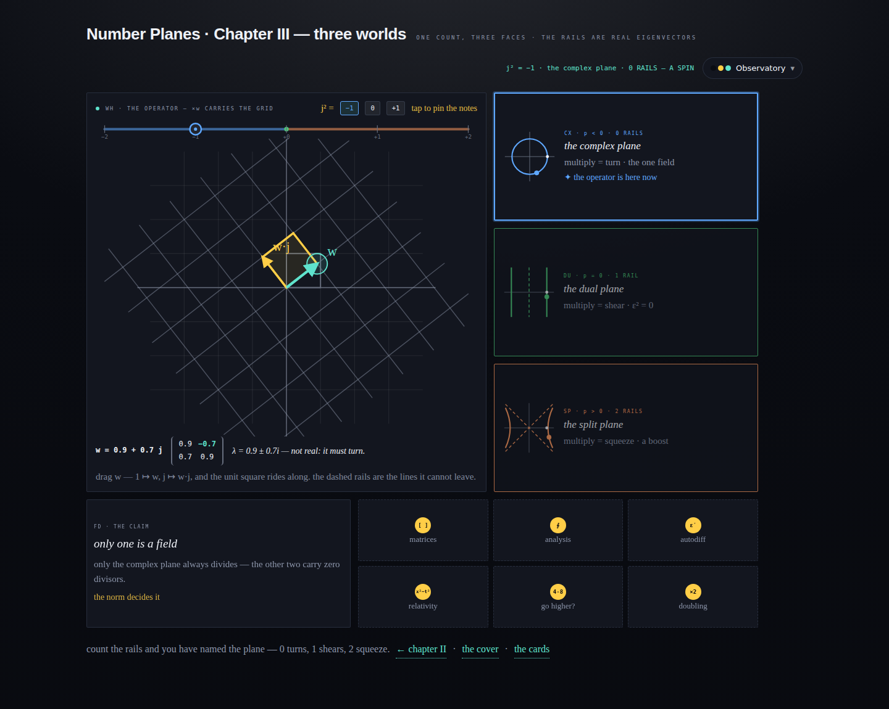
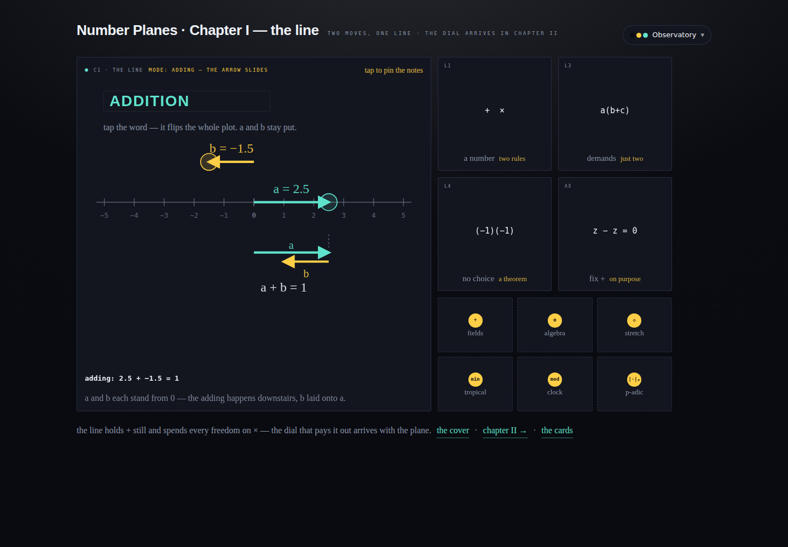
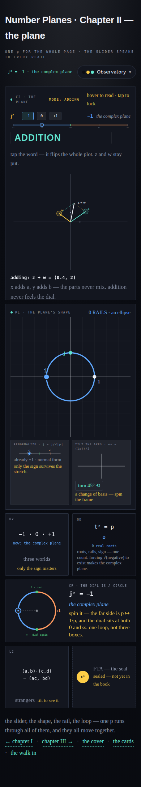

# The whole notebook — chapters I &amp; III ported, a cover that binds them, and the void fixes

## Session purpose

Dan: *"There are some definite problems. Do you have access to a browser? Can you
look at the pages yourself and see what's wrong? Make it work and make it look
great. And get the other notebooks into place so we can see the whole thing."*

## What the browser showed (the diagnosis)

Headless Chromium over the served pages, desktop + phone, all 8 skins:

| # | Finding | Root cause |
|---|---------|-----------|
| 1 | Plates read as **voids** — FTA nearly empty, DV/L2 sparse, captions wrapped mid-phrase ("three / worlds") | The `.fgl` glosses (each plate's second caption) were `opacity:0` until a `.vat:hover` — **invisible forever on touch**, and their reserved layout space squeezed the visible caption into a wrap |
| 2 | Phone layout undesigned | The ≤1140px rule stacked every plate full-width × 208px — slabs with a dot of centered content |
| 3 | "hover to read · tap to lock" shown on touch devices | Hint text assumed a mouse |
| 4 | Chapter links dead | "chapter I · chapter III — not yet laid" |
| 5 | Console noise | favicon 404; a Cyrillic-х class typo (`phх`) |

Checked and **cleared**: all 8 skins resolve every token to real colors; every
interaction (slider magnets, word flip, vat flips, CR dial, renormalize, tilt)
drives correctly; "0 RAILS · an ellipse" at p=−1 is the design's own text, not a
port bug. The committed 2026-07-08 screenshot shows the same voids — this was
port-fidelity debt from day one, not a regression.

## The fixes (chapter-2.html)

- **Glosses always present**: `.fgl` rests at 62% opacity, brightens on hover;
  on `hover:none` devices it sits at 85%. The voids fill with the design's own
  second voice ("only the sign matters", "sealed — not yet in the book").
- **Touch policy**: `@media (hover:none)` shows the `.ann` annotations, disables
  the hover-tilt (no sticky-hover artifacts), and the lock hint reads
  "tap to pin the notes".
- **Phone re-pack**: the plate grid becomes two columns — C2/PL/CR full-width,
  DV|QD and L2|FTA as square-ish pairs (`aspect-ratio` on vats, inline grid
  placements overridden). No more slabs.
- Caption rows wrap as centered lines (`flex-wrap`); header labels no longer
  break mid-word; the long header readout wraps below 700px instead of
  overflowing; inline SVG favicon; footer links to the real chapter pages.

## The other notebooks (now in place)

- **`chapter-1.html` — the line.** Full port of the design reference: C1 hub
  (ADDITION↔MULTIPLICATION word flip, draggable a and b arrows that never move
  when the operation flips, the cutout flap showing b laid onto a vs. a
  stretched by b — "b &lt; 0 — flipped!"), the four demand plates (L1 two rules,
  L3 distributes + a 1, L4 the sign rule is a theorem, AX we hold + still), and
  six sealed orbs (fields, algebra, stretch, tropical, clock, p-adic).
- **`chapter-3.html` — three worlds.** Full port: the WH operator hub (×w
  carries the whole grid — transformed gridlines, unit square image, w and w·j
  arrows, the [a pb; b a] matrix with the p-feeling entry highlighted, live
  eigenvalue line), the sticky j² strip, the three world cards with animated
  orbit/slide/squeeze dots that light up "✦ the operator is here now", the FD
  field-claim plate, and six application seals (matrices, analysis, autodiff,
  relativity, go higher?, doubling).
- **`index.html` — the cover.** Masthead ("Number Planes", the voice-underline
  squiggle, *does the number plane have to be complex? — let's find out ✦*),
  the three-chapter shelf with emblem SVGs, and three leaf side-doors (the walk
  in · the cards · the full app). The 274KB "working copy" design remains a
  future project; this cover binds what exists today.
- Cross-links: every chapter footer → neighbors + cover + cards; the cards
  inspector and notebook.html link back to the cover.

## Verification

`verify-all.mjs` (headless): cover links all resolve 200; ch1 word-flip
produces "multiplying: 2.5 × −1.5 = −3.75"; ch3 chip +1 gives λ = 1.6, 0.2,
"2 RAILS — A SQUEEZE", lit SP card, m12 = p·b; DU card sets p=0 with the
repeated-λ line; the slider magnet snaps −0.95 → −1; no horizontal overflow on
any page at 390px; no JS errors (the only console noise is the sandbox-blocked
Google Fonts fetch). `npm run build` passes.

## Also this session

Reviewed the S02 leak/re-grid plan (uploaded from Dan's parallel session,
committed as `2026-07-08-S02-plan-q3-leak-regrid.md`): mathematics verified by
hand (leak formulas, p_s = p + sq − s² including the recorded trap, Δ
invariance, the three disguises); verdict **adopt with corrections** — the
plan's letters are swapped vs. the shipped z = x + y·j / w = a + b·j
convention, RG's `same-as: [CN]` should be `leans-on`, placement translates to
a Chapter II annex (PL's renormalize plate already is the plan's unbuilt second
act), and the one-p contract resolves as sandboxed-q + an explicit "adopt
p′ = p + q²/4" exit. The referenced prototype HTML was not uploaded — asked Dan
to attach it or approve a rebuild from the plan's verification recipe.

## Self-reflection

**What went well.** Looking before fixing: the headless pass separated real
defects (hover-gated text unreachable on touch; the undesigned phone stack; a
61px header overflow) from false leads (fonts fail only in the sandbox; the
"ellipse" label is the design's own). The three-file port went fast because
chapter-2 had already established the skeleton — tokens, click routing, sticky
slider, seal/vat vocabulary — so chapters I and III are structurally identical
consumers of it.

**What was hard.** The port markup matched the design almost line-for-line, yet
rendered hollow — the gap was *behavioral* (hover semantics, fonts, viewport)
not structural, which is exactly the class of problem a diff can't see and only
a browser can. Also: absolute-positioned flip faces mean vats need explicit
heights everywhere; `aspect-ratio` on the phone grid turned out to be the clean
answer.

**Divergence noted.** The design's `data-trig` hover/click modes were collapsed
to click-mode in the port; the gloss policy (rest-visible at 62%) deliberately
departs from the design's hover-only glosses because the notebook must read on
touch. Flagged so a future session doesn't "restore" the regression.

**Follow-up value:** MEDIUM — the notebook is now whole (cover + 3 chapters);
next sessions harvest notebook.html's animations into the chapters and build
the leak/re-grid annex; the keyboard/ARIA pass stays parked per Dan.
