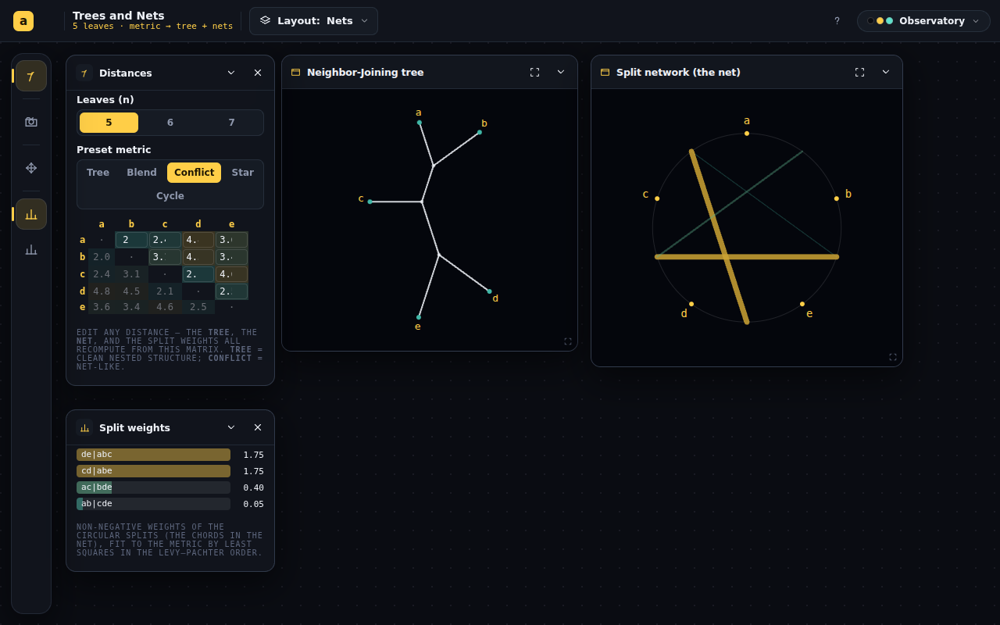
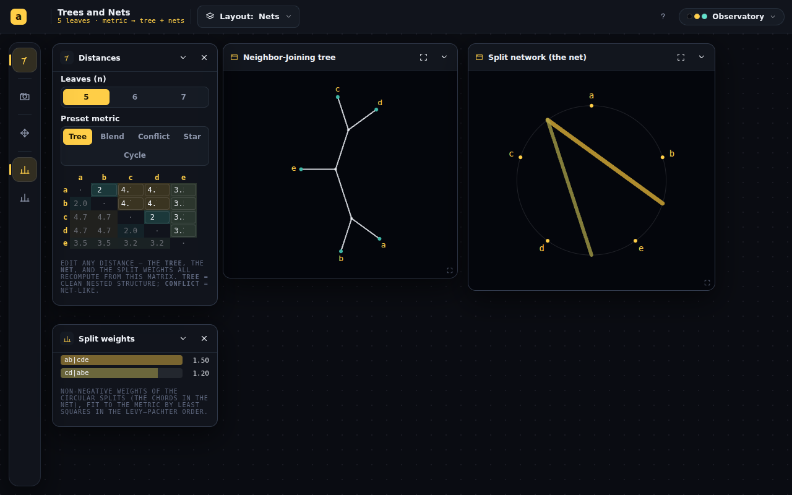
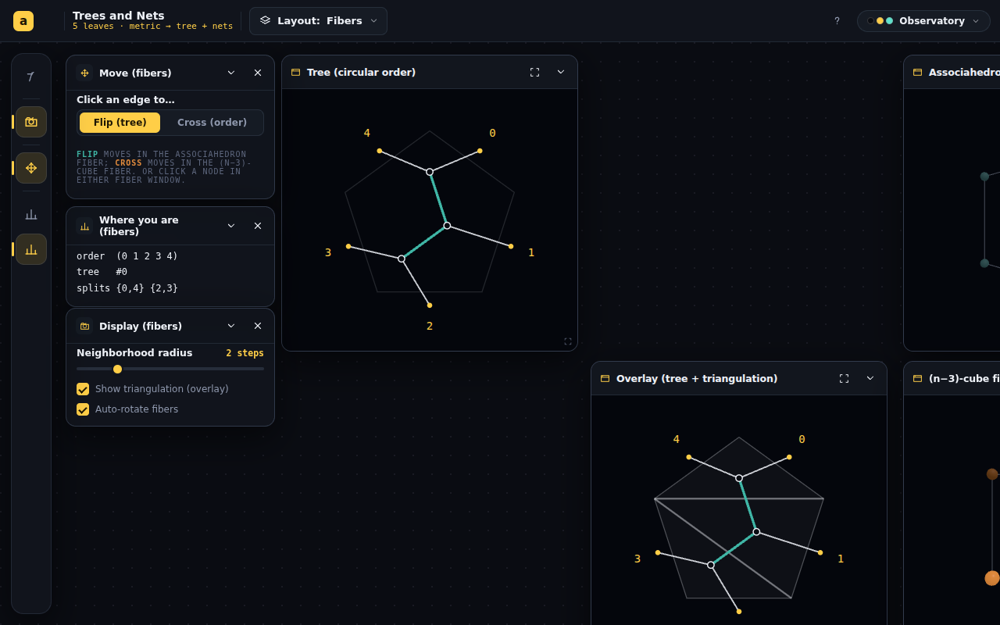

# Trees and Nets — port the rest of quantum-tree (evidence engine first)

## Session purpose

Dan: "We are going to be working in animath but making reference to the deployment
on quantum-tree. Port over far more of the quantum-tree code than we have — we were
focused on the associahedron and viewing the space of trees/orderings; move that
objective to the back a bit and bring the rest of this application to the front."
This session: **review what is there now, review the quantum-tree deployment, and
discuss how to make Trees and Nets more like the quantum-tree page.** No
implementation yet — scope and plan first.

## Previous session

[trees-and-nets S01](../trees-and-nets/2026-06-10-S01-associahedron-representation.md)
(PR #211, not merged): built the **abstract combinatorial skeleton** — a (tree,
order) point and its two fibers (associahedron × (n−3)-cube), disk views, flip/twist
moves, a gallery card. The handoff's own build-out ramp flagged that **the "Nets"
half (distance matrix → NeighborNet/NJ) and energies were scoped but never built**,
and that the quantum-tree source was shared in-session only (now gone). This session
we have **direct GitHub access to `piyarsquare/quantum-tree`**, so we can port from
the real source.

## Key finding — what "the rest of the application" is

The quantum-tree deployment (`docs/`, GitHub Pages) is data/evidence-driven; the
animath port kept only the polytope geometry. The deployment:

| quantum-tree file | what it is |
|---|---|
| `docs/index.html` + `docs/map.js` (215 KB) + `docs/styles.css` (50 KB) | **The main page** — tree-ordering **map** for 4–7 leaves: circular-order energies, resultant tree energies, **Neighbor-Joining**, **circular split weights**, **split-graph (network) views** |
| `docs/four.html` + `docs/app.js` | quartet toy — four-point condition, difference engine, **evidence plane**, quartet "superposition" |
| `docs/five.html` + `docs/five.js` | five-leaf composition — quartets → splits → orderings → trees, two assembly routes, Gibbs posteriors |
| `paper/circular_order_tree_working_paper` | the companion working paper (combinatorics + evidence-before-probability framing) |

The conceptual spine (README + NOTES): **distance data → evidence/scores/energies →
optional probability law**, never collapsing to a distribution too early. The
"quantum" layer is a framing (one-hot registers per topology, Gibbs posteriors now,
cost-phases/mixers later).

What animath's Trees and Nets is currently **missing**: the distance matrix (the
input), the whole evidence layer (quartet support, four-point condition, energies),
Neighbor-Joining, circular split weights / NeighborNet split networks, the evidence
plane, and the quartet→split→ordering→tree assembly views.

## Working notes

<!-- Newest entry first. -->

### 🔵 finding · 18:50 — Dan's feedback on the preview: "okay, not excellent"
**Why:** Dan opened the Cloudflare preview (mobile) and gave directional feedback.

Points: (1) the **matrix → solution connection doesn't read**; (2) **poor on
mobile**; (3) **no sense of how the split weights connect to the trees** / sit in
the path diagram; (4) wants **n > 7**; (5) wants the **SplitsTree split-graph
view**; (6) wants to **build a tree / CDM by edges**. Mobile diagnosis (390×844
shot): the Nets views stack fine as cards, but the bottom dock is cluttered with
the fiber controls (Move/Display (fibers)) and the matrix is hidden in a sheet, so
input and output never sit together.

Plan (3 themes): **A — make it read + mobile** (link matrix↔tree↔net↔weights with
hover/select highlighting; show weights *on* the tree edges + net chords; a
pair→path highlight; layout-aware controls; usable mobile matrix) → 1,2,3.
**B — the real net + scale** (port the SplitsTree convex-hull split-graph view;
raise n with lazy/capped fiber compute) → 4,5. **C — build by edges** (metric
builder: add tree edges / circular splits with weights → metric) → 6. Recommended
order A→B→C; priority put to Dan. Codex review fixes already pushed (n=8 restored +
verified at `tn-n8.png`; namespace bump so the new layout surfaces; both threads
resolved).

### 🟡 milestone · 18:35 — P1 shipped: the app finally has nets (matrix → tree + net)
**Why:** Bring the quantum-tree evidence engine to the front, per the decision.

Re-centered the app on an **editable distance matrix** (default **Nets** layout);
the associahedron × cube explorer is demoted to a secondary **Fibers** layout.
New views (`views/MatrixEditor.tsx`, `views/NetViews.tsx`): heatmapped matrix +
presets, a radial **Neighbor-Joining tree**, the **circular split network** (the
net), and a split-weights readout — all derived from the matrix via `useMemo`
(NJ · Levy–Pachter order · NNLS split weights). Guarded the fiber index against
n-changes (`curSafe`). `npm run build` green, **157/157 tests** pass, lint clean.

Verified headless at `#/trees-and-nets`: the **Tree** preset gives a tree-like net
(2 chords), the **Conflict** preset gives crossing chords (net-like) — the whole
point — and the **Fibers** layout still renders the associahedron + cube canvases.

### 🟢 code · 18:05 — P1a: metric/evidence engine ported + verified
**Why:** Get the math right and tested before any UI (the foundation).

Faithful TS port of quantum-tree `map.js` into `lib/{metric,trees,neighborJoining,
splitWeights,orders}.ts`: four-point support, tour energy, soft-min energy, tree
enumeration + splits, compatibility, Saitou–Nei **Neighbor-Joining**, **NNLS
circular split weights**, **Levy–Pachter** ordering. 19 vitest cases assert real
correctness (NJ recovers known additive trees; split weights reconstruct a tree
with residual < 1e-6; four-point sign; Levy–Pachter compatibility). Reviewed the
NJ + NNLS + Levy–Pachter modules by hand — clean and faithful (tolerances,
tie-breaks, ridge preserved). Committed separately (`b05d3cb`).

### 🟣 decision · 17:52 — Proceed: Nets first, drop the quantum framing, rebuild in place
**Why:** Dan said "continue" on the recommended defaults (the AskUserQuestion prompt
failed to render, then "continue" ×2).

Going with: (1) **start with the Nets** — port the metric/evidence engine + the
NJ-tree / split-network / split-weights views; (2) **drop the "quantum" framing**
for animath (present distance → evidence → trees & nets; the paper itself calls it
aspirational); (3) **one app, rebuilt in place** — the associahedron/fibers demote
to one layout. Phased port:

- **P1 (now) — engine + Nets.** Pure TS: tree enumeration, four-point support, tour
  energy, **Neighbor-Joining**, **NNLS circular split weights**, **Levy–Pachter**
  ordering, compatibility, soft-min energies (+ vitest). Then views: matrix editor,
  NJ tree, split network, split graph, split weights.
- **P2 — map + evidence.** Trees×orders correspondence map; energy coloring on the
  fibers; quartet evidence plane; two-route tree-like/net-like readout.
- **P3 — deep.** Fiber walks (greedy/anneal), metric builder, perturbation studies,
  five-leaf composition.
- **P4 — polish.** Higher-n rendering, attribution (honest source split), EXPLAINER.

Dispatched a focused agent to port the engine faithfully from the real `map.js`
with tests (P1a). Review + build the views after.

### 🔵 finding · 17:38 — Three deep inventories back: quantum-tree is a metric/evidence engine
**Why:** Ground the porting discussion in the real source, not the README.

`map.js` (the deployment) is a full pipeline keyed off an **editable distance
matrix**: four-point support, tour energy, **Neighbor-Joining** (Saitou–Nei),
**non-negative-least-squares circular split weights** + a SplitsTree convex-hull
**split graph**, **Levy–Pachter circular ordering**, tree enumeration,
compatibility, soft-min energies, a **fiber explorer** (order fiber = associahedron
flip graph, tree fiber = twist cube — *exactly what animath already has*), the
**trees×orders correspondence map**, a metric builder, and perturbation/stability
studies. The toys add the **quartet evidence plane**, the five-leaf **two-route**
composition (S_quartet vs S_ordering = tree-like vs net-like), and a dormant
Born/correspondence mode. Paper spine: distance → evidence/energies → *optional*
probability (β is a display knob); the "quantum" layer is explicitly aspirational.
**Attribution caveat:** the paper's bib is empty — it credits only Levy–Pachter,
Devadoss×2, Carr–Devadoss, Semple–Steel, BHV; Stasheff/GKZ/Saitou–Nei/
Bryant–Moulton/Buneman/Kalmanson are NOT cited and must be sourced by us.

**Diagnosis:** the animath port kept only the fiber explorer (the *skeleton*) and
dropped the entire data/evidence/nets *body* — the app literally has no "nets".
Recommending we re-center on **matrix → Neighbor-Joining + split networks (the
Nets) + the correspondence map**, with the associahedron/fibers demoted to one
layout. Put the starting scope + the quantum-framing question to Dan
(AskUserQuestion). Full mapping + phasing in the chat synthesis.

### 🔵 finding · 17:24 — Inventoried the quantum-tree deployment via GitHub
**Why:** The port source was lost after last session (in-session `/tmp` only); this
session the repo is in scope, so read the real source before proposing a plan.

Read repo root, `README.md`, `NOTES.md`, and the `docs/` + `paper/` listings of
`piyarsquare/quantum-tree` (branch `main`, default = `codex/associahedron-fiber-visuals`,
both at the same SHA). Confirmed the deployment is the evidence/metric engine
(map.js) plus the quartet/five-leaf toys — i.e. exactly the "Nets" + energies half
the animath port deferred. Dispatched agents to inventory `map.js`, the toys, and the
paper in depth so the discussion is grounded in the real feature set. Summary table
above.

### 🟡 milestone · 17:21 — Session start; oriented on Trees and Nets
**Why:** `/start-session` on Trees and Nets — first tracked session on branch
`claude/pensive-pasteur-ewpdqb` (the `trees-and-nets` folder is the prior branch).

Read the prior handoff + progress report, the current app source
(`TreesAndNets.tsx`, `lib/associahedron.ts`, `lib/mosaic.ts`, `EXPLAINER.md`), TODO
backlog, and RECIPES. Established that the current app is the tree-space explorer
only (associahedron × cube), and the user now wants to foreground the rest of
quantum-tree. Created this report.
