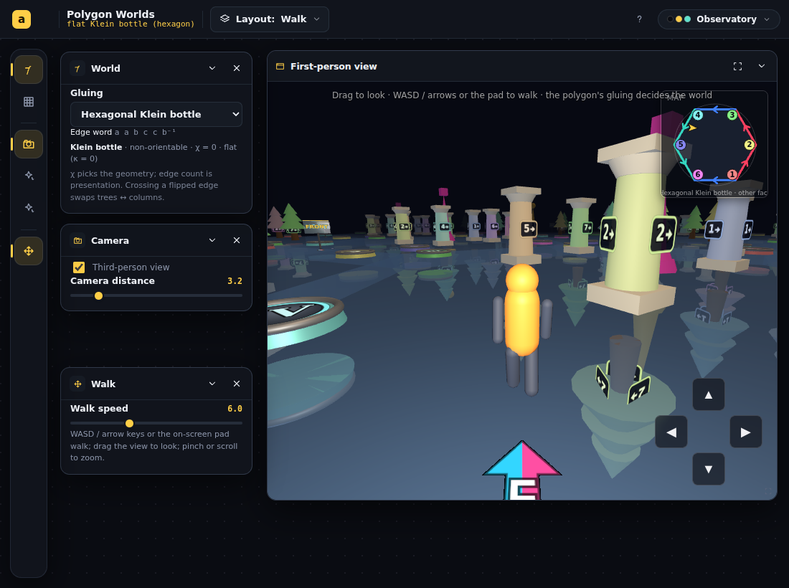
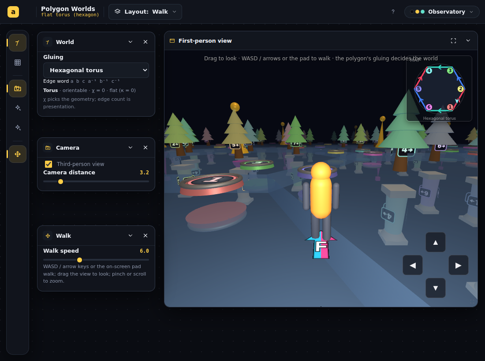
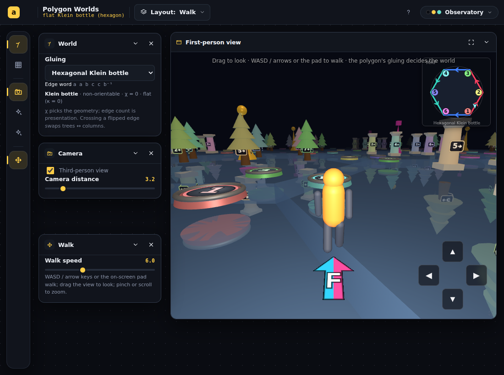
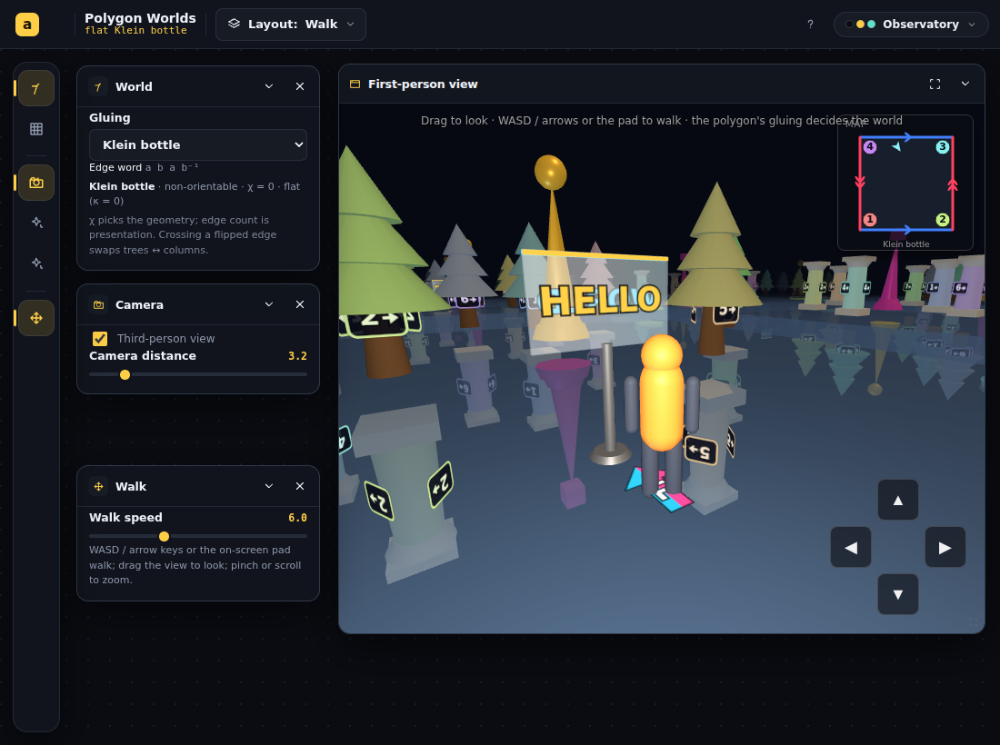
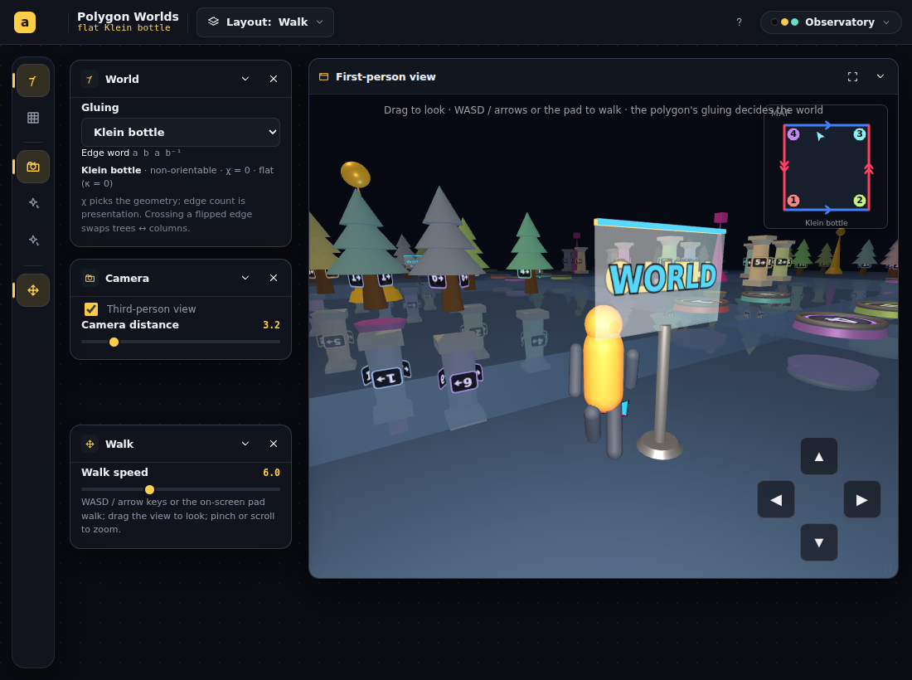
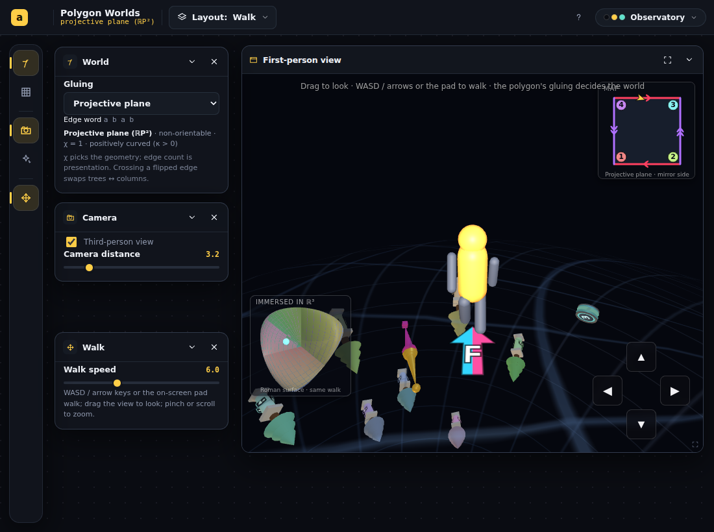
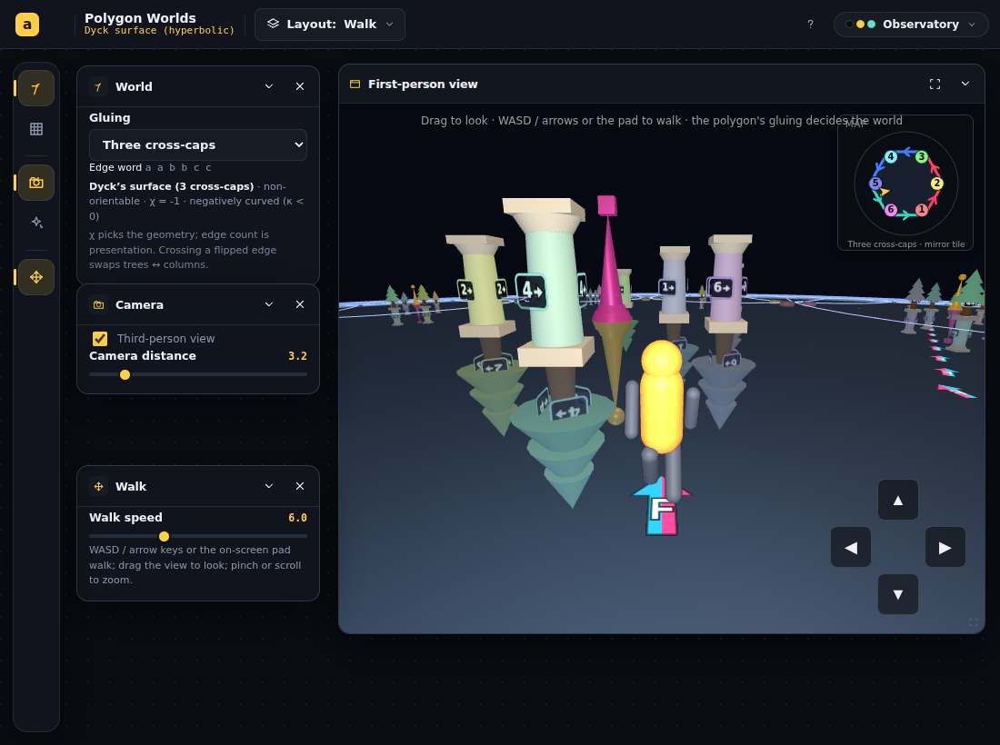

# Polygon Worlds — sign-through-the-floor orientation question + three-hats review

## Session purpose

Settle the question: when a sign is viewed *through the floor* in Polygon
Worlds, should it appear rotated by 180° or reflected? The user suspects
residual orientation issues in how chirality is expressed in the app. Then
apply the three-hats review to the Polygon Worlds application as a whole.

## Previous session

First tracked session on this branch. The latest handoff overall is directly
relevant: [2026-06-09-S06 — ink-on-the-sheet trail](../../handoff/polygon-worlds-spherical-p2-qgExR/2026-06-09-S06-ink-on-the-sheet-trail.md)
(branch `claude/polygon-worlds-spherical-p2-qgExR`) — the trail was rebuilt as
"one canonical trail, no mirror flags", the Klein glide deck became a rigid
π-rotation ("transparency flip"), and the invariant was set: *backwards text
only ever appears through the glass*. Open items there: the curvature-
demonstration choice (holonomy square recommended, undecided) and a parked
camera/headlamp bug.

## Working notes

### 🟡 milestone · 06-11 — Hexagonal worlds verified: all 8 worlds green
**Why:** klein6 was the open risk — whether the linear-lattice + parity-flip
model survives the hexagonal glide (`a a b c c b⁻¹` puts the glide on
*adjacent* edges, unlike the square Klein's opposite pair).

It does: **klein6 A+B both positive** (print right-handed on both faces
across the hexagonal glide crossing), torus6 control clean, decor audits
0/3757 improper on both hexagonal worlds, and every previously-green check
stayed green. The flip side renders columns-up with upright Roman plates and
through-glass mirrored ink, exactly like the square Klein.



Residual caution for next session: the chirality probe doesn't test
glide-crossing *smoothness* (the S06 pixel-diff check was a temp script);
worth re-running that recipe on klein6 once.

### 🟢 code · 06-11 — "Trivial" n-gon worlds: hexagonal torus + hexagonal Klein bottle live
**Why:** The user's next desire: hexagon/octagon presentations of the simple
topologies (torus, Klein, sphere, ℝP²) — same world, different fundamental
polygon.

**The math settled the catalog first** (`scripts/probe-trivial-words.ts`,
committed): a smooth flat world needs *equal corner classes* (each class's
angles must sum to 2π on a regular polygon). Brute force over all hexagon
words: 48 smooth torus presentations (canonical: opposite edges
`a b c a⁻¹ b⁻¹ c⁻¹`, classes 3+3 of 120° = 360° ✓) and 288 smooth Klein
presentations (shipped: `a a b c c b⁻¹`). **No smooth flat octagon exists**
(135° ∤ 360°), so the octagon's trivial worlds are exactly the spherical pair:
ℝP² `abcdabcd` (smooth hemisphere, R=π/2, classes all 2) and the chart sphere
`aa⁻¹bb⁻¹cc⁻¹dd⁻¹`; hexagon likewise has smooth ℝP² `abcabc` + chart sphere.

**Implemented now (euclidean half):** the euclidean presenter generalized from
"the square" to "the kernel's realized polygon" — slab = extruded realized
m-gon (det+1 mapping, no baked mirror), m corner markers placed radially
(reproduces the square's ±0.41·side inset exactly at m=4), decor authored in
the inscribed square (span = 2·inradius ≡ `side` at m=4 — square worlds
pixel-identical), chart() picks the Dirichlet representative as a *cell* (so
flip parity rides the right rep) and returns circumcircle units for the n-gon
mini-map; `polygonSpec` made flat-aware (rhoV=1 vs tanh(R/2)). New worlds
`torus6`, `klein6` in worldSpec; guard extended to 8 worlds.





**Deferred to next session (spherical half):** hex/oct ℝP² (`abcabc`,
`abcdabcd` — smooth hemispheres whose equator is divided into 2n antipodally
identified arcs; generalize `sq2hemi`→`ngon2hemi` + corner count) and the
hex/oct chart spheres (generalize `fullDir`; the kernel already flags
`chart=true`). The spherical presenter's square charts (`squareMap.ts`
`rp2Square`/`sq2hemi`, `CHART_CORNERS`) are the seam.

### 🟡 milestone · 06-11 — Sign feature verified: six worlds green with a sign planted in each
**Why:** Same guard, now with sign instances inside the audited population.

All checks pass; the audited mesh counts prove coverage — torus/klein
3282→3457 (+175 = 25 cells × 7 sign meshes), rp2 269→283 (+14 = main + the
antipodal twin), crosscap3 2281→2393 and genus2 2473→2536 (+112/+63 ≈ visible
tiles × 7). Every sign instance in every world is placed by a proper
transform; the rp2 ink twin still hangs below the glass (29.880 < 30.000);
every trail probe reads right-handed on both faces.

### 🟢 code · 06-11 — "Plant a sign": user-authored two-sided glass plaque, all three presenters
**Why:** The user is still befuddled by vision through the floor and asked for
an instrument beyond the trail: a sign with *their own* text, different on the
front and back — ground truth they authored themselves.

**Design (one law, three covers).** The sign is player-laid content exactly
like an ink stamp — its placement is pulled back through the whole current
render transform — but realized as a **rigid (det>0) object**: the deck's
orientation reversal expresses itself only as *which face of the sheet the
sign hangs from*, and mirror-reading happens only physically, through the
glass (the two ink planes are DoubleSide on a transparent plaque; the back
ink is *rotated* π, never mirror-scaled). Front ink amber, back ink cyan, so
the reader always knows which ink they're reading even when it's backwards.

- **`sign.ts`** (new; sub-agent): `makeSignBuilder(front, back)` — shared
  textures/materials, auto-shrinking canvas text, glass plaque + hue strips.
- **Euclidean**: sheet-coordinate pose `{sx, sz, phi, face}`; per-cell local
  matrix premultiplied by the transparency flip when planted from the other
  face (so the flipped cell under the player renders it exactly upright at
  plant time); one instance per cell rides the cells' genuine transforms.
- **Spherical**: rigid frame on the shell; on ℝP² a twin instance through the
  genuine face-swapping deck (tangent vectors negate, radial response +1 — a
  PROPER frame growing inward at the antipode, gated by the glass like the
  inner shell).
- **Hyperbolic**: stamp-like canonical triple (p, ahead, left) through h⁻¹ at
  plant time; per visible tile the triple projects through `Mtiles·γ` and the
  projected frame's handedness picks the face (det<0 image ⇒ rigid turn-over
  below the glass), conformal scale from (1−r²).
- **UI** (sub-agent): a `Sign` panel (arch `marks`) — Front/Back text inputs,
  Plant/Clear; keyboard guard for typing already existed. Bridge gains
  `plantSign`/`clearSigns`; the guard script now plants a sign in every world
  so the decor audit covers its instances (one correction to the sub-agent's
  work: it had tagged the ink planes `userData.ink`, which would *exempt*
  them from the audit — signs are never legitimately mirrored, so they must
  be guarded, not exempt).
- **EXPLAINER**: the Through-the-glass section now opens with the sign.
- **`scripts/sign-shots.mjs`** (new): headless front/back/flip-side captures.





### 🟡 milestone · 00:20 — Prose pass landed; final build green; session deliverables complete
**Why:** Last step of the adjudicated plan (§4.4); closes the session's
implementation scope.

A sub-agent applied the language corrections while the green run executed:
EXPLAINER gained the **"Through the glass: backwards, or just upside-down?"**
section (the user's headline question, answered in the app's own vocabulary,
with the torus under-glass Roman numerals as the control experiment); the two
false "mirror-reversed on glide tiles" claims were corrected to the
other-face-upright / reversed-only-through-glass truth; "mirror side/tile"
labels became **"other face"**; the one-line law of the app now lives in
`inkTrail.ts`'s header; stale comments fixed (`euclidean.ts` Cell matrix,
`engineTypes.ts`, `squareMap.ts`); **`otherSide.ts` deleted** (zero
importers); American spellings normalized in `decor.ts`/EXPLAINER.

`npm run build` ✅ over everything. Not done (deliberately, per the
adjudication): hyperbolic decor azimuth equivariance (polish; candidate
future curvature demo via the vertex-plate holonomy ring); British spellings
outside the mandated files; the parked S05 camera/headlamp bug.

### 🟡 milestone · 23:55 — GREEN: all six worlds pass every check
**Why:** The fixes are verified by the same extended guard that failed before
them.

```
torus      A ✅ · decor 0/3282 ✅
klein      A+B ✅ · decor 0/3282 ✅
crosscap3  A+B ✅ · decor 0/2281 ✅   (was 1136 improper)
rp2        A+B ✅ · decor 0/269 ✅ · twin mirrorR=29.880 < shellR=30.000 ✅   (was 30.120)
sphere     A ✅ · decor 0/138 ✅
genus2     A ✅ · decor 0/2473 ✅   (was 1232 improper)
```

The twin radius is exactly R−LIFT — mirror ink hangs under the glass, above
the inner decor shell. Flip-side captures from the green run:





### 🟢 code · 23:35 — RED confirmed exactly as predicted; both geometry fixes applied; green run + prose pass in flight
**Why:** The guard must fail for the right reasons before the fixes count.

**Red run** (all six worlds, headless): crosscap3 decor **1136/2281 improper** ❌,
genus2 decor **1232/2473 improper** ❌ (the baked `scale(sc,−sc,sc)` under-floor
mirrors), rp2 twin **mirrorR=30.120 vs shellR=30.000** ❌ (−Id floats mirror ink
in open air at the walking radius, R+LIFT with LIFT=0.12). Every trail A/B
probe and the torus/klein/sphere controls green — no collateral findings.

**Fixes applied:**

1. **Spherical twin** (`presenters/spherical.ts`): the twin now renders through
   the genuine face-swapping deck — `twinM4 · scale(s)` with
   `s = (R−INK_LIFT)/(R+INK_LIFT)` (`INK_LIFT` newly exported from
   `inkTrail.ts`), recomputed on `setRadius`. Mirror ink lands at R−LIFT,
   under the glass, above the inner decor shell (R·0.985).
2. **Hyperbolic under-floor decor** (`presenters/hyperbolic.ts` `placeDecor`):
   `scale(sc,−sc,sc)` → rigid turn-over (`rotation.set(π,0,0)` + uniform
   scale), for landmark decor and corner markers; rotation reset explicitly on
   the above branch because pooled groups swap roles between frames.

Green verification run is walking the six worlds now. Meanwhile a sub-agent is
doing the adjudicated prose pass (EXPLAINER "Through the glass" section, the
two false "mirror-reversed on glide tiles" claims, "mirror side" → "other
face" labels, stale comments, `otherSide.ts` deletion, American spellings) —
prose only, barred from building while the verification run uses `dist/`.

### 🟢 code · 23:05 — Guard infrastructure landed; red run in flight
**Why:** User approved implementation in the synthesis order; step 1 is
"guards first, red first" — the new assertions must fail on today's code
before any geometry changes.

Added (all fix-neutral, so the red run is honest):

- **`__poly.auditDecor()`** (PolygonWorlds.tsx): traverses the visible scene
  and asserts the decor law — every rendered non-ink mesh sits under a
  **proper** (det>0) world transform. Ink meshes are tagged
  `userData.ink = true` in all three presenters (ink may legitimately render
  through det<0).
- **`__poly.auditInk()`** (spherical presenter → CoverModel/PolygonEngine
  optional method): the freshest print's mirror image AS RENDERED through the
  twin's actual matrix, vs the shell radius — left-handed ink must hang
  strictly **below** the glass. Uses a new `InkTrail.slotCenter(i, m)`
  diagnostic.
- **`scripts/trail-chirality.mjs`**: two new orientable controls (sphere,
  genus2 — the χ<0 below-floor decor exists there too), decor + twin audit
  lines per world, and a nonzero exit code on any failure.

Expected red: crosscap3 + genus2 decor audits (baked `scale(sc,−sc,sc)`
mirrors below the floor), rp2 twin audit (−Id keeps mirror ink at the walking
radius). Expected green: torus/klein/sphere all checks; all existing A/B
chirality probes.

### 🟡 milestone · 22:40 — Three-hats review complete; synthesis written
**Why:** All three expert reports returned; convergence analysis adjudicates
their disagreements.

Reports: [maintainer](2026-06-10-S01-expert-maintainer.md) ·
[consultant](2026-06-10-S01-expert-consultant.md) ·
[pedagogy](2026-06-10-S01-expert-pedagogy.md) ·
[synthesis](2026-06-10-S01-expert-synthesis.md).

**Unanimous:** through-the-floor = reflected, always; hyperbolic below-floor
`scale(sc,−sc,sc)` is a real baked-mirror bug; `otherSide.ts` is dead + stale;
the chirality guard sees none of it; prose has drifted (the "mirror-reversed
on glide tiles" claims are false).

**Adjudicated against the lead's brief (pedagogy's refutations win, verified
by direct computation):** the ℝP² face-swapping shell deck is *proper* in 3D
(dF = 2p̂p̂ᵀ − I, det +1), so far-side decor is chirally correct as rendered —
the real bug is the **ink twin using −Id (the untwisted bundle)**, which
floats mirror footprints on the walking face; fix = twin → −s·Id,
s = (R−LIFT)/(R+LIFT). Likewise hyperbolic above-floor det<0 decor is correct
un-mirrored (Klein-approved semantics); the prose is what must change. Two of
the lead's candidate fixes would have re-broken S06-repaired behavior.

**Recommended order:** guards red-first → ℝP² twin fix → hyperbolic rigid
turn-over → prose pass (incl. "Through the glass" explainer paragraph) →
optional azimuth polish.

### 🔵 finding · 21:55 — Pre-review investigation: the answer is "reflected," and three residual suspects found
**Why:** Before dispatching the three hats, establish the geometry and locate the
code that expresses it, so the experts review concrete claims instead of vibes.

**The math.** A sign viewed through the floor is **reflected (mirror-reversed),
never merely rotated 180°.** The back view of any flat glyph composes its front
appearance with an orientation-reversing map of the visual plane; which mirror
*axis* you perceive depends on how you got underneath (turning around reads as a
left–right flip, pitching over as a top–bottom flip — the two differ by an
in-plane π-rotation, the source of the usual confusion), but the chirality
reversal is viewpoint-invariant. "Rotated by 180°" is correct only in a
different sense: the rigid **transparency flip** (π about an in-plane axis) that
carries a physical plaque from one face to the other is a det+1 motion of
3-space whose restriction to the sheet is an orientation-reversing (glide)
isometry — *in 3D it's a rotation; on the 2D sheet it's a reflection.* Third
distinction: glass only mirrors ink **on** the sheet; a 3D object *behind*
glass is seen as it is, and a vertical plaque read from its back is reflected
because back-views of flat glyphs always are — not because of the glass.

**Residual suspects in the code** (to be verified/refuted by the review):

1. **`presenters/hyperbolic.ts` `placeDecor` (≈ lines 286–309)** — above-floor
   decor is placed by **position + uniform scale only**: the in-plane mirror of
   a det<0 tile (and even the rotation of a det>0 tile) is never applied to the
   decor's orientation, though the header comment (line 37) claims "decals
   mirror-reversed." This is the same class of bug as the old Klein
   `scaleY(−1)` deck. Below-floor decor uses `scale.set(sc, -sc, sc)` — the
   **baked mirror S06 banned** in the euclidean presenter ("never
   `scale.y = −1`").
2. **`presenters/spherical.ts` `buildMarkers` (≈ lines 117–146)** — on ℝP² the
   antipodal decor copies are placed by **proper** shortest-arc rotations
   (`setFromUnitVectors`), not through the genuine det<0 deck (`twinM4`) that
   the ink-trail twin uses — so far-side chiral badges/Roman plates likely read
   **un-mirrored** beside genuinely mirrored footprints.
3. **`otherSide.ts`** — dead module (no importers in PolygonWorlds), whose doc
   comment still describes the abandoned `scale(1,-1,-1)` per-cell mirror
   story, contradicting the current rigid-flip invariant.

The euclidean presenter itself appears to honor the S06 invariant (rigid
π-rotation deck; sheet-coordinate ink; "backwards text only ever appears
through the glass").

### 🟣 decision · 21:58 — Dispatching the three-hats review
**Why:** The user asked for the full three-lens review of Polygon Worlds with
the orientation question as the focus; the suspects above go to the experts as
claims to check, not conclusions.

### 🟡 milestone · 21:37 — Session opened; orienting
**Why:** /start-session — read the S06 ink-trail handoff, created this report.

The session focus continues the S06 chirality story but probes a specific
worry: the appearance of a sign seen through the floor (rotated π vs.
reflected) and whether the app still expresses orientation incorrectly
anywhere. Plan: first analyze the geometry question, inspect the relevant
transforms (`presenters/euclidean.ts`, `decor.ts`), then run `/three-hats`
on the Polygon Worlds app.
