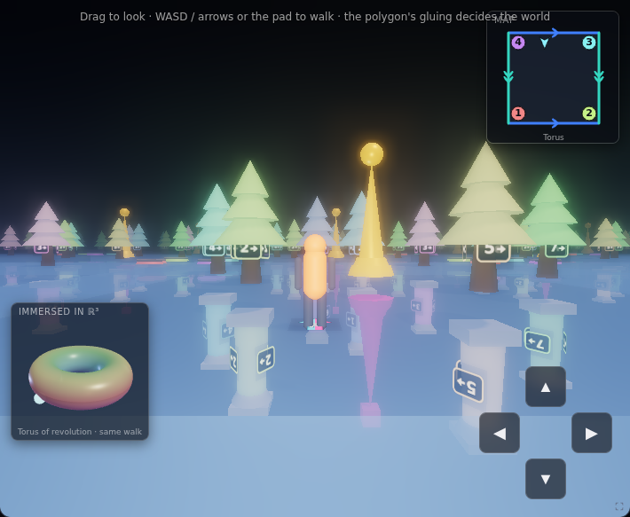
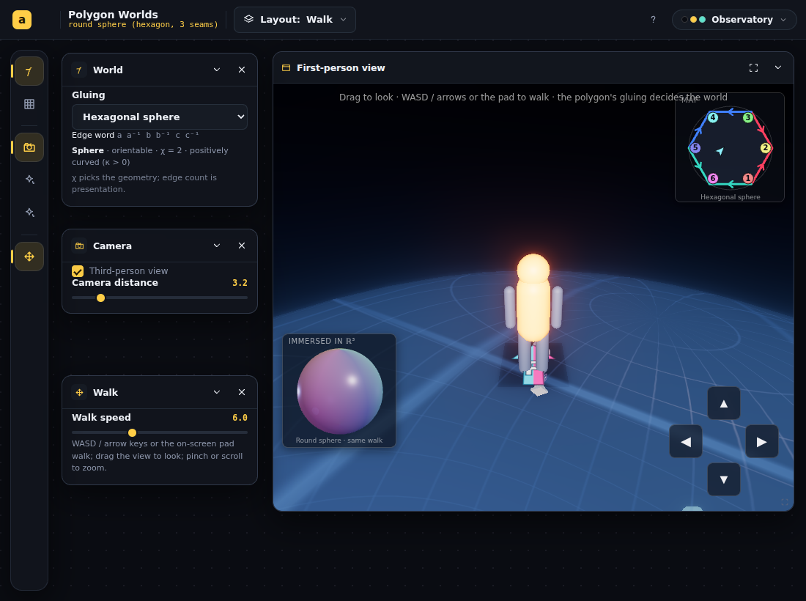
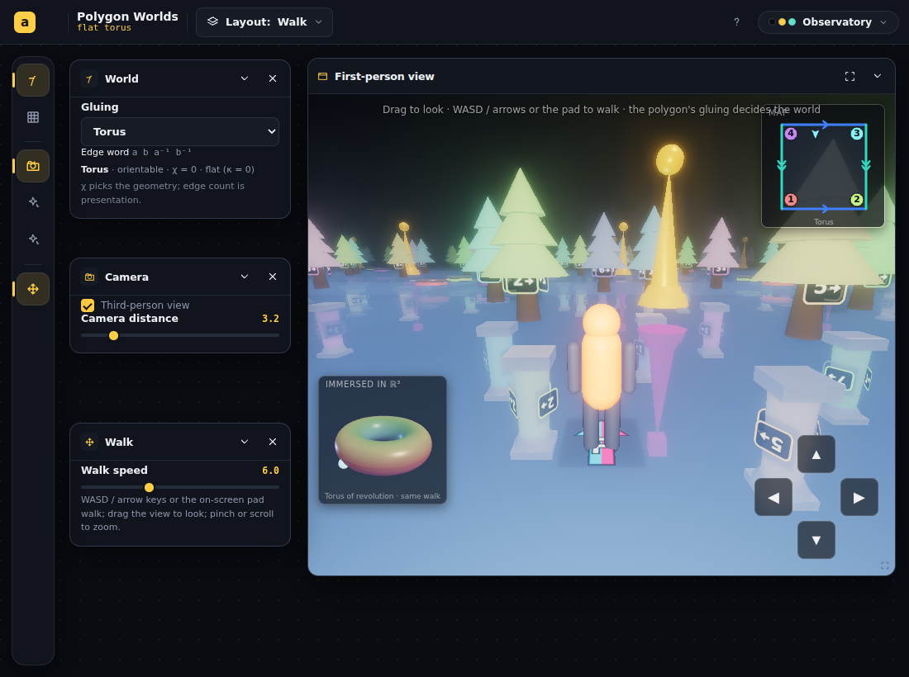
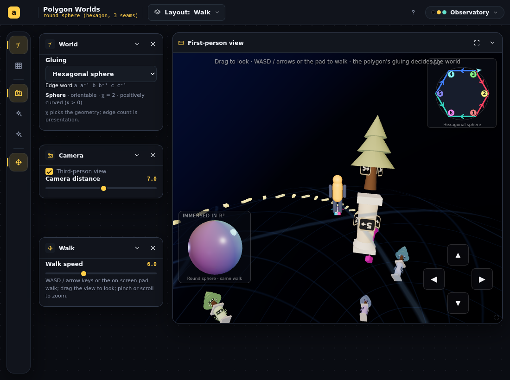
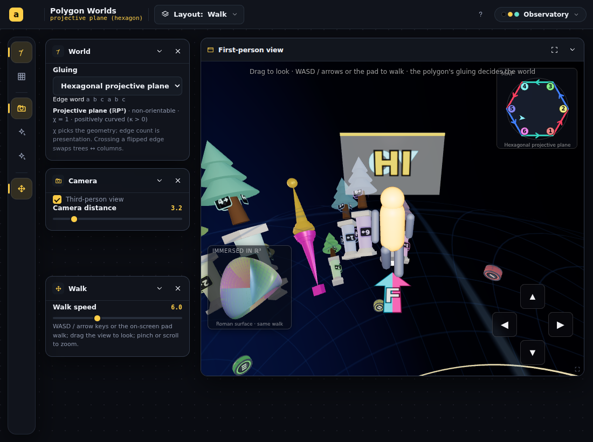

# Continue the Polygon Worlds walk

## Session purpose

Continue work on the polygon walk (`src/animations/PolygonWorlds/`). Specific
target to be set with the user after reviewing the standing roadmap.

## Previous session

First tracked session on this branch (forked from current `main`, tip
`0d2cb60`). Continuity picks up from the most recent polygon handoff:
[`polygon-sign-orientation-50exno/2026-06-10-S01`](../../handoff/polygon-sign-orientation-50exno/2026-06-10-S01-sign-orientation-review.md)
— orientation fixed end-to-end, two-sided glass **sign** instrument added,
euclidean presenter generalized to arbitrary realized polygons (+hexagonal
torus/Klein worlds), and a four-part improvement roadmap left open. That work
is merged to `main`. Build: passed; follow-up value: MEDIUM.

## Working notes

<!-- Newest entry first. -->

### 🟢 layout · 13:40 — World picker moved to the top bar (user request)
User asked to improve the layout/controls — "should be able to change world from
the top bar." Moved the world (gluing) selector out of the World panel into the
top bar via the framework's `topExtra` slot (the idiom for "the one selector you
should never open a panel to reach" — Complex Particles' function picker). It's a
native `am-bar-select` grouped by the geometry χ forces (Flat · χ=0 / Sphere ·
χ>0 / Hyperbolic · χ<0). The World panel is now a pure topology readout (edge
word + name/χ/orientability/curvature); `titlePanel="world"` makes the top-bar
title double as a shortcut to it. Verified: selector renders in the top bar with
the three optgroups; switching to a world updates the subtitle + scene. Build +
lint green. (Broader layout/control polish: awaiting the user's specifics.)

### 🔵 finding · 13:10 — F audit: TopologyWalk's "baked mirror" is deliberate, not a bug
The prior handoff worried TopologyWalk "likely carries the same baked-mirror bug
class, never audited." Audited it. Conclusion: **it uses det<0 transforms on
content on purpose, and it is carefully built — not an accidental bug.**

Evidence:
- `footprints.ts` glyph is **intentionally chiral** (an "F" + cyan-left/
  magenta-right halves); its docstring states the design: *through an
  orientation-reversing transform (a mirrored Klein cell, the antipodal map, the
  Möbius floor) the F comes back reversed and the colors swap — making the flip
  impossible to miss.* The reversed F is TopologyWalk's signature teaching cue.
- `flatEngine.ts:463` `S.makeScale(1, 1, sz)` with `sz = −1` on every other
  Klein column ⇒ **det<0 cell transform on the trail/decor** (the deliberate
  mirror). Separately the glued under-face uses `makeScale(1,−1,−1)` (det **+1**,
  proper) — correct, with an explicit z-mirror-for-chiral-marks comment.
- `sphericalEngine.ts:266` `antipode.scale.set(-1,-1,-1)` ⇒ det<0 point
  reflection on the ℝP² antipode decor (intended "twin reads mirrored").
- `flatEngine.ts:426` `sz0` **bakes in the home cell's mirror parity** so your
  *current* cell reads right — i.e. the walking face is parity-corrected; only
  *other* cells show the reversed F.

**This contradicts the PolygonWorlds "one-line law"** (deck transforms proper in
3D; walking-face never reversed; mirror only through the glass) — but the two
apps embody two *different, internally-consistent pedagogies* for the same math:
TopologyWalk makes the flip **visible** (reversed F on mirrored cells);
PolygonWorlds **hides** it (you carry your frame; the mirror only appears on the
far side through glass). TopologyWalk's per-cell det<0 + home-parity correction
is deliberate and careful, not a naive `scale.y=-1` oversight.

**Recommendation: no hygiene fix.** Migrating TopologyWalk to the one-line law
would delete its core "spot the flip" device — a product/pedagogy decision for
the user, not an autonomous cleanup, and it would need its own adapted chirality
guard first. Reframes handoff item F: confirmed-at-code-level, but *deliberate*,
so closed as "no action without product direction."

### 🟢 polish · 12:30 — Roadmap E/F set: American spellings + settings persistence
Picked up the fidelity/hygiene set after the beauty detour.

- **F (spellings):** swept the module's code comments to American English per
  CLAUDE.md (color/center/normalize/neighbor/behavior/analyze/labeled) — ~42
  occurrences across presenters/lib/maps, including a few introduced earlier
  this session. Comment-only; `.md` files were already clean. Committed.
- **E3 (sign-text persistence):** the broader finding was that PolygonWorlds
  persisted **nothing** — every control was plain `useState`. Resolved
  consistently: the genuine *settings* now use `usePersistentState`
  (`polygon-worlds:<field>`) — moveSpeed, floorOpacity, squareSize,
  floorThickness, planetRadius, landmarkCount, arrangement, signFront, signBack
  — while navigation/view stay session-only (selected world for predictable
  landing; third-person + camera distance per the "don't persist camera"
  convention). Verified: slider change → localStorage → reload reads it back.

Build + lint green throughout.

**E1 (hyperbolic decor azimuth equivariance) — assessed, deferred to pair with
demo D.** The signs already implement the equivariant pattern (project a
position+forward+left triple → proper basis) and the hyperbolic decor is
det-audited by the guard (genus2: 0/2536 improper), so chirality would be safe.
But: (1) the current decor is largely **rotationally symmetric** — trees are
cone-stacks, so per-tile azimuth is essentially invisible on them; the only
beneficiaries are number decals / square column bases / corner plates; (2) its
real payoff is the **vertex-ring holonomy demo (D)**, where the rotation becomes
meaningful *and* visually verifiable; (3) azimuth *correctness* is unguarded
(only det>0 is) and too subtle to verify by screenshot standalone. So a
moderate basis-refactor for near-zero standalone benefit, unverifiable by eye —
deferred to land together with D.

Remaining: E1 (with D), E2 (klein6 glide smoothness pixel-diff — chirality
already shown flaky-OK; this would be a *new permanent guard* for crossing
smoothness), F-TopologyWalk audit (cross-app); features B/C/D await a pick.

### 🔴 revert · 11:55 — Bloom removed (user: "looks terrible")
User rejected the bloom outright. Reverted the render path to the direct
`renderer.render(scene, camera)`, removed the `makeSelectiveBloom` wiring, and
deleted `bloom.ts`. Build + lint green; sphere confirmed back to the clean
matte look. **Kept** (not objected to): the flat-world soft shadows and the
sun in the environment map — offered to revert those too.

### 🟢 beauty · 04:10 — Atmosphere overhaul pt.2: soft shadows (flat worlds)
Soft `PCFSoftShadowMap` shadows from the warm key, **gated to the euclidean
(flat) worlds**. Empirically: on the torus floor the decor's soft cast shadows
(plus the beacon's long shadow) clearly ground the scene; on the *spherical*
shell shadows gave neither benefit nor artifact (translucent, curved — the map
fights the glass), so they stay off there and on hyperbolic.

Robustness: cast/receive flags are set at **build time** — `markShadow()` in
`decor.ts` tags the lit (non-decal) decor meshes, the euclidean floor slab sets
`receiveShadow`, the avatar casts — so they survive the per-radius/per-thickness
**rebuilds** (verified: shadows persist after a floor-thickness change). The
first attempt (a one-time `root.traverse`) would have dropped them on rebuild;
also fixed `normalBias` (0.6 → 0.05, which had peter-panned the shadows away).
`shadowMap.enabled` tracks `cover === 'euclidean'` so switching worlds resets it.

Verified: build + lint green; chirality guard PASS (rp2 both faces, zipsphere6),
decor 0 improper across euclidean/spherical.

### 🟢 beauty · 03:40 — Atmosphere overhaul pt.1: emissive selective bloom + sun env
**Why:** user asked to "turn up the beauty" (basic decor, flat lighting, the ground
not reading as glass) and chose the atmosphere overhaul (bloom + shadows + richer
env). This is pt.1 (bloom + env); shadows next.

- **`bloom.ts`** (new): emissive-keyed **selective bloom**. Two composers — a bloom
  pass renders an *emissive-only* copy of the scene (each mesh swapped for a flat
  material showing just its `emissive`, against black) and blurs it; the final pass
  renders normally, adds the bloom, then ACES-tonemaps via `OutputPass`. Keying on
  emissive (not luminance) is essential: the first attempt (plain full-scene
  `UnrealBloomPass`) had the **90-intensity camera headlamp blow the avatar/beacon
  into a giant glare**. Emissive-keyed means the lights can be as hot as they like and
  only the seams / markers / ★ beacon / avatar (the genuine emitters) bloom.
- **Sun in the env** (`makeGradientEnv`): a warm sun disc + halo in the key-light
  direction, so glass + metals catch a moving specular highlight instead of a flat
  gradient.

Verified: build + lint green; screenshots across spherical (zipsphere6), euclidean
(torus), hyperbolic (genus2) all read richer without blowing out; chirality guard
PASS (rp2 both faces, sphere) with decor 0 improper — the per-frame emissive swap is
restored each frame, and the guards key on geometry/transforms not pixels, so the
pipeline change is safe.

### 🟢 polish · 01:40 — Square `sphere` now shows its seams too (whole family consistent)
**Why:** user audit — the square pillowcase `a a⁻¹ b b⁻¹` is the n=2 zip sphere
but drew no seams (it carries square `edges`, so the `zip` branch skipped it),
and its 4 `CHART_CORNERS` collapsed to the two poles under `fullDir` (a lat/lon
sphere, not a realized pillowcase).

Added `starSeams = !antipodal` (exactly {sphere, zipsphere6, zipsphere8}) and
gated the seams + hub/leaf corner markers on it instead of `zip`. So the square
sphere now wears its **2 stitched seams** (hub at the pole + 2 equator leaves)
with the same code, while **`zip` still gates the star/gore `chart()`** — the
square sphere keeps its square mini-map + rp2Square marker (the n-gons keep the
polygon mini-map). Switching its corners from the 4 pole-collapsed `CHART_CORNERS`
to hub+2 leaves is what makes the seams connect to real marked points.

Verified: build + lint green; guard PASS for sphere/zipsphere6/zipsphere8
(controls) **and** rp2 (both faces unaffected), decor 0 improper everywhere;
screenshot confirms the square sphere shows the stitched seam while its mini-map
stays the square diagram. EXPLAINER + docstring updated.

### 🟢 fix · 01:10 — Zip minimap marker: real star/gore chart (was misreading square coords)
**Why:** user caught a real bug — for zip worlds `chart()` fell through to the
**square** rp2Square path, but the minimap renders the hex/oct disk via
`drawPolygonMap`. So `[-1,1]²` square coords were misread as polygon-disk
coords: near diagonal-equator directions the marker landed **outside** the
polygon with a heading unrelated to the displayed gluing.

Added a `zip` branch to `chart()` — a continuous **star/gore chart** into the
2n-gon: colatitude-from-hub → radius, longitude → gore sector, barycentric into
each `(center, V_A, V_B)` triangle (so it's *always* inside by construction).
South pole → center, each leaf (odd vertex 2k+1, sphere longitude 2πk/n) →
**exactly** its vertex, each gore → the hub (even) vertex it surrounds, a seam →
the center→leaf diagonal. (There is no isometric map from a round sphere to a
*regular* 2n-gon — the true unfolding of this star is an n-spiked shape — so the
polygon stays the abstract gluing diagram; this chart respects its combinatorics
and keeps the marker honest.)

Verified: build + lint green; standalone math check — south pole→center, each
leaf→its vertex (err 0.0000), **0/1600 sampled points outside** the polygon
(hex & oct), the diagonal-equator case now inside; runtime while walking
**0/24 marker samples outside**; minimap screenshot shows the marker inside the
hexagon with a sensible heading.

### 🟢 tweak · 00:45 — Zip seams restyled as stitches (user request)
Replaced each solid seam tube with a row of short **stitch bars** crossing the
geodesic, alternately slanted for a hand-sewn look — sutures closing the cut,
thematically apt for *zip* words. One `InstancedMesh` per world (unit box,
per-instance matrices; density tracks arc length so it reads the same at any
radius). Build + lint green; zip guard re-run still PASS, **decor 0 improper**
(the instanced stitches present one proper world matrix, so the audit is
unaffected). `spherical.ts` docstring + EXPLAINER updated tube→stitch; the
report asset now shows the stitched seam.

### 🟢 milestone · 00:30 — Hardened the chirality guard's flip-side read; full 12-world run all green
**Why:** the klein6 "failure" earlier was a flaky false-fail of the guard — the
safety net that protects every orientation world (including the four I added).
Rather than guess into a large new roadmap feature (B/C/D all need a steer),
fixing the net compounds the whole session's work.

**Root cause:** trail prints lay only every ~0.12–1.6 units, so the *freshest*
print right after crossing to the flipped face can still be the **pre-crossing**
stamp (laid on face A) — which reads mirrored in the flipped frame → a false
`B=−axis`. The old gate ("sign stable for 3 reads") didn't prove the print was
laid on the flip side, so a stale stamp could be accepted.

**Fix (no engine plumbing):** exposed the existing `clearTrail` on the
`__poly` debug bridge; the guard now **wipes the trail on crossing** and accepts
the **first stamp laid while still flipped** (guaranteed a genuine flip-side
print), re-confirming the face hasn't changed at read time.

**Verification:** `npm run build` ✓, `npm run lint` ✓ (0 errors). Full guard,
all **12 worlds green** — every flip-side world (klein, crosscap3, rp2, klein6,
rp2hex, rp2oct) PASS on BOTH faces; every orientable control (torus, sphere,
genus2, torus6, zipsphere6, zipsphere8) PASS; **all decor 0 improper**; twin
mirror-ink below the glass on all three twin worlds. **klein6 now passes
reliably** — the flake is gone.

### 🟡 milestone · 23:55 — A2 implemented + verified: hex/oct zip spheres with visible seams
**Why:** the star-tree insight made A2 tractable — the walk/decor reuse the
round-sphere path, so the new code is just the seams + corner topology.

Added `zipsphere6` (`a a⁻¹ b b⁻¹ c c⁻¹`) and `zipsphere8`
(`a a⁻¹ b b⁻¹ c c⁻¹ d d⁻¹`). In `spherical.ts`, a `zip = !antipodal &&
!spec.edges` branch: places **1 hub marker (north pole) + n leaf markers
(equator)** and draws the **n seam arcs** (glowing tubes, geodesic hub→leaf,
lifted just proud of the shell). Decor (`fullDir`), walk (kernel Frame),
`chart()` (rp2Square marker), and the word-driven 2n-gon minimap all reused
unchanged. Immersions: zip ids → the round-sphere immersion. EXPLAINER gains a
"Zip spheres" bullet.

Verification:
- `npm run build` ✓, `npm run lint` ✓ (0 errors).
- Scene probe confirmed the seams render (`TubeGeometry: 3` hex, `4` oct).
- Visual: the seams read as bright arcs from the hub across the shell (the
  shipped brighter/thicker tubes); minimap shows the hexagon/octagon; the
  embedding inset shows the round sphere.
- Focused chirality guard (orientable A-control): `zipsphere6`/`zipsphere8`
  both PASS — head print reads correct, **decor 0 improper**.

> [!NOTE]
> The seam screenshot used a temporary north-pole spawn purely for framing
> (the shipped spawn is far from the hub, which is why the seams were hard to
> catch on camera); the seam geometry shown is the shipped code. Open polish:
> the 2n-gon minimap marker stays the approximate rp2Square one (matches the
> existing round sphere's bar) — a faithful zip-chart marker is future work,
> as is optionally giving the existing square `sphere` the same visible seams.

### 🔵 finding · 23:20 — Zip-sphere structure is a star tree; klein6 fails the guard (pre-existing, not mine)
**Why:** kernel probe of the zip words + the full 10-world guard, before
building A2.

**Zip structure** (`a a⁻¹ b b⁻¹ c c⁻¹ …`, n pairs, m=2n): corner classes are
ONE hub = all even vertices {0,2,4,…} (size n) + n leaves = the odd vertices
(size 1 each). The cut-tree is the **star K_{1,n}** — a hub with n spokes (one
per `x x⁻¹` pair). Orientable (χ=2), `chart:true`. Consequence: the **walk and
decor reuse the round-sphere machinery** (kernel Frame + `fullDir`); the new
work is just drawing the n seam arcs + the hub/leaf corner topology + the
minimap chart. Far smaller than a bespoke unfolding.

**Full guard (10 worlds):** my new worlds (rp2hex/rp2oct) PASS; the touched
square worlds (rp2/sphere) PASS; all decor proper everywhere. One world
flagged `klein6` `B=cyan@−axis` — but **two clean re-runs of klein6 alone both
PASS** (`B=cyan@+axis`), so this was a **flaky false-positive** of the guard's
timing-sensitive flip-side detection (it caught a transitional, pre-crossing
print that one time), not a real bug. klein6 chirality is correct. (Worth
noting as a guard-robustness item: the B-side dwell could be hardened — it is
the fragility the prior handoff's self-reflection #2 hinted at.)

### 🟣 decision · 23:05 — Next: A2 (hex/oct zip spheres), user-chosen
**Why:** asked the user for direction at the post-A1 fork; they chose A2 — the
"complete the set" option (zip-sphere n-gon worlds), the larger design-heavy
item. Starting with a kernel probe of the exact cut-tree structure before
designing the chart.

### 🟡 milestone · 22:50 — A1 verified green end-to-end; committed
**Why:** the focused chirality guard is the decisive correctness test for a
non-orientable walker world.

Focused `trail-chirality` run on the ℝP² family (`rp2`, `rp2hex`, `rp2oct`):
**all three PASS** — `A=cyan@+axis B=cyan@+axis` (a fresh print reads correct
on BOTH faces across the seam), `decor 0/N improper`, mirror ink at
`29.880 < 30.000` (below the glass). The new hex/oct worlds reproduce the
proven square ℝP²'s behavior exactly. Flipped-face render confirms the
footprint, the hexagon minimap (amber/flipped marker), and the Roman-surface
embedding inset all read correctly. EXPLAINER gains two rows (`abcabc`,
`abcdabcd` → projective plane again). Committing.

> [!NOTE]
> A1 done. Remaining roadmap-A item is **A2 (zip spheres)** — a bigger lift
> (cut-tree charts); the hex/oct zip-sphere words realize as `chart:true`
> (lon/lat fullDir), so they would *load* on the existing sphere path but
> without word-faithful seams. Deferred as a separate, scoped effort.

### 🟢 code · 22:35 — A1 implemented; build/lint green; smoke test passes
**Why:** finished the edits and ran the fast headless smoke + the focused
chirality guard.

Changes (all on `claude/polygon-walk-continue-4tyht3`):
- `squareMap.ts`: + `ngon2hemi` / `hemi2ngon` / `ngonBoundaryRadius` — the
  polygon-gauge chart (boundary→equator, center→pole; reduces to `sq2hemi`
  structure).
- `spherical.ts`: `nGon = antipodal && !spec.edges`; `ngonDir`,
  `cornerPlacements()` (m vertices at their azimuths), and a `chart()`
  branch using `hemi2ngon`. Square ℝP² / round sphere paths untouched.
- `worldSpec.ts`: + `rp2hex`, `rp2oct`.
- `PolygonWorlds.tsx`: `polygonSpec` rhoV=1 for spherical (was Poincaré tanh).
- `immersions.ts`: + `rp2hex`/`rp2oct` → Roman surface (marker rides true dir).
- `scripts/trail-chirality.mjs`: + the two worlds to the guard.

`npm run build` ✓, `npm run lint` ✓ (0 errors). Headless smoke (walk + plant a
sign on rp2/rp2hex/rp2oct): **decor 0/N improper** and **mirror ink below the
glass** on all three; minimap renders the hexagon/octagon with numbered
corner chips; render looks correct (see assets). Awaiting the focused A/B
chirality guard (does a fresh print read right on BOTH faces across the seam).

### 🟢 code · 22:05 — Implementing roadmap A1: smooth hex/oct ℝP² worlds
**Why:** the user said "proceed as far as you can"; A1 is the handoff's
recommended next target, a complete shippable unit, and lowest-risk.

Investigation settled the design. Kernel probes confirm the new words realize
as **smooth hemispheres** (R=π/2, `chart:false`) with deck group `{Id, −Id}`
(antipodal, det<0) — *identical* deck structure to the square ℝP², so the
twin/ink/sign/seam logic is word-agnostic. The only square-specific pieces are
(1) the chart map `sq2hemi`, (2) the 4 `CHART_CORNERS`, (3) `chart()`'s
`rp2Square` player marker.

Plan (isolates risk — the proven square path stays untouched, branch on
`nGon = !spec.edges`, mirroring the minimap's existing `edges ? square : polygon`
split):
- `worldSpec.ts`: +`rp2hex` (`a b c a b c`), +`rp2oct` (`a b c d a b c d`).
- `squareMap.ts`: + `ngon2hemi` / `hemi2ngon` (a polygon-gauge chart that
  reduces to `sq2hemi` semantics — boundary→equator, center→pole).
- `spherical.ts`: branch `dirFor`, corner markers (4→m at vertex azimuths),
  and `chart()` on `nGon`.
- `PolygonWorlds.tsx`: `polygonSpec` rhoV=1 for spherical (was tanh — Poincaré).
- `immersions.ts`: register the new ids → the Roman-surface ℝP² immersion
  (marker rides true `dir`, so it works for any ℝP² word).
- Guard: extend `scripts/trail-chirality.mjs` world list; build + lint.

### 🟡 milestone · 19:31 — Session opened, oriented on polygon roadmap
**Why:** /start-session — read the latest polygon handoff and orient before
picking a target.

New branch with no prior handoff; pulled context from the
`polygon-sign-orientation-50exno` S01 handoff (the most recent of the polygon
lineage). Confirmed PolygonWorlds is on `main` with the sign instrument,
hexagonal worlds, and orientation guards in place. Standing roadmap items
(A–F) summarized for the user; awaiting direction on which to pursue.
