# Solid Worlds review + AI-collaboration attribution policy

## Session purpose

Review the uploaded `threemanifoldsplan.md` ("Solid Worlds" — walking closed
3-manifolds as the dimensional successor to Polygon Worlds), discuss the design,
and — the now-directed deliverable — **figure out the best way to add an
AI-collaboration attribution policy to the project workflow** and write it.

## Previous session

First tracked session on this branch. Nearest relevant prior work:
[`future-apps-scoping` S01](../future-apps-scoping/2026-06-10-S01-future-app-scoping.md)
(scoped the next wave of apps in `docs/FUTURE_APPS.md`; it already flagged
*"licensing/attribution before any code lands"* as an open item — the same theme
this session is generalizing into a standing policy). Latest handoff overall is
`gallery-app-ordering` (2026-06-15), unrelated to this focus.

## Working notes

### 🟢 code · 12:24 — Solid Worlds: face labels + corner markers (both toggles)
**Why:** Dan picked both, as options that can be turned off.

- **Face labels:** per-face axis letter (X/Y/Z) with a glyph + color for what its
  pairing does (↔ straight · ↻ turn · ⇋ flip), facing inward. One InstancedMesh
  per face (6), instanced over the cover. `faceLabelTexture` in textures.ts.
- **Corner markers:** at each of the 8 cube corners, **just inside the room**, a
  cluster of **4 colored balls** in a chiral tetrahedron (R·G·B·white). A 4-color
  tetrad has no mirror symmetry, so crossing a wall reveals the gluing's rotation
  *or* reflection straight off how the colors land. One InstancedMesh, N×8×4.
- Both default **off** (clean default), toggled by **Face labels** / **Corner
  markers** checkboxes; persisted.

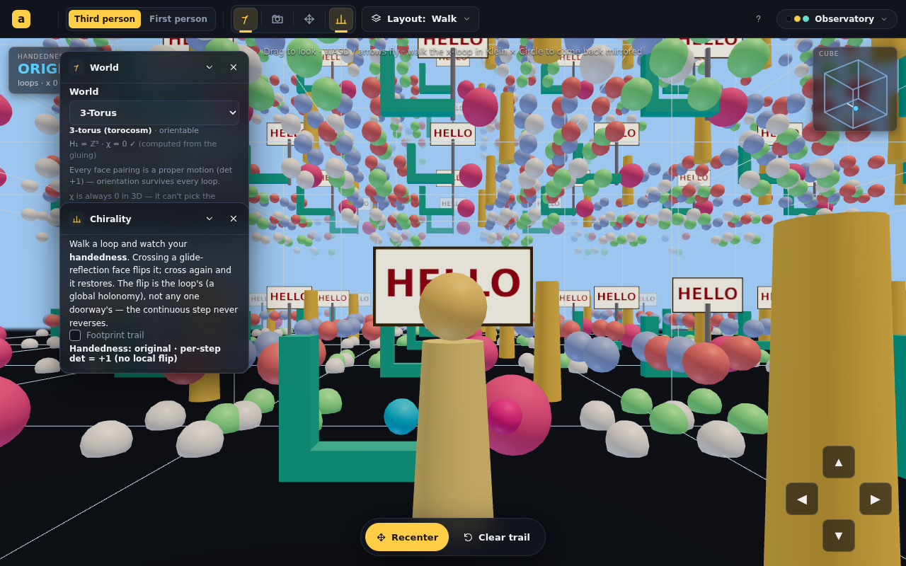

### 🟢 code · 12:19 — Solid Worlds: the "ground floor" for walk/drive
**Why:** Dan's design call — grounded modes get a solid floor; Fly stays free.
Refined: the floor is about *how you pass through space*, not the topology —
the vertical y-copies still exist and you **look up** at the rooms stacked above;
you just can't **pass through** the floor by walking (vertical travel is the
plane's job). Since the y-gluing here doesn't interact with x/z, the vertical
direction is "look at, don't traverse."

- **Grounded cover** (walk/drive): the BFS keeps the start level + every room
  **above** it, but drops cells **below** (`c.y < −0.4·size`), and a single big
  opaque **ground slab** sits just under the start level. So you look down and
  see a floor, up and see the hall of mirrors climbing away.
- **Grounded movement**: horizontal only — the up-coordinate is locked to floor
  eye-height each frame (in the *carried* frame, so the amphicosm's flip is
  handled), so you never sink through the floor.
- **Fly** rebuilds the **full** cover (rooms below included) for free 6DOF — the
  engine rebuilds the cover whenever you switch between grounded and fly.

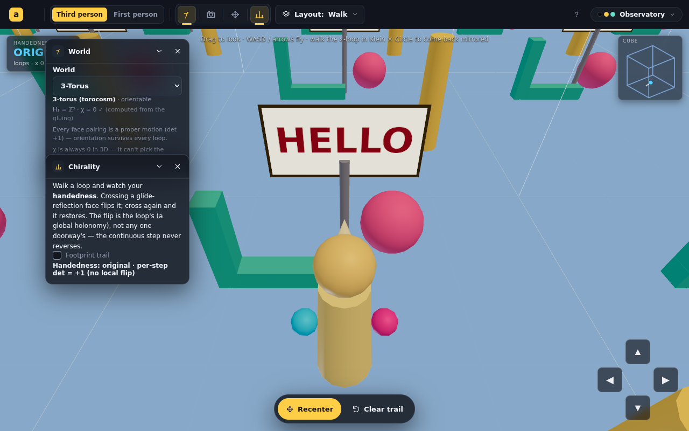

> [!NOTE]
> Still to build (Dan approved): **face labels** (per-face gluing, pairing-colored)
> and **corner markers**, both as toggles.

### 🟢 code · 12:01 — Solid Worlds tuning: furniture-size decoupled, fog control, floor toggle, depth→10, sparser trail
**Why:** Dan's tuning batch.

- **Room size no longer scales the furniture.** New constant `U = 9`: the sign,
  props, footprints, avatars and eye height are sized from `U`, while the cube
  frame/floor/grid scale with `size`. Growing the room enlarges only the room
  (and how far apart props sit), not the things standing in it.
- **Fog under control:** a **Fog** slider (0 = off … 1 = thick); maps to fog
  near/far scaled to the cover radius. Default 12%.
- **Floor plane is optional:** a **Floor plane** checkbox toggles the
  see-through slab + grid (tagged floor parts; visibility flipped live).
- **Depth → 10** (slider max 5 → 10), room size max → 30, BFS cap → 6000.
- **Trail sparser:** spacing now an absolute stride (`U·0.55`), so footprints
  read as steps, not a smear.

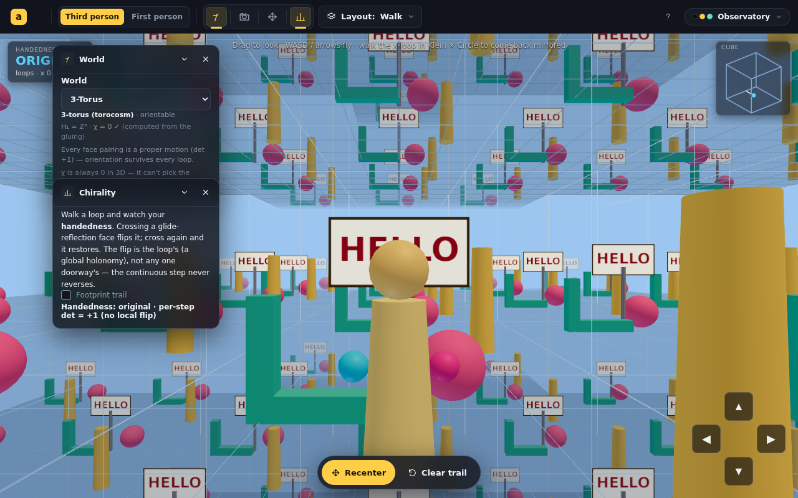

> [!NOTE]
> **Open for discussion (Dan):** (1) the **"ground floor"** idea — make the start
> cell the lowest level, with a solid floor (no portal) on it and its horizontal
> neighbors, so you can look down but not fall through; this trades the vertical
> torus loop for a grounded world (likely a walk/drive-mode option). (2) **corner
> markers / face labeling** to read orientation and the gluing. Asked via the UI.

### 🟢 code · 11:25 — Solid Worlds: fix the lost trail, instanced cover (depth 4–5), bigger rooms, further camera
**Why:** Dan: "we lost the trail", + move the camera further out, bigger rooms,
repeat size 4–5.

- **Lost-trail bug found & fixed.** A headless probe showed `stampCalls = 1`: the
  spacing (`> 0.3·size`) plus the wrap-reset meant footprints almost never
  dropped, and the few that did were tiny floor decals. Spacing → `0.13·size`
  (upper bound `0.6·size` still skips the wrap jump) and the decal is larger; the
  trail now reads clearly when enabled (still off by default).
- **Instanced cover (the real perf win).** `buildRoom` now yields reusable PARTS;
  `buildCover` draws each solid part as **one `InstancedMesh`** over all cells and
  merges each line part into **one `LineSegments`** — so draw calls stay ~constant
  (~10) regardless of cell count. This is what makes **depth 4–5** viable
  (previously ~12 draw calls × N cells). Cap raised to 1700; the trail is one
  instanced draw too (its shared geometry's drawRange tiles + mirrors through
  every cell).
- **Bigger / further / deeper:** cover-depth slider max 3 → **5** (default **4**),
  room-size max 14 → **24** (default 9 → **11**), camera-distance max 14 → **40**.

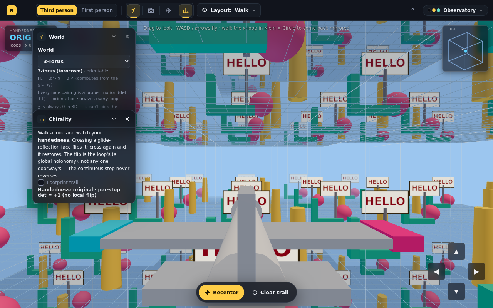

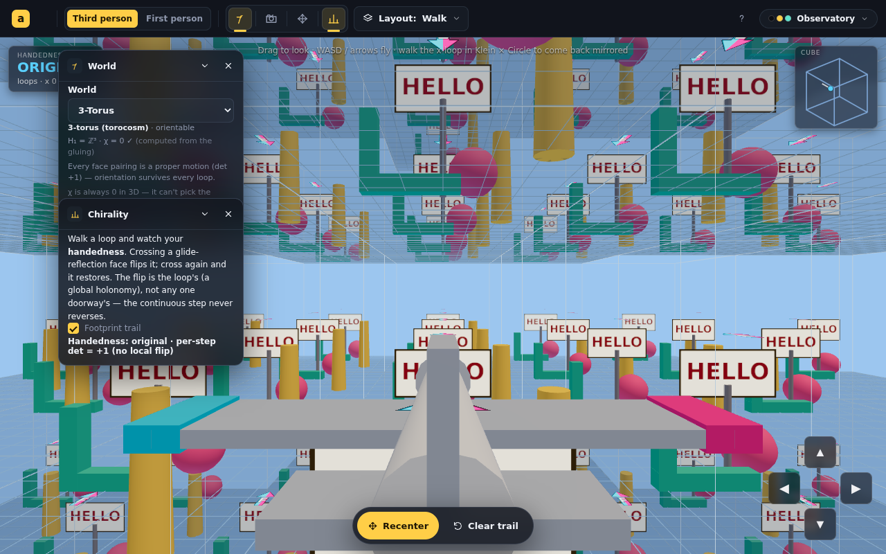

### 🟢 code · 04:37 — Solid Worlds: trail revert + off-by-default, the plane flies, carried-frame gravity
**Why:** Dan's three corrections.

1. **Trail reverted** to the classic flat F-arrow decal (textured, cyan-left /
   magenta-right), and **off by default** — a "Footprint trail" checkbox in the
   Chirality panel turns it on (off also clears it).
2. **The plane flies:** in Fly mode the airplane now noses along the **full**
   flight direction (yaw + pitch, = `camLinear`), so it climbs/dives as you do;
   the grounded person/car stay upright and only turn.
3. **Gravity lives in the carried frame:** "up" is `bodyLinear·(+y)`, which the
   holonomy rotates as you cross faces. So down stays consistent cube-to-cube,
   but **which face is the floor depends on how you entered the room** (the path's
   holonomy) — the amphicosm x-loop lands you on the old ceiling (no fall, frame
   flipped with you); a turn-space z-loop drops you onto a former wall. Movement
   is on the plane ⊥ up; you settle onto the −up face; rise (E/Space) jumps between
   floors. Footprints (when on) lie on that carried-frame floor.

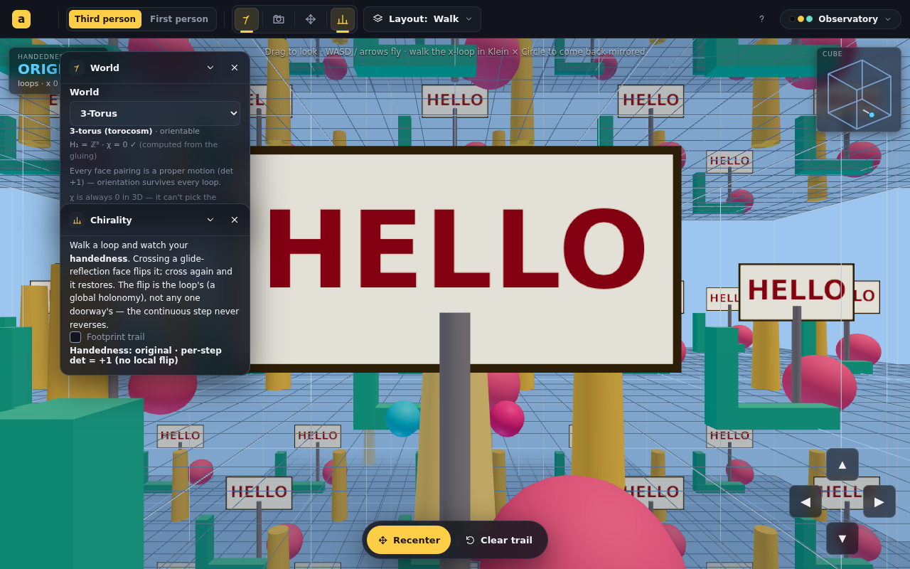

### 🟢 code · 04:09 — Solid Worlds: travel modes — airplane (fly) · person (walk) · car (drive)
**Why:** Dan meant an *airplane* for free exploration and a *person or car* for a
gravity-bound version (I'd read "plane" as a 2D floor — which luckily became the
ground these modes walk on).

- **`TravelMode = 'fly' | 'walk' | 'drive'`** (FrameInput3). A **Travel** pill in
  the Walk panel switches them; persisted.
- **Fly** = the airplane: free 6DOF along the look frame (E/Q for vertical).
- **Walk / Drive** = gravity-bound: move on the **horizontal floor plane**
  (look projected ⊥ up), and when you're not rising, ease back down to floor
  eye-height — so you stand/drive on the floor and E/Space jumps you up to the
  room above (then settle on its floor). Footsteps now land **on the floor**
  under your feet in these modes.
- **Three chiral vehicles** (airplane · person · car), each cyan-left /
  magenta-right with a nose toward −z, shown per mode in third person and
  oriented to your heading (`bodyLinear · Ry(yaw)`, upright) so they still mirror
  with you across a glide loop. (Fixes a latent bug: the old avatar always faced
  −z regardless of where you walked.)

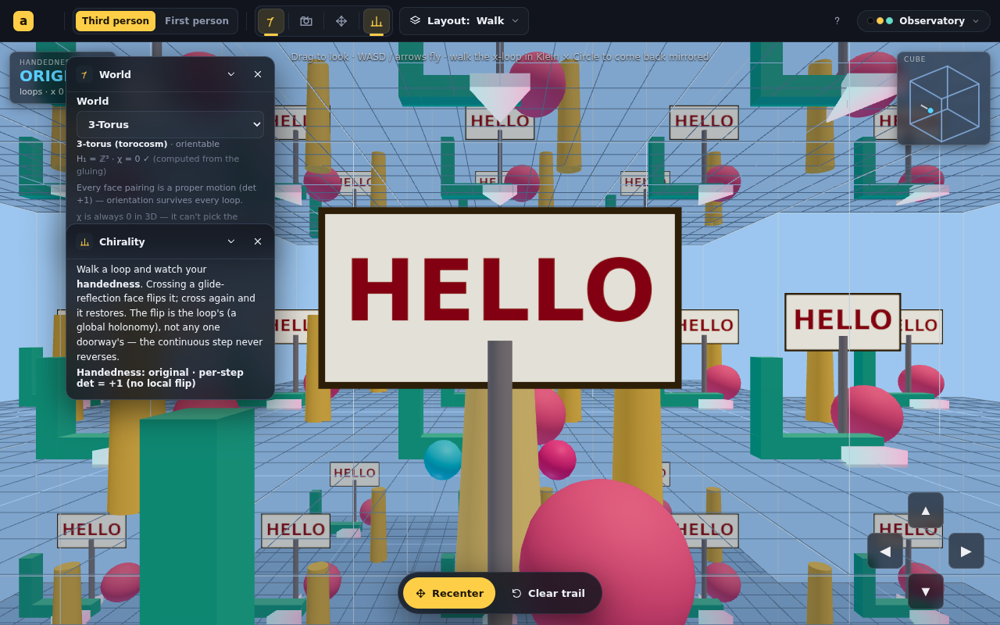

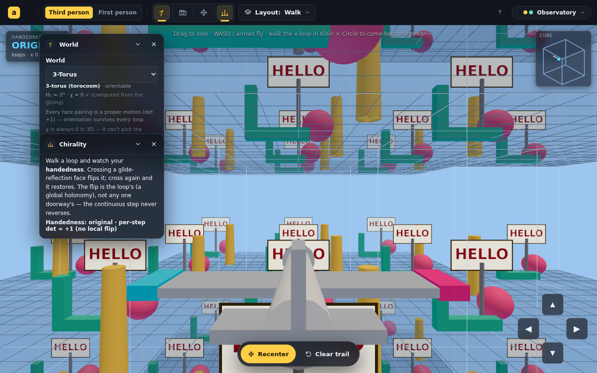

### 🟢 code · 04:01 — Solid Worlds: lighter fog, a floor plane, redesigned footsteps, depth always-on
**Why:** Dan: fog still too thick, footsteps "not good", and 3D space needs a
reference plane.

- **Fog much lighter** (`near = R·0.95`, `far = R·1.2`) so *every* rendered ring
  stays crisp and only the cull boundary feathers into the sky.
- **Root cause of "still thick":** cover depth was **persisted**, so the default
  bump never reached an existing session. Made cover depth **session-only**
  (always starts at 3) — the hall-of-mirrors now shows on load.
- **Floor plane:** each cell gets a clear horizontal reference — a faint
  see-through slab + a brighter grid — so you stay oriented while moving in 3D
  (it's a landmark, not gravity; there's still no global "down").
- **Footsteps redesigned:** the flat decal → tetra was "not good"; now a
  **flat-lying solid arrowhead** (top + bottom + 3 side walls, real thickness)
  that lies on the body's horizontal plane (normal = body up, not the pitched
  camera) and is colored by a **cyan-left → magenta-right gradient** so the
  chirality reads from any angle. Spaced out (`> 0.3·size`) so each arrow is
  distinct. Verified by driving the headless browser to walk forward.

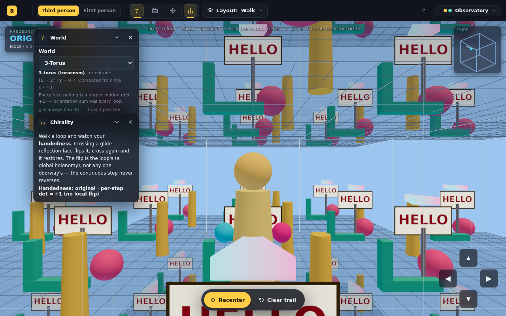

### 🟢 code · 03:45 — Solid Worlds: the infinite-mirror effect + 3D footprint arrows
**Why:** Dan: fog too thick (couldn't see into neighbors — the hall-of-mirrors
was lost), and the footprints needed thickness in a 3D world.

- **Fog fixed:** the old `near = size·0.9` (8 units) was *closer than one room*
  (9), so it hazed the first neighbor. Now tied to the cull radius
  (`near = R·0.8`, `far = R·1.08`) so the corridor of rooms stays clear and only
  the outermost shell fades into the sky. Default cover depth 2 → **3** (a 7×7×7
  shell) for a real hall-of-mirrors corridor.
- **3D footprint arrows:** replaced the flat decal (which vanished edge-on and
  looked paper-thin in a 3-manifold) with a **solid raised tetra-arrow** —
  vertex-colored (LEFT face cyan, RIGHT face magenta, back/underside dark), so it
  reads from any angle and keeps its chirality (a mirrored walker / det < 0 cover
  cell shows the opposite face). The trail is one vertex-colored
  `MeshBasicMaterial` geometry, cloned per cover cell.

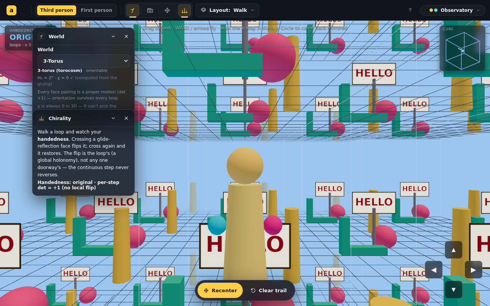

> [!NOTE]
> Cover depth 3 = up to 343 cells (~3k draw calls). It renders fine; the Cover
> depth slider (0–3 rings) is the escape hatch for weaker machines. A future
> perf pass could merge each room's decor into one vertex-colored mesh.

### 🟢 code · 03:36 — Solid Worlds: denser cover + the "you-are-here" cube mini-map (Schlegel-style)
**Why:** Dan asked for more cubes receding into the distance, and for the next
Tier-2 item (the polyhedron mini-map).

- **More cubes:** default cover depth 1 → 2 (a 5×5×5 shell), BFS cap 220 → 400,
  slider max 2 → 3 ("rings"). Fog now tied to the render radius
  (`far = (depth+0.55)·size·1.12`) so distant cubes **fade into the sky** at the
  cull boundary instead of popping.
- **Mini-map** (`SolidMiniMap` in `SolidWorlds.tsx`): an isometric wireframe of
  the fundamental cube with the walker as a dot + heading arrow. Each axis's
  edges are colored by what its pairing *does* — translation (blue) · rotation
  (amber) · glide-reflection (pink) — so the gluing is legible at a glance; the
  dot turns **pink when you're mirror-reversed**. Engine `getMapState` now also
  returns the forward direction in fundamental coordinates.

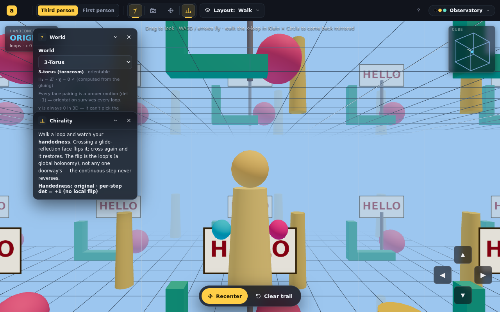

### 🟡 milestone · 03:22 — Solid Worlds Tier 2: H₁ computed from the chain complex (Smith normal form), cross-checked
**Why:** The plan's central schema deliverable — turn the catalog's H₁ from
asserted facts into *computed, verified* invariants ("validate invariants, never
claim a classification that doesn't exist").

- **`lib/homology.ts`** — builds the cube quotient's integer cellular chain
  complex: vertex/edge/face identifications via the pairing isometries
  (union-find; **signed** union-find for edges, since gluings can reverse
  orientation), the boundary maps ∂₂ (faces → edges) and ∂₁ (edges → vertices),
  and **Smith normal form** to read `rank H₁ = #E − rank ∂₁ − rank ∂₂` and the
  torsion = invariant factors > 1 of ∂₂. Also returns χ = V − E + F − 1.
- **`analyzeSolid`** now reports the **computed** H₁ + χ (+ a manifold-consistency
  flag χ = 0); the World panel shows "H₁ = … · χ = 0 ✓ (computed from the gluing)".
- **Tests (14 total, +5)**: computed H₁ equals the curated catalog value for all
  four worlds — **ℤ³, ℤ⊕ℤ/2⊕ℤ/2, ℤ⊕ℤ/2, ℤ²⊕ℤ/2** — and χ = 0 throughout. The
  agreement across four independent values is strong evidence the cell-
  identification machinery (the hard part, and the foundation for the future
  vertex-link S² test) is correct.
- EXPLAINER + CLAUDE tree updated (H₁ is now the world's fingerprint). Build ✓,
  14/14 tests ✓, lint clean.

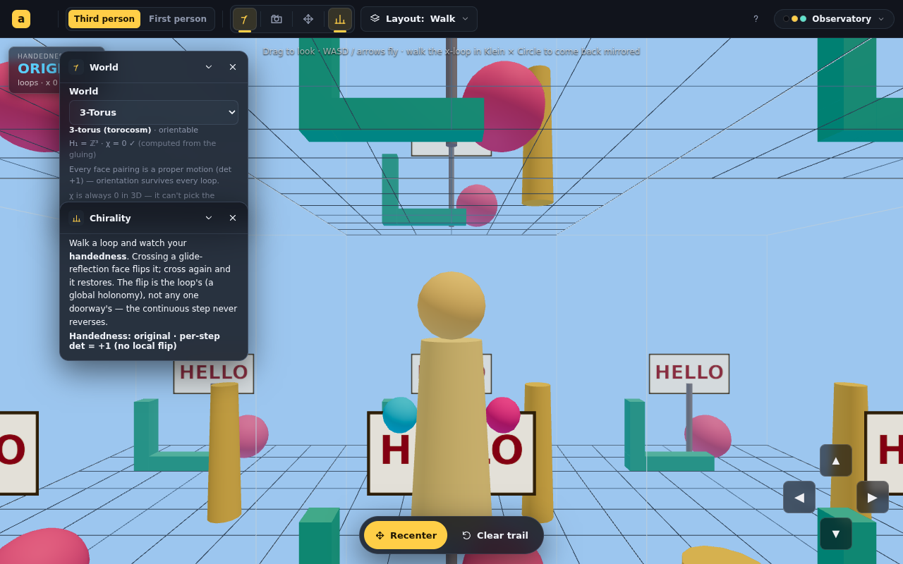

> [!NOTE]
> **Still open in Tier 2:** the full **vertex-link = S²** manifold certificate
> (χ = 0 is implemented as the necessary check; the sufficient link test is the
> next schema step), the **Schlegel mini-map**, the platycosms needing a non-cube
> domain (third/sixth-turn, Hantzsche–Wendt), and a **headless walk-the-loop**
> chirality test for the engine (the pure-math half is now tested).

### 🟢 code · 03:13 — Solid Worlds Tier 2: turn-spaces, rotation-vs-reflection HUD, schema tests; + an avatar bug fix
**Why:** Continue the plan into Tier 2 (richer catalog + matured schema), and fix
a real bug Dan spotted: the third-person avatar's chirality colors were reversed
relative to the footprints.

- **Catalog grew 2 → 4** (`worlds.ts`): added the **half-turn (dicosm)** and
  **quarter-turn (tetracosm)** spaces — mapping tori of the 180°/90° rotation of
  the xy-torus, glued on the z-pair (cube-compatible). They're the
  rotation-vs-reflection teaching pair: a proper rotation you can reorient away
  vs. the amphicosm's un-fixable mirror. (Third/sixth-turn + Hantzsche–Wendt need
  a hexagonal prism / richer gluing — deferred.)
- **HUD upgraded** to three states: **ORIGINAL · ROTATED N° · MIRRORED**. The
  engine now reports `rotationDeg` (angle of the carried frame from the trace of
  `bodyLinear`); `det −1` ⇒ mirrored, `det +1` with angle ⇒ rotated. Makes the
  "rotation is cosmetic, reflection is the invariant" lesson visible live.
- **Schema matured** (`solidSchema.ts`): added `rot`, `transposeM3`, `traceM3`,
  `rotationAngleDeg`. **9 vitest tests** (`__tests__/solidSchema.test.ts`) assert
  orientability per world, the amphicosm reverses only on x, the x-loop holonomy
  (once → det −1, twice → identity), and the quarter-turn z-loop is a proper 90°
  rotation of order 4. This closes the **pure-math half** of the flagged
  chirality-harness gap (a headless walk-the-loop test is still TODO).
- **Avatar fix** (`coverEngine.ts`): the third-person figure now puts **cyan on
  its left, magenta on its right**, matching the footprint convention exactly
  (its nose also now points forward); rebuilt as a clearer little figure (body +
  head + nose + side markers).
- EXPLAINER + CLAUDE tree updated for the grown catalog. Build ✓ (4.29s), 9/9
  tests ✓, `eslint src/` 0 errors.

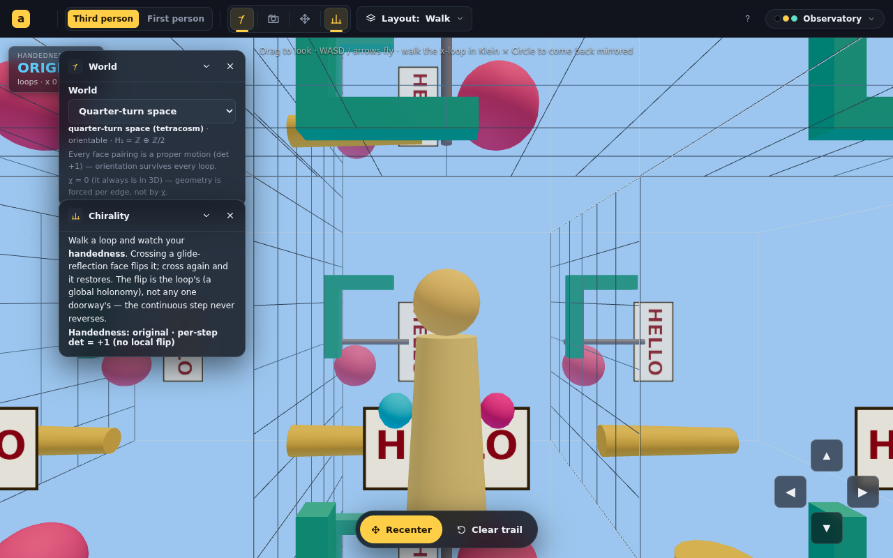

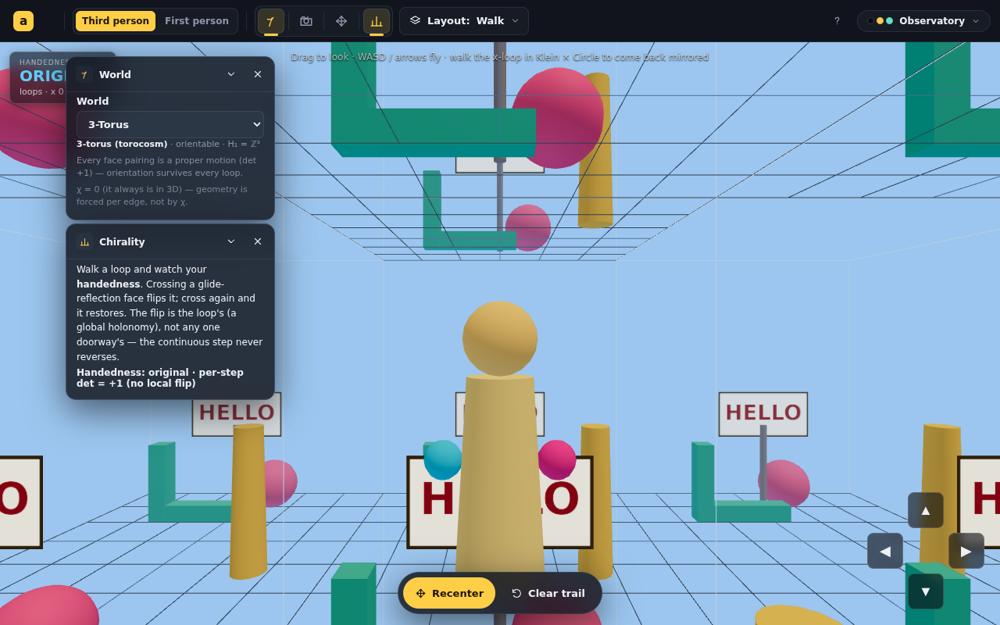

### 🟡 milestone · 02:58 — Solid Worlds Tier 1 built, registered, and renders (build + lint green)
**Why:** Author asked to "build out the plan." Tier 1 is the shippable entry —
walk the flat cube worlds and exercise the genuine 3D mirror-flip.

New app `src/animations/SolidWorlds/` — a self-contained first-person walker for
closed 3-manifolds, the 3D successor to Polygon Worlds:

- **`solidSchema.ts`** — pure (Three-free) cube face-pairing algebra; computes
  orientability from the pairing determinants (H₁ / manifold name carried as
  curated catalog facts, per the honesty rule). **`worlds.ts`** — the Tier-1
  catalog: 3-torus + amphicosm (Klein × S¹).
- **`coverEngine.ts`** — the developing-map cover engine. The walker carries a
  body frame; crossing a glide-reflection face premultiplies it by a det −1 linear
  part, so the camera world matrix goes **left-handed** and the whole view renders
  mirror-reversed (DoubleSide materials throughout so the reflected view doesn't
  cull). Seamless universal-cover tiling via a BFS over the deck generators
  (works for the non-abelian amphicosm group), shared room + trail geometry cloned
  per cell. Chiral footprint trail (F/arrow/cyan-magenta) + an opaque HELLO sign.
- **`SolidWorlds.tsx`** — Workspace integration (immersive, third/first-person
  modes, looks, cover-depth/room-size, free-flight WASD+QE, drag-look, pinch-zoom)
  + the **chirality HUD** (ORIGINAL / MIRRORED, per-axis loop counts) and a
  readout panel. **`textures.ts`**, **`looks.ts`**, **`engineTypes.ts`**,
  **`EXPLAINER.md`** (with the policy-mandated lineage block).
- Registered: `index.tsx` route `#/solid-worlds`, `apps.ts` entry, `catalog.ts`
  META (new `solid` preview kind in `previews.tsx` — a rotating cube-strip with a
  chiral F pair), CLAUDE.md routing table + tree, README.md.

**Verified headless** (`scripts/shoot.mjs`, SwiftShader): the 3-torus tiles the
room in all directions with all signs reading forward (no loop flips it); the
amphicosm cover shows genuinely reflected neighbor cells across the x-pairing. The
first-person mirror is confirmed by construction — after one +x crossing
`bodyLinear = diag(1,−1,1)`, det −1, HUD → MIRRORED. `npm run build` ✓ (4.39s),
`eslint src/` 0 errors (60 baseline warnings, none new).

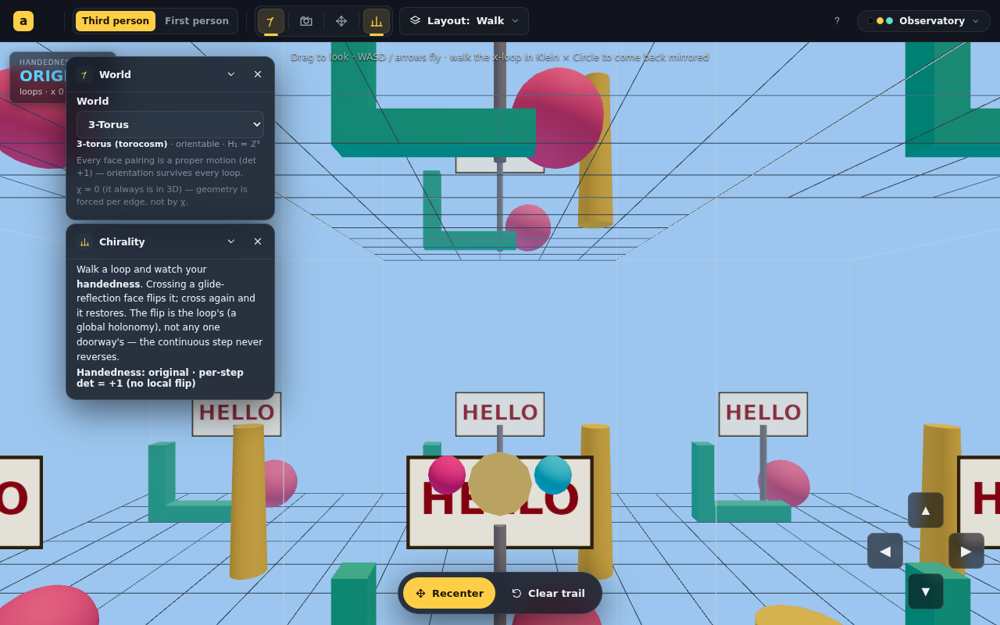

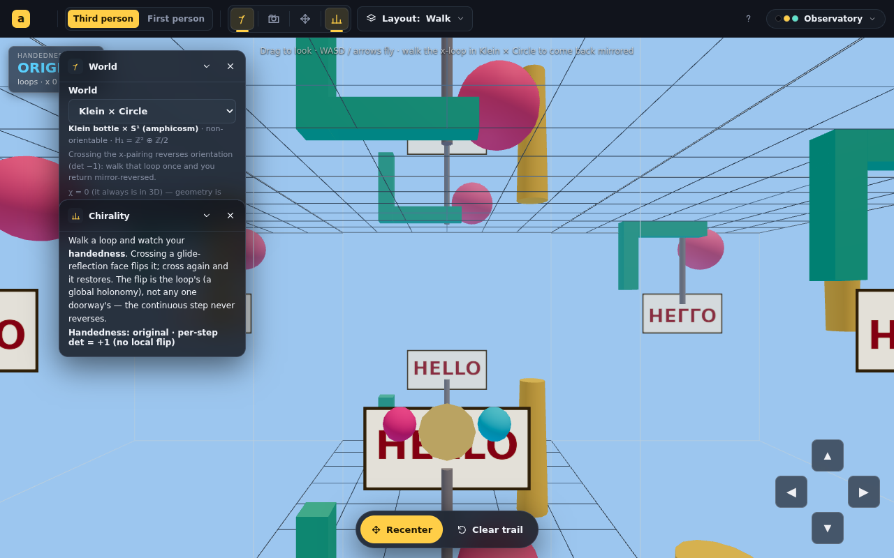

> [!NOTE]
> **Tier-1 scope honestly stated.** Flat (κ = 0) only; two worlds; the post-loop
> first-person mirror is verified by the determinant logic, not yet by an
> automated walk-the-loop test (the flagged 3D `trail-chirality` harness gap is
> still open). Tiers 2–4 (full platycosm catalog, Schlegel mini-map, the 4×4
> kernel + curved render, seam slider) remain as planned.

### 🟡 milestone · 00:07 — Solid Worlds written up as a `kind: plan` report
**Why:** Author chose "write it up as a planned report first" (over starting the
Tier 1 build). A pick-up-cold plan preserves the design discussion before context
is lost.

Wrote [`2026-06-18-S01-solid-worlds-plan.md`](2026-06-18-S01-solid-worlds-plan.md)
(`kind: plan`, `status: proposed`). It distills the uploaded draft + this session's
discussion into a file-level, tiered sequence grounded in the *real* codebase:
the reality-check table (app-local kernel, `surfaceSchema.ts` reused as the 3D
manifold-certifier, `coverModel.ts`/`looks.ts` reuse), the separate-app decision,
the session's design calls (footstep chirality headline, `ollɘH` sign, rotation-
vs-reflection pair, portal rooms / free-frame / cover view), Tiers 1–4, the
validation strategy (with the flagged 3D-`trail-chirality` harness gap), risks,
naming, and a policy-conformant "Possible sources" block.

### 🟡 milestone · 23:55 — Attribution policy added across the workflow (full scope); build green
**Why:** Author chose the full-workflow option; a policy doc only sticks if the
binding rule, the build checklist, and a worked example are all in place.

Wrote four pieces:

1. **`ATTRIBUTION.md`** (repo root) — the up-front policy statement (AI
   collaborators plural; "possible sources"; clarity/wayfinding not priority; two
   honest provenances; the honesty guardrail; and the 3-point in-practice
   workflow).
2. **`CLAUDE.md` → new section *Attribution & AI collaboration*** (after Code
   Conventions) — the standing rule that makes future sessions *do* it: per-app
   "Possible sources & where to go further" block, name-what-you-can-stand-behind /
   flag-uncertainty / never-fabricate, record both provenances, capture in handoff.
3. **`docs/BUILDING_AN_APP.md` §3d** — added the lineage block as a build step in
   the "document your app" checklist.
4. **`src/animations/PolygonWorlds/EXPLAINER.md`** — first worked example: a
   "Possible sources & where to go further" block crediting Weeks (*Torus Games*,
   *The Shape of Space*), the edge-word surface classification + Gauss–Bonnet, and
   the Steiner Roman surface.

`npm run build` passes (`tsc && vite build`, ✓ built in 6.49s). Nothing committed
yet.

### 🟣 decision · 23:51 — Run /start-session; record the design discussion + the directed deliverable
**Why:** The conversation moved from open-ended design talk to a concrete,
committed task ("add the attribution policy to our workflow"), so the session
needs an audit trail from here on.

Discussion to date (no code yet):

- **Reviewed the Solid Worlds plan** against the real `PolygonWorlds` code.
  Confirmed: the geometry kernel is app-local
  (`src/animations/PolygonWorlds/lib/cayleyKlein.ts`), *not* a shared
  `src/lib/geometry/` — so the plan's §3 "promote vs fork" is genuinely
  un-started. Separate-app recommendation fits house style; `PolygonEngine`
  (`engineTypes.ts`) is the interface to mirror as `SolidEngine`; Polygon Worlds
  already uses the `immersive` Workspace mode the 3D walk would reuse.
- **Chirality Q&A** (the conceptual spine): the **footstep/ink trail** lifts and
  becomes the *headline* instrument (det = −1 lands on the body — no normal to
  absorb it), while the 2D **glass sign's see-through mechanism breaks** and is
  replaced by a 3D chiral totem. Worked the concrete case: an opaque "Hello" sign
  in the amphicosm (Klein × S¹) reads **ollɘH** after one lap on the x-axis,
  restored after two; honest caveat that the flip is loop holonomy, not a
  localizable event (the §7 seam-slider thesis).
- **Rotation vs reflection**: turn-spaces give *cosmetic* (reorientable-away)
  rotations — sign comes back spun / upside-down / facing-away but you can turn to
  read it; only the non-orientable worlds give a genuine, un-fixable mirror, and
  even *which kind* of mirror is gauge. Good Tier-2 teaching pair.
- **"Room" / Escher questions**: keep the cube a furnished room but with
  **portal faces, not walls**; default to a transported free-frame (no global
  "up"), with imposed-gravity as an opt-in that doubles as the Escher
  ceiling-disagreement demo in worlds that can't carry a consistent vertical;
  each face shows the deck-translate of the cell under that face's isometry; a
  zoom-out third-person **cover view** (lattice of tinted cubes + mirror twins)
  reuses `coverModel.ts`. Precedent surveyed (Control/Manifold Garden/Antichamber
  for *feel*; Jeff Weeks' *Curved Spaces* / *Torus Games* / *The Shape of Space*,
  *Not Knot*, Segerman–Hart non-Euclidean VR for *substance*).

### 🟣 decision · 23:51 — Attribution policy: scope and shape (pending author confirmation on placement)
**Why:** The user articulated a clear values position and corrected the framing
twice; capturing the agreed wording so it survives context loss.

Agreed principles (the user's corrections folded in):

- **AI collaborators** (plural).
- The phrase is **"possible sources"** (not "sources and near-analogues").
- **Not about priority** ("who got there first"). It is about **bringing
  clarity and informing the approach for others to seek out** — attribution as
  *wayfinding*, a path for others to find more, **as well as** credit.
- Independent rediscovery is honored *and* named: distinguish the reasoning that
  reached an idea from the existing work it lands near, and record both. (Worked
  example: the author reasoned to the **Clifford torus** via (r,θ) maps + the
  single-radius constraint; it has a name and already lives in the codebase as
  the Hopf/Torus projection in Complex Particles.)
- **Honesty guardrail**: name people/works we can stand behind; **flag
  uncertainty, never fabricate** a citation/DOI/date.

Proposed implementation (the "best way to add it to the workflow"):

1. **`ATTRIBUTION.md`** at repo root — the public, up-front policy statement.
2. **A standing instruction in `CLAUDE.md`** ("identifying possible sources is
   part of building every app") so future sessions actually *do* it — this is
   what makes it a workflow, not a one-off doc.
3. **A per-app convention**: each EXPLAINER/guide ends with a short
   **"Possible sources & where to go further"** block (annotated pointers, not
   priority claims). Retrofit Polygon Worlds (credit *Torus Games* as its 2D
   ancestor) as the first instance.
4. Tie-in to the existing
   [`[docs] !high Productionize the signals/to-do system`](../../TODO.md) item
   and `BUILDING_AN_APP.md` so the lineage block becomes a build step.

**Open for the author:** exact placement (standalone `ATTRIBUTION.md` + CLAUDE.md
pointer is the recommendation) before writing anything to disk.
