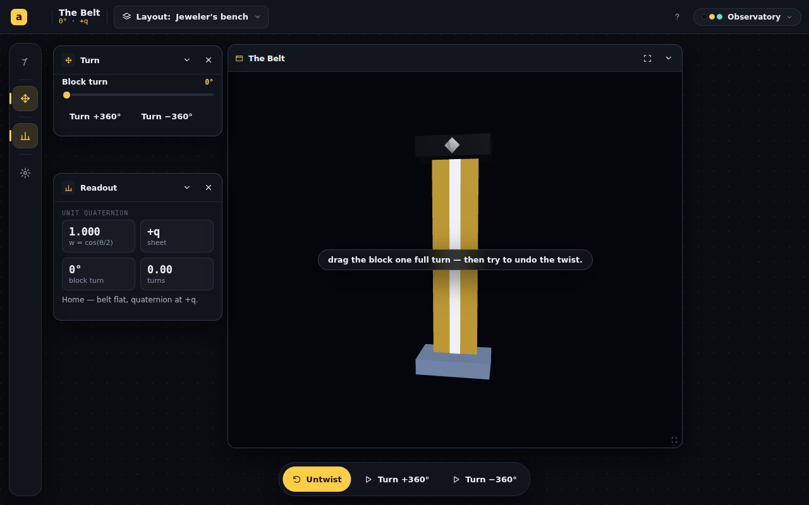
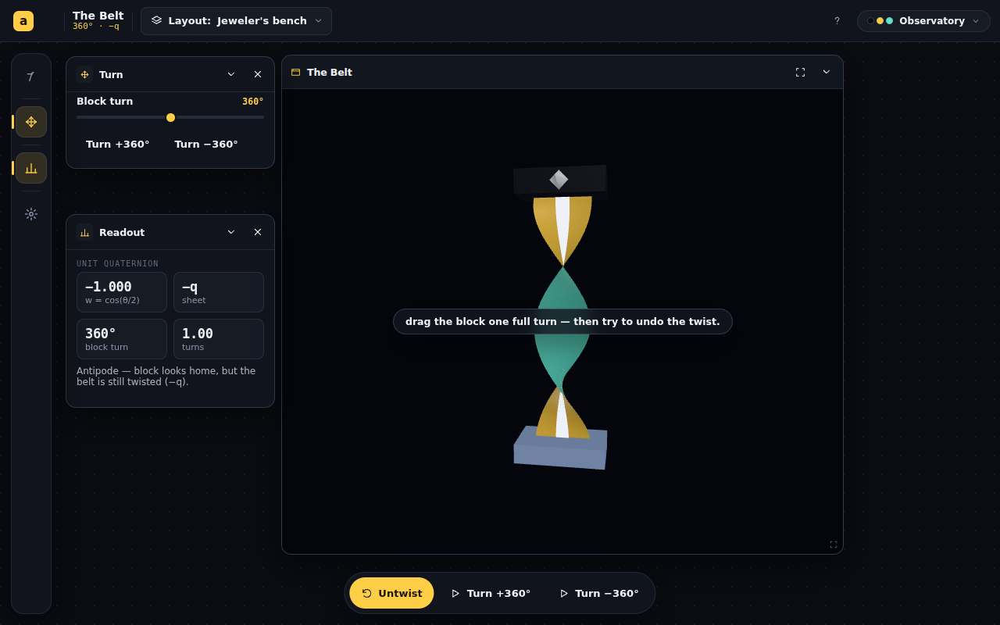
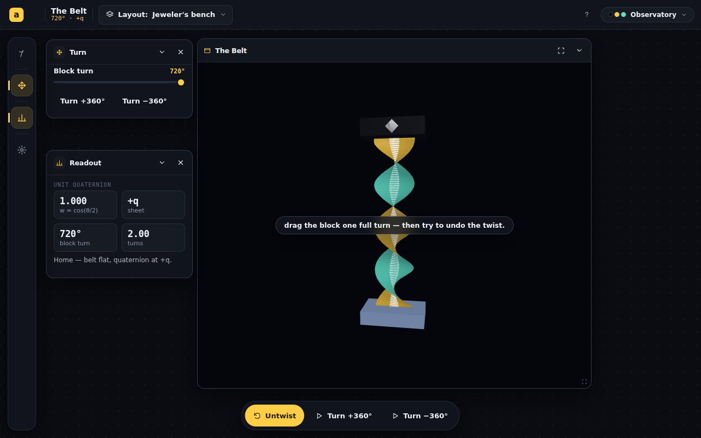

# The Belt — ribbon-twist spike + T1 resolved

The three-hats synthesis green-lit The Belt gated on **one ribbon spike** that had
to answer the single genuine expert disagreement (**T1**): is a *painted center
stripe* a faithful primary readout for `q` vs `−q`, or does it read "home" at 360°
and so mislead? This session built the spike — as a real, registered app (the spike
*is* the foundation) — and shot it headless at 0°/360°/720°. **The spike says: demote
the stripe.** Everything else in the spec held up.

## What got built

A working, registered app at `#/the-belt` (not a throwaway):

| File | Role |
|---|---|
| `src/animations/TheBelt/belt.ts` | Pure θ→readout math (`beltReadout`, `formatW`). θ is the accumulated scalar source of truth — the load-bearing invariant all three hats flagged. |
| `src/animations/TheBelt/__tests__/belt.test.ts` | 7 unit tests: `w(360°)≈−1`, `w(720°)≈+1`, 2:1 gearing, signed turns. **All pass.** |
| `src/animations/TheBelt/ribbon.ts` | The twisting belt mesh — built once, **mutated in place** per frame (no per-frame `TubeGeometry`). Front/back two-toned via `FrontSide`/`BackSide` meshes sharing one geometry, plus a glued center stripe. |
| `src/animations/TheBelt/TheBelt.tsx` | The `<Workspace>`: Turn / Readout / Block / Detail panels, one windowed view ("jeweler's bench"), action strip (Untwist primary, ±360°), camera orbit kept separate from the turn. |
| `src/animations/TheBelt/EXPLAINER.md` | The `?` text — frames the belt as a *demonstration*, not a proof, and includes the spin-½ bridge (both pedagogy asks). |
| registry | `index.tsx` route, `apps.ts` entry, `catalog.ts` META + a new cheap `belt` gallery preview in `previews.tsx`. All append-only. |

`npm run build` passes; `eslint` clean; `vitest` 7/7.

## The spike result (headless screenshots)

Captured via `scripts/shoot.mjs` with `SEED_LS` seeding the persisted turn angle.

| 0° — home | 360° — antipode | 720° — home again |
|---|---|---|
|  |  |  |
| flat, `w=+1.000`, `+q` | **one** full twist, `w=−1.000`, `−q` | **two** full twists, `w=+1.000`, `+q` |

The mesh reads beautifully: the gold-front / teal-back culling makes the twist
unmistakable with no labels and no reliance on lighting direction (so it is
CVD-safe — the cue is *shape/facing*, not hue). The `w` readout, block marker, and
sheet label all behave exactly as the math demands.

## T1 — resolved: the painted stripe is **not** a faithful primary readout

> [!IMPORTANT]
> **The pedagogy hat was right.** On an honest belt (a stripe physically glued to a
> ribbon that accumulates the full angle θ), the center stripe returns **home at
> both ends at 360°** — the block went all the way around, so the stripe at the
> block end has rotated a *full* 360° back to where it started. Look at the 360°
> shot: the stripe faces the viewer (front/gold) at *both* the clamp and the block.
> The spec's claim that "at 360° the stripe faces the wrong way at the block" is
> only true if you gear the stripe to θ/2 — i.e. **decouple it from the ribbon it is
> painted on**, which is the dishonest contrivance the math hat warned against.

What *is* faithful and visible is the **number of full twists in the body** (1 at
360°, 2 at 720°) — but 1-vs-2 twists is not a glanceable binary "wrong/home," and
the real ℤ/2 invariant (a 360° twist *cannot* be removed, a 720° twist *can*) only
shows up under the **untwist motion**, not in any static pose.

### Consequent revision to the readout hierarchy

| Spec (S05) | After the spike |
|---|---|
| **Primary (felt):** painted stripe orientation at the block | **Demoted to decoration.** It is honest *as a twist-counter* (it spirals 1× vs 2×) but it is **not** a q-vs-−q indicator — it reads home at 360°. Keep it for richness, not as the lesson. |
| At-a-glance: `w=−1.000` number | **Confirmed — promote.** It is the cleanest unambiguous "home vs not" at a glance, and it is correct *because* θ is tracked as an accumulated scalar. |
| The felt primary | **The untwist *motion* becomes the felt primary:** attempt-and-refuse at 360°, comes-free at 720°. This is the only thing that shows the actual topological fact, and it is exactly the action-strip lede ("Untwist") the Game Designer already wanted. |

This *strengthens* the design: the lesson was always the failed-then-successful
untwist (the on-ramp's posed task), not a static stripe. The spike just proves the
static stripe can't carry it.

## Carried forward unchanged from the synthesis

- **θ-as-accumulated-scalar** is implemented as the single source of truth (the math
  module + tests lock it in).
- **Mutate-in-place ribbon** — done; smooth in software WebGL at 96 segments.
- **`THREE.Quaternion`, not `quat4.ts`** — followed.
- **Windowed jeweler's bench, not immersive** — followed.
- **Explainer framed as demonstration + spin-½ bridge** — written.

## Still open (next session)

1. **Build the untwist (loop-around) motion** — now the felt primary. This is the
   real animation cost the spec under-weighted; the *twist* was easy, the *homotopy
   that removes a double twist* is the hard, essential part.
2. **The "Why a half" earned reveal** (the `q·v·q⁻¹` sandwich) — gate on a persisted,
   edge-latched `unlocked` boolean; not built yet.
3. **Compare panel** (ghost 3×3 matrix returning to identity at 360°) — not built.
4. **Phone one-thumb gesture split** (turn vs orbit) — still unanswered.
5. **Theme reactivity** — colors are read once at mount; a skin change mid-session
   won't recolor the mesh until remount. Wire a skin observer.
6. **Soften the I1 framing** in the S05 plan text itself (the explainer already is).

## Self-reflection

1. **What would you do with another session?** Build the untwist loop-around motion —
   the spike proved it, not the stripe, is the lesson, and it's the one genuinely hard
   animation left.
2. **What would you change about what you produced?** The stripe is still in the mesh;
   I kept it (it's honest as a twist-counter) but a future pass should add a clear
   in-app note so no one re-reads it as the q-sign.
3. **What were you not asked that you think is important?** Whether 1-vs-2 twists needs
   a *twist-count readout* ("1 twist" / "2 twists") to make the body legible at a
   glance, since the stripe can't be the binary signal.
4. **What did we both overlook?** That the untwist motion — not the twist — is the
   expensive part. The spec said "spike the ribbon mesh"; the mesh was the easy 80%.
5. **What did you find difficult?** Nothing technical; the honest call was resisting
   the temptation to "fix" the stripe by gearing it to θ/2, which would have made the
   demo lie. The screenshot made the call for me.
6. **What would have made this task easier?** Nothing — the headless shoot harness was
   exactly the right tool and turned an opinion (T1) into evidence in three frames.
7. **Follow-up value:** MEDIUM — the spike is conclusive and the app builds/tests/lints
   clean, but it is a foundation: the untwist motion, the earned reveal, and the
   Compare panel are the substance still to build.
