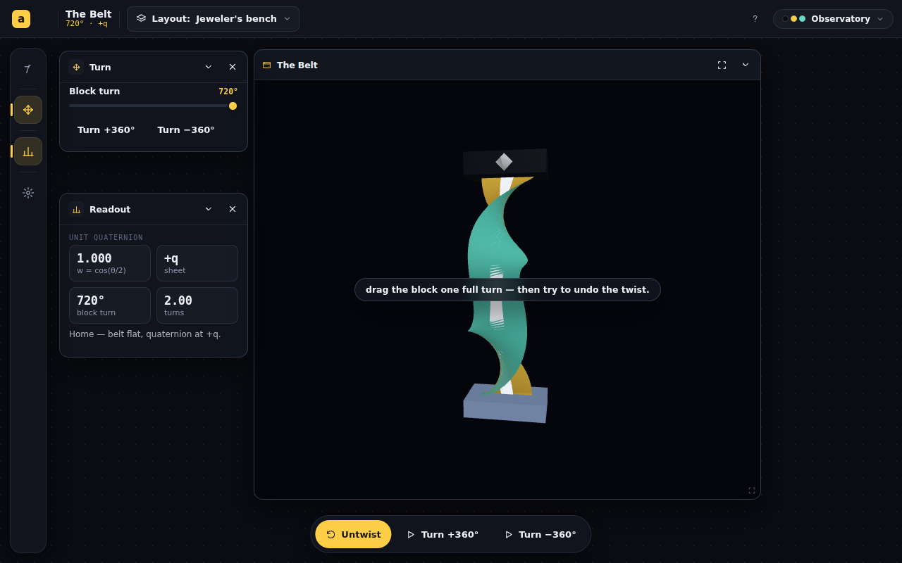
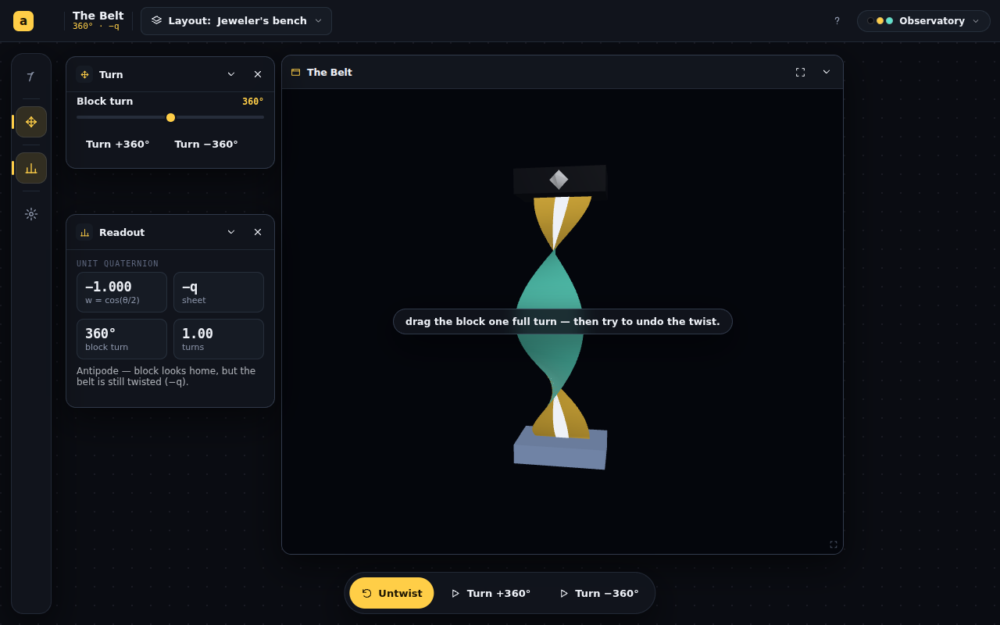

# The Belt — the untwist motion + the refusal

S06's spike proved the *twist* was the easy part and named the real work: **the
untwist** — the loop-around that sheds a 720° twist but stalls on a 360° one. That
motion, not the static stripe, is the lesson. This session built it, grounded it in
a tested pure-math null-homotopy, and verified both outcomes headless.

## The idea, made honest

The belt's twist is a **path of unit quaternions** `q(s)` along its length, from the
fixed clamp `q(0)=1` to the block `q(1)`. Untwisting without turning the block back
is a **null-homotopy of that path with both endpoints pinned**:

| Turn | Block lands at | Path is… | Untwist |
|---|---|---|---|
| 720° | `q(1)=+1` | a closed loop on S³ (simply connected) | **contracts → flat** |
| 360° | `q(1)=−1` | a path nailed to the antipode | **no pinned homotopy exists → refuses** |

This is an honest demonstration of **π₁(SO(3)) = ℤ/2**: the impossibility *is* the
refusal, for a real reason (the block is stranded on the other sheet), not a scripted
animation.

### The two motions (and why they are different code)

> [!IMPORTANT]
> A naive "untwist" that blends every frame toward identity would secretly rotate the
> block back to +1 on the 360° case — i.e. cheat. A unit test caught exactly this.
> So success and refusal are deliberately different operations:

- **Success** (`untwistFrame`, contractible turns): a straight blend from the twisted
  frame toward identity, with a transverse **bow** that routes the belt's body
  *around* the `q=−1` antipode it would otherwise pass through at the midpoint — the
  geometric content of "loop it over the top." Endpoints pinned for all t; reaches the
  flat belt at t=1. On completion the turn resets to 0°.
- **Refusal** (`setStrain`, non-contractible turns): the frames **stay** the pure
  twist (block pinned at −1, twist count unchanged) — only the centerline bows out and
  recoils. The belt strains and springs back; the readout never leaves `−q`.

## Verified headless (scripted Untwist click, captured mid-motion)

| 720° — mid-loop | 720° — completed (flat, reset to 0°) | 360° — strain & refuse |
|---|---|---|
|  |  |  |
| belt loops out of plane, block stays home | `0° · +q · 0.00 turns` | bulges but `360° · w=−1.000 · −q` holds — block never moves |

## What changed

| File | Change |
|---|---|
| `belt.ts` | + `twistFrame`, `untwistFrame` (the pinned null-homotopy), `isContractible`. θ stays the accumulated-scalar source of truth. |
| `__tests__/belt.test.ts` | **13 tests pass** (was 7): t=0 reproduces the twist; endpoints pinned ∀t; reaches flat at t=1 for 720°; never crosses the antipode at the midpoint; 360° strands the block at −1. |
| `ribbon.ts` | Frames now drive both states via quaternions; + `setUntwist` (success) and `setStrain` (refusal); scratch objects reused (no per-frame alloc). |
| `TheBelt.tsx` | Untwist action runs the homotopy in the rAF loop — `easeInOut` over 1.5 s (success → reset to 0°) or a 0.95 s strain-and-recoil (refusal). |

`npm run build` green · `eslint` clean · `vitest` 13/13.

## Fidelity note (honest disclosure)

The *mathematics* is rigorous and tested: the frame homotopy is endpoint-pinned and
contracts to identity iff the turn is contractible; the refusal provably keeps the
block on the −1 sheet. The *in-between embedding* (the bowed writhe) is **illustrative,
not a physically exact developable-strip motion** — the surface is generated from the
frames plus a centerline bow, so it may stretch slightly mid-motion. This matches the
explainer's framing of the belt as a demonstration, not a proof. A future pass could
swap in an isometric (non-stretching) ribbon if the writhe ever reads as rubbery.

## Still open (next session)

1. **"Why a half" earned reveal** — the `q·v·q⁻¹` sandwich on the same scene, gated on
   a persisted, edge-latched `unlocked` boolean (set when a 720° untwist completes).
2. **Compare panel** — the ghost 3×3 matrix that returns to identity at 360° while the
   belt does not (the Skeptic's resolution).
3. **Phone one-thumb gesture split** (turn vs orbit) — still unanswered.
4. **Theme reactivity** — colors read once at mount; wire a skin observer.
5. **Twist-count readout** ("1 twist" / "2 twists") so the body is legible at a glance,
   now that the stripe is demoted (S06).

## Self-reflection

1. **What would you do with another session?** Build the earned "Why a half" reveal —
   it is the last piece that turns the felt mystery into the math answer on one object.
2. **What would you change about what you produced?** The success writhe is pretty but
   not isometric; if user testing finds it rubbery, an arc-length-correct ribbon is the
   fix. I chose tested-correct-math + illustrative-embedding over an unverified exact
   embedding this session.
3. **What were you not asked that you think is important?** Whether the untwist should
   be drivable by *dragging* the belt's middle (direct manipulation) rather than only
   the action button — more visceral, more code.
4. **What did we both overlook?** Nothing new surfaced; the S06 prediction (untwist is
   the hard part) held exactly.
5. **What did you find difficult?** Getting the refusal honest. The first cut blended
   the block back toward +1 — a unit test, not the eye, caught the cheat. Splitting
   success/refusal into two operations was the fix.
6. **What would have made this task easier?** A scriptable "trigger this action then
   screenshot" already existed in spirit; I wrote a tiny click-then-shoot helper, which
   was enough.
7. **Follow-up value:** MEDIUM — the core lesson (twist · untwist · refusal) is built,
   tested, and verified; the earned reveal + Compare panel are the substance left, and
   the embedding-fidelity note is a known, disclosed limitation.
