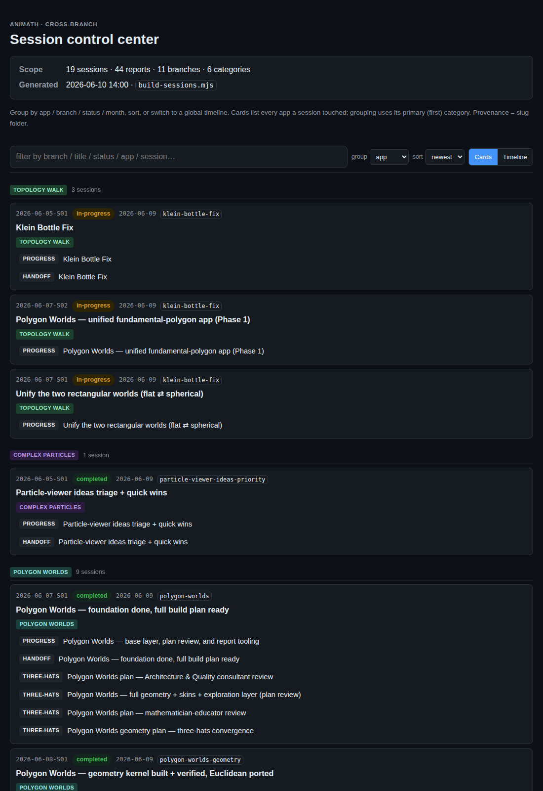
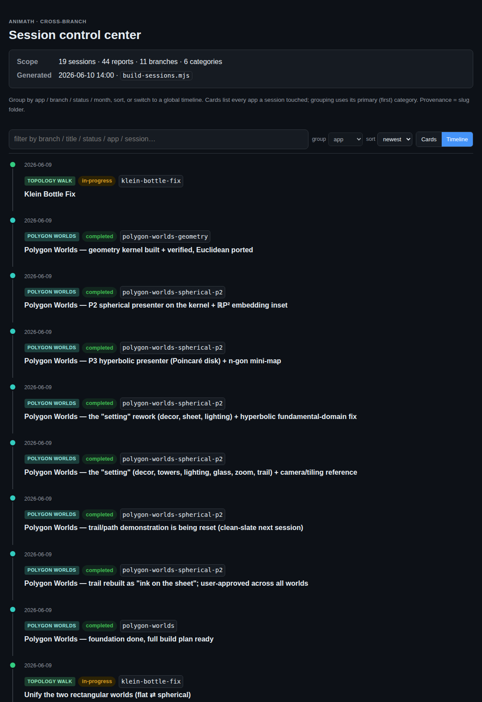

# Control center — app categories, group/sort, global timeline

## Session purpose

Make the session control center organize reports by **app category** (not just
branch): label each report, add **group-by / sort-by** controls so time and app
are salient, and add a **global timeline** view across all branches.

## Previous session

First tracked session on this branch. Builds on the `better-reports` session that
created the rich HTML view (`render-report.mjs` + `report.css/js`).

## Working notes

<!-- Newest entry first. -->

### 🟢 code · 14:05 — Logged this session + the Gale–Shapley one
**Why:** the user asked that recent work (notably the Gale–Shapley extensions)
show up in the control center, which only lists reports under `docs/sessions/`.

Authored progress + handoff for `gale-shapley-strategy`, plus this report (which
dogfoods `app: general` and a `thumbnail:`).

### 🟡 milestone · 13:55 — Categories, grouping, and timeline working
**Why:** verified end-to-end against all 11 branches before logging anything.

`npm run sessions` built 44 reports across 6 inferred categories; the cards view
groups by app with colored chips, and the timeline view renders a chronological
rail colored by app. Screenshots below.

### 🟢 code · 13:30 — Data-driven control center
**Why:** server-rendered fixed branch sections couldn't support client-side
re-grouping; the page needed to carry structured data per card.

Rewrote `build-sessions.mjs` to emit each session as a flat `.cc-session` card with
`data-*` attributes (apps, primary category + hue, date, status, branch, title,
href). An inline script groups (app / branch / status / month / none), sorts
(newest / oldest / app / title), filters, and switches to a global **Timeline**
view. With JS off, the flat newest-first list and all links still work.

### 🟢 code · 13:00 — Shared taxonomy module
**Why:** the builder and the per-report renderer must label categories identically.

Added `docs/sessions/categories.mjs`: the canonical taxonomy (app slugs mirroring
`src/apps.ts`, plus `chrome` / `engine` / `general`), `normalizeApps()` (explicit
`app:` wins, else infer from slug), and `appChips()`. `render-report.mjs` now shows
the same chips in the per-report "App" meta; `.cat` chip styling lives in
`report.css`.

### 🟣 decision · 12:50 — Reuse the existing `app:` field, allow multiple + tokens
**Why:** the frontmatter slot already existed (templates + renderer) but the
control center never read it; extending it beats inventing a new field.

`app:` now accepts several comma-separated values plus the `chrome`/`engine`/
`general` tokens, validated against `src/apps.ts`. Existing reports without it are
inferred from their slug, so all 44 got a sensible chip with zero hand-editing.
