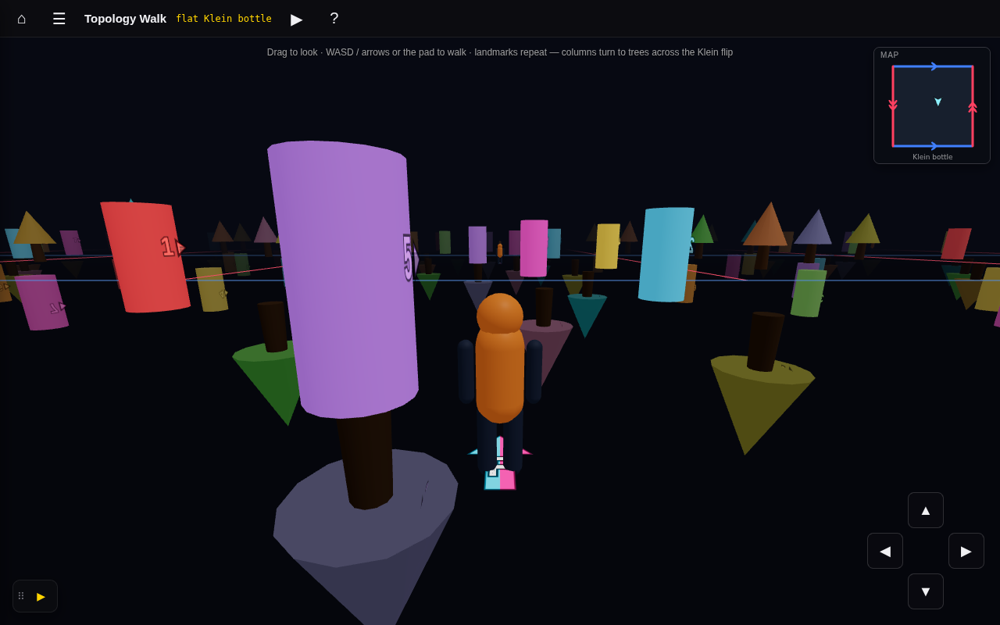

# Session reports — embedded screenshots + control-center thumbnails

## Session purpose

Let progress/handoff reports embed screenshots that render in **both** GitHub
Markdown and the generated HTML, and surface a lead thumbnail per session on the
cross-branch control center — so the latest visual state is readable from one page.

## Previous session

First tracked session on this branch (cut from `main`).

## Working notes

### 🟢 code · 15:10 — Pipeline carries screenshots end-to-end
**Why:** the cross-branch build reads report *text* read-only from branch tips, so
it had to learn to fetch image binaries the same way.

`build-sessions.mjs` now scans each report for `` refs, `git show`s the binary
from the same branch tip into `converted/<kind>/<slug>/<rel>`, picks a lead
thumbnail (`thumbnail:` frontmatter or first image), and prints a screenshot-bytes
budget. `render-report.mjs` turns standalone image lines into `<figure>`; the dist
copier now ships image files too.

## How it looks

A screenshot embedded in a report section (this very image was carried by the
build), rendered as a captioned figure in the HTML view and inline on GitHub:

This session's control-center thumbnail is a **separate** image (`thumbnail:
assets/card.png`) that is *not* embedded in the body — the build carries explicit
thumbnail assets too, so a dedicated card crop never breaks the link.
