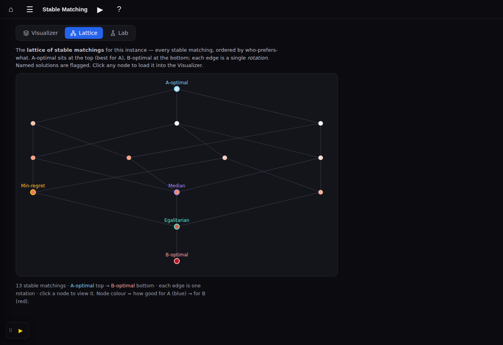
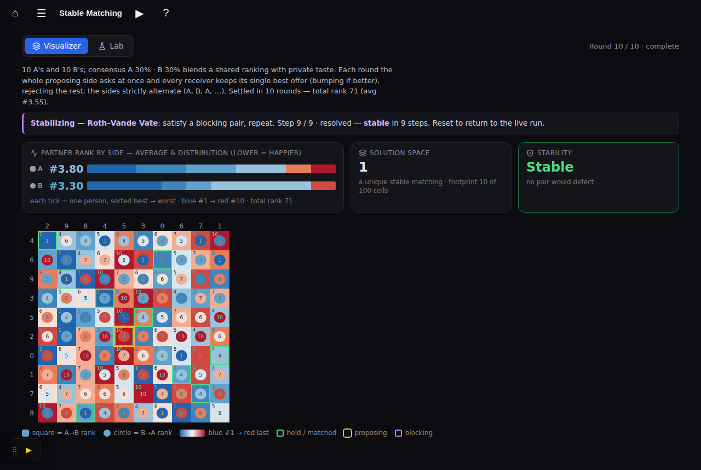
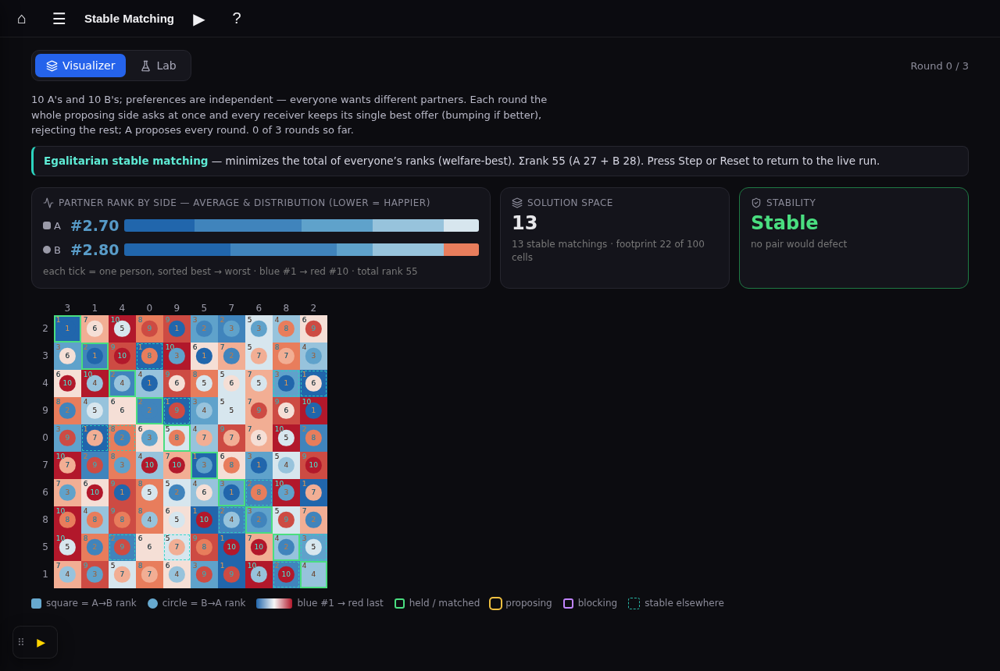
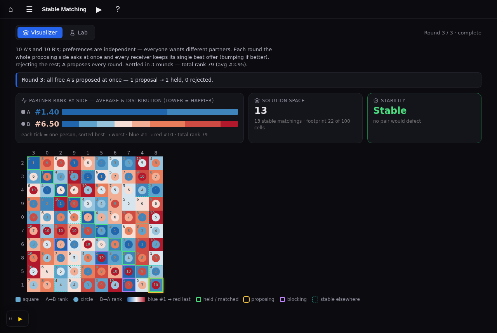
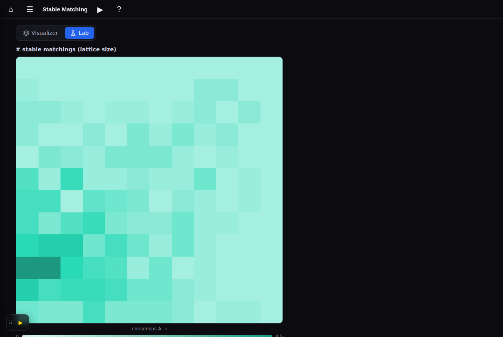
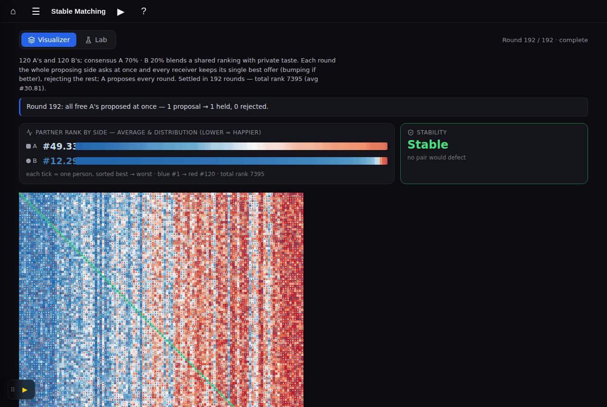
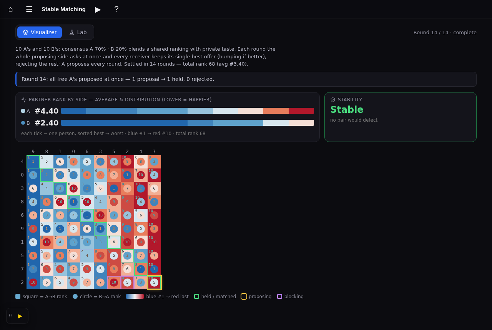

# Stable Matching — iron out simulation & Lab details

## Session purpose

Detail/polish + fill-the-gaps pass on the new **Stable Matching** app
(`#/stable-matching`, `src/animations/StableMatching/`). Work interactively:
propose → screenshot → iterate. Prioritize the backlog with the user rather than
plowing through. The old `#/stable-marriage` stays untouched (no route switch).

## Previous session

[2026-06-06-S01 handoff](../../handoff/stable-marriage-styling-ulMPt/2026-06-06-S01-advanced-styling-parity.md):
rebuilt Stable Matching from scratch as a new app (engine-first: `model.ts`,
`galeShapley.ts` with synchronous `runRounds`, `StableMatching.tsx` Lego-matrix
visualizer + heatmap Lab). Build passes. Key finding: synchronous two-sided
deferred acceptance is usually **not** stable (worst mid-consensus). The route
switch and old-app retirement are deferred.

> [!NOTE]
> **Branch note.** This session's working branch is `claude/great-thompson-ko30di`,
> which already carries the full PR #189 history (StableMatching app + the S01
> reports). Session reports continue under the `stable-marriage-styling-ulMPt`
> slug for continuity, as the task directs.

## Backlog (to prioritize with user)

Grouped from the task brief; not yet sequenced.

- **Simulation:** Stabilize/RVV repair animation · inspect preferences (readable
  ranked lists) · fate of unused engine bits (`market`/`extremal`) · ease re-sort
  motion · robustness (NaN guard, reduced-motion, large-n legibility) ·
  per-round vs per-proposal stepping.
- **Lab:** more surfaces (RVV cost, A−B difference, welfare, proposer-advantage,
  #stable-matchings) · declarative param model to sweep any axis pair · cell
  hover/pinning, legends, variance guidance, side-by-side compare, resolution UX.
- **Solution space (user's main interest):** stable-pair footprint · count of
  stable matchings vs consensus · the lattice of stable matchings + rotations.
- **Code health:** extract `StableMatching.tsx` (~650 lines) · tighten
  EXPLAINER/README to match behaviour.

## Working notes

<!-- Newest entry first. -->

### 🟡 milestone · 14:45 — Solution-space plan Tiers 0–4 shipped + docs
**Why:** "Continue as far as you can — finish the plan, regular commits, self-test."

Built and pushed, each verified (build + 1440-case rotation cross-check +
screenshots): **T0** rotation engine · **T1** footprint + count surface · **T2**
named solutions + jump-to · **T3** the lattice tab · **T4** RVV resolver +
cost-to-stabilize surface. Rewrote EXPLAINER.md / README.md to match. Build passes,
tree clean. **Tier 5 (preference falsification) not built** — it's a candidate
standalone app needing the app-vs-mode decision (E4) *and* an engine extension
(incomplete/truncated lists for truncation manipulation); flagged for the user.

### 🟢 code · 14:30 — Tier 4 completion: cost-to-stabilize surface
**Why:** Round out the resolver with its Lab surface.

Lab **Repair cost** surface: average RVV repair steps to stabilize the synchronous
schedule's result across consensus A×B — deeper in the disordered corner.

### 🟢 code · 14:20 — Tier 3: the lattice of stable matchings
**Why:** The centerpiece — make the solution space literally spatial (wishlist
Tier 3).

- `layoutLattice` in `rotations.ts`: layered Hasse layout — y by longest-path
  depth from the A-optimal top, x by parent-barycenter to reduce crossings.
  (Caught + fixed a sign-convention bug: covers are [upper, lower].)
- New **Lattice tab** + `LatticeView` (SVG): A-optimal top → B-optimal bottom,
  each edge a single rotation; named solutions (Egalitarian/Median/Min-regret/
  Sex-equal/Balanced) flagged in place; node colour shades blue→red
  (good-for-A → good-for-B). **Click any node → loads it into the Visualizer**
  (`pickedNode` override, same as jump-to). Gated to ≤ 80 nodes; "unique point"
  message at consensus where the lattice collapses.
- Seed 53 (n=10, consensus 0): a clean 13-node distributive lattice.

### 🟢 code · 13:40 — Tier 4: Roth–Vande Vate resolver
**Why:** "Use an alternative mode + a resolver" — repair an unstable run to
stability, animated (wishlist Tier 4).

- `resolver.ts`: `rothVandeVate(inst, start, seed)` repeatedly satisfies a random
  blocking pair until stable, recording each step (the satisfied pair + the two
  partners it displaces + blocking-pairs-remaining). `replaySteps` rebuilds any
  intermediate for stepping. Verified (test now 1440 cases): always converges, the
  landing matching is in the stable set, replay reproduces it.
- **Visualizer**: a **Stabilize** button (enabled when the live result is
  unstable) runs RVV from the final matching and animates the purple blocking
  cells healing — own Step/Play/Finish/Back controls, purple banner with live
  step count + blocking-remaining. Seed 27 (Alt, consensus 30): 4 blocking → stable
  in 9 steps.
- Note: RVV is a *random walk*, so the blocking count is non-monotonic and the
  path length varies widely (9 to 100+ steps) — that variance is exactly the
  "cost to stabilize" (a future Lab surface).

### 🟢 code · 13:00 — Tier 2: named solutions + "jump to"
**Why:** Locate the canonical/fair stable matchings and let the user teleport to
them (wishlist Tier 2).

- **"Jump to a stable solution"** Select in Actions: A-optimal / B-optimal /
  Egalitarian / Median / Min-regret / Sex-equal / Balanced. Selecting one
  statically overrides the displayed matching (matrix, per-side averages,
  stability, diagonal); Step/Play/Reset return to the live run.
- Teal **banner** names the solution + what it optimizes + its Σrank.
- Refactored so footprint + named solutions share one enumeration (`stableSet`).

The fairness story, concrete: seed 53 A-optimal = **A #1.40 / B #6.50, Σ79**;
jump to **Egalitarian = A #2.70 / B #2.80, Σ55** — the averages collapse together.

### 🟢 code · 12:30 — Tier 1: stable-pair footprint + count surface
**Why:** Turn the rotation engine into visible payoff (wishlist Tier 1).

- **Solution-space metric card**: lattice size ("13 stable matchings") + footprint
  cell count, computed per instance via `stablePairs` (cap 1000).
- **Footprint overlay** on the matrix: teal-dashed inset on every cell matched in
  *some* stable matching but not the current one ("stable elsewhere"). Display
  toggle + legend key. Seed 53 (n=10, consensus 0): 13 matchings, footprint 22/100.
- **Lab "# stable" surface**: counts the lattice size across consensus A×B — huge
  in the low-consensus corner, collapsing toward 1 (the glassiness phase curve).
  Enumeration capped at 300; teal palette.

### 🟢 code · 12:00 — Tier 0: rotation engine (verified vs brute force)
**Why:** The keystone for the whole solution-space track (wishlist Tier 0).

`rotations.ts`: enumerate every stable matching by BFS rotation-elimination from
A-optimal; stable-pair footprint; named solutions (A/B-optimal, egalitarian,
median, min-regret, sex-equal, balanced); lattice scores + Hasse covering
relation. `scripts/test-rotations.ts` cross-checks the fast path against a
brute-force n! enumeration over **1440 cases — all pass** (also verifies named
solutions are stable & in-set, egalitarian/sex-equal minimal, lattice counts).

### 🟣 decision · 11:30 — Wrote the solution-space wishlist + tiered plan
**Why:** User: "make a very complete record of [the solution-space discussion] —
it's a wish list for the app… and build a tiered stepwise plan." Added the kicker:
**preference falsification** (every agent games their official rank), possibly its
own app.

Captured as a dedicated reference doc:
[2026-06-08-S01-solution-space-wishlist.md](2026-06-08-S01-solution-space-wishlist.md)
— the lattice/rotation structure, where the named solutions live, traversal
methods, fair algorithms (egalitarian/median/min-regret poly; sex-equal/balanced
NP-hard), the RVV resolver, and a **5-tier build plan** (T0 rotation engine →
T1 footprint+count → T2 named solutions → T3 lattice diagram → T4 resolver;
T5 preference-falsification as a candidate standalone app). Recommended first
build: **T0 → T1**.

### 🔵 finding · 11:10 — Solution-space design map (rotations, fairness, resolver)
**Why:** User asked what enumerating all stable matchings involves, how to explore
the space, algorithm alternatives, the "resolver" idea, and canonical *fair*
algorithms. Capturing the plan before building.

**Keystone = the rotation poset.** The set of stable matchings is a distributive
lattice (Conway); man-optimal = top, woman-optimal = bottom (both already in
`galeShapley.ts:extremal`). Rotations are the edges; the **rotation poset**
(≤ n(n−1)/2 rotations, O(n²) to build) compactly encodes the whole lattice —
stable matchings ↔ closed down-sets of the poset. One structure yields: the
**stable-pair footprint** (union of matched cells), the **count** (= #antichains;
#P-complete in general → cap & enumerate only for small/correlated n), the
**egalitarian** matching (min Σrank, poly-time via min-cut on the poset), the
**median** matching (each agent's median stable partner; Teo–Sethuraman), and
**minimum-regret** (poly). **Sex-equal / balanced** (the most "fair between
sides") are NP-hard (Kato/Feder) — approx only.

**Resolver = Roth–Vande Vate** random path to stability: from *any* matching
(incl. our often-unstable synchronous runs), repeatedly satisfy a blocking pair
→ converges to *a* stable matching; animate purple cells resolving; #steps =
"cost to stabilize" Lab surface.

**Build order (proposed):** (1) `rotations.ts` engine → footprint overlay on the
matrix [high value, low effort]; (2) count-vs-consensus curve (the
glassiness-collapse-to-1); (3) lattice Hasse diagram + rotation slider (small n);
(4) RVV resolver + egalitarian/median "fair" reference points (ties to the
per-side averages — fair points pull A and B averages together).

### 🟢 code · 10:45 — Colour the average by its mean; scale to many people
**Why:** User: "the numbers are a summary — colour the number to match the mean
value. Also have some minimal pixel size, but allow much larger number of people."

- The per-side **average number** is now coloured by its mean rank on the BuRd
  scale (A pale, B bluer at low consensus); the marker reverts to a neutral shape
  (square A / circle B) so identity and value are separate cues.
- Strip ticks get a **3px minimum** (fill-to-width when there's room, floor when
  not — horizontal scroll only past a few hundred people).
- **Population cap 60 → 200**; matrix cell floor 12px → 5px so large n renders as
  a dense lego heatmap that fits; index labels auto-hide below 16px cells.

### 🟢 code · 10:20 — Merge average + distribution into one panel
**Why:** User: "partner rank and distribution should be a single panel not two."

Collapsed the two cards into a single **Partner rank by side** panel: each side
is one row — marker + average number + its sorted colorbar. Metrics grid is now
`2fr 1fr` (wide outcome panel + Stability). Reads as one object: "A #4.40 →
[strip], B #2.40 → [strip]."

### 🟢 code · 10:05 — Distribution → sorted outcome colorbars (ECDF read)
**Why:** User: "use an ecdf or approximate PDF… a sorted colorbar from A and from
B of outcomes — that might make it obvious."

Replaced the mirror histogram with **sorted colorbars** (one per side): each tick
is one person, sorted best→worst, colored on the shared **BuRd** rank scale
(blue #1 → red worst). The blue/red balance reads like an ECDF — A's strip
reddens fast, B's stays blue, so the asymmetry is obvious at a glance. Dropped
the blue/amber side hues entirely: identity is now **shape** (square A / circle B,
like the matrix) and **all** color is the one rank scale.

### 🟢 code · 09:40 — Per-side average + outcome distribution (Visualizer)
**Why:** User picked the thread "show outcome distribution and average by A and B."

The Visualizer headline was one **combined** total-rank number and a single
**merged** rank histogram (A and B summed). Split both per side:

- **Average partner rank** card now shows **A** and **B** averages on their own
  rows, colour-coded (A = blue square, B = amber circle, echoing the matrix's
  square/circle), with total rank demoted to the sub-line.
- **Rank distribution** is now a **mirror histogram**: A's outcomes grow up
  (blue), B's grow down (amber) from a centre line, shared y-scale.

Reuses the per-side accounting already in `acct`; added side-colour CSS vars
(`--a-side`/`--b-side`), `.sm2-avgrows`, and `.sm2-dist2`. Build passes.
Screenshot (cA 70 · cB 20, A proposes): A #4.40 vs B #2.40 — the asymmetry is
now legible at a glance.

### 🟡 milestone · 09:00 — Session initialized
**Why:** Read prior handoff + roadmap, confirmed app state, oriented on branch.

Read the S01 handoff and the status/roadmap progress report. Confirmed the
StableMatching app is present on the working branch (`great-thompson-ko30di`,
which holds PR #189's work) and `npm run build` is the only CI gate. Awaiting the
user's pick of which backlog thread to take first.
