# Theming v2 — light/dark-paired theme engine (Phase 0) + pilots

## Session purpose

Decouple a theme's **color identity** from its **light/dark mode**. Every theme
gets both a LIGHT and a DARK palette under shared token names (via CSS
`light-dark()`), so a feature that *requires* a mode (star fields / glowing
particle stages → dark; print → light) forces it on its own subtree and its
objects use the **normal tokens at that mode's values** — no bespoke per-app
scene palette — and every app's *visualization* tracks the skin, not just the
chrome.

Scope this session: **Phase 0 (the theme engine)** then the **two pilots**.

- **Phase 0** — convert `theme.css` tokens to `light-dark()` pairs; author the
  missing companions (light Phosphor = the 1980s beige case, light Neon/Mirage,
  dark Primary; theme-tinted darks); add the `<Scheme mode>` force-mode
  primitive, a canvas "read resolved tokens + redraw on change" hook
  (`useThemeTokens()`), and an identity + mode picker.
- **Pilots** — Trinary's star scene (force-dark; stars→discrete `--data`,
  planet→neutral, outcomes→divergent registry colormap) and the Worlds'
  day/night skies (mode = time of day).

## Previous session

First tracked session on this branch (fresh off `main` after PR #238 merged).
The locked spec lives on `main` at
[`youthful-cray-7m6z9d/2026-06-24-S02-plan-light-dark-theming.md`](../youthful-cray-7m6z9d/2026-06-24-S02-plan-light-dark-theming.md);
the foundations (chrome token contract, colormap registry, `data-scheme`
attribute, reactive `useSkin`/`useThemeId`) shipped in
[its S01 handoff](../../handoff/youthful-cray-7m6z9d/2026-06-24-S01-chrome-design-cleanup.md).

## Decisions locked (carried from the plan)

> [!IMPORTANT]
> These are settled — do not relitigate:
> - **`--accent`/`--accent-2` are UI-voice only** — interaction/identity, never data.
> - **Ordered/polar data** (temperature, good→bad outcomes) → *sample a registry
>   colormap* (divergent by goodness; chaos/stat ramps → sequential).
> - **Identity** (the three stars) → discrete `--data` slots of the forced-dark variant.
> - **Planet** → a neutral (the calm subject vs the vivid stars).
> - **Worlds skies = day/night by mode** — light mode = day sky, dark = night sky.
> - **Phosphor's light analog = the 1980s beige computer case** (not the CRT glass).
> - **Worlds skies** use theme colors; the mode *is* the time of day.

## Open questions (to resolve in Phase 0)

- `light-dark()` vs paired `[data-scheme]` blocks — pick after a quick
  browser-support check against the project's targets.
- Mode toggle: global-only, or also per-identity default mode?
- Exact divergent map for outcomes (custom `--success`→`--danger`, or a registry
  entry like RdYlGn) — decide when wiring the Trinary pilot.

## Working notes

<!-- Newest entry first. -->

### 🟡 milestone · 17:45 — Shader/DOM batch: Plane Transform + 3 apps confirmed clean
**Why:** Work down the rollout list; verify which apps already comply vs need work.

- **Plane Transform** — viewport clear + pane bg → `--viz-bg`, drawn-curve stroke →
  `--fg`, draw-mode pill → `--accent-soft`/`--accent` (the rainbow domain field is
  kept — it's the meaningful hue map).
- **Fractals GPU · Correspondence · Counting the Ways** — audited, **already
  token-clean** (palettes in `colormaps.ts` / the registry, backgrounds via CSS
  tokens). No changes.

**Rollout status** (per-app audit → tokens):
- ✅ Chrome engine · Trinary (scene + timeline + Lab) · Polygon Worlds (sky +
  decor) · Solid Worlds (sky + decor + HUDs) · Plane Transform · Fractals ·
  Correspondence · Counting the Ways · Stable Matching (#238).
- ⏳ **Remaining:** **Argand** (equation-identity colors `Z/A1/A0/A2/F/FIX/CRIT`
  → `--data` slots — needs the exported consts made theme-dynamic across the plane
  + panel labels), **Trees & Nets** (SVG, ~16), **Agentic Sorting** (agents →
  discrete `--data` + canvas redraw), **TrinaryLab console** stat-text/histograms,
  **Worlds avatars** + walk-pad/instruction HUD + spherical sky-dome retint.

### 🟡 milestone · 17:30 — Solid Worlds: HUDs + decor themed
**Why:** Bring Solid Worlds to the same "complete" bar as Polygon Worlds under the
per-app color-audit rule.

Routed Solid Worlds' visualization colors through theme tokens:
- **Chirality HUD + cube minimap** → discrete `--data` (original=`--data-1` /
  rotated=`--data-4` / mirrored=`--data-6`, matching the cube's
  translation/rotation/glide edge legend); HUD chrome → `--panel`/`--border`/
  `--dim`/`--font-ui`.
- **Diagnostic decor** (the default scene): marker props → `--data` identities;
  sign post/slab, floor, grid, frame → neutrals (`coverEngine` `DiagPalette`).
- **Rooms decor** (`rooms.ts` `RoomPalette`): walls keep the X-warm/Y-green/Z-blue
  cue in data hues blended toward a neutral; wood/stone/metal → neutrals; frame +
  knobs → `--accent`; book spines → the data palette; Klein ornament → `--accent-2`.
- Emissive **lamp/fire/chandelier** stay physically warm (light depicts light, like
  the first-person sky).

The cover rebuilds on a skin/mode change (added `themeId`/`themeMode` to the
rebuild effect), so the decor recolors live. **Build green, lint 59 (no new), 88
tests.** Verified the diagnostic props track the theme (Primary's bold data palette
vs Daylight's teal/pink).

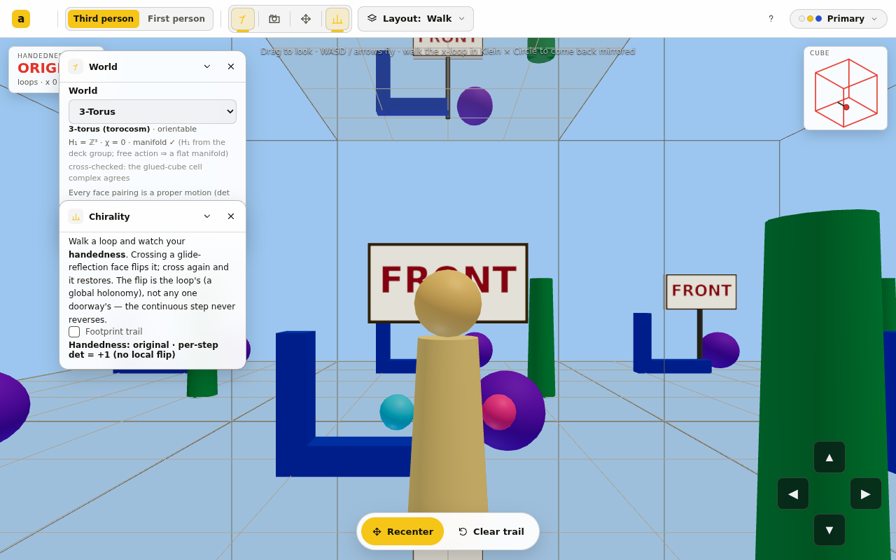

> [!NOTE]
> Remaining in Worlds: the **avatar** body colors + the handedness avatar tint
> (`coverEngine` ~line 495), the **walk-pad/instruction** HUD chrome, and the
> spherical sky-dome retint. Then the rest of the app suite.

### 🟣 decision · 15:55 — Standard adopted: per-app "audit every color → map to a token"
**Why:** Dan: "for each app, list out every color it uses and every colormap and
identify which ones are hardcoded and assign them to theme values" + "Complete
theming would be ideal." So theming isn't just chrome + sky — **every** color in
each app's visualization must resolve to a theme value (or a registry colormap).

This raises the bar from the original per-app blast radius: each app gets a full
color inventory and a token assignment, including deep 3D **decor** (trees,
columns, signs, footsteps, fonts), not just background/marks. Mapping rules:
identity sets → `--data` slots; structure → neutrals (`--dim`/`--dim-2`/
`--fg`); focal/UI → `--accent`/`--accent-2`; ordered/outcome data → registry
colormaps; text → the theme fonts.

### 🟡 milestone · 15:55 — Polygon Worlds: complete decor theming
**Why:** First app taken to "complete" under the new standard (Dan flagged the
trees/columns/signs/fonts weren't tracking the theme).

Routed **all** Polygon Worlds decor color through a theme palette read from the
live tokens (`decor.ts` `setDecorPalette`/`getDecorPalette`): landmark + corner
identities → the `--data` slots (3D markers *and* mini-map together), tree trunk /
structural stone / disc rim → neutrals, center beacon → `--accent`/`--accent-2`,
euclidean floor → a neutral, badge backing + glyph font → `--panel-solid` /
`--font-ui`. Props depend on theme id/mode, so a skin switch regenerates them and
the engine's existing `[spec, props]` rebuild recolors the decor **live**. Build
green, lint 59 (no new), 88 tests. Verified the decor changes per theme
(Observatory daytime vs Primary Bauhaus).

> [!NOTE]
> Still hardcoded (next): **Solid Worlds** decor (room walls/furniture/signs in
> `decor/rooms.ts`, avatars, the chirality HUD → `--data-1/4/6`), the Worlds
> **mini-map/walk-pad/instruction** HUD chrome, the spherical sky-dome retint, and
> the `numeralTexture` corner-plate fonts. Then the rest of the app suite.

### 🟡 milestone · 15:13 — Phase 1 pilot 2: Worlds day/night sky by mode
**Why:** The second locked pilot — prove "mode = time of day" — and Dan said
continue.

Both walkers (**Polygon Worlds** + **Solid Worlds**) now tie their sky + lighting
to the theme mode. Both already had a live `looks` system (daytime/overcast/dusk/
moonlit applied via `setLook`), so the change is small and clean: a new **default
`auto` look** resolves time-of-day from `resolveScheme(themeId, mode)` — **light →
daytime, dark → moonlit** — re-applied reactively on a mode/identity switch. The
manual look picker still overrides (overcast/dusk). **Build green, lint 59 (no new),
88 tests.** Verified headless — the scene *and* the chrome track the mode:

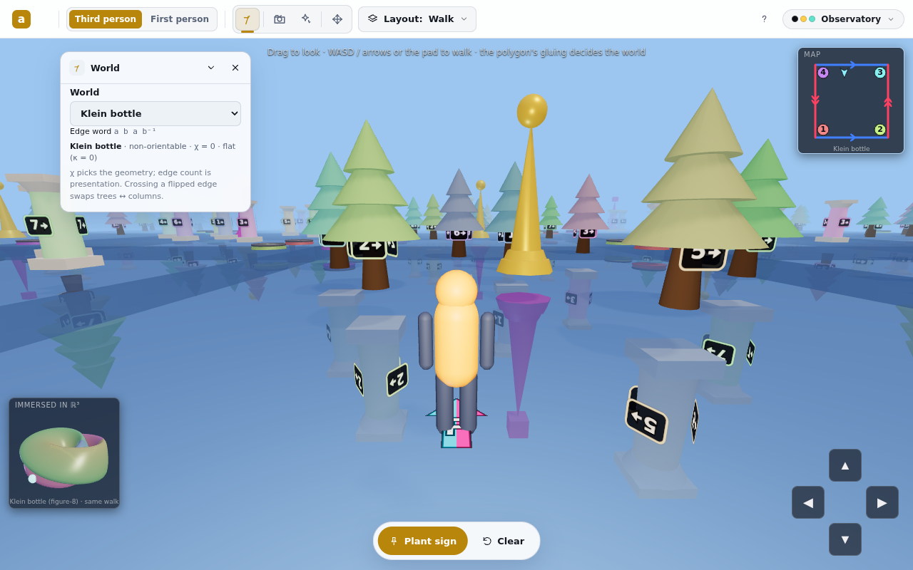
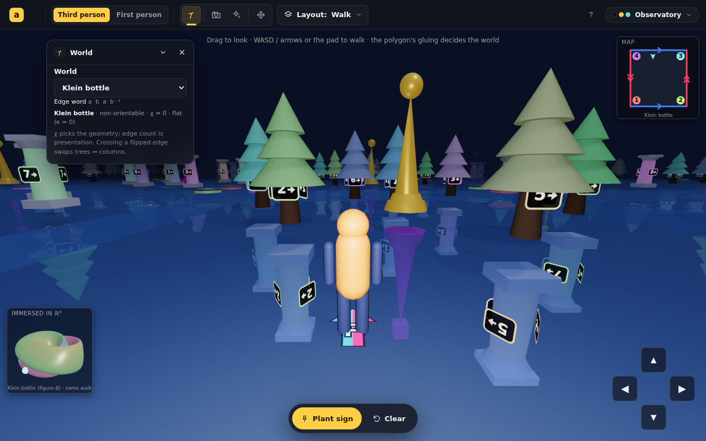
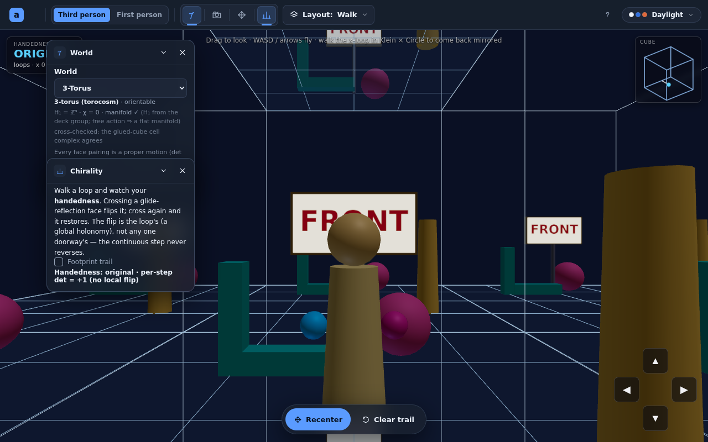

> [!NOTE]
> Deferred for these apps (the headline day/night works without them): **HUD
> tokenization** (the chirality HUD original·rotated·mirrored → `--data-1/4/6`, the
> walk pad, mini-map, instruction text) and the **spherical sky-dome retint**
> (Polygon Worlds paints the χ>0 dome once; `setSky` doesn't update it, so spherical
> worlds keep their built dome until that's wired). Both are follow-ups.

### 🟡 milestone · 03:05 — Trinary Lab Destiny Map themed (fate · chaos · stat) + PR #239
**Why:** Dan, reviewing the Cloudflare preview, flagged the **fate map** (then the
**chaos map**) "not taking theme colors" — the Lab was deferred from the pilot.

Opened **PR #239** (engine + pilot), subscribed to its activity; Cloudflare
preview is live (`https://claude-theming-v2-light-dark.animath.pages.dev`).
Then, on Dan's feedback, two rounds:

1. **Observatory outcomes → registry divergent map** (was a custom success/danger
   ramp): the theme's recommended divergent map sampled by goodness (coolwarm
   flipped). **Stars → spread `--data` slots 1·4·6** (was adjacent 1·2·3) so the
   three hues read distinct (blue/gold/pink) without touching the shared palette.
2. **Lab Destiny Map now tracks the theme** — the fate/chaos/stat maps were fully
   hardcoded. They're computed in workers/GPU (no DOM), but the map already stores
   an outcome-code grid + value grids and recolors on the main thread, so I moved
   *all* coloring to themed ramps there (no worker-protocol change): **fate →
   divergent map by outcome goodness** (same voice as the Observatory timeline),
   **chaos & stat → registry sequential maps**. Recolors on a skin switch without
   resimulating. Also tokenized the map background, star-path overlay, legend
   swatches, gradient bars, and the box-dimension inset. Exported `hexToRgb` from
   the registry.

**Build green · lint 0 errors (60 baseline) · 88 tests.** Verified headless by
scripting a Lab render across themes:

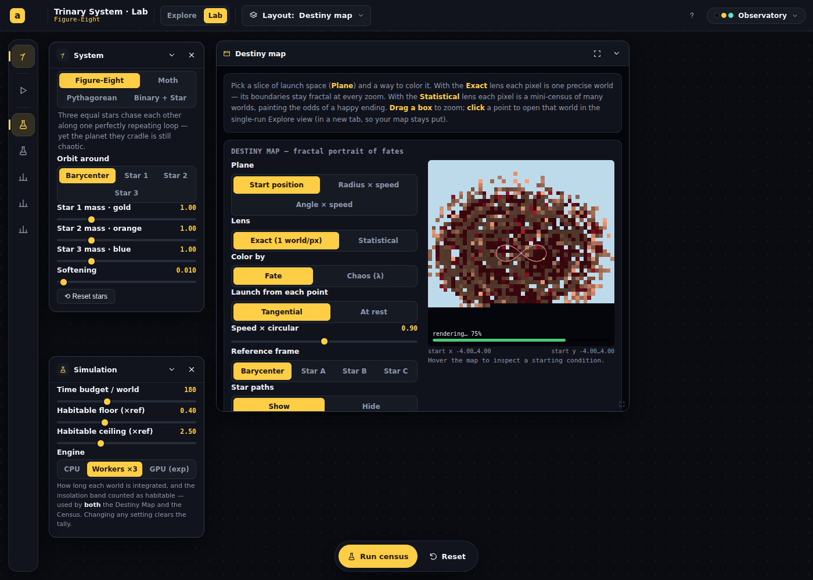
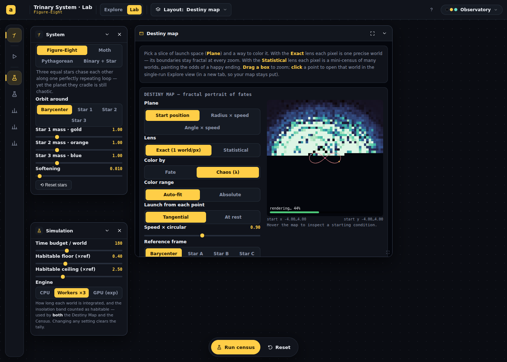
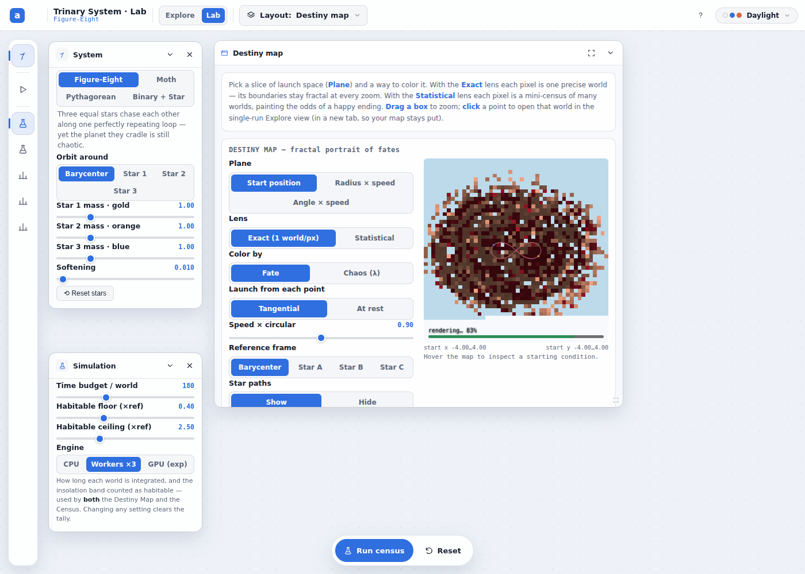

> [!NOTE]
> Remaining Trinary hardcoded color: `SkyView`'s first-person insolation sky (a
> physical temperature gradient, arguably the actual sky, not a data encoding) +
> `MiniSim`/`TrinaryLab` outcome flash/meta swatches. Small; next pass.

### 🟡 milestone · 02:02 — Phase 1 pilot: Trinary star scene (force-dark + divergence map)
**Why:** Prove the force-mode + canvas-token path end-to-end on the scene Dan
flagged, and put the outcomes divergence map in front of him to evaluate.

The Observatory star scene now tracks the theme. **Build green, lint 0 errors,
88 tests pass.**

- **Force-dark scene** — wrapped the Orbit view node in `<Scheme mode="dark">`, so
  the WebGL scene resolves the theme's **dark companion** tokens regardless of the
  user's global mode. Its objects use the normal tokens: **stars → discrete
  `--data-1/2/3`** (three identities), **planet → `--fg`** (neutral calm subject),
  **ghosts → `--dim`**, background → `--viz-bg`, grid from `--dim-2`. No bespoke
  scene palette.
- **Reactive recolor** — the engine reads the palette at build (from inside the
  forced-dark subtree) and recolors **in place** on a skin change
  (`Trail.setColor`, `applyPalette`, keyed on `useThemeId`) — orbits/camera/sim
  untouched. (Live-switch is wired via the same reactive `useThemeId` path proven
  in Phase 0; verified across themes *at load*, not yet by a headless click-switch.)
- **Outcomes = divergence map** — the Observatory timeline/legend/status now ride a
  **divergent ramp the theme owns**: `--danger` (bad) → neutral → `--success`
  (good), sampled by each bin's goodness (`BIN_GOODNESS`). Paradise→success green,
  Chaotic→danger red, the two half-goods in the gray middle. Climate/status colors
  join the same voice. Added `lerpStops` + `sampleContinuous` to the registry.

Verified headless — the scene theme-tints per identity and the ramp renders:

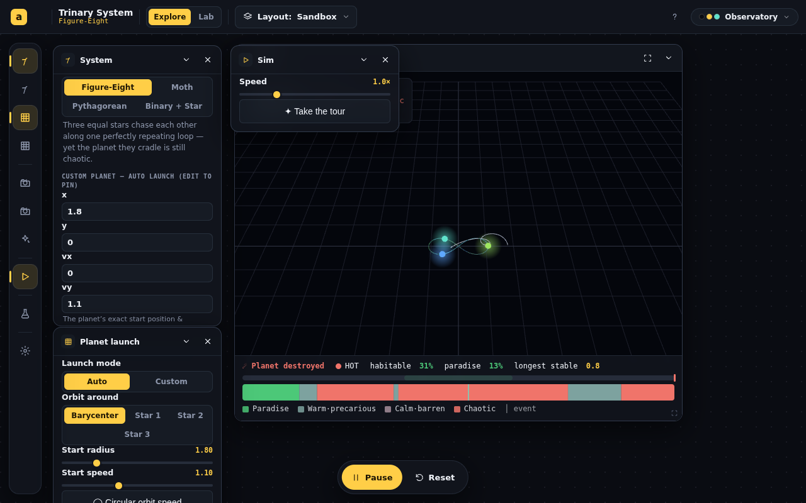
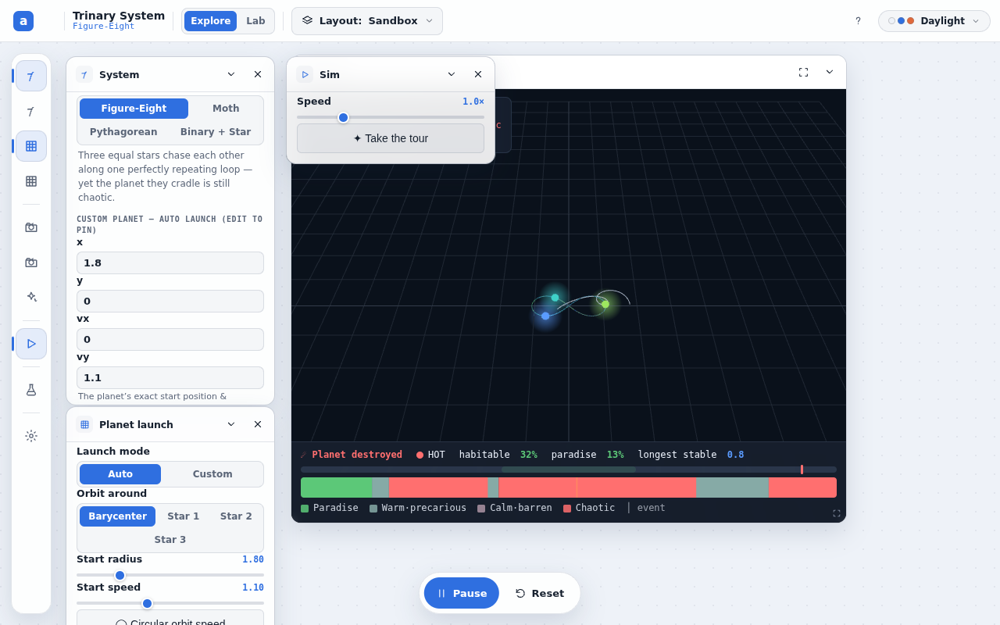
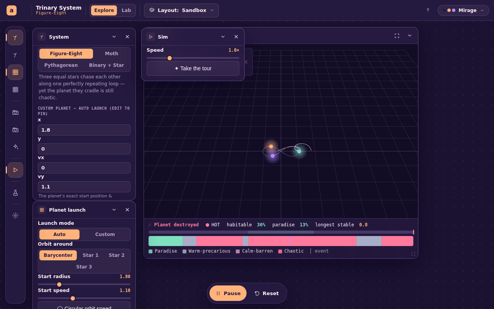

> [!NOTE]
> **Deferred within Trinary (not in this pilot):** the **Lab** (`BasinMap`,
> `MiniSim`, `basin.ts` fate/chaos/magma ramps) and `SkyView`'s first-person
> insolation sky (a physical temperature color, arguably not a data encoding).
> The Lab is a separate view/route (`#/trinary-lab`); rolling its fate map onto the
> divergent registry + tokenizing its mini-canvases is the natural follow-up.

> [!IMPORTANT]
> **For Dan to eyeball:** (1) the divergence ramp — `--success↔--danger` through a
> gray midpoint; the two middle bins read fairly desaturated (gray-green /
> gray-red). Want punchier mids, or a registry divergent map (RdBu/RdYlBu) instead
> of the success/danger custom? (2) The three stars are now cool data hues
> (blue/cyan/green in Observatory) rather than the old warm/cool gold-orange-blue —
> more "theme identity," less individual pop. Keep, or special-case star identity?

### 🟡 milestone · 01:47 — Phase 0 engine complete + verified (committed)
**Why:** The theme engine is the prerequisite for both pilots; de-risk it (build
+ headless screenshots across identity × mode) before the per-app design work.

Built and verified the full identity × mode engine. **Build green, lint 0 errors
(60 baseline warnings, none new), 88 tests pass.**

- **`theme.css`** — all 8 themes converted to family vars (`--x-n` native source +
  sparse `--x-lt`/`--x-dk` companions); shared `[data-theme]`/`[data-scheme=light]`/
  `[data-scheme=dark]` blocks map consumed tokens with native fallback. Authored
  the missing companions: light Observatory (cool paper + gold), light Blueprint
  (white-print), light Spectrum (white + teal/magenta), light Mirage (peach dawn),
  dark Paper (warm sepia night), dark Daylight (charcoal), dark Primary (true-black
  Bauhaus), and **light Phosphor = the 1980s beige case** (warm plastic, dark
  CRT-green ink, mono kept).
- **`skins.tsx`** — `ThemeMode`, `resolveScheme`, `useThemeMode`/`useThemeModeId`;
  `data-scheme` now carries the user's mode (default native); identity + mode both
  persisted; picker gains a Native/Light/Dark toggle.
- **`Scheme.tsx`** — the `<Scheme mode>` force-mode primitive (layout-transparent
  by default).
- **`useThemeTokens.ts`** — reactive canvas token reader (+ `readThemeTokens` for
  non-React engines) that re-reads on identity/mode change.
- **Gallery previews** track the mode (`resolveScheme`).

Verified headless across combos — Observatory-by-day, Paper-at-night,
Primary-at-night, and the beige Phosphor all resolve, and **Stable Matching under
Observatory forced-light** themes cleanly end-to-end (no light-on-light), proving
the path works in a real app, not just the gallery.

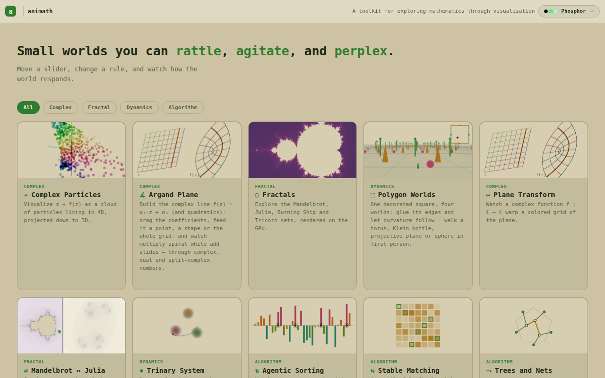
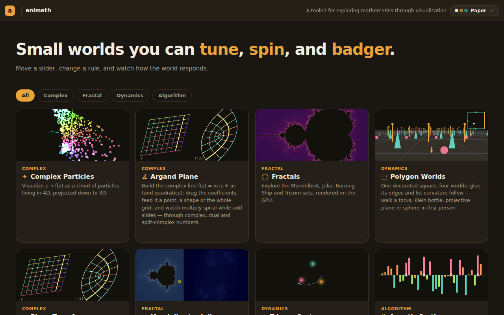
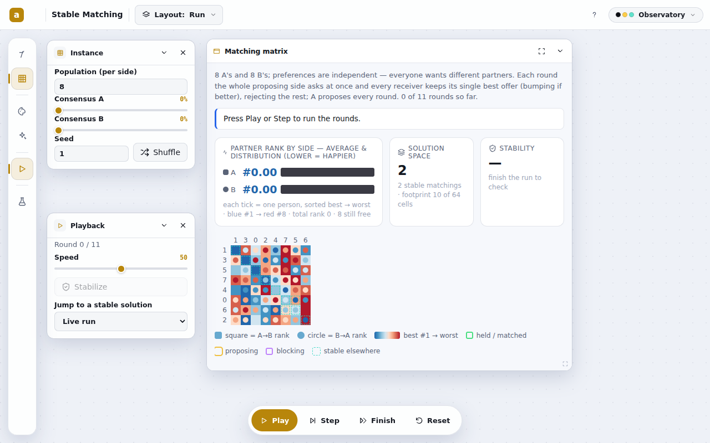

> [!NOTE]
> Engine is non-breaking by construction: with companions falling back to native,
> every theme in native mode renders exactly as before #238. Previews still carry
> their own hardcoded on-light/on-dark palettes (branch on `resolveScheme`); fully
> tokenizing them is a Phase 2 rollout item.

### 🟣 decision · 00:18 — Adjusted model (Dan) + the CSS engine architecture
**Why:** Dan refined the two-mode plan into **three** modes, and the three-mode
requirement settles the long-open `light-dark()`-vs-paired-blocks question — and
forces a specific variable structure to make it leak-proof under nesting.

**Dan's adjusted model.** Each theme has its own **native** mode *plus* a **light**
and a **dark** mode (three value-sets per element, often equal). **Default =
native**; light and dark are **overrides**. Any element may draw from native,
light, or dark. A theme may opt to set "dark = native for all elements" (e.g.
Observatory) — that must be **free** (no re-authoring).

> [!IMPORTANT]
> **`light-dark()` is out** — it carries exactly two values; we need three
> (native/light/dark). So the engine is **paired `[data-scheme]` blocks** keyed
> on a three-valued mode attribute. (Resolves Phase-0 open question #1.)

**The variable architecture (family vars + fallback).** The naive "sparse
descendant-override" approach **leaks** under force-mode nesting: a force-dark
subtree under a *light* root inherits the root's light deltas for any token the
dark block doesn't restate — so "dark = native" can't be the empty block Dan
wants. Fix: three namespaces.

- **Consumed token** `--bg` — what all CSS/JS reads. Set *only* by the shared mode
  blocks (never authored per-theme directly).
- **Native source** `--bg-n` — the theme's native value (today's values, renamed).
- **Companions** `--bg-lt` / `--bg-dk` — sparse light/dark overrides (omit ⇒ native).

Shared, theme-independent blocks do the mode selection (with native fallback, so
an omitted companion costs nothing):

```css
[data-theme]            { --bg: var(--bg-n); … }                  /* native default */
[data-scheme="light"]   { color-scheme: light; --bg: var(--bg-lt, var(--bg-n)); … }
[data-scheme="dark"]    { color-scheme: dark;  --bg: var(--bg-dk, var(--bg-n)); … }
```

Per-theme blocks shrink to **palette data only**: native sources `--bg-n…` (+ the
intrinsic `color-scheme`) plus whatever sparse `-lt`/`-dk` companions that theme
needs. The consumed-token plumbing lives once in the shared blocks. This is
leak-proof (a forced subtree's `[data-scheme]` rule re-derives every consumed
token from inherited family members) **and** makes "dark = native" free (omit the
`-dk` companions → fallback to `-n`). Only the ~32 mode-varying color/shadow tokens
get families; structural tokens (z-layers, radii, fonts, eases) stay plain.

**Attribute semantics change.** `data-scheme` is repurposed from "derived
light/dark (for `<select>` UA rendering)" to **the user's chosen mode**
(`native` default · `light` · `dark`); the root carries identity (`data-theme`) ×
mode (`data-scheme`), both persisted. `<Scheme mode>` sets `data-scheme` on a
subtree. `color-scheme` (for native widgets) comes from the theme block in native
and from the mode blocks when forced — `<select>` rendering stays correct.

**Build order (de-risk the engine before 8× design authoring):** shared blocks +
convention → convert all 8 themes to family vars (mechanical rename, dark=native
free) → `<Scheme>` primitive + `useThemeMode`/`useThemeTokens` hooks + picker mode
toggle → author the missing companions (light Phosphor/Neon/Mirage, dark Primary,
theme-tinted darks) → verify every identity × 3 modes via screenshots. Then the
Trinary divergence-map pilot (Dan wants to eyeball it).

### 🟡 milestone · 00:03 — Session started; plan read, branch oriented
**Why:** New branch off `main`; need the durable record before any code.

Fresh branch `claude/theming-v2-light-dark-5rdcxv` off `main` (tip `26e00dc`,
the PR #238 merge — chrome contract + foundations). No prior handoff for this
branch; this is the first tracked session.

Read the locked plan
(`youthful-cray-7m6z9d/2026-06-24-S02-plan-light-dark-theming.md`), the
predecessor handoff (#238), and the TODO backlog (theming-v2 is the `!high`
chrome item). Oriented on the two engine files:

- `src/chrome/theme.css` (877 lines) — **8 fixed skins** today, each a single
  `[data-theme="…"]` block: `dark` (Observatory), `light` (Paper), `neon`
  (Spectrum), `blueprint`, `phosphor`, `daylight`, `primary`, `mirage`. No
  light/dark pairing yet — that's the Phase 0 conversion target.
- `src/chrome/skins.tsx` — `SKINS[]` registry, `isLightSkin()`, reactive
  `useSkin`/`useThemeId`, `applySkinAttrs()` (sets `data-theme` + `data-scheme`),
  `SkinPicker`. The `data-scheme` attribute is already the mode switch; the
  picker is identity-only today and needs the mode axis added.

Awaiting Dan's direction on where to begin within Phase 0.
