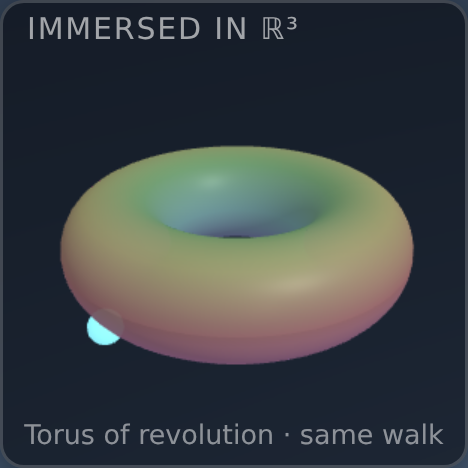

# Tighten the app and enrich the visuals

## Session purpose

**Polygon Worlds** (`#/polygon-worlds`) is the target. This is an exercise in
**tightening the application and providing a richer visual experience**. Begin
by reviewing the current status of the app and any outstanding requests or
TODOs, then take direction from the user.

> Note: the branch is named `topology-world-review-…` from an initial
> mis-statement of the focus; the actual app under work is **Polygon Worlds**.

## Previous session

Latest handoff is
[polygon-sign-orientation · S01](../../handoff/polygon-sign-orientation-50exno/2026-06-10-S01-sign-orientation-review.md)
(status: **completed**, followup: **medium**) — fixed orientation end-to-end,
added the two-sided glass **sign** instrument, generalized the euclidean
presenter to arbitrary polygons (hexagonal torus + Klein), and laid out a
six-part improvement roadmap (A–F).

## Working notes

<!-- Newest entry first. -->

### 🟡 milestone · 12:40 — Embedding inset now ships for every world (verified headlessly)
**Why:** Feature 1 complete — the "immersed in ℝ³" 3D model is no longer ℝP²-only.

**What landed.**
- New `instruments/immersions.ts` — a per-world registry of immersion descriptors
  (procedural mesh + marker map + caption). Standard immersions: torus/torus6 →
  torus of revolution, klein/klein6 → figure-8 (Lawson) Klein bottle, rp2 →
  Steiner Roman surface (moved here), sphere → round sphere, genus2 → double
  torus, crosscap3 → non-orientable schematic.
- `instruments/embeddingInset.tsx` rewritten world-general: takes `worldId` +
  `getState` + `getDir`, picks its descriptor from the registry, rides the bead
  on the immersion. Spherical worlds drive the bead from the player's true unit
  direction (full sphere coverage); flat worlds from the chart `(u,v)`.
- Engine now exposes `getPose()` (`engineTypes.ts`, `fundamentalSquareEngine.ts`);
  host passes `getDir = pose.up` and renders the inset for **all** worlds
  (removed the `spec.id === 'rp2'` gate).

**Verification.** Built (passes), lint clean (0 errors, no new warnings), and
captured 156² insets for all 8 worlds headlessly (SwiftShader) — torus donut,
Klein figure-8, Roman surface, round sphere, double torus, Dyck schematic, and
both hexagonal worlds all render with the live bead where applicable. Screenshots
in `assets/`.

> [!NOTE]
> The hyperbolic pair (genus2, crosscap3) show a recognizable representative mesh
> with **no live marker** — their Poincaré-disk chart has no clean global map to a
> 3-space immersion. genus2's double torus is the correct topology; crosscap3 is a
> captioned non-orientable schematic. A faithful hyperbolic marker is a possible
> follow-up, not blocking.

### 🟣 decision · 12:10 — Scope: two features, sequenced (inset-for-everyone first, then C)
**Why:** User chose roadmap **C** (ℝP² inside walk) *and* asked to bring the 3D
embedding model — currently ℝP²-only — to every world. Both are substantial; I
sequence the lower-risk, higher-confidence one first.

**Plan.**
1. **Embedding inset for every world.** The inset (`instruments/embeddingInset.tsx`)
   is hard-gated to `spec.id === 'rp2'` and hard-codes the Steiner Roman surface.
   Generalize into a per-world **immersion registry** (`instruments/immersions.ts`):
   each world supplies an immersed mesh + a marker map from the uniform
   `SquareMapState` / player pose. Faithful live markers for the 6 non-hyperbolic
   worlds (sphere → round sphere, rp2 → Roman, torus/torus6 → torus of revolution,
   klein/klein6 → figure-8 Klein bottle); a representative spinning mesh for the
   two hyperbolic worlds (genus2 → double torus; crosscap3 → Dyck/cross-capped),
   marker best-effort. Expose the player **pose** through the engine so the
   spherical marker rides the true direction (full sphere, not a hemisphere chart).
2. **C — ℝP² inside walk.** In the spherical presenter, when the player is in the
   `flipped` (antipodal) state, place the camera on the **inner** face of the
   shell (inside the hollow planet) with the outer ink/decor seen overhead through
   the glass, re-emerging on the second seam crossing. Orientation geometry here
   is the subtle part that bit prior sessions — verify with headless screenshots
   (`scripts/shoot.mjs`) and the existing chirality/decor guards before committing.

### 🔵 finding · 03:50 — Reviewed current status and outstanding work
**Why:** Re-oriented onto Polygon Worlds after the focus correction, before
taking direction.

**What exists (shipped).** Polygon Worlds (`#/polygon-worlds`) walks every
closed surface generated from one glued polygon, in first person. Architecture:
- **Kernel** (`lib/`: `cayleyKlein.ts`, `develop.ts`, `invariants.ts`,
  `realize.ts`) — the geometry engine; `npm run verify` guards it.
- **Three presenters** — `euclidean.ts` (flat, now polygon-general),
  `spherical.ts`, `hyperbolic.ts`.
- **8 worlds** (`worldSpec.ts`): torus, klein, rp2, sphere, genus2,
  crosscap3, **torus6**, **klein6**.
- **Instruments:** the **ink trail** (`inkTrail.ts` — one canonical trail, no
  mirror flags; every mirrored appearance is a genuine orientation-reversing
  render transform), the two-sided glass **sign** (`sign.ts`), and an
  **embedding inset** (`instruments/embeddingInset.tsx`).
- **Guards:** `scripts/trail-chirality.mjs` (8-world chirality + decor/ink
  audit, plants a sign per world), `scripts/probe-trivial-words.ts`,
  `scripts/sign-shots.mjs`.

Shipped across PRs #193 (the app), #200 (chrome redesign), #209/#212.

> [!IMPORTANT]
> **PLAN.md's HIGH "path-demonstration redesign" item is stale.** That flag
> came from spherical-p2 **S05** ("the path demonstration must be redesigned").
> It was *resolved* in **S06** — the trail was rebuilt from first principles as
> "ink on the sheet" and the user approved it in every world ("excellent!") —
> and the sign-orientation session then hardened orientation correctness. The
> live backlog is the sign-orientation handoff's **roadmap A–F**, all
> medium-priority and awaiting the user's prioritization.

**Outstanding (sign-orientation handoff roadmap A–F):**
- **A. Remaining spherical n-gon worlds** — hex/oct ℝP² (smooth hemispheres)
  and hex/oct zip spheres; generalize the spherical presenter's square chart
  (`sq2hemi`/`fullDir`, `CHART_CORNERS=4`) to n-gon. *Recommended next target;
  kernel is ready, seam identified.*
- **B. Orbifold worlds** (cone points) — big separate feature; payoff is
  curvature you can stand next to (Gauss–Bonnet with deficit angles).
- **C. ℝP² "inside walk"** — let the seam crossing continue onto the inner
  shell face; small relative to payoff.
- **D. Curvature demonstrations** (user pick pending since S06) — holonomy
  square (recommended), vertex-plate holonomy ring, or cone-point orbifolds.
- **E. Fidelity polish** — hyperbolic decor azimuth equivariance; klein6
  glide-crossing pixel-diff; sign-text persistence decision.
- **F. Hygiene** — British spellings in `lib/develop.ts`, `polygonMap.ts`;
  (TopologyWalk sibling audit — out of scope here).

**Open question (roadmap §D / S06):** how to *show* negative curvature without
relying on hyperbolic distances — holonomy square recommended, no decision yet.

> [!NOTE]
> Headless rendering already exists for this app (SwiftShader via
> `scripts/trail-chirality.mjs`, `scripts/sign-shots.mjs`); the session-start
> hook's headless WebGL reconfirms `scripts/shoot.mjs '#/polygon-worlds'` is
> available for ad-hoc captures.

### 🟣 decision · 03:49 — Focus corrected to Polygon Worlds
**Why:** User clarified the target is **Polygon Worlds**, not Topology Walk
(the branch name `topology-world-review` reflects the original mis-statement).

### 🟣 decision · 02:31 — Session focus: tighten + enrich visuals
**Why:** User set the goal (tightening + richer visual experience), then said
to continue.
