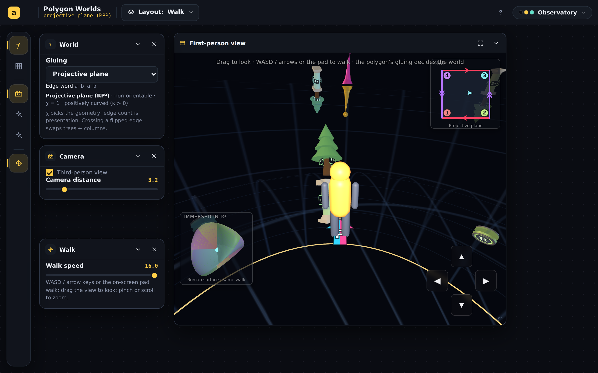
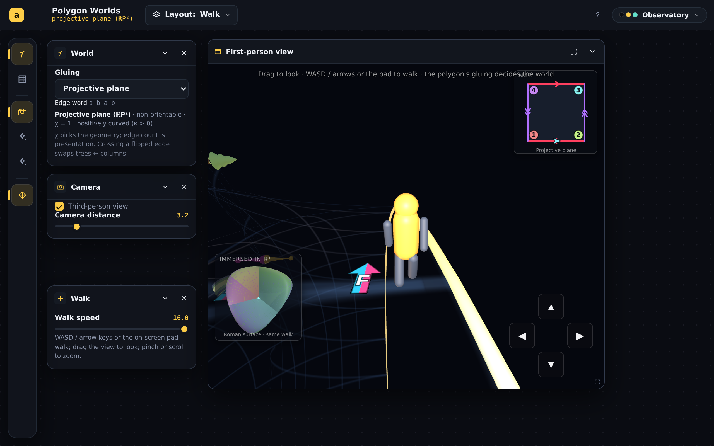
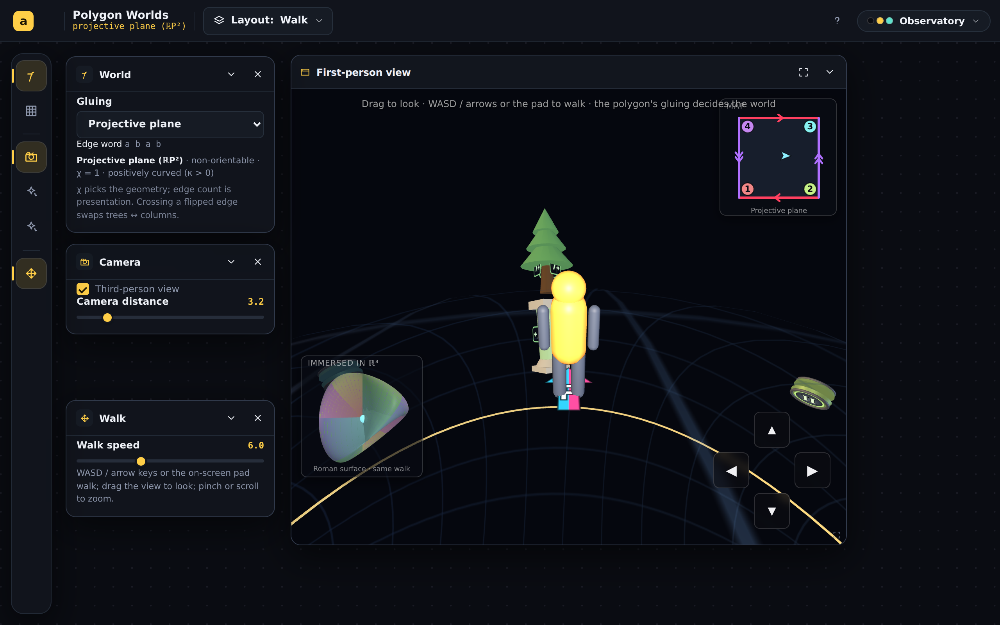
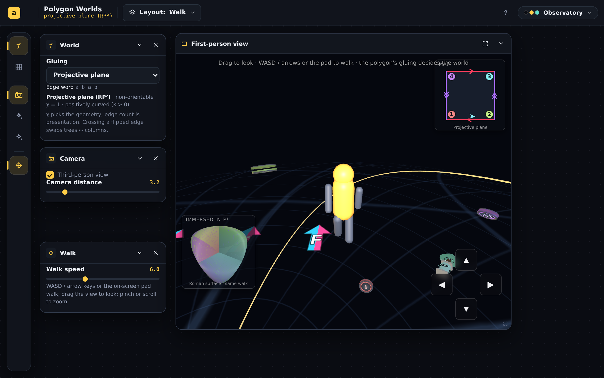
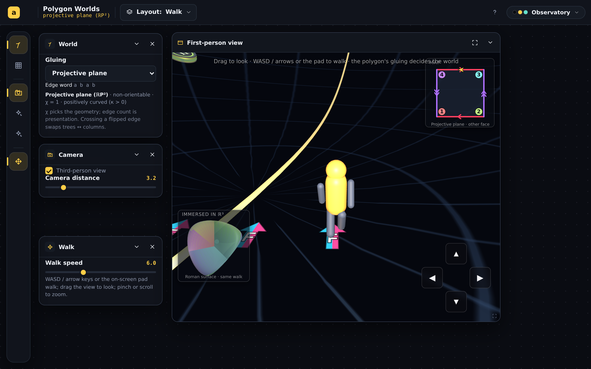
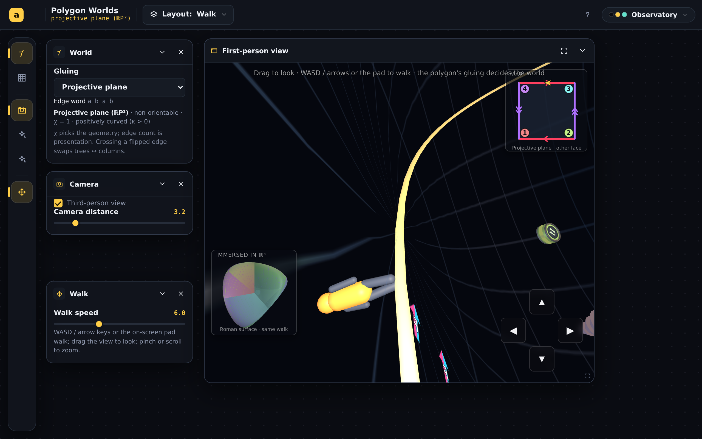

# Tighten the app and enrich the visuals

## Session purpose

**Polygon Worlds** (`#/polygon-worlds`) is the target. This is an exercise in
**tightening the application and providing a richer visual experience**. Begin
by reviewing the current status of the app and any outstanding requests or
TODOs, then take direction from the user.

> Note: the branch is named `topology-world-review-…` from an initial
> mis-statement of the focus; the actual app under work is **Polygon Worlds**.

## Previous session

Latest handoff is
[polygon-sign-orientation · S01](../../handoff/polygon-sign-orientation-50exno/2026-06-10-S01-sign-orientation-review.md)
(status: **completed**, followup: **medium**) — fixed orientation end-to-end,
added the two-sided glass **sign** instrument, generalized the euclidean
presenter to arbitrary polygons (hexagonal torus + Klein), and laid out a
six-part improvement roadmap (A–F).

## Working notes

<!-- Newest entry first. -->

### 🟣 decision · 15:12 — Reverted all ℝP² seam work to the original sphere
**Why:** User: "this is not working. please revert to the original behavior." None of
the seam attempts (camera somersault → smooth eversion → latitude-driven → fixed
everted surface) matched the intended behavior.

`git checkout 02dda65 -- spherical.ts EXPLAINER.md` restores both to their state right
after the embedding-inset feature — the original convex sphere + seam, with the
inset-for-every-world feature **kept** (it was never in question). Build + lint clean;
screenshot confirms the original ℝP² renders. Roadmap item **C is parked** — the
inside/outside reversal needs a clearer shared spec before another attempt (the four
tries are recorded below for context, not to be resurrected as-is).

### 🟡 milestone · 14:55 — Eversion → a FIXED everted surface (local curvature reversal)
**Why:** User: the previous version made the *entire* world flatten (a global scale by
the character's latitude). They want the **local** curvature to flatten then reverse —
"along the seam the sphere flattens open, starts to fold upward around the character" —
a fixed shape, not a global event.

**What changed (spherical presenter — substantial rework).**
- Dropped the group-matrix flatten entirely. The ℝP² shell is now a **custom everted
  surface** built per-vertex (`buildShellGeometry` + `evertDir`): the north hemisphere
  (z≥0) is the round sphere (convex, you stand on top); across the z=0 seam the
  meridian leaves *vertically* (so the seam is locally flat/smooth) and the south
  hemisphere folds **up and out** into a concave brim (a sun-hat). The shape is FIXED —
  it does not reshape as you move; you simply experience convex → flat → concave
  *locally* as you walk across it.
- Avatar, camera, decor and ink all ride the everted surface via an everted frame
  (`evertDir`/`evertNormal` → `ePosW`, `eUp`, `eFwd`, `eLeft`). `eUp` is the
  upper-face normal, so the player stays upright the whole way — only the ground's
  curvature reverses under them. The mirror ink-twin is retired (the eversion's own
  reflection is the mirror now).
- Trees on the outer/upper face, columns on the inner/under face, uniformly — so
  crossing the seam, the same landmark reads as an outside tree then an inside column,
  carried by the fold. Spawn near the +z pole (kept).

**Verification (headless walk pole→seam→past).** Convex cap with trees at the pole →
ground locally **flat at the seam** while the rest of the world keeps its shape (not a
global flatten) → past the seam, concave with columns; avatar upright throughout.
Build + lint clean.

> [!NOTE]
> Shape params `EVERT_FLARE`/`EVERT_LIFT` set how far the south brim folds up/out;
> easy to tune if the user wants more/less enclosure. The far (south) rim is an open
> sombrero edge — fine for the walk, but closing it into a full bowl is a possible
> follow-up.

### 🟡 milestone · 14:30 — Eversion reworked per feedback: latitude-driven + unified with the double cover
**Why:** User refined C: (1) eversion smooth and beginning *away* from the seam,
not a sudden event; (2) columns always inside / trees always outside, with the
eversion and the double cover being the *same* process; (3) spawn near the pole.

**What changed (spherical presenter).**
- **Latitude-driven eversion.** Dropped the timed ease. The fold is now a smooth
  function of position: `s = (1 − posU.z)/2`, so `k = 1−2s = posU.z`. At the spawn
  pole (z=+1) `s=0` (convex ball you stand on); it flattens to the tangent plane as
  you near the seam (z=0 ⇒ `s=0.5`); past it the world folds concave, full
  inside-out at the far pole (z=−1 ⇒ `s=1`). Begins the instant you leave the pole.
- **Unified decor.** Removed the antipodal skin-swap — trees now sit on the OUTER
  wall and columns on the INNER wall at *every* direction (incl. the antipodal
  preimage). The orientation flip is carried entirely by the eversion: walking to
  the antipode, the *same* landmark you saw as an outside tree reads as an inside
  column, because the fold reflects the inner face toward you. (Verified the
  reflection geometry: at s=1 the inner-face columns grow into the dome toward the
  player; the outer trees grow away.) Inner decor is always present on ℝP² now.
- **Near-pole spawn** on ℝP² (just off +z), so the whole walk to the seam is the
  gradual eversion.

**Verification (headless walk pole→seam).** Captured the progression: upright on
the convex cap with trees on the outer wall → the world smoothly flattening → flat
at the seam → past it, concave with columns. Avatar stays upright throughout; build
+ lint clean.

> [!NOTE]
> Right at the seam the concavity is shallow and the spot is landmark-thin, so the
> just-crossed view reads sparse; it fills in toward the far pole. Interior-lighting
> / enclosure polish is still the open visual follow-up.

### 🟡 milestone · 14:05 — C reworked: smooth **eversion** (the somersault was wrong)
**Why:** User rejected the somersault — "I don't want the normal to change and have
the character walking upside down, I want inside and outside to reverse at the
seam… a smooth eversion." Confirmed the intent via AskUserQuestion: **world everts
around a fixed, upright character.**

**What changed (spherical presenter).**
- Reverted the camera somersault entirely — the player frame is untouched again
  (up = surface normal, always level, never flips).
- The shell + decor + ink + signs now live in a `planetG` group. Crossing the seam
  eases `evertT` 0→1 (smoothstep, ~0.7 s) and `evert(s)` scales the planet's
  **radial component about the player's foot** by `k = 1−2s`: s=0 identity (convex
  ball you stand on) → s=0.5 `k=0` the world flattens to the tangent plane → s=1
  `k=−1` a **reflection** through that plane (concave dome enclosing you). The
  foot `P = R·posU` is the fixed point, so the player stays planted and upright
  while the world folds inside-out. At s=1 it's a genuine reflection — the
  orientation reversal made physical ("inside-out and mirror are the same ℤ/2").
- Shell self-glow lifts with `s` so the concave interior reads. EXPLAINER rewritten
  from "dive through the floor / somersault" to the eversion.

**Verification (headless).** Drove across the seam on ℝP²: captured the fold
sequence — the avatar stays **upright** through convex → flat → concave (no
upside-down), the seam sweeps from underfoot to overhead, mini-map reads *other
face*, outside unregressed. Build + lint clean.

> [!NOTE]
> The eversion is correct and smooth, but at the default planet radius (30) the
> everted dome is large/far, so the "inside" reads sparse and dark in a
> landmark-thin spot. Tuning the enclosure feel (camera framing, a tighter fold,
> interior lighting) is the natural next step — flagged for the user.

### 🟡 milestone · 13:35 — C (v1): ℝP² inside-walk via camera somersault — SUPERSEDED
**Why:** Feature 2 (roadmap C) — crossing the seam now dives you inside the hollow planet.

**What landed (spherical presenter, camera-only — no decor/deck change).**
- Crossing the ℝP² seam (z=0) eases a `rollT` 0→1 tied to the `flipped` sheet
  (`posU.z < 0`). The camera **somersaults** — a 180° roll about the heading
  (`localUp = posU` rotated π about `fwdU`) — which flips up (+normal→−normal)
  **and** swaps left/right (the mirror), exactly the orientation reversal, while
  keeping you walking forward. The eye slides R+EYE (outside) → R−EYE (inside) so
  you end up on the **inner** face of the shell.
- Inner decor is force-shown while inside (`innerG.visible`), and the shell's
  self-glow lifts with `rollT` so the hollow interior reads (the key lights graze
  the inner face near the seam). Third-person rig swings toward the planet center
  via `localUp`. Re-crossing eases back out — two laps to come home.
- EXPLAINER's ℝP² section rewritten for the dive-through-the-floor behavior; added
  a general "shape from outside" section for the now-universal inset.

**Why it respects the orientation law.** The deck already places south-inner ≡
north-outer (both trees) and south-outer ≡ north-inner (both columns), all det>0.
So the inside walk is a pure *camera* move onto the already-correct inner face —
it does **not** touch the deck/decor the sign-orientation session enshrined.

**Verification (headless, ?polydebug bridge).** Drove the avatar across the seam
on ℝP²: chart flips to `flipped:true`, mini-map reads *other face*, camera lands
inside (third- and first-person), inner trees visible, outside unregressed. The
geometric correctness of the roll is argued above; a chirality-guard extension for
the inside camera would be a good belt-and-suspenders follow-up.

> [!NOTE]
> Near the equator the interior is a dim "night" read (grazing key light); it
> brightens toward the poles and with the glow lift. Further inside-lighting polish
> (an interior fill / headlamp boost) is a low-risk visual follow-up, not blocking.

### 🟡 milestone · 12:40 — Embedding inset now ships for every world (verified headlessly)
**Why:** Feature 1 complete — the "immersed in ℝ³" 3D model is no longer ℝP²-only.

**What landed.**
- New `instruments/immersions.ts` — a per-world registry of immersion descriptors
  (procedural mesh + marker map + caption). Standard immersions: torus/torus6 →
  torus of revolution, klein/klein6 → figure-8 (Lawson) Klein bottle, rp2 →
  Steiner Roman surface (moved here), sphere → round sphere, genus2 → double
  torus, crosscap3 → non-orientable schematic.
- `instruments/embeddingInset.tsx` rewritten world-general: takes `worldId` +
  `getState` + `getDir`, picks its descriptor from the registry, rides the bead
  on the immersion. Spherical worlds drive the bead from the player's true unit
  direction (full sphere coverage); flat worlds from the chart `(u,v)`.
- Engine now exposes `getPose()` (`engineTypes.ts`, `fundamentalSquareEngine.ts`);
  host passes `getDir = pose.up` and renders the inset for **all** worlds
  (removed the `spec.id === 'rp2'` gate).

**Verification.** Built (passes), lint clean (0 errors, no new warnings), and
captured 156² insets for all 8 worlds headlessly (SwiftShader) — torus donut,
Klein figure-8, Roman surface, round sphere, double torus, Dyck schematic, and
both hexagonal worlds all render with the live bead where applicable. Screenshots
in `assets/`.

> [!NOTE]
> The hyperbolic pair (genus2, crosscap3) show a recognizable representative mesh
> with **no live marker** — their Poincaré-disk chart has no clean global map to a
> 3-space immersion. genus2's double torus is the correct topology; crosscap3 is a
> captioned non-orientable schematic. A faithful hyperbolic marker is a possible
> follow-up, not blocking.

### 🟣 decision · 12:10 — Scope: two features, sequenced (inset-for-everyone first, then C)
**Why:** User chose roadmap **C** (ℝP² inside walk) *and* asked to bring the 3D
embedding model — currently ℝP²-only — to every world. Both are substantial; I
sequence the lower-risk, higher-confidence one first.

**Plan.**
1. **Embedding inset for every world.** The inset (`instruments/embeddingInset.tsx`)
   is hard-gated to `spec.id === 'rp2'` and hard-codes the Steiner Roman surface.
   Generalize into a per-world **immersion registry** (`instruments/immersions.ts`):
   each world supplies an immersed mesh + a marker map from the uniform
   `SquareMapState` / player pose. Faithful live markers for the 6 non-hyperbolic
   worlds (sphere → round sphere, rp2 → Roman, torus/torus6 → torus of revolution,
   klein/klein6 → figure-8 Klein bottle); a representative spinning mesh for the
   two hyperbolic worlds (genus2 → double torus; crosscap3 → Dyck/cross-capped),
   marker best-effort. Expose the player **pose** through the engine so the
   spherical marker rides the true direction (full sphere, not a hemisphere chart).
2. **C — ℝP² inside walk.** In the spherical presenter, when the player is in the
   `flipped` (antipodal) state, place the camera on the **inner** face of the
   shell (inside the hollow planet) with the outer ink/decor seen overhead through
   the glass, re-emerging on the second seam crossing. Orientation geometry here
   is the subtle part that bit prior sessions — verify with headless screenshots
   (`scripts/shoot.mjs`) and the existing chirality/decor guards before committing.

### 🔵 finding · 03:50 — Reviewed current status and outstanding work
**Why:** Re-oriented onto Polygon Worlds after the focus correction, before
taking direction.

**What exists (shipped).** Polygon Worlds (`#/polygon-worlds`) walks every
closed surface generated from one glued polygon, in first person. Architecture:
- **Kernel** (`lib/`: `cayleyKlein.ts`, `develop.ts`, `invariants.ts`,
  `realize.ts`) — the geometry engine; `npm run verify` guards it.
- **Three presenters** — `euclidean.ts` (flat, now polygon-general),
  `spherical.ts`, `hyperbolic.ts`.
- **8 worlds** (`worldSpec.ts`): torus, klein, rp2, sphere, genus2,
  crosscap3, **torus6**, **klein6**.
- **Instruments:** the **ink trail** (`inkTrail.ts` — one canonical trail, no
  mirror flags; every mirrored appearance is a genuine orientation-reversing
  render transform), the two-sided glass **sign** (`sign.ts`), and an
  **embedding inset** (`instruments/embeddingInset.tsx`).
- **Guards:** `scripts/trail-chirality.mjs` (8-world chirality + decor/ink
  audit, plants a sign per world), `scripts/probe-trivial-words.ts`,
  `scripts/sign-shots.mjs`.

Shipped across PRs #193 (the app), #200 (chrome redesign), #209/#212.

> [!IMPORTANT]
> **PLAN.md's HIGH "path-demonstration redesign" item is stale.** That flag
> came from spherical-p2 **S05** ("the path demonstration must be redesigned").
> It was *resolved* in **S06** — the trail was rebuilt from first principles as
> "ink on the sheet" and the user approved it in every world ("excellent!") —
> and the sign-orientation session then hardened orientation correctness. The
> live backlog is the sign-orientation handoff's **roadmap A–F**, all
> medium-priority and awaiting the user's prioritization.

**Outstanding (sign-orientation handoff roadmap A–F):**
- **A. Remaining spherical n-gon worlds** — hex/oct ℝP² (smooth hemispheres)
  and hex/oct zip spheres; generalize the spherical presenter's square chart
  (`sq2hemi`/`fullDir`, `CHART_CORNERS=4`) to n-gon. *Recommended next target;
  kernel is ready, seam identified.*
- **B. Orbifold worlds** (cone points) — big separate feature; payoff is
  curvature you can stand next to (Gauss–Bonnet with deficit angles).
- **C. ℝP² "inside walk"** — let the seam crossing continue onto the inner
  shell face; small relative to payoff.
- **D. Curvature demonstrations** (user pick pending since S06) — holonomy
  square (recommended), vertex-plate holonomy ring, or cone-point orbifolds.
- **E. Fidelity polish** — hyperbolic decor azimuth equivariance; klein6
  glide-crossing pixel-diff; sign-text persistence decision.
- **F. Hygiene** — British spellings in `lib/develop.ts`, `polygonMap.ts`;
  (TopologyWalk sibling audit — out of scope here).

**Open question (roadmap §D / S06):** how to *show* negative curvature without
relying on hyperbolic distances — holonomy square recommended, no decision yet.

> [!NOTE]
> Headless rendering already exists for this app (SwiftShader via
> `scripts/trail-chirality.mjs`, `scripts/sign-shots.mjs`); the session-start
> hook's headless WebGL reconfirms `scripts/shoot.mjs '#/polygon-worlds'` is
> available for ad-hoc captures.

### 🟣 decision · 03:49 — Focus corrected to Polygon Worlds
**Why:** User clarified the target is **Polygon Worlds**, not Topology Walk
(the branch name `topology-world-review` reflects the original mis-statement).

### 🟣 decision · 02:31 — Session focus: tighten + enrich visuals
**Why:** User set the goal (tightening + richer visual experience), then said
to continue.
